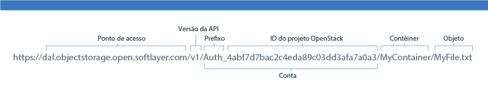

---

copyright:
  years: 2014, 2016

---
{:new_window: target="_blank"}
{:shortdesc: .shortdesc}
{:screen: .screen}
{:pre: .pre}

## Usando a API REST do Swift para acessar o {{site.data.keyword.objectstorageshort}} {: #using-swift-restapi}
*Última atualização: 19 de outubro de 2016*
{: .last-updated}

É possível usar a API REST do Swift com uma interface do cliente da linha de comandos, como cURL, ou chamar a API a partir do aplicativo.
{: shortdesc}

### Construindo sua URL do {{site.data.keyword.objectstorageshort}} {: #access-points}

Para interagir com a API do {{site.data.keyword.objectstorageshort}}, construa a URL do {{site.data.keyword.objectstorageshort}} como a seguir:
  ```
  https://<access point>/<API version>/AUTH_<project ID>/<container namespace>/<object namespace>
  ```
  {: pre}

<table>
  <tr>
    <th> Partes da URL </th>
    <th> Definição </th>
  </tr>
  <tr>
    <td> Versão da API  </td>
    <td> Versão 1: v1 </td>
  </tr>
  <tr>
    <td> Dados da conta  </td>
    <td> Este é o ID do projeto e o prefixo combinado. Ele pode ser localizado na interface com o usuário. </td>
  </tr>
  <tr>
    <td> Namespace do contêiner  </td>
    <td> O nome do contêiner. Ele pode ser localizado na interface com o usuário. </td>
  </tr>
  <tr>
    <td> Namespace de Objeto  </td>
    <td> O nome do seu arquivo ou objeto. Ele pode ser localizado na interface com o usuário. </td>
  </tr>
  <tr>
    <td> Ponto de acesso</td>
    <td> Londres: https://lon.objectstorage.open.softlayer.com/
    <br> Dallas: https://dal.objectstorage.open.softlayer.com/ </br> </td>
  </tr>
</table>

*Tabela 1. Partes da URL do {{site.data.keyword.objectstorageshort}} explicadas*

Exemplo:

Partes da URL do 


### API do {{site.data.keyword.objectstorageshort}} {: #openstack-reference}

Consulte a
[Referência
completa da API Swift OpenStack](http://developer.openstack.org/api-ref-objectstorage-v1.html) para obter uma lista abrangente das opções e dos
exemplos da API REST {{site.data.keyword.objectstorageshort}}.
