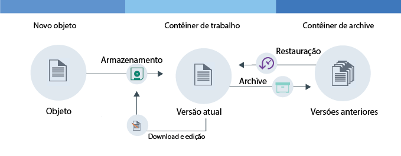

---

copyright:
  years: 2014, 2017
lastupdated: "2017-02-10"

---
{:new_window: target="_blank"}
{:shortdesc: .shortdesc}
{:codeblock: .codeblock}
{:screen: .screen}
{:pre: .pre}


# Configurando versão de objeto {: #setting-up-versioning}

É possível manter versões antigas de seus objetos automaticamente configurando a versão do objeto. Com o versionamento, é possível evitar sobrescrições não intencionais e recuperar versões anteriores de seus arquivos.
{: shortdesc}


#### Como o versionamento de objeto funciona

O versionamento de objeto é uma maneira de um usuário armazenar um objeto que pode mudar. Com o versionamento, a versão atual de seu objeto está sempre disponível em seu contêiner de trabalho e todas as versões anteriores são submetidas a backup em seu contêiner de archive.

<dl>
  <dt>Armazenamento</dt>
    <dd>Um novo objeto é um objeto que você está armazenando pela primeira vez. Esse objeto pode ser um objeto totalmente novo ou um objeto editado cujo upload você está fazendo pela segunda vez.</dd>
  <dt>Archive</dt>
    <dd>Com o versionamento, quando um objeto com o mesmo nome que um objeto existente é salvo no contêiner de trabalho, o objeto mais antigo é movido para o contêiner de archive. Um registro de data e hora é anexado ao nome do objeto.</dd>
  <dt>Restauração</dt>
    <dd>Se um objeto é excluído do contêiner de trabalho e existe uma versão arquivada desse objeto, a versão arquivada é restaurada.  É possível restaurar um objeto arquivado a qualquer momento.</dd>
</dl>



Figura 1. Visão geral do versionamento do objeto


#### Tutorial

Para entender o versionamento de objeto, conclua o tutorial a seguir.

1. Crie um contêiner e forneça um nome a ele. Substitua a variável *container_name* pelo nome que você deseja fornecer ao contêiner.

    ```
    swift post <container_name>
    ```
    {: pre}

2. Crie um segundo contêiner para agir como armazenamento de backup e forneça um nome a ele.

    ```
    swift post <archive_container_name>
    ```
    {: pre}

3. Configure a versão.

    Comando Swift:

    ```
    swift post <container_name> -H "X-Versions-Location: <archive_container_name>"
    ```
    {: pre}

    Comando cURL:

    ```
    curl -i -X PUT -H "X-Auth-Token: <token>" -H "X-Versions-Location:<archive_container_name>" https://<object-storage_url>/<container_name>
    ```
    {: pre}

4. Faça upload de um objeto para seu contêiner de trabalho pela primeira vez.

    ```
    swift upload <container_name> <object>
    ```
    {: pre}

5. Edite o objeto e faça upload da nova versão para seu contêiner de trabalho.

    ```
    swift upload <container_name> <object>
    ```
    {: pre}

6.  Os objetos em seu contêiner de archive são nomeados automaticamente com o formato a seguir: `<Length><Object_name>/<time stamp>`.
    <table>
    <caption> Tabela 1. Atributos de nomenclatura descritos </caption>
      <tr>
        <th> Atributo </th>
        <th> Descrição </th>
      </tr>
      <tr>
        <td> <i>Length</i> </td>
        <td> O comprimento do nome de seu objeto. Este é um número hexadecimal de 3 caracteres preenchido com zero. </td>
      </tr>
      <tr>
        <td> <i>Object_name</i> </td>
        <td> O nome do objeto. </td>
      </tr>
      <tr>
        <td> <i> registro de data e hora </i> </td>
        <td> O registro de data e hora de quando essa versão do objeto foi transferida por upload originalmente. </td>
      </tr>
    </table>

7. Liste os objetos em seu contêiner de trabalho para ver a nova versão de seu arquivo.

    ```
    swift list --lh <container_name>
    ```
    {: pre}

8. Liste os objetos em seu contêiner de archive para ver a versão anterior de seu arquivo com um registro de data e hora anexado.

    ```
    swift list --lh <backup_container_name>
    ```
    {: pre}

9. Exclua o objeto em seu contêiner de trabalho. A versão mais recente em seu contêiner de archive é restaurada automaticamente para seu contêiner de trabalho.

    **Observação**: deve-se excluir todas as versões de seu arquivo para que o objeto seja excluído.

    ```
    swift delete <container_name> <object>
    ```
    {: pre}

10. Opcional: desative a versão de objeto.

    Comando Swift:

    ```
    swift post <container_name> -H "X-Remove-Versions-Location:"
    ```
    {: pre}

    Comando cURL:

    ```
    cURL -i -X POST -H "X-Auth-Token: <token>" -H "X-Remove-Versions-Location: anyvalue" https://<object-storage_url>/<container_name>
    ```
    {: pre}
