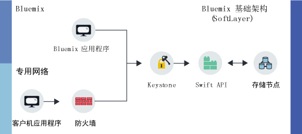

---

copyright:
  years: 2014, 2017
lastupdated: "2017-01-31"

---
{:new_window: target="_blank"}
{:shortdesc: .shortdesc}

# 关于 {{site.data.keyword.objectstorageshort}}  {: #about-object-storage}

{{site.data.keyword.objectstorageshort}} 使用元数据来识别放入存储器中的对象，以便能在大量数据中轻松搜索并快速访问这些对象。
{: shortdesc}

## {{site.data.keyword.Bluemix_notm}} Public {{site.data.keyword.objectstorageshort}} 的工作方式 {: #public}

Public {{site.data.keyword.objectstorageshort}} 有两条不同的路径可供用户在供应帐户时使用。您可以在自己的专用网络中开始，也可以通过 {{site.data.keyword.Bluemix_notm}} 应用程序访问 {{site.data.keyword.objectstorageshort}}。管理员和开发者都可以存储和访问对象，如下图中所示。

<dl>
  <dt><dfn>{{site.data.keyword.Bluemix_notm}} 应用程序</dfn></dt>
    <dd> 可以将 {{site.data.keyword.objectstorageshort}} 服务绑定到 {{site.data.keyword.Bluemix_notm}} 应用程序。</dd>
  <dt><dfn>客户机应用程序</dfn></dt>
    <dd> 可以从应用程序通过专用网络上的防火墙来直接访问 {{site.data.keyword.objectstorageshort}}。</dd>
  <dt><dfn>Keystone</dfn></dt>
    <dd> 可以使用 {{site.data.keyword.objectstorageshort}} 服务提供的凭证从 Keystone 获取授权令牌。</dd>
  <dt><dfn> OpenStack Swift API</dfn></dt>
    <dd> 一旦对实例进行认证后，即可以使用 Swift API 来读写存储的对象。</dd>
  <dt><dfn>存储节点</dfn></dt>
    <dd> 该服务维护<a href="http://docs.openstack.org/developer/swift/overview_replication.html">从多个存储节点复制</a>的数据的三个副本。</dd>
</dl>

图 1. {{site.data.keyword.Bluemix_notm}} Public {{site.data.keyword.objectstorageshort}} 的工作方式

**注意：**提供者端加密并未提供。由客户机应用程序负责在上传数据之前对数据进行加密。目前，磁盘级别加密不可用于 {{site.data.keyword.Bluemix_notm}} Public {{site.data.keyword.objectstorageshort}}。
