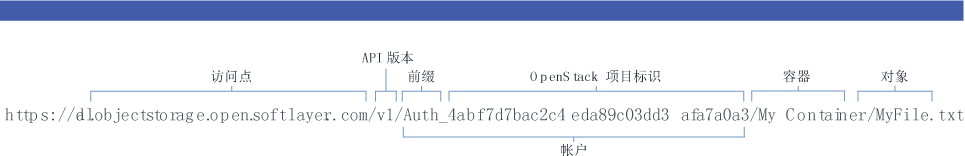

---

copyright:
  years: 2014, 2016

---
{:new_window: target="_blank"}
{:shortdesc: .shortdesc}
{:screen: .screen}
{:pre: .pre}

## 使用 Swift REST CLI 访问 {{site.data.keyword.objectstorageshort}} {: #using-swift-restapi}
*上次更新时间：2016 年 10 月 19 日*
{: .last-updated}

可以通过命令行客户机接口（例如，cURL）来使用 Swift REST API，也可以通过应用程序来调用该 API。
{: shortdesc}

### 构造 {{site.data.keyword.objectstorageshort}} URL {: #access-points}

要与 {{site.data.keyword.objectstorageshort}} API 进行交互，请如下所示构造 {{site.data.keyword.objectstorageshort}} URL：
  ```
https://<access point>/<API version>/AUTH_<project ID>/<container namespace>/<object namespace>
  ```
  {: pre}

<table>
  <tr>
    <th> URL 部分</th>
    <th> 定义</th>
  </tr>
  <tr>
    <td> API 版本</td>
    <td> 版本 1：V1 </td>
  </tr>
  <tr>
    <td> 帐户信息</td>
    <td> 这是项目标识和前缀的组合。可以在 UI 中找到。</td>
  </tr>
  <tr>
    <td> 容器名称空间</td>
    <td> 容器的名称。可以在 UI 中找到。</td>
  </tr>
  <tr>
    <td> 对象名称空间</td>
    <td> 文件或对象的名称。可以在 UI 中找到。</td>
  </tr>
  <tr>
    <td> 访问点</td>
    <td> 伦敦：https://lon.objectstorage.open.softlayer.com/<br> 达拉斯：https://dal.objectstorage.open.softlayer.com/</br> </td>
  </tr>
</table>

*表 1. {{site.data.keyword.objectstorageshort}} URL 部分的说明*

例如：




### {{site.data.keyword.objectstorageshort}} API {: #openstack-reference}

请参阅 [OpenStack Swift API Complete Reference](http://developer.openstack.org/api-ref-objectstorage-v1.html)，以获取 {{site.data.keyword.objectstorageshort}} REST API 选项和示例的完整列表。
