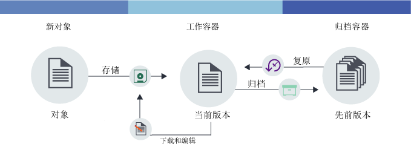

---

copyright:
  years: 2014, 2017
lastupdated: "2017-02-10"

---
{:new_window: target="_blank"}
{:shortdesc: .shortdesc}
{:codeblock: .codeblock}
{:screen: .screen}
{:pre: .pre}


# 设置对象版本控制 {: #setting-up-versioning}

通过设置对象版本控制，可自动保留较旧版本的对象。利用版本控制，不但可以防止意外覆盖，还可以检索文件的先前版本。
{: shortdesc}


#### 对象版本控制的工作原理

对象版本控制是用户存储可能会更改的对象的一种方式。利用版本控制，对象的当前版本在工作容器中始终可用，而所有先前版本都会在归档容器中备份。

<dl>
  <dt>存储</dt>
    <dd>新对象是您要进行第一次存储的对象。此类对象既可以是全新的对象，也可以是您第二次上传的经过编辑的对象。</dd>
  <dt>归档</dt>
    <dd>利用版本控制，如果保存到工作容器中的对象与现有对象名称相同，那么会将旧对象移动到归档容器中。并且会在该对象的名称后附加时间戳记。</dd>
  <dt>复原</dt>
    <dd>如果从工作容器中删除了对象，而且该对象有已归档的版本，那么会复原已归档的版本。随时都可以复原已归档的对象。</dd>
</dl>



图 1. 对象版本控制概述


#### 教程

要了解对象版本控制，请学完以下教程。

1. 创建容器并对其命名。将 *container_name* 变量替换为希望为容器提供的名称。

    ```
swift post <container_name>
```
    {: pre}

2. 再创建一个容器以充当备份存储器，并对其命名。

    ```
    swift post <archive_container_name>
    ```
    {: pre}

3. 设置版本控制。

    Swift 命令：

    ```
    swift post <container_name> -H "X-Versions-Location: <archive_container_name>"
    ```
    {: pre}

      cURL 命令：

    ```
    curl -i -X PUT -H "X-Auth-Token: <token>" -H "X-Versions-Location:<archive_container_name>" https://<object-storage_url>/<container_name>
    ```
    {: pre}

4. 首次将对象上传到工作容器。

    ```
    swift upload <container_name> <object>
    ```
    {: pre}

5. 编辑对象并将新版本上传到工作容器。

    ```
    swift upload <container_name> <object>
    ```
    {: pre}

6.  归档容器中的对象会按下列格式自动命名：`<Length><Object_name>/<time stamp>`。<table>
    <caption> 表 1. 描述的命名属性</caption>
      <tr>
        <th> 属性</th>
        <th> 描述</th>
      </tr>
      <tr>
        <td> <i>Length</i></td>
        <td> 对象名称的长度。这是 3 字符零填充十六进制数字。</td>
      </tr>
      <tr>
        <td> <i>Object_name</i></td>
        <td> 对象的名称。</td>
      </tr>
      <tr>
        <td> <i> time stamp </i> </td>
        <td> 最初上传该对象的该版本时的时间戳记。</td>
      </tr>
    </table>

7. 列出工作容器中的对象，以查看文件的新版本。

    ```
    swift list --lh <container_name>
    ```
    {: pre}

8. 列出归档容器中的对象，以查看附加了时间戳记的文件先前版本。

    ```
    swift list --lh <backup_container_name>
    ```
    {: pre}

9. 删除工作容器中的对象。归档容器中的最新版本会自动复原到工作容器中。

    **注**：必须删除文件的所有版本，才能删除该对象。

    ```
    swift delete <container_name>
    <object>
    ```
    {: pre}

10. 可选：禁用对象版本控制。

    Swift 命令：

    ```
    swift post <container_name> -H "X-Remove-Versions-Location:"
    ```
    {: pre}

      cURL 命令：

    ```
    cURL -i -X POST -H "X-Auth-Token: <token>" -H "X-Remove-Versions-Location: anyvalue" https://<object-storage_url>/<container_name>
    ```
    {: pre}
