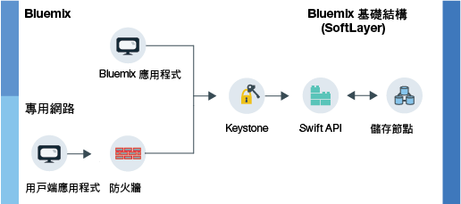

---

copyright:
  years: 2014, 2017
lastupdated: "2017-01-17"

---
{:new_window: target="_blank"}
{:shortdesc: .shortdesc}

# 關於 {{site.data.keyword.objectstorageshort}} {: #about-object-storage}

{{site.data.keyword.objectstorageshort}} 使用 meta 資料來識別儲存空間中所放置的物件，因此即使有大量資料，還是可以輕鬆地進行搜尋及快速存取。
{: shortdesc}

## {{site.data.keyword.Bluemix_notm}} 公用 {{site.data.keyword.objectstorageshort}} 的運作方式 {: #public}

公用 {{site.data.keyword.objectstorageshort}} 有兩種使用者在佈建帳戶時可遵循的不同路徑。您可以在自己的專用網路內開始，也可以透過 {{site.data.keyword.Bluemix_notm}} 應用程式存取 {{site.data.keyword.objectstorageshort}}。管理者及開發人員都可以儲存及存取物件（如下圖所示）。

<dl>
  <dt><dfn> {{site.data.keyword.Bluemix_notm}} 應用程式 </dfn></dt>
    <dd> 您可以將 {{site.data.keyword.objectstorageshort}} 服務連結至 {{site.data.keyword.Bluemix_notm}} 應用程式。</dd>
  <dt><dfn> 用戶端應用程式</dfn></dt>
    <dd> 您可以在專用網路上，透過防火牆直接從應用程式存取 {{site.data.keyword.objectstorageshort}}。</dd>
  <dt><dfn> Keystone </dfn></dt>
    <dd> 您可以使用 {{site.data.keyword.objectstorageshort}} 服務所提供的認證來取得來自 Keystone 的授權記號。</dd>
  <dt><dfn> OpenStack Swift API </dfn></dt>
    <dd> 鑑別實例之後，您可以使用 Swift API 來讀取及寫入所儲存的物件。</dd>
  <dt><dfn> 儲存節點 </dfn></dt>
    <dd> 服務會針對<a href="http://docs.openstack.org/developer/swift/overview_replication.html">跨多個儲存節點抄寫</a>的資料維護三份副本。</dd>
</dl>

圖 1. {{site.data.keyword.Bluemix_notm}} 公共 {{site.data.keyword.objectstorageshort}} 的運作方式

**注意**：並不提供提供者端加密。用戶端應用程式需負責上傳之前的資料加密。「{{site.data.keyword.Bluemix_notm}} 公用 {{site.data.keyword.objectstorageshort}}」目前無法使用磁碟層次加密。
