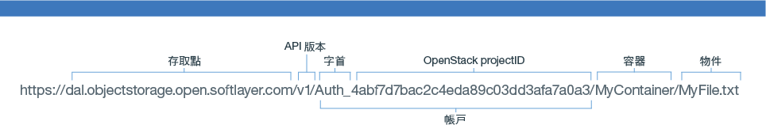

---

copyright:
  years: 2014, 2016

---
{:new_window: target="_blank"}
{:shortdesc: .shortdesc}
{:screen: .screen}
{:pre: .pre}

## 使用 Swift REST API 來存取 {{site.data.keyword.objectstorageshort}} {: #using-swift-restapi}
*前次更新：2016 年 10 月 19 日*
{: .last-updated}

您可以搭配使用 Swift REST API 與指令行用戶端介面（例如 cURL），或是從應用程式中呼叫 API。
{: shortdesc}

### 建構 {{site.data.keyword.objectstorageshort}} URL {: #access-points}

若要與 {{site.data.keyword.objectstorageshort}} API 進行互動，請如下所示建構 {{site.data.keyword.objectstorageshort}} URL：
  ```
https://<access point>/<API version>/AUTH_<project ID>/<container namespace>/<object namespace>
  ```
  {: pre}

<table>
  <tr>
    <th> URL 部分  </th>
    <th> 定義</th>
  </tr>
  <tr>
    <td> API 版本  </td>
    <td> 第 1 版：v1</td>
  </tr>
  <tr>
    <td> 帳戶資訊  </td>
    <td> 這合併了 ProjectID 與字首兩者。您可以在使用者介面中找到它。</td>
  </tr>
  <tr>
    <td> 容器名稱空間  </td>
    <td> 容器的名稱。您可在使用者介面中找到它。</td>
  </tr>
  <tr>
    <td> 物件名稱空間  </td>
    <td> 檔案或物件的名稱。您可在使用者介面中找到它。</td>
  </tr>
  <tr>
    <td> 存取點</td>
    <td> 倫敦：https://lon.objectstorage.open.softlayer.com/
    <br> 達拉斯：https://dal.objectstorage.open.softlayer.com/ </br> </td>
  </tr>
</table>

*表 1. 說明的 {{site.data.keyword.objectstorageshort}} URL 部分*

例如：




### {{site.data.keyword.objectstorageshort}} API {: #openstack-reference}

如需 {{site.data.keyword.objectstorageshort}} REST API 選項及範例的綜合性清單，請參閱 [OpenStack Swift API Complete Reference](http://developer.openstack.org/api-ref-objectstorage-v1.html)。
