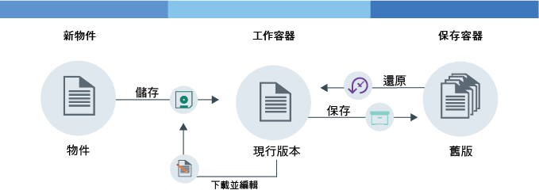

---

copyright:
  years: 2014, 2017
lastupdated: "2017-02-10"

---
{:new_window: target="_blank"}
{:shortdesc: .shortdesc}
{:codeblock: .codeblock}
{:screen: .screen}
{:pre: .pre}


# 設定物件版本化 {: #setting-up-versioning}

您可以設定物件版本化，來自動保留舊版物件。使用版本化，您可以避免意外改寫並且可以擷取舊版的檔案。
{: shortdesc}


#### 物件版本化的運作方式

物件版本化可以讓使用者儲存可能變更的物件。使用版本化，物件的現行版本隨時都可在您的工作容器取得，且所有舊版會備份在您的保存容器中。

<dl>
  <dt>儲存</dt>
    <dd>新物件是您第一次儲存的物件。此物件可以是全新的物件，或是您第二次上傳的編輯後物件。</dd>
  <dt>保存</dt>
    <dd>使用版本化，當與現有物件同名的物件儲存到工作容器時，較舊的物件會移到保存容器。物件的名稱上會附加時間戳記。</dd>
  <dt>還原</dt>
    <dd>如果物件從工作容器刪除，並且有該物件的保存版本存在，則會還原保存版本。您可以隨時還原保存物件。</dd>
</dl>



圖 1. 物件版本化概觀


#### 指導教學

若要瞭解物件版本化，請完成下列指導教學。

1. 建立容器，並為它命名。將變數 *container_name* 取代為您要提供給容器的名稱。

    ```
    swift post <container_name>
    ```
    {: pre}

2. 建立第二個容器以充當您的備份儲存空間，並加以命名。

    ```
    swift post <archive_container_name>
    ```
    {: pre}

3. 設定版本化。

    Swift 指令：

    ```
    swift post <container_name> -H "X-Versions-Location: <archive_container_name>"
    ```
    {: pre}

    cURL 指令：

    ```
    curl -i -X PUT -H "X-Auth-Token: <token>" -H "X-Versions-Location:<archive_container_name>" https://<object-storage_url>/<container_name>
    ```
    {: pre}

4. 第一次將物件上傳至工作容器。

    ```
    swift upload <container_name> <object>
    ```
    {: pre}

5. 編輯物件並上傳新版本到您的工作容器。

    ```
    swift upload <container_name> <object>
    ```
    {: pre}

6.  保存容器中的物件會自動以下列格式命名：`<Length><Object_name>/<time stamp>`。
    <table>
    <caption> 表 1. 說明的命名屬性</caption>
      <tr>
        <th> 屬性</th>
        <th> 說明</th>
      </tr>
      <tr>
        <td> <i>Length</i> </td>
        <td> 物件名稱的長度。這是 3 個字元並填補零的十六進位數。</td>
      </tr>
      <tr>
        <td> <i>Object_name</i> </td>
        <td> 物件的名稱。</td>
      </tr>
      <tr>
        <td> <i> time stamp </i> </td>
        <td> 物件的這個版本最初上傳時的時間戳記。</td>
      </tr>
    </table>

7. 列出工作容器中的物件，以查看新版本的檔案。

    ```
    swift list --lh <container_name>
    ```
    {: pre}

8. 列出保存容器中的物件，以查看附加時間戳記的檔案舊版。

    ```
    swift list --lh <backup_container_name>
    ```
    {: pre}

9. 刪除工作容器中的物件。保存容器中最近的版本會自動還原到您的工作容器。

    **附註**：您必須刪除檔案的所有版本，物件才能刪除。

    ```
    swift delete <container_name> <object>
    ```
    {: pre}

10. 選用：停用物件版本化。

    Swift 指令：

    ```
    swift post <container_name> -H "X-Remove-Versions-Location:"
    ```
    {: pre}

    cURL 指令：

    ```
    cURL -i -X POST -H "X-Auth-Token: <token>" -H "X-Remove-Versions-Location: anyvalue" https://<object-storage_url>/<container_name>
    ```
    {: pre}
