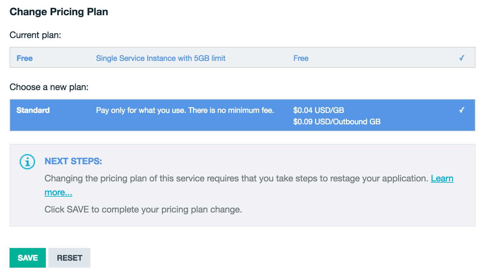

{:new_window: target="_blank"}

# FAQ {: #faq} 

## How do prices vary depending on which plan I choose? {: #plan-price}
Pricing varies depending on the chosen plan. For more pricing information, see the [IBM Bluemix Pricing Sheet](https://console.ng.bluemix.net/pricing/){: new_window} or use the [Calculator](https://console.ng.bluemix.net/?direct=classic/#/pricing/cloudOEPaneId=pricing&paneId=pricingSheet){: new_window} for more detailed estimates.

## How do I change my plan from Free to Standard? {: #changeplan}  

1.	Click **Plan** from the left navigation bar in the {{site.data.keyword.objectstorageshort}} user interface.
2.	Select **Standard** as the new plan and then click **Save**.

*Figure 5. {{site.data.keyword.objectstorageshort}} Change Pricing Plan*

Your services instances and customer data are moved to the new plan.

You can also change your payment plan by using the command line interface. For more information, see [How to change your plan](../../pricing/index.html#changing)  

## What accounts and payment plans can I use for {{site.data.keyword.objectstorageshort}}? {: #account-payment}
The {{site.data.keyword.objectstorageshort}} service comes with multiple plan options. As of our general availability release, two plans are currently offered, Standard and Free. The Standard plan is available only to {{site.data.keyword.Bluemix_notm}} Paid Accounts, either Pay-As-You-Go or Subscription, and to IBM internal users. The Standard plan includes an introductory 5 GB Free Credit Allowance on storage usage per account.

Trial accounts that are still active are able to use the Free plan which allows only one instance to exist in a {{site.data.keyword.Bluemix_notm}} Organization. After the time on the {{site.data.keyword.Bluemix_notm}} trial expires, the associated {{site.data.keyword.objectstorageshort}} service instance will be disabled, meaning that the storage account cannot be accessed either by the {{site.data.keyword.Bluemix_notm}} user interface or command line. After a grace period of 30 days, your {{site.data.keyword.Bluemix_notm}} account will be purged, and all data deleted. To avoid data loss, it is recommended that you upgrade to a {{site.data.keyword.Bluemix_notm}} Paid Account as soon as possible. To upgrade your account, click on the user management menu in the upper-right corner, and select **Account**, which provides instructions about the upgrade process.

Instances that are created on the Free plan can be upgraded to the Standard plan with the steps described in [How do I change my plan from Free to Standard?](#changeplan). To upgrade to the Standard plan, the associated organization must be a {{site.data.keyword.Bluemix_notm}} Paid Account. Trial accounts with {{site.data.keyword.objectstorageshort}} instances cannot be upgraded to the Standard plan, and instances on the Standard plan cannot be downgraded to other plans.

## How will I be charged and billed for my use of {{site.data.keyword.objectstorageshort}}? {: #charge-bill}

The {{site.data.keyword.objectstorageshort}} service charges only for what you use.  There are no minimum fee, set-up fees, or commitments to begin using the service. There is no charge for API request or inbound data network traffic.

Your {{site.data.keyword.objectstorageshort}} usage is billed based on your storage usage within the billing cycle. This includes all object data in containers that you created under your {{site.data.keyword.Bluemix_notm}} organization account. 

Outbound Data Transfer charge applies whenever data is read from any of your object containers over the public network. Public Outbound Bandwidth is billed for all bandwidth consumed in the billing cycle.

The metrics components to {{site.data.keyword.objectstorageshort}} pricing are as follows:
* Storage Usage  - $0.04 per GB per month
* Public Outbound Data Transfer  - $0.09 per GB per month 

At the end of the billing cycle, {{site.data.keyword.Bluemix_notm}} will automatically bill you for the usage for the current billing period. You can view your charges for the current billing period via {{site.data.keyword.Bluemix_notm}} reporting.

The standard service plan that is released for London and Dallas has the same pricing.

## How is data replication performed in {{site.data.keyword.objectstorageshort}}? {: #replication}
The {{site.data.keyword.objectstorageshort}} service maintains three copies of your data, which are replicated across multiple storage nodes. For more information, see the [OpenStack Swift Replication](http://docs.openstack.org/developer/swift/overview_replication.html){: new_window} document.

