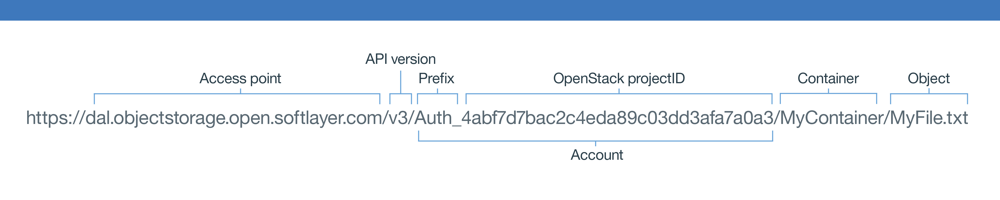

{:new_window: target="_blank"}

# Start using {{site.data.keyword.objectstorageshort}}  {: #using-object-storage} 


## Using the {{site.data.keyword.objectstorageshort}} user interface {: #using-object-storage-ui}

### UI elements and navigation
When your {{site.data.keyword.objectstorageshort}} is provisioned, you can see your instance information in the {{site.data.keyword.objectstorageshort}} for {{site.data.keyword.Bluemix_notm}} service instance dashboard. From the dashboard, select your {{site.data.keyword.objectstorageshort}} instance to view the panel with more detailed information.  
#### Usage data
At the top of the panel, you’ll see the storage usage information for your instance. It also shows the current number of **Storage Containers** and the total number of **Objects** in all of your containers. It lists your memory usage in megabytes. **Storage Consumed** refers to the current amount of space that is used. 
#### Actions
To retrieve the latest usage data, click the **Refresh** button.   
####Object browser 
The bottom section of the panel contains the object browser. Use the object browser to manage object storage containers and objects. You can create containers, upload files, delete containers, and delete files among other actions.


## Using {{site.data.keyword.objectstorageshort}} from a {{site.data.keyword.Bluemix_notm}} app {: #using-object-storage-from-bluemix-app} 

### How to bind your {{site.data.keyword.objectstorageshort}} service to an application after creation {: #bind-object-storage-to-application} 
1.	In the {{site.data.keyword.Bluemix_notm}} dashboard, select the app that you want to bind.
2.	In the app overview, click **Bind a Service or API**.
3.	Select your {{site.data.keyword.objectstorageshort}} instance from the list of services and click **Add**.
4.	Click **Restage** when prompted. Your app must be restaged to use the new service.

### Bound context

If you want to use {{site.data.keyword.objectstorageshort}} in a bound context, the cloud credentials are provided indirectly through the application binding process. After you successfully bind a service instance to your application, a configuration similar to the following example is added to your `VCAP_SERVICES` environment variable.

    {
    "Object-Storage": [
    {
      "name": "Object-Storage - YP",
      "label": "Object-Storage",
      "plan": "Free",
      "credentials": {
         "auth_url": "https://identity.open.softlayer.com",
         "project": "object_storage_d049255b",
         "projectId": "0f47b41b06d047f9aae3b33f1db061ed",
         "region": "dallas",
         "userId": "ad78b2a3f843466988afd077731c61fc",
         "username": "user_202db1f8a7aa3f3ac51ec68f10dbe7dc29070bc7",
         "password": "K/jyIi2jR=1?D.TP",
         "domainId": "2df6373c549e49f8973fb6d22ab18c1a",
         "domainName": "639347"
        }
       }
      ]
    }


## Using the Swift CLI to access {{site.data.keyword.objectstorageshort}} {: #using-swift-cli}

You can access the {{site.data.keyword.objectstorageshort}} service over the Internet and from applications and virtual servers within IBM {{site.data.keyword.Bluemix_notm}}. Common use cases for the {{site.data.keyword.objectstorageshort}} service are as follows:

* Backing up volume data from your instances
* Using as an intermediary location when you transfer large amounts of data
* Transferring data between environments that are not directly connected
* Acting as a central repository

The {{site.data.keyword.objectstorageshort}} service is based on OpenStack Swift and can be accessed by using any compatible client application. This section describes how to use the Python Swift client, which is the command-line interface (CLI) for the {{site.data.keyword.objectstorageshort}} API and its extensions, to work with containers and files.

### Installing the Swift client {: #install-swift-client}

Install the following prerequisite software if not already installed. For more information, see the [OpenStack Documentation](http://docs.openstack.org/user-guide/common/cli_install_openstack_command_line_clients.html#install-the-prerequisite-software){: new_window}. 
* Python 2.7 or later
* setuptools package
* pip package

Install the Python Swift client by using Python pip:

	sudo pip install python-swiftclient

### Setting up the client {: #setup-swift-client}

The Swift client takes the authentication information from the following environment variables:
* ```OS_AUTH_URL``` is the endpoint URL
* ```OS_USER_ID``` is the user name
* ```OS_PASSWORD``` is the password

Set the authentication information as follows. 

	export OS_USER_ID=24a20b8e4e724f5fa9e7bfdc79ca7e85
	export OS_PASSWORD=aaa55AAAaaaaa]?,
	export OS_PROJECT_ID=383ec90b22ff4ba4a78636f4e989d5b1
	export OS_AUTH_URL=https://identity.open.softlayer.com/v3
	export OS_REGION_NAME=dallas
	export OS_IDENTITY_API_VERSION=3
	export OS_AUTH_VERSION=3

You can find the credential values for your {{site.data.keyword.objectstorageshort}} service from the **Service Credentials** page in the {{site.data.keyword.objectstorageshort}} user interface. 

**Note:** Make sure that you add a ```/v3``` to the ```auth_url``` from the credentials in the {{site.data.keyword.objectstorageshort}} user interface when you configure the environment variables ```OS_AUTH_URL``` for the Swift client.


*Figure 2. {{site.data.keyword.objectstorageshort}} Service Credentials*

### Working with containers {: #work-with-containers}

Listing containers:

	swift list
	
Creating a container:

	swift post <container_name>
	
Listing the content of a container:

	swift list <container_name>

### Working with objects {: #work-with-objects}

#### Adding a file to a container

	swift upload <container_name> <file_name>

#### Adding files larger than 5 GB to a container

If you are uploading a file that is larger than 5 GB, you must split it into smaller chunks. You can instruct the Swift client to handle such upload by supplying the ```-segment-size``` parameter:

	swift upload <container_name> <file_name> --segment-size <size_in_bytes>
	
Each segment is uploaded in parallel into a separate container named ```<container_name>_segments```. After all the segments are uploaded, Swift creates a manifest file so that the segments can be downloaded in a single file from the original container ```<container_name>``` with the original file name ```<file_name>```.

For example, the following command uploads a file named ```large_file``` from a container named ```test_container``` with the segment size ```1073741824```.

	swift upload test_container -S 1073741824 large_file

You can run the following command to download the file:

	swift download test_container large_file

#### Downloading a file

	swift download <container_name> <file_name>
	
#### Adding a directory to a container

Swift does not have a true directory structure, but uses the naming to represent a directory layout. To add a directory to a container, run the following command:

	swift upload <container_name> <directory_name>
	
This command will upload the full directory structure as a relative path. For example, if you specify ```/mnt/volume1```, the directory structure mnt/volume1 will be attached to all the file names to indicate the directory structure.

	
#### Downloading a directory

To download a directory structure, use the ```-prefix``` parameter to indicate the directory or directory structure that you want to download.

	swift download <container_name> --prefix <directory>
	
#### Deleting a file

	swift delete <container_name> <file_name>

### Working with object versioning {: #work-with-object-versioning}

You can set up versions of each object in your container by using the ```X-Versions-Location``` flag. To do this, create an additional container to keep older versions of your objects as follows. 

If you are using the swift client, you can set it up like this:

	swift post container_one -H "X-Versions-Location:container_two"

If you are using curl, you can set it up like this:

	curl -i -X PUT -H "X-Auth-Token: <token>" -H "X-Versions-Location:container_two" https://<object-storage_url>/container_one

In the example above, ```container_two``` has been set up to contain the older versions of your objects stored in ```container_one```. Therefore, ```container_one``` will have the most current version of your objects, and ```container_two``` will have the older versions of your objects. Make sure ```container_two``` exists in order for versioning to work.

With versioning set up, when you upload an object to ```container_one```, if there is an existing version of the object, the existing version is moved to ```container_two``` as the new version is created in ```container_one```. If you delete an object from ```container_one```, the previous version of the object is moved from ```container_two``` back to ```container_one```.

Objects in ```container_two``` will be automatically named with the following format: ```<Length><Object_name>/<Timestamp>```

```Length``` refers to the length of the name of your object; this is a 3-characters, zero-padded hexadecimal number. ```Object_name``` is the name of your object. ```Timestamp``` is the timestamp of when this particular version of the object was originally uploaded.

To disable versioning, use the ```X-Remove-Versions-Location``` flag:

	swift post container_one -H "X-Remove-Versions-Location:"

or

	curl -i -X POST -H "X-Auth-Token: <token>" -H "X-Remove-Versions-Location: anyvalue" https://<object-storage_url>/container_one

Here is a full example of the use of versioning:

1. Create a container:

		$ swift post container_one
		$

2. Set up versioning for container_one:

		$ swift post container_one -H "X-Versions-Location:container_two"
		$

3. Create container_two:

		$ swift post container_two
		$

4. Upload an object for the first time to container_one:

		$ swift upload container_one object
		object
		$

5. List objects in container_one:

		$ swift list container_one
		object
		$

6. List objects in container_two:

		$ swift list container_two
		$

7. Upload a new version of the object to container_one:

		$ swift upload container_one object
		object
		$

8. List objects in container_one:

		$ swift list container_one
		object
		$

9. List objects in container_two:

		$ swift list container_two
		006object/1457456909.27383
		$

10. Delete object in container_one:

		$ swift delete container_one object
		object
		$

11. List both containers:

		$ swift list container_one
		object
		$ swift list container_two
		$

### Scheduling object deletion {: #schedule-object-deletion}

You can set your objects to expire in a given amount of time. In other words, you can schedule the deletion of your objects. You can do this by making use of either of the ```X-Delete-At``` or ```X-Delete-After``` headers. The ```X-Delete-At``` header takes an integer number representing the epoch time at which to delete the object. The ```X-Delete_After``` header takes an integer number representing the number of seconds after which the object will be deleted.

If you are using the swift client do a post to the object in your container, see the following examples.

* To set the object to be deleted on "2016/04/01 08:00:00", use the following command:

		swift post -H "X-Delete-At:1459515600" container object

* To set the object to be deleted an hour from now, use the following command:

		swift post -H "X-Delete-After:3600" container object

  After doing this, the ```swift stat container object``` command will show the ```X-Delete-At``` header with the appropriate expiration in epoch time.

* To remove the expiration time from your object, use the following command:

		swift post -H "X-Remove-Delete-After:" container object

If you are using curl, the commands are as follows. 

* To set the object to be deleted on "2016/04/01 08:00:00", use the following command:

		curl -X POST -H "X-Auth-Token: <token>" -H "X-Delete-At:1459515600" https://<object-storage_url>/container/object

* To set the object to be deleted an hour from now, use the following command:

		curl -X POST -H "X-Auth-Token: <token>" -H "X-Delete-After:3600" https://<object-storage_url>/container/object

* To check if the object has the header, use the following command:

		curl -I -H "X-Auth-Token: <token>" https://<object-storage_url>/container/object

* To remove the expiration time, use the following command:

		curl -X POST -H "X-Auth-Token: <token>" -H "X-Remove-Delete-At:" https://<object-storage_url>/container/object

**Note:** The actual deletion of an object might not happen at the exact time indicated. However, the object will in fact expire at the specified time, meaning it will not be reachable any more. The actual deletion will take place the next time the swift-object-expirer daemon configured in your swift cluster runs.


### Creating a temporary URL {: #create-temporary-url}

A temporary URL is a long, difficult-to-guess URL that can be used for a specified period to download objects without requiring further authentication. Generate a temporary URL with the following steps:

1. Identify your authentication account.
2. Set a secret key.
3. Create the temporary URL.

#### Identifying your authentication account

The Swift ```stat``` command prints information about your account:

	swift stat

Locate the Account field and note the full string behind *Account*: including ```AUTH_```.

#### Setting a secret key

This key can be anything that you select, but best practice is that you select a long, random, and hard to guess string.

	swift post -m "Temp-URL-Key:<key>"
	
Run the Swift ```stat``` command to verify that the ```Temp-URL-Key``` is set successfully.

	swift stat


#### Creating the temporary URL

The Swift ```tempurl``` command takes these positional arguments:

* [method] GET to allow download. PUT to allow upload.
* [seconds] Time in seconds that the temporary URL will be available.
* [path] The full path of the object expressed as ```/v1/<auth_account>/<container_name>/<object_name>```. For more information, see the [{{site.data.keyword.objectstorageshort}} URL](#access-points). 
* [key] The key that you set in step 2.

```
swift tempurl GET <seconds> <path> <key>
```

This command will return a URL that you can append to your cluster name to get a full URL. Use the full URL to download the object with any compatible HTTP client such as curl, wget, or Firefox.

## Using the Swift REST API to access {{site.data.keyword.objectstorageshort}} {: #using-swift-restapi}

You can use the Swift REST API with a command–line client interface, such as cURL, or call the API from your application.  

### {{site.data.keyword.objectstorageshort}} URL {: #access-points}

To interact with the {{site.data.keyword.objectstorageshort}} API, construct the {{site.data.keyword.objectstorageshort}} URL as follows:

	https://<access point>/<API version>/AUTH_<project ID>/<container namespace>/<object namespace>

For example:



*Figure 3. {{site.data.keyword.objectstorageshort}} URL*

The URL consists of five parts. The ```<API version>``` is v1. You can find the  ```<project ID>```, ```<container namespace>```, and ```<object namespace>``` of your {{site.data.keyword.objectstorageshort}} from the {{site.data.keyword.objectstorageshort}} user interface.  For the ```<access point>```, see the following table: 


| **Region**  |   **Public access point**                     |
|-------------|-----------------------------------------------|
| Dallas      | https://dal.objectstorage.open.softlayer.com/ | 
| London      | https://lon.objectstorage.open.softlayer.com/ |


*Table 1. {{site.data.keyword.objectstorageshort}} access point*


### {{site.data.keyword.objectstorageshort}} API

See the [OpenStack Swift API Complete Reference](http://developer.openstack.org/api-ref-objectstorage-v1.html){: new_window} for a comprehensive list of the {{site.data.keyword.objectstorageshort}} REST API options and examples.

## Using {{site.data.keyword.objectstorageshort}} across multi-regions {: #multi-regions}  

The IBM {{site.data.keyword.objectstorageshort}} for {{site.data.keyword.Bluemix_notm}} service supports the Dallas and London storage regions. These storage regions are independent of the {{site.data.keyword.Bluemix_notm}} region, such as US-South and United Kingdom, in which the {{site.data.keyword.objectstorageshort}} service instance is created.  For example, if you create an {{site.data.keyword.objectstorageshort}} instance in the US-South {{site.data.keyword.Bluemix_notm}} region, you can read and write data to either the Dallas or London storage region.  

For the US-South {{site.data.keyword.Bluemix_notm}} region, the Dallas storage region is the default. For the United Kingdom {{site.data.keyword.Bluemix_notm}} region, the London storage region is the default.  The {{site.data.keyword.objectstorageshort}} user interface always launches to the default storage region of the {{site.data.keyword.Bluemix_notm}} region. To switch regions, click the {{site.data.keyword.objectstorageshort}} Region drop-down list and choose another region.


*Figure 4. {{site.data.keyword.objectstorageshort}} Change Region*

**Note:** The {{site.data.keyword.objectstorageshort}} service does NOT support cross storage region replication.

### Multi-region access

To use the {{site.data.keyword.objectstorageshort}} service, you must [authenticate to OpenStack Keystone](#keystone-authentication). After you successfully authenticated, an ```X-Subject-Token``` and the {{site.data.keyword.objectstorageshort}} endpoints will be available in the response.

For example, to create a container named ```my_container``` in the Dallas storage region, specify a Dallas access point in the curl command as follows:

	# curl -i https://dal.objectstorage.open.softlayer.com/v1/AUTH_3c9c89a2edbb458da74a9e81e215da9e/my_container -X PUT -H "Content-Length: 0" -H "X-Auth-Token: gAAAAABWlw5mwttbb_6G3LnTiGusyoOSEHXMG7oTnDYWN1vBZB6XAxUEhz4ehGkdw6Qm_I9ZFFXr8fwcc2KaEbpWbQoglhAvrYTXbrkn8MvErLdnbcT0XK2t5N7lEZyyKQlsgmQWcrch8VOO_OiSKKToORYR7luI-2TrR_JIVZm-8AAS6hLhk9"

	HTTP/1.1 201 Created
	Content-Length: 0
	Content-Type: text/html; charset=UTF-8
	X-Trans-Id: tx4a640ca81c7240ea8f812-00569712fc
	Date: Thu, 14 Jan 2016 03:16:13 GMT


To create a container named ```my_container``` in the London storage region, specify a London access point in the curl command as follows:

	# curl -i https://lon.objectstorage.open.softlayer.com/v1/AUTH_3c9c89a2edbb458da74a9e81e215da9e/my_container -X PUT -H "Content-Length: 0" -H "X-Auth-Token: gAAAAABWlw5mwttbb_6G3LnTiGusyoOSEHXMG7oTnDYWN1vBZB6XAxUEhz4ehGkdw6Qm_I9ZFFXr8fwcc2KaEbpWbQoglhAvrYTXbrkn8MvErLdnbcT0XK2t5N7lEZyyKQlsgmQWcrch8VOO_OiSKKToORYR7luI-2TrR_JIVZm-8AAS6hLhk9"

	HTTP/1.1 201 Created
	Content-Length: 0
	Content-Type: text/html; charset=UTF-8
	X-Trans-Id: tx4a640ca81c7240ea8f812-00569712fc
	Date: Thu, 14 Jan 2016 03:16:13 GMT

**Note:** The ```X-Subject-Token``` that you acquired from Keystone works across storage regions. 

For more information about the access points for different regions, see the [Object Storage access point](#access-points) table.


## Understanding authentication and credentials {: #understanding-authentication-credentials}

### Generating {{site.data.keyword.objectstorageshort}} credentials without binding an application

To generate {{site.data.keyword.objectstorageshort}} cloud credentials for use outside a {{site.data.keyword.Bluemix_notm}} application, you must generate a service key for your {{site.data.keyword.objectstorageshort}} instance. You can generate a new key by selecting  **Service Credentials** from the sidebar of the user interface or by using the Cloud Foundry CLI (version 6.11.3 or later). After you generate and retrieve a service key for your {{site.data.keyword.objectstorageshort}} instance, you can use the cloud integration information to request a Keystone token by using an OpenStack SDK or the OpenStack Identity API and start using the Swift account to manage objects.
   
To create the key by using the Cloud Foundry CLI, log in and run the following command:
 
    cf create-service-key <object_storage_instance_name> <unique_name_for_this_key>

To retrieve the service credentials from the Cloud Foundry CLI, run the following command:

	cf service-key <object_storage_instance_name> <unique_name_for_this_key>


### Cloud projects and users
Provisioning a new {{site.data.keyword.objectstorageshort}} instance creates an isolated Keystone project in the IBM Public Cloud. When you bind a new application to the {{site.data.keyword.objectstorageshort}} instance, a new Keystone user with access to the project is created. When you deprovision the instance, the project and user are deleted.

### OpenStack Identity (Keystone) v3 {: #keystone-authentication}
The credentials structure contains a complete set of attributes to allow to you to choose the OpenStack token request method or OpenStack SDK that best fits your application. 
 
The recommended v3 token request is a POST request to https://identity.open.softlayer.com/v3/auth/tokens as shown in the following curl command:

	curl -i \
	  -H "Content-Type: application/json" \
	  -d '
	{
		"auth": {
			"identity": {
				"methods": [
					"password"
				],
				"password": {
					"user": {
						"id": "ad78b2a3f843466988afd077731c61fc",
						"password": "K/jyIi2jR=1?D.TP"
					}
				}
			},
			"scope": {
				"project": {
					"id": "0f47b41b06d047f9aae3b33f1db061ed"
				}
			}
		}
	}' \
	  https://identity.open.softlayer.com/v3/auth/tokens ; echo

Use the value of the ```X-Subject-Token``` field from the response header as the ```X-Auth-Token``` field when you make requests to the {{site.data.keyword.objectstorageshort}} service.

An example response is as follows. The response is trimmed to show only the {{site.data.keyword.objectstorageshort}} relevent information.

	HTTP/1.1 201 Created
	Date: Mon, 29 Feb 2016 21:03:41 GMT
	Server: Apache/2.4.6 (CentOS) OpenSSL/1.0.1e-fips mod_wsgi/3.4 Python/2.7.5
	X-Subject-Token: gAAAAABW1LIubUgqKl-eInzhZUHWEnXijp7t6_5inl4DTRLxDhNbJ25ly2X7bASNvH7ocxinaJu_kdhSfnHNRwPAeYY77Ii2Cwp02-bvxUA1S9lV_knT6EyCOW2mSBl_HuuDD2cEgdiKmyZTVt-RvDxhPKYD-rHkJz-dHO4Folg8TVXotilb1uw
	Vary: X-Auth-Token
	x-openstack-request-id: req-01e096c8-5393-4f98-8ff6-029c55e42524
	Content-Length: 12051
	Content-Type: application/json

	{
	  "token" : {
	    "roles" : [
	      {
	        "id" : "f61f06a84f6443e880210fa986bd8691",
	        "name" : "ObjectStorageOperator"
	      }
	    ],
	    "catalog" : [
	      {
	        "endpoints" : [
	          {
	            "id" : "20cbfa6ff22b4a67a1484d30235bfc80",
	            "region" : "london",
	            "region_id" : "london",
	            "url" : "https:\/\/lon.objectstorage.service.open.networklayer.com\/v1\/AUTH_3ecf7d7bac2c4eda89c03dd3afa7a0a3",
	            "interface" : "admin"
	          },
	          {
	            "id" : "38b8c081b11a452bb951698c334a406d",
	            "region" : "london",
	            "region_id" : "london",
	            "url" : "https:\/\/lon.objectstorage.service.open.networklayer.com\/v1\/AUTH_3ecf7d7bac2c4eda89c03dd3afa7a0a3",
	            "interface" : "internal"
	          },
	          {
	            "id" : "4207049680fa4effbecd044c7448a8cb",
	            "region" : "dallas",
	            "region_id" : "dallas",
	            "url" : "https:\/\/dal.objectstorage.open.softlayer.com\/v1\/AUTH_3ecf7d7bac2c4eda89c03dd3afa7a0a3",
	            "interface" : "public"
	          },
	          {
	            "id" : "8a65a0cf38ac4211ad6a3c9c0eb337ff",
	            "region" : "london",
	            "region_id" : "london",
	            "url" : "https:\/\/lon.objectstorage.open.softlayer.com\/v1\/AUTH_3ecf7d7bac2c4eda89c03dd3afa7a0a3",
	            "interface" : "public"
	          },
	          {
	            "id" : "a60cf32be624491d89170ef8264de5e8",
	            "region" : "dallas",
	            "region_id" : "dallas",
	            "url" : "https:\/\/dal.objectstorage.service.open.networklayer.com\/v1\/AUTH_3ecf7d7bac2c4eda89c03dd3afa7a0a3",
	            "interface" : "admin"
	          },
	          {
	            "id" : "c769862200124a308d6748e418c971ba",
	            "region" : "dallas",
	            "region_id" : "dallas",
	            "url" : "https:\/\/dal.objectstorage.service.open.networklayer.com\/v1\/AUTH_3ecf7d7bac2c4eda89c03dd3afa7a0a3",
	            "interface" : "internal"
	          }
	        ],
	        "id" : "896e4064cbe742afbf9a543c15f27ac0",
	        "type" : "object-store",
	        "name" : "swift"
	      },
	    ],
	    "extras" : {

	    },
	    "user" : {
	      "id" : "0b8aebd924ef4cc7aa9232f07e47e874",
	      "name" : "user_87c094ce47a9feae3a137ffcbbfa098a888c12a8",
	      "domain" : {
	        "id" : "8753ff40ac1a4f4a9f162ad8026b6ce0",
	        "name" : "757955"
	      }
	    },
	    "expires_at" : "2016-02-29T22:03:42.061343Z",
	    "audit_ids" : [
	      "cbA-iL2dSheyB72PHd7q8Q"
	    ],
	    "issued_at" : "2016-02-29T21:03:42.000000Z",
	    "project" : {
	      "id" : "3ecf7d7bac2c4eda89c03dd3afa7a0a3",
	      "name" : "object_storage_c1d8b3a1",
	      "domain" : {
	        "id" : "8753ff40ac1a4f4a9f162ad8026b6ce0",
	        "name" : "757955"
	      }
	    },
	    "methods" : [
	      "password"
	    ]
	  }
	}


The {{site.data.keyword.objectstorageshort}} URL is found in the Service Catalog. The Service Catalog is contained in the response body of the token request. The response is a full catalog of OpenStack services that are available. Select the endpoint from the Service Catalog with type of ```object-store``` and the region that matches the region field in the credentials.

**Note:** Use the public interface (`publicURL`). The internal interface (`internalURL`) is not accessible from {{site.data.keyword.Bluemix_notm}}.


## Unbinding and deprovisioning {{site.data.keyword.objectstorageshort}} {: #deprovisioning-object-storage}

### How to deprovision your {{site.data.keyword.objectstorageshort}} service
1.	Select your service from the {{site.data.keyword.Bluemix_notm}} dashboard.  
2.	Click the gear icon in the upper right corner and select **Delete Service**.
	
**Warning:** If you deprovision an IBM {{site.data.keyword.objectstorageshort}} for {{site.data.keyword.Bluemix_notm}} service instance, the cloud project and Swift account are deleted. All containers and objects in the deprovisioned instance are deleted from Swift and cannot be restored.

### Unbinding an application or deleting a service key

If you unbind an application from the {{site.data.keyword.objectstorageshort}} instance or delete the service key, the credentials are deleted. The {{site.data.keyword.objectstorageshort}} account is not deleted until the {{site.data.keyword.objectstorageshort}} instance is deprovisioned. You can generate new cloud credentials by [rebinding or creating a new service key](#bind-object-storage-to-application).

