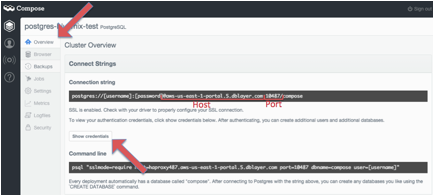

{:shortdesc: .shortdesc}
{:new_window: target="_blank"}

# Getting started with PostgreSQL by Compose

PostgreSQL is the first SQL database to make its way to Compose. Postgres is a powerful, open source object-relational database that is highly customizable. With Postgres, development is fast and easily scalable, plus you can develop in a language you're comfortable with like C/C++, Perl, Python, TCL/TK, Delphi/Kylix, VB, PHP, ASP, and Java just for starters. It's a feature-rich enterprise database with JSON support, giving you the best of both the SQL and NoSQL worlds.
{:shortdesc} 

### Setting up credentials for PostgreSQL by Compose:
In order to sign-in to Compose’s PostgreSQL through Bluemix, you will need the following credentials: 

- Username
- Password
- Host
- Port

The instructions below will show you where to find these credentials on the Compose platform:
1. Sign-in to your Compose account. On the dashboard, 'Deployments' will be automatically selected. Under PostgreSQL, select the deployment that you would like to get the credentials for.  
2. The 'Overview' icon will be automatically selected for you. Under 'Connect Strings' you will see host and port. The select 'show credentials' to reveal username and password.

*Figure 1. Compose dashboard*

># Related Links {:class="linklist"}
>## Related Links {:id="general"}  
>* [Welcome Compose Blog](http://cloudant.com/blog/welcome-compose/){:new_window}
>* [PostgreSQL Deployments Docs](http://docs.compose.io/getting-started/postgresql-deployments.html){:new_window}
>
>{:elementKind="article" id="rellinks"}
