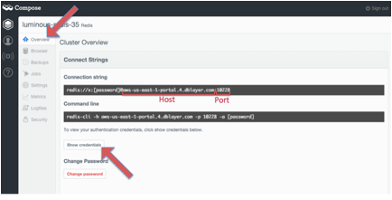

{:shortdesc: .shortdesc}
{:new_window: target="_blank"}

# Getting started with Redis by Compose

Redis is an open-source, blazingly fast, key/value low maintenance store. Redis's lightning fast speed comes from its architecture – an in-memory database which keeps your entire dataset in RAM for fast access and handles persisting to disk in the background. By running your Redis database on Compose's platform you get a configuration pre-tuned for high availability and locked down with additional security features.
{:shortdesc} 

### Setting up credentials for Redis by Compose:
In order to sign-in to Compose’s Redis through Bluemix, you will need the following credentials: 

- Password
- Host
- Port

The instructions below will show you where to find these credentials on the Compose platform:
1. Sign-in to your Compose account. On the dashboard, 'Deployments' will be automatically selected. Under Redis, select the deployment that you would like to get the credentials for. 
2. 'Overview' will automatically be selected. Under 'Connection Strings', you will find the host and port. If you select show credentials reveal your password. 

*Figure 1. Compose dashboard*

># Related Links {:class="linklist"}
>## Related Links {:id="general"}  
>* [Welcome Compose Blog](http://cloudant.com/blog/welcome-compose/){:new_window}
>* [Redis Deployments Docs](https://docs.compose.io/getting-started/redis-deployments.html){:new_window}
>
>{:elementKind="article" id="rellinks"}