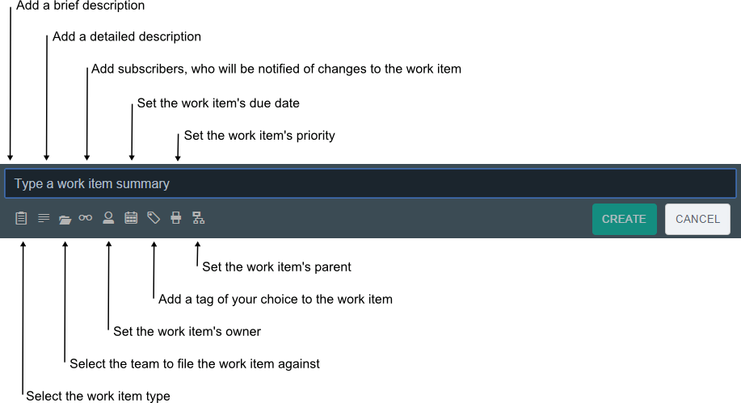
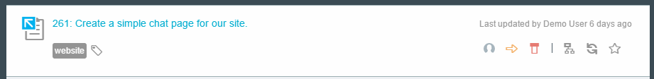
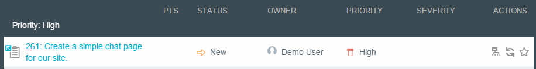
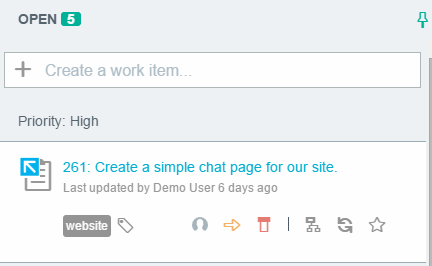

---

 

copyright:

  years: 2015, 2016

 

---

{:shortdesc: .shortdesc}
{:screen: .screen}
{:new_window: target="_blank"}
{:codeblock: .codeblock}

#Creating and displaying work items {: #tp-creatingwis}  

*Last Updated: 29 April 2016*

You can create and display work items in several ways, depending on your context. 
{: shortdesc}

For example, if you create a work item in the My Work view, you own the work item automatically. But if you create a work item from the Incoming Work view, the owner will be unassigned unless you select one.

To set the attributes, click the icons, as shown in the following image. You can also open and edit a work item's attributes by clicking its summary. 

**Note**: Some attributes are available for only specific work item types. For example, the Severity attribute type is available for Defect work items only.

Work items have three basic states:
- **Open**: The work item is not started yet. Its status is New.
- **In progress**: The work item is started. Its status is In progress.
- **Resolved**: The work item is finished. Its status is Complete or Invalid.

##Displaying work items {: #tp-widisplay}  

You can display your work items in several ways.    

###List 
When you view work items in a list, each work item spans the width of the list. You can see more information about a work item by expanding it. Attributes are shown as icons.

###Table  
When you view work items in a table, each work item is in a condensed format. Some attributes are shown as icons and text and are arranged into columns.

###Lanes
When you view work items in lanes, the work items are grouped by states. Attributes are shown as icons. You can view two states at a time. To view the third state, scroll horizontally.

For more information about creating work items and defining their attributes, [see the documentation for IBM Rational Team Concert](http://www.ibm.com/support/knowledgecenter/SSYMRC_6.0.1/com.ibm.team.workitem.doc/topics/t_creating_work_items_web.html). 
