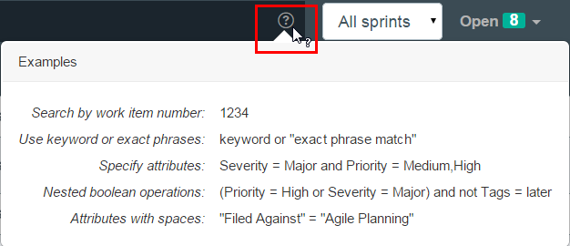
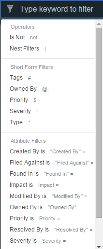
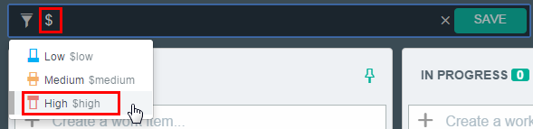
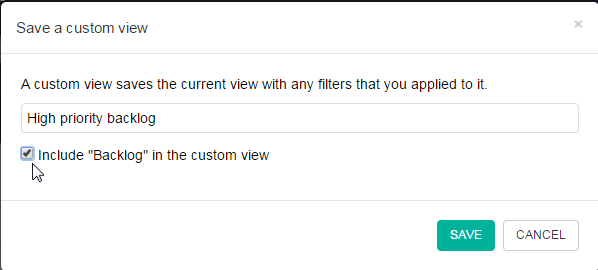
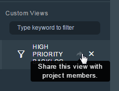
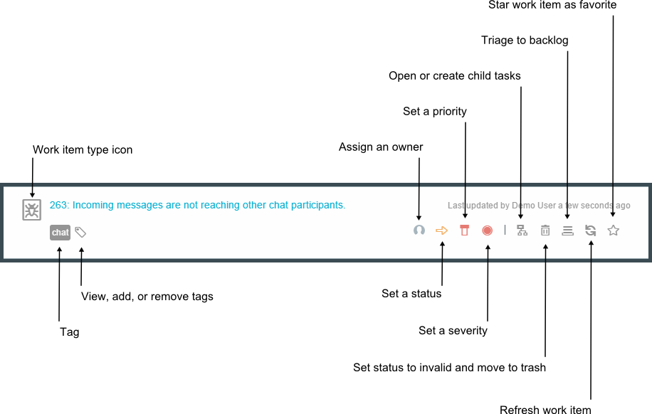

---

 

copyright:

  years: 2015, 2016

 

---

{:shortdesc: .shortdesc}
{:screen: .screen}
{:new_window: target="_blank"}
{:codeblock: .codeblock}

#Organizing and filtering work items {: #tp-organize}  

*Last Updated: 29 April 2016*

The {{site.data.keyword.trackplan}} service includes several options for sorting and organizing your work items.
{: shortdesc}

##Filtering work items {: #tp-filteringwis}

You can filter work items based on words or on values for specific attributes. 

Filtering is supported in these views:   
- My Work
- My Subscribed
- Incoming Work
- Backlog
- Sprint Planning
- Team's Work
- All Work

If you type a word, the work item summaries that contain that word are shown. You can also filter work items based on values for specific attributes. For details, see the following table.

| Attribute |Example | 
|-------|-------|
|*Type  | `*Defect` |
|#Tag  | `#conference`| 
|@:Owner  | `@:jasmith`|
|$Priority|`$High`|
|!Severity|`!Major`|       
   

You can create queries that use any work item attribute by typing the attribute name. For example, if you type `Created by`, the query options and the syntax are shown. You can use operators, such as "and," "or," and "not" in your filter criteria. You can also include complex operations that nest multiple operators by using parentheses. To see examples, click the **Help** icon. 

When you click the **Filter work items by keyword** field, the operators and filters that you can use to create queries are shown.

##Saving custom views {: #tp-customviews}
You can create custom views by applying filters. Then, you can share the views with your team.    

1. In the **Filter work items** field, type the short-form of an attribute type and a value for that attribute, for example, `$high`. Some attribute choices are automatically listed when you type the short-form, for example, *Type, $Priority, and !Severity.

2. Click **SAVE**.
3. Name the view. 
4. If you want the custom view to include the sprint that you're viewing, select the check box to include the sprint. In the following example, the Backlog sprint will be included in the "High priority backlog" view.

5. Click **SAVE**. 
6. If you want to share your saved views with your team, in the Custom Views section, click the share icon next to the new view. Then, click **OK**.    

Custom views return results for only the current sprint and status that you're viewing. If you want the view to return results for more sprints or statuses, click the view and change it as needed.

##Viewing and organizing your work items {: #tp-organizingwis}

- To view work items that you own, see the My Work view. 
- If you often use specific work items, you can mark them as your favorites by clicking their Star icons . Then, you can see all of your favorite work items in the My Starred view. When you click the Star icon for a work item, only you can see that you marked it as a favorite.  
- To view all of the work items that you are subscribed to, see the My Subscribed view.
- To view your work items sorted by their modified dates, see the My Recent Work view.
- To view your work item activity, see the My Activities view. The My Events section lists the work items that you were mentioned in. The My Subscriptions section lists all of the changes that occurred in work items that you are subscribed to.

##Triaging work items {: #tp-triaging}

When a work item is created but not assigned to a sprint, the work item is shown in the Incoming Work view.
As soon as a work item is assigned to a sprint, it is removed from the Incoming Work view.

In the Incoming Work view, you can triage work items in several ways: 
- To reject the work item, click the **Trash this item** icon . The work item is resolved and its status is changed to Invalid.
- To accept the work item and assign it to the Backlog, click the **Triage to backlog** icon . Then, you can evaluate the work item against other work items in the Sprint Planning view and assign the work item to a sprint.
- To assign the work item to a sprint, open the work item and select a value from the **Planned for** list.

  

For more information about managing work items, [see Managing a project with Quick Planner](http://www.ibm.com/support/knowledgecenter/SSYMRC_6.0.1/com.ibm.team.concert.tutorial.doc/topics/tut_quick_planner_lesson.html).
