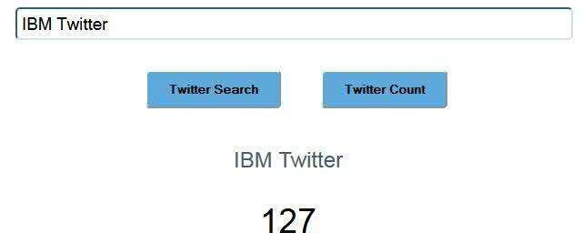

---

copyright:
  years: 2015, 2016
lastupdated: "2016-11-21"

---

{:new_window: target="_blank"}
{:shortdesc: .shortdesc}
{:screen:.screen}
{:codeblock:.codeblock}

# Insights for Twitter 예제
{: #examples}

{{site.data.keyword.twittershort}} 서비스를 시작하려면 제공된 샘플을 사용하여 서비스의 레버리지 활용 방법을 이해해야 합니다.
{: shortdesc}

## Insights for Twitter 데모
{: #insights_twitter_demo}

{{site.data.keyword.twittershort}} 서비스를 사용하는 Twitter 데이터 스트림을 검색할 수 있도록 샘플 애플리케이션이 제공됩니다. [https://cdetestapp.mybluemix.net/](https://cdetestapp.mybluemix.net/){: new.window}으로 이동하여 애플리케이션에 액세스할 수 있습니다. 사용 중인 브라우저에서 애플리케이션이 열리며 **Twitter 검색** 및 **Twitter 개수** 단추가 있는 검색 필드가 표시됩니다.  


[쿼리 언어](twitter_rest_apis.html#querylanguage){: new.window}에 설명된 대로 샘플 애플리케이션에서 지원되는 매개변수와 연산자를 사용하여 트윗을 검색할 수 있습니다. 예를 들어, "IBM Twitter"(공백은 부울 AND 연산을 나타냄)를 입력하고 **Twitter 검색**을 클릭하면 두 용어를 포함하는 트윗이 리턴됩니다. 


검색 필드에 "IBM Twitter"를 지정하고 **Twitter 개수**를 클릭하면 두 용어가 포함된 트윗의 수가 리턴됩니다. 



## 규칙 추적 작성
{: #creating_rule_track}

Entry Plan 사용자는 규칙 기반 추적을 작성하여 PowerTrack 데이터 스트림에 수집된 트윗을 필터링할 수 있습니다. 이후 절의 예제는 PowerTrack 스트림에 대하여 검색 또는 개수 API 호출을 실행하고 추적을 편집 및 삭제 방법을 보여줍니다. 규칙 추적을 작성하려면 **POST** 요청을 /api/v1/tracks 조작으로 실행하고 추적 유형(**Rule**)을 지정한 후 'EndDate'를 표시하고 하나 이상의 규칙을 포함하십시오. 다음 스니펫은 2개의 규칙을 포함하는 예제 요청입니다.

```
POST https://<username>:<password>@cdeservice.mybluemix.net:443/api/v1/tracks
HTTP/1.1 Content-Type: application/json
{
    "endDate": "2015-10-03T10:23:00Z",
    "name": "My First Rule Track",
    "type": "Rule",
    "rules": [
        {"value": "Canada"},
        {"value": "sport hockey"}
    ]
}
```

`username` 및 `password`는 사용자 애플리케이션과 서비스 인스턴스에 고유합니다. 이 정보는 **VCAP_SERVICES** 환경 변수를 통해 확보할 수 있습니다. 자세한 정보는 [{{site.data.keyword.twittershort}} 시작하기](index.html#insights_twitter_overview){: new.window}를 참조하십시오. 

응답 본문은 다음 스니펫과 유사하게 나타납니다.

```
HTTP/1.1 201 Created
Content-Type: application/json;charset=utf-8
Location: https://cdeservice.mybluemix.net:443/api/v1/tracks/66ff1961-51fe-4475-8bcd-c02f071d6fd1
{
    "id": "66ff1961-51fe-4475-8bcd-c02f071d6fd1",
    "type": "Rule",
    "state": "Active",
    "createdDate": "2015-08-06T20:38:28.940Z",
    "endDate": "2015-10-03T10:23:00Z",
    "name": "My First Rule Track",
    "rules": [
        {
          "id": "06497963-4fe3-47e8-90cd-aaef25f31314"
          "value": "Canada"
        },
        {
          "id": "d021165d-85e2-456a-af16-b9c026d76208",
          "value": "sport hockey"
        }
    ]
}
```

응답에는 새로 작성된 추적과 연관된 고유 ID가 포함됩니다. 또한 각 규칙은 고유 ID가 지정됩니다. endDate는 추적이 메시지 수집을 중지하는 시기를 표시하고 UTC 형식(`YYYY-MM-DD` 또는 `YYYY-MM-DDTHH:MM:SSZ`)에 부합해야 합니다. 유형 특성은 **Rule** 또는 **Aggregated** 중 하나로 지정되어야 합니다. 이 예제가 규칙 기반 추적의 작성을 보여주므로 **Rule** 유형이 지정되었습니다.

상태 특성이 요청에 지정되지 않은 경우 추적이 작성되고 기본적으로 **활성화**됩니다. 이름 특성은 선택사항이고 고유할 필요가 없습니다. 필터 관리를 개선하려면 고유하고 설명적인 이름을 선택하도록 권장합니다.

규칙 구문에 대한 더 자세한 정보는 {{site.data.keyword.twittershort}} [쿼리 언어](twitter_rest_apis.html#querylanguage){: new.window}를 참조하십시오.

## 집계된 추적 작성
{: #creating_aggregated_track}

Entry Plan 사용자는 둘 이상의 기존 추적을 결합하는 집계된 추적을 작성할 수 있습니다. 집계된 추적에는 규칙 기반 추적 및 기타 집계된 추적을 둘 다 포함할 수 있습니다. 집계된 추적에서 트윗을 검색하면 해당 구성 성분 추적에서 결과가 리턴됩니다. 집계된 추적을 작성하려면 **POST** 요청을 /api/v1/tracks 조작으로 실행하고 추적 유형(**Aggregated**)을 지정한 후 둘 이상의 trackId를 포함하십시오. 다음 스니펫은 2개의 추적을 포함하는 예제 요청입니다.

```
POST https://<username>:<password>@cdeservice.mybluemix.net:443/api/v1/tracks
HTTP/1.1 Content-Type: application/json
{
    "name": "My Aggregated Track",
    "type": "Aggregated",
    "trackIds": [
       {"id": "a22206cd-b72b-4b7d-a5a3-e2d08ce02a88"},
       {"id": "180356df-9a78-491e-b070-f3ffbe00bdf2"}
     ]
}
```
`username` 및 `password`는 사용자 애플리케이션과 서비스 인스턴스에 고유합니다. 이 정보는 **VCAP_SERVICES** 환경 변수를 통해 확보할 수 있습니다. 자세한 정보는 [{{site.data.keyword.twittershort}} 시작하기](index.html#insights_twitter_overview){: new.window}를 참조하십시오.

응답 본문은 다음 스니펫과 유사하게 나타납니다.

```
HTTP/1.1 201 Created 
Content-Type: application/json;charset=utf-8
Location: https://cdeservice.mybluemix.net:443/api/v1/tracks/66ff1961-51fe-4475-8bcd-c02f071d6fd1
{
  "id": "9808fb82-7ea8-4b8e-9cd5-ad653a6dabe6",
  "type": "Aggregated",
  "createdDate": "2015-08-07T17:05:51.214Z",
  "name": "My Aggregated Track",
  "trackIds": [
    {
      "id": "a22206cd-b72b-4b7d-a5a3-e2d08ce02a88"
    },
    {
      "id": "180356df-9a78-491e-b070-f3ffbe00bdf2"
    }
  ]
}
```

응답에는 집계된 추적과 연관된 고유 ID가 포함됩니다. 규칙 기반 추적과 달리, 집계된 추적에는 endDate 또는 state 특성이 포함되지 않으며 이러한 특성은 개별 규칙 기반 추적 내에서 관리됩니다. 

## 추적 편집
{: #editing_tracks}

규칙 및 집계된 추적을 편집하여 데이터가 PowerTrack 스트림에서 필터링되는 방법을 세분화할 수 있습니다. 규칙이 기존 추적에서 추가(또는 수정)되면 이전 규칙에 기반하여 검색된 메시지가 추적에서 지속됩니다. 검색 결과에서 최신 규칙 세트에 대한 데이터를 리턴하는지 확인하려면 추적을 삭제하고 원하는 규칙 세트로 새 추적을 작성하십시오. 

[규칙 추적 작성](#creating_rule_track){: new.window}의 예제에 추적 ID가 `66ff1961-51fe-4475-8bcd-c02f071d6fd1`인 2개의 규칙이 포함되었습니다. "Champions" 값에 새 규칙을 추가하려면 POST /api/v1/tracks/{track Id} 조작을 사용하고 새 규칙을 추가하십시오. 

```
POST https://<username>:<password>@cdeservice.mybluemix.net:443/api/v1/tracks/66ff1961-51fe-4475-8bcd-c02f071d6fd1
HTTP/1.1 Content-Type: application/json
{
    "endDate": "2015-10-03T10:23:00Z",
    "name": "My First Rule Track",
    "type": "Rule",
    "rules": [
        {"value": "Canada"},
        {"value": "sport hockey"},
        {"value": "Champions"}
    ]
}
```
마찬가지로 GET /api/v1/tracks/{track Id} 조작을 실행하여 기존 추적에서 규칙을 제거하고 원치 않는 규칙을 제거할 수 있습니다.

[집계된 추적 작성](#creating_aggregated_track)의 예제에 2개의 추적이 포함되었습니다. ID가 `c4562594-1eeb-4a95-8fac-255428d74bce`인 다른 추적은 다음 조작을 실행하여 기존의 집계된 추적에 추가할 수 있습니다.

```
POST https://<username>:<password>@cdeservice.mybluemix.net:443/api/v1/tracks/9808fb82-7ea8-4b8e-9cd5-ad653a6dabe6
HTTP/1.1 Content-Type: application/json
{
  "trackIds": [
    {"id": "a22206cd-b72b-4b7d-a5a3-e2d08ce02a88"},
    {"id": "180356df-9a78-491e-b070-f3ffbe00bdf2"},
    {"id": "c4562594-1eeb-4a95-8fac-255428d74bce"}
  ]
}
```

## 추적 삭제
{: #deleting_tracks}

DELETE /api/v1/tracks/{trackId} 조작을 실행하여 더 이상 필요하지 않은 추적을 삭제할 수 있습니다. 이 조치는 규칙 기반 및 집계된 추적 둘 다에 적용될 수 있습니다. 집계된 추적에 포함된 추적은 모든 집계된 추적에서 추적이 제거될 때까지 삭제할 수 없습니다. 다음 예제는 ID `a22206cd-b72b-4b7d-a5a3-e2d08ce02a88`인 추적을 삭제하는 방법을 보여줍니다.

```
DELETE https://<username>:<password>@cdeservice.mybluemix.net:443/api/v1/tracks/a22206cd-b72b-4b7d-a5a3-e2d08ce02a88
HTTP/1.1
```

또는 해당 상태를 비활성으로 변경하여 특정한 추적에서 트윗의 콜렉션을 중지할 수 있습니다. 추적을 삭제하는 대신 다음 예제에서는 추적을 사용 안함으로 설정합니다. 

```
POST https://<username>:<password>@cdeservice.mybluemix.net:443/api/v1/tracks/a22206cd-b72b-4b7d-a5a3-e2d08ce02a88
HTTP/1.1
{
    "state": "Inactive"
}
```

## 트윗 검색
{: #searching_tweets}

사용자 애플리케이션의 GET 조작을 실행하여 하나의 데이터 스트림에서 트윗을 검색할 수 있습니다. 예를 들어, Decahose 트윗 검색이 `/api/v1/messages/search?q=QUERY&size=NUMBER&from=NUMBER`로 구현됩니다. Entry Plan 사용자는 PowerTrack 스트림에서 트윗을 검색하는 경우 ` /api/v1/tracks/{trackId}/messages/search?q=QUERY&size=NUMBER&from=NUMBER`로 구현됩니다. 

"size" 매개변수는 쿼리 응답에서 리턴할 메시지 수를 지정하고 "from" 매개변수는 전체 결과 세트에서 리턴할 초기 메시지를 표시합니다. {trackId} 참조는 특정 추적에 대한 고유 ID입니다.
cURL을 사용하여 다음을 입력하면 "IBM"이 포함된 트윗을 Decahose 스트림에서 검색할 수 있습니다.

```
curl https://<username>:<password>@cdeservice.mybluemix.net:443/api/v1/messages/search?q=IBM
```

PowerTrack 스트림에 반하여 동일한 쿼리를 제출하는 경우 다음과 같이 입력됩니다. 

```
curl https://<username>:<password>@cdeservice.mybluemix.net:443/api/v1/tracks/{trackId}/messages/search?q=IBM
```

`username` 및 `password`는 사용자 애플리케이션과 서비스 인스턴스에 고유합니다. 이 정보는 **VCAP_SERVICES** 환경 변수를 통해 확보할 수 있습니다. 자세한 정보는 [{{site.data.keyword.twittershort}} 시작하기](index.html#insights_twitter_overview){: new.window}를 참조하십시오. 

서비스는 JSON 형식으로 응답을 리턴합니다. 다음 테이블에 가능한 응답 코드가 나열되어 있습니다.

| **HTTP 상태 코드** 	| **이유**                                                           	|
|------------------	|------------------------------------------------------------------	|
| 200              	| 확인                                                               	|
| 400              	| 요청 페이로드 특성이 올바르지 않거나 누락되었습니다.                   	|
| 401              	| 인증에 실패했습니다. 올바른 사용자 이름과 비밀번호가 필요합니다.  	|
| 403              	| 사용 금지입니다. 한도에 도달했습니다.                                         	|
| 500              	| 내부 오류가 발생했습니다.                                   	|

** 표 1. 응답 메시지

응답의 본문은 다음과 같이 표시됩니다. 

```
{
    "search": {
        "results": 16283624
    },
    "tweets": [{
        "message": {
            ...
            "body": "this is a nice tweet",
            "actor": {
                "followersCount”: 456,
                "displayName": "IBM Tweeter"
                ...
            },
            "cde": {
                "sentiment": {"polarity": "POSITIVE"...
                },
                "author": {"gender": "male"...
                },
                ...
            }
        }
    }]
}
```

다음의 URL 인코딩 쿼리 표현식은 지정된 시간 프레임과 발행 횟수를 토대로 동영상의 트윗을 검색합니다. 이 예제는 동영상 트레일러에 대한 관심과 반응 레벨을 판별하는 데 사용할 수 있습니다.

```
/api/v1/messages/search?q=%28posted:2015-02-01T00:00:00Z%20AND%20%23americansniper%29&size=5 
```

URL을 디코딩하면 쿼리 구문과 조작은 "(posted:2015-02-01T00:00:00Z AND #americansniper) &size=5"가 됩니다. 

## 트윗 수 계수
{: #counting_tweets}

사용자 애플리케이션의 GET 조작을 적용하여 지정된 쿼리와 일치하는 트윗 수를 검색할 수 있습니다. Decahose에 대한 쿼리는 `/api/v1/messages/count?q=QUERY`로 실행되고, PowerTrack 스트림에 대한 호출은 다음 형식을 사용합니다.  

```
/api/v1/tracks/{trackId}/messages/count?q=QUERY
```

cURL을 사용하여 다음을 입력하면 "IBM"이 포함된 트윗 수를 Decahose에서 찾을 수 있습니다.

```
curl https://<username>:<password>@cdeservice.mybluemix.net:443/api/v1/messages/count?q=IBM
```

동일한 쿼리가 PowerTrack 데이터 소스에 반하여 다음과 같이 실행될 수 있습니다. 

```
curl https://<username>:<password>@cdeservice.mybluemix.net:443/api/v1/tracks/{trackId}/messages/count?q=IBM
```

`username` 및 `password`는 사용자 애플리케이션과 서비스 인스턴스에 고유합니다. 이 정보는 **VCAP_SERVICES** 환경 변수를 통해 확보할 수 있습니다. 자세한 정보는 [{{site.data.keyword.twittershort}} 시작하기](index.html#insights_twitter_overview){: new.window}를 참조하십시오. 

서비스는 JSON 형식으로 응답을 리턴합니다. 다음 테이블에 가능한 응답 메시지가 나열되어 있습니다. 

| **HTTP 상태 코드** 	| **이유**                                                           	|
|------------------	|------------------------------------------------------------------	|
| 200              	| 확인                                                               	|
| 400              	| 요청 페이로드 특성이 올바르지 않거나 누락되었습니다.                   	|
| 401              	| 인증에 실패했습니다. 올바른 사용자 이름과 비밀번호가 필요합니다.  	|
| 403              	| 사용 금지입니다. 한도에 도달했습니다.                                         	|
| 500              	| 내부 오류가 발생했습니다.                                   	|

**표 2. 응답 메시지**

응답의 본문은 다음과 같이 표시됩니다. 
```
{
  "related": {
      "search": {
          "href": "https://server.bluemix.net/api/v1/messages/search?q=ibm" 
      }
  },
  "search": {
      "results": 21695
  }
}
```

다음 쿼리 표현식은 "IBM"과 "Bluemix"가 포함된 긍정 트윗의 수를 검색합니다. 이 경우 Decahose의 트윗이 응답에서 리턴됩니다.

`.../api/v1/messages/count?q="IBM Bluemix sentiment:positive`

다음의 URL 인코딩 쿼리 표현식은 지정된 기간 동안 "IBM"이 포함된 트윗의 수를 검색합니다. 이 샘플 쿼리가 주제의 대중성을 측정하여 최신 경향인지 여부를 판별하는 데 도움이 됩니다. PowerTrack 스트림의 트윗이 이 예제에서 리턴됩니다.

`.../api/v1/tracks/{trackId}/messages/count?q=%28posted:2015-02-01T00:00:00Z,2015-02-15T00:00:00Z AND %23IBM%29`

URL을 디코딩하면 쿼리 구문과 조작은 "(posted:2015-02-01T00:00:00Z,2015-02-15T00:00:00Z AND #IBM)"이 됩니다. 
