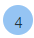
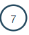
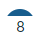
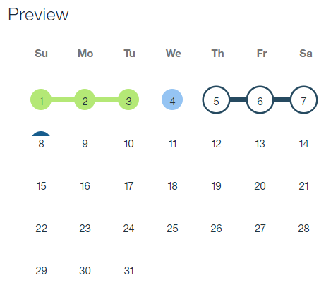
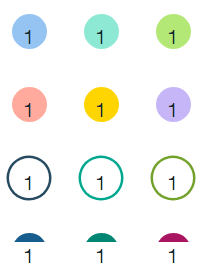

---

copyright:
 years: 2017
lastupdated: "2017-6-16"

---

{:new_window: target="_blank"}
{:shortdesc: .shortdesc}
{:screen:.screen}
{:codeblock:.codeblock}

# Managing events and tags
{: #events_overview}

An event represents a release-related activity that you manage with the calendar.

A tag is a label that you can add to a release or an event. You can use tags to filter the Activities list on the Releases page. Unlike events, tags do not appear on the calendar.

{:shortdesc}

Events are organized into general categories that include releases, holidays, and maintenance windows. [Calendar events and tags are assigned to releases](UCCR_releases.html#releases_overview). You can add events to releases or use them indepedent of releases.  

When an event is assigned, it is represented on the calendar by an icon appropriate for the event category. You can use the icons to filter the Releases page and select releases for any affected date or range of dates.

Tags are assigned to releases and can be used to filter the Releases page. Assigned tags appear in Releases page but they do not appear on the calendar. You can use tags to avoid calendar clutter.

## Filtering release events and deployment plans
{: #events_findFilter}

The Releases page displays the releases, events, and deployment plans that are created by you and your teams. From the Releases page, you can do most release-related activities, such as creating releases and deployment plans.

By default, the Releases page displays activities that are scheduled for the next seven days. You can filter the display by time, event, tag, and status. For example, you might restrict the display to releases that are scheduled for tomorrow. The currently selected date range is displayed on the action bar.

To filter the Releases page by event or tag, select the event or tag in the search bar, and then press Enter.

To filter scheduled activities by date, complete one of the following tasks:
<ul>
<li>Select a value from the **Dates** list on the action bar. For example, to display items that are scheduled for the upcoming week, select **Next 7 days**.</li>
<li>On the calendar, select a date or a range of dates. When you select dates on the calendar, the **Dates** value on the action bar is set to **Custom**.</li>
</ul>

Activities that are or were scheduled for the selected dates are displayed.

To filter items by status, select one the following filters:
<ul>
<li>Select **All** to display all activities. Displays all releases, events,and deployment plans except for those that that are archived. Use this option to display unscheduled deployment plans.
</li>
<li>Select **Draft** to display deployment plans that do not have a status of In Progress, Complete, or Failed.
</li>
<li>Select **Scheduled** to display releases, events, and plans that are scheduled for the selected date range.
</li>
<li>Select **In Progress** to display deployments that are in progress but do not have the status of Complete or Failed.
</li>
<li>Select **Failed** to display deployments that have the status of Failed.</li>
<li>Select **Complete** to display deployments that have the status of Complete.
</li>
</li>
<li>Select **Archive** to display releases, events, and deployment plans saved to the archive. Archived items can be restored.
</li>
<li>Select **Templates** to display deployment plans that are saved as templates. You can use templates to create plans. You can revert templates to deployment plans.  
</li>
</ul>

## Using the calendar
{: #events_calendarManage}

You can filter the **Activities** list by selecting event icons on the calendar. Event icons are styled by category, which makes it easy to tell the event category represented. Event categories are described in the following list:

<ul>
<li>Release events are represented by solid-colored circles .</li>
<li>Black outs and maintenance events are represented by circles with colored outlines .</li></li>
<li>Holiday events are represented by colored, umbrella-like symbols above the date .</li>
</ul>

In the following figure, the green-colored release event is scheduled from Sunday to Tuesday. The blue-colored release event is scheduled for Wednesday. The maintenance event is scheduled from Thursday to Saturday. The holiday event is scheduled for the second Sunday.

Figure 1. Default event icon styles

To filter the **Activities** list, complete one of the following actions:

<ul>
<li>Click a date.</li>
<li>Select a range of dates. You can select a range of dates by clicking a date and then shift-clicking another date.</li>
</ul>

Releases, events, and deployments that are scheduled for the selected dates are displayed. If a date has more than one calendar event scheduled, the date is underlined .

## Creating event types
{: #events_eventTypeCreate}

In addition to the default event types, you can create event types for any of the event categories.

When you create an event type, graphical styles are automatically applied to the associated icon. You can change the icon style after you create an event.

To create an event, complete the following steps:

1. On the Releases page, click **Calendar settings** .

1. In the Configure calendar page, click **Add event type**  for the event category that you want to create.

3. In the text box, enter a name for the event.

3. Click **Save**. You can edit and delete event tags.

## Managing event types
{: #events_eventEdit}

By default, event icon styles are applied automatically and randomly according to category.

In the following illustration, the styles on the top two rows are applied to events in the release events category; styles in the third row are applied to maintenance and blackout events; styles in the fourth row are applied to holidays.

Figure 2. Event icon styles

To edit an event type style, complete the following steps:

1. On the Releases page, click **Calendar settings**.

2. On the Configure calendar page, click the **Edit** icon next to the event icon that you want to change, then click **More**.

3. Select a style. You can select any style regardless of category.

To edit an event type name, click the **Edit** icon next to the event type's name, and then edit the name.

To delete an event type, click the **Delete** icon next to the name.

## Importing releases and events
{: #events_importing}

You can import your own releases and events.  To import items, define them in a comma-separated values (CSV) file. The CSV file format is a standard format that is used to exchange data between applications. In CSV files, each field in a record is separated by commas, and each record is on a separate row. Use the following format to define events and releases:  

`name*,description,start*,end,team*,tag`

The following fields are required:

`name,start,team`

For example, `Holiday,New Years Day,1/1/18,1/1/18,my_team,National Holiday` 

To import events and releases, complete these steps:

1. On the Releases page, click **Import** .

2. On the Import from CSV dialog box, select the CSV file that contains your releases and events, and then click **Import Events**. The dialog box provides a link where you can download a sample CSV event file.

If the import is successful, the releases and events are displayed on the Releases page. If the value in the **tag** field contains a previously-defined event type, the event is displayed on the calendar. Otherwise, the value in the **tag** field is treated as a tag.

## Creating tags
{: #events_tagManage}

[You create tags on the Create Release page when you create or modify a release.](UCCR_releases.html#releases_create) Tags are displayed in the Releases page along with owning release. Although tags do not appear on the calendar, you can use them to filter items displayed on the Releases page.
