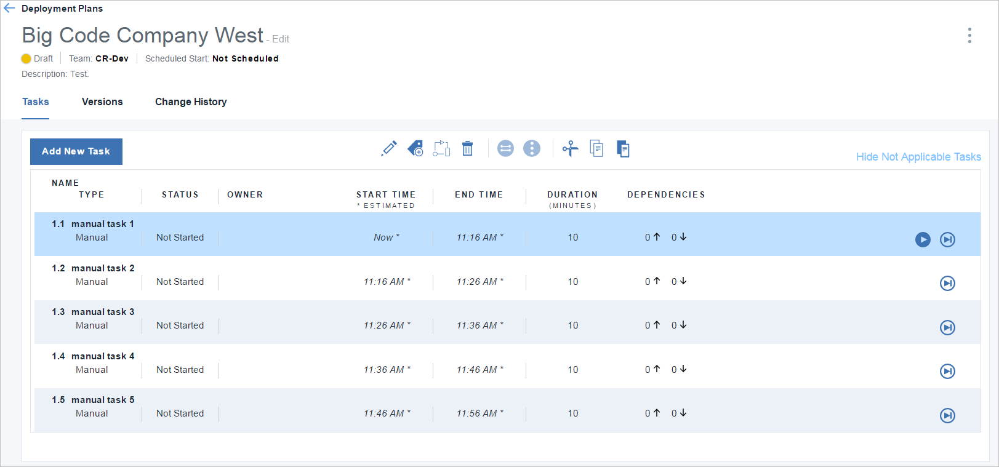
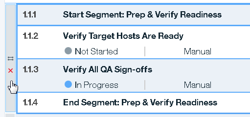
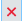
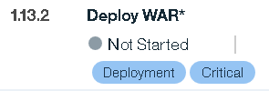
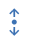

---

copyright:
  years: 2017
lastupdated: "2017-3-17"

---

{:new_window: target="_blank"}
{:shortdesc: .shortdesc}
{:screen:.screen}
{:codeblock:.codeblock}

# Managing tasks
{: #tasks_overview}

A task represents some business-meaningful activity that is associated with a software deployment. Tasks are defined in deployment plans.

{:shortdesc}

Most tasks have a starting and ending point, and a measurable duration.  A task can be of one of following types:

<ul>
<li>A **Manual** task can represent any activity that is associated with a software deployment, such as taking a server offline or updating a database.</li>
<li>An **UrbanCode Deploy** task represents an IBM&reg; UrbanCode&reg; Deploy application. You can run UrbanCode Deploy applications with this task type.</li>
<li>A **Continuous Delivery pipeline** task represents a {{site.data.keyword.contdelivery_full}} pipeline. You can manage your {{site.data.keyword.contdelivery_short}} pipelines with this task type.</li>
<li>A **Delayed** task represents a critical event that happens at a specific time.</li>
<li>A **Header** task is an organizational element. For example, you might use a header task to identify a task group.</li>
<li>An **Email** task sends an email message when it runs.</li>
<li>A **Run another plan** task runs deployments for other deployment plans participating in the same release event. This is an experimental task type.</li>
</ul>

You can add tasks to deployment plans by creating tasks or you can import tasks from CSV files that are created by IBM UrbanCode Release or another application. You can also copy tasks from other deployment plans. See [Importing tasks](/docs/services/UCCR/UCCR_deployPlan.html#plan_importTasks) for information about the format of the CSV file.

# Creating tasks
{: #tasks_create}

When you create a task, you select the deployment plan where you want to add the task. By default, new tasks are inserted at the bottom of the deployment plan.  After a task is created, you can move it, or copy it and paste it into another deployment plan. [You can also create dependencies with other tasks](/docs/services/UCCR/UCCR_tasks.html#tasks_dependencies).

After you save a task, action icons are displayed for the task. You use action icons to change the task's status during a deployment. All tasks have the **Skip** action icon. Other icons, such as **Start**, are displayed when the context is appropriate for them.

Figure 1. Simple deployment plan with tasks and action buttons

Each task in a deployment plan is contained in a separate row. The information that is displayed for each task is described in the following table.

### Table 1. Task properties

| Property  | Description  |
| ------------------ | ------------------ |
| Name               |Task name       |
| Type               |Type of task: manual, UrbanCode Deploy, Delayed, Header |             
| Status             |Task status: Not started, complete, failed, skipped, not applicable |
| Owner              |Person to whom the task is assigned                                                        |
| Start Time  |Start time or expected start time based on scheduled start, or estimated duration of other tasks        |
| End Time               |Time that the task resolved        |
| Duration               |Length of time from task start to task resolution (time is in minutes)        |
| Dependencies               |Indicates the number of tasks that are prerequisites for the task, and dependent on the task        |

---
After tasks are added to deployment plans, you can manage them in several ways.

To move a task, click anywhere on the task and drag it to a new location.

To copy a task or group, select the task and click **Copy** , and then place the cursor where you want to insert the copied task and click **Paste** .

To cut a task or group from a deployment plan, select the task and click **Cut** .

To delete a task, select the task and click **Delete** . The task is removed from the deployment plan.

## Creating UrbanCode Deploy tasks
{: #tasks_UDTasks}

UrbanCode Deploy tasks manage UrbanCode Deploy applications. When you run an UrbanCode Deploy task, the associated UrbanCode Deploy application runs by using the process, version, and environment specified by the task. You can set the version and environment at design time or wait and select them at run time.

During deployments, UrbanCode Deploy tasks start automatically when they become eligible to run.   

**Important** Applications become available after {{site.data.keyword.uccr_short}} is integrated with UrbanCode Deploy. The applications that are available to a deployment plan depend on the team that is assigned to the plan. The applications that are managed by the team in UrbanCode Deploy are also available in {{site.data.keyword.uccr_short}}.

Complete the following tasks to create an UrbanCode Deploy task.

1. On the Deployment Plan Details page, click **Create Task**. If you want to insert a task at a specific position in the plan, select a task before using the **Create Task**. The new task is inserted above the selected task.

1. On the Create Task dialog box, in the **Type** list, select **UrbanCode Deploy**.

1. In the **Name** field, enter a name for the task.

3. In the **Duration (minutes)** field, enter the number of minutes that you expect the task to run until it is completed. The estimated duration is used to calculate expected deployment times.

3. In the **Tags** list, attach a tag to the task. You can select multiple tags. To create a tag, type the tag name in list's text field.

3. In the **Application Name** list, select an application.

3. In the **Process** list, select an application process. Processes that belong to the selected UrbanCode Deploy application are available.

3. In the **Environment** list, select an application environment. Environments that belong to the selected UrbanCode Deploy application are available.  To postpone selecting an environment until you are ready to run the deployment, select **Use Version Tab**.

3. In the **Version** list, select an application version. Versions refer to IBM UrbanCode Deploy application snapshots. Versions that belong to the selected application are available.  To postpone selecting a version, select **Use Version Tab**. If the application process does not require a version, select **No Version**. You might select this last option if you are running a configuration-type process that does not require components.

3. In the **Assigned groups and users** list, assign the task to a user or group. The assigned user runs the task during deployment.

3. In the **Owner** list, select the task owner. The default owner is the user who created the task. The **Owner** list is displayed after the task is assigned to a user or group.    

5. Click **Save**. The task is inserted into the deployment plan.

After the task is created, the plan's **Version** tab is updated with information about the application assigned to the task. If you selected **Use Version Tab** for the application environment and version, use the Version tab to set those options before running the deployment.

## Creating manual tasks
{: #tasks_manual}

Typically, manual tasks represent some activity that is associated with a software release that has a start point, an end point, and a measurable duration.

Complete the following tasks to create a manual task:

1. On the Deployment Plan Details page, click **Create Task**. If you want to insert a task at a specific position in the plan, select a task before using the **Create Task**. The new task is inserted above the selected task.

1. In the Create Task dialog box, in the **Type** list, select **Manual**.

1. In the **Name** field, enter a name for the task.

3. In the **Duration (minutes)** field, enter the number of minutes that you expect the task to run until it is completed. The estimated duration is used to calculate expected deployment times.

3. In the **Tags** list, attach a tag to the task. You can select multiple tags. To create a tag, type the tag name in list's text field.

3. In the **Assigned groups and users** list, assign the task to a user or group. The assigned user runs the task during deployment.

3. In the **Owner** list, select the task owner. The default owner is the user who created the task. The **Owner** list is displayed after the task is assigned to a user or group.    

5. Click **Save**. The task is inserted into the deployment plan.

## Creating delayed tasks
{: #tasks_delayed}

Delayed-type tasks represent milestones or critical events during a deployment. With delayed tasks, you can ensure that important tasks start at the expected time. Typically, delayed tasks are prerequisites for other important tasks.

A delayed task starts as soon as it is eligible to run, and it finishes at a user-specified time. A started delayed-type task has a status of `In Progress` until it reaches its planned-for time, when it then changes its status to `Complete`. When a delayed tasks completes, auto tasks that are dependent on it start running.

Complete the following tasks to create a delayed task:

1. On the Deployment Plan Details page, click **Create Task**. If you want to insert a task at a specific position in the plan, select a task before using the **Create Task**. The new task is inserted above the selected task.

1. In the Create Task dialog box, in the **Type** list, select **Delayed**.

1. In the **Name** field, enter a name for the task.

3. In the **Time** field, enter or select the time that the task will be completed.

3. In the **Time Zone** list, select the time zone for the value that is entered in the **Time** field.    

5. Click **Save**. The task is inserted into the deployment plan.

## Creating header tasks
{: #tasks_header}

Header tasks represent organization elements that you can add to deployment plans. If you create a task group, you might identify the group with a header task. Header tasks can have dependencies like any other task.

When you import a deployment plan from IBM UrbanCode Release, segment tasks are bracketed by note-type Start Segment and End Segment tasks. Segment dependencies are represented by dependencies to End Segment tasks.

To create a header task, complete the following steps:

1. On the Deployment Plan Details page, click **Create Task**. If you want to insert a task at a specific position in the plan, select a task before using the **Create Task**. The new task is inserted above the selected task.

1. In the Create Task dialog box, in the **Type** list, select **Header**.

1. In the **Name** field, enter a name for the task. The name might represent a task group name.

3. In the **Description** field, enter or paste a description. You might enter a note, a reminder, or other instructions in the field.

5. Click **Save**. The task is inserted into the deployment plan.

## Creating Continuous Delivery Pipeline tasks
{: #tasks_pipelineCD}

{{site.data.keyword.contdelivery_full}} pipelines automate your DevOps workflows. A pipeline is a sequence of stages that retrieve input and run jobs. You can manage your {{site.data.keyword.contdelivery_short}} pipelines with pipeline tasks. Continuous Delivery pipeline tasks are auto tasks and run as soon as they are eligible.

To create a Continuous Delivery pipeline task, complete the following steps:

1. On the Deployment Plan Details page, click **Create Task**. If you want to insert a task at a specific position in the plan, select a task before you use the **Create Task** action. The new task is inserted before the selected task.

1. In the Create Task dialog box, in the **Type** list, select **Continuous Delivery Pipeline**.

1. In the **Name** field, enter a name for the task.

3. In the **Description** field, enter or paste a description. You might enter a note, a reminder, or other instructions in the field.

3. In the **Pipeline** field, enter or select the pipeline.

3. In the **Stage Name** field, enter or select the stage name. The stages defined for the selected pipeline are available.

3. In the **Tags** list, attach a tag to the task. You can select multiple tags. To create a tag, type the tag name in list's text field.

3. In the **Assigned groups and users** list, assign the task to a user or group. The assigned user runs the task during deployment.

3. In the **Owner** list, select the task owner. The default owner is the user who created the task. The **Owner** list is displayed after the task is assigned to a user or group.    

5. Click **Save**. The task is inserted into the deployment plan.

When a Continuous Delivery pipeline task runs, it runs the jobs on the specified stage for the selected pipeline.

## Creating email tasks
{: #tasks_email}

An email task sends an email message when the task runs. You specify the email's recipients and message when you create the task. Email tasks are auto tasks and run as soon as they are eligible.

To create an email task, complete the following steps:

1. On the Deployment Plan Details page, click **Create Task**. If you want to insert a task at a specific position in the plan, select a task before you use the **Create Task** action. The new task is inserted before the selected task.

1. In the Create Task dialog box, in the **Type** list, select **Email**.

1. In the **Name** field, enter a name for the task.

3. In the **Recipients** field, enter or select the email's recipient. The list of available recipients include the users and groups who are members of your team. You can also type the email addresses of non-team members. You can specify multiple recipients.

3. In the **Email subject** field, enter the email topic.

3. In the **Email message** field, enter or paste the email message.

5. Click **Save**. The task is inserted into the deployment plan.

When the task runs, the recipients receive an email from **IBM Continuous Release** with the subject you specified when you created the task.

## Creating run another plan tasks
{: #tasks_runAnother}

A run another plan task runs a deployment for another deployment plan. The targeted plan must be created from a template. Both the template and the targeted plan must be in the same release event as plan with the run another plan task.

Note that this is an experimental task type.

To create a run another plan task, complete the following steps:

1. On the Deployment Plan Details page, click **Create Task**. If you want to insert a task at a specific position in the plan, select a task before you use the **Create Task** action. The new task is inserted before the selected task.

1. In the Create Task dialog box, in the **Type** list, select **Run Another Plan**.

1. In the **Name** field, enter a name for the task.

3. In the **Plan Template Name** list, select a deployment plan template. The template must be in the same release event as the task's parent plan.

3. In the **Tags** list, attach a tag to the task. You can select multiple tags. To create a tag, type the tag name in text box.

5. Click **Save**. The task is inserted into the deployment plan.

When the task runs, a deployment starts for the deployment plan that is created from the selected template and in the same release event. If multiple plans in the release event are created from the template, deployments start for all of them. While the other deployments run, status information is provided by the run another plan task. Expand the task to see the status information. You can open the other deployments by using links on the task. While the other deployments run, the run another plan task has a status of **In Progress**.

<!--

## Creating slack tasks
{: #tasks_slack}

-->

## Managing task groups
{: #tasks_groups}

You can combine two or more tasks into a task group. When you create a group, you define the group's execution pattern, sequential or parallel. You can run the tasks in a parallel-pattern group in any order and, unless there are dependencies, simultaneously. The tasks in sequential groups are done in list-order starting with the first or top-most task.

You can embed groups within other groups. You can embed a sequential-pattern group within a parallel-pattern group, and vice versa. However, you cannot embed a sequential-pattern group within another sequential group, or a parallel-pattern group within another parallel group.  

Complete the following steps to create a task group.

1. On the Deployment Plan Detail page, select two or more tasks.

1. Depending on the type of group you want to create, complete one of the following steps.

  <ul>
  <li>To create a parallel group, click the **Parallel** button . If you cannot create a parallel group with the selected tasks, the button is disabled. You might not be able to create a parallel group if all the selected tasks are already in a parallel group, for example.
  </li>
  <li>To create a sequential group, click the **Sequential** button .
  </li>
  </ul>

The group is formed and a **group select bar** is added to the deployment plan. If you selected discontiguous tasks, the tasks form a contiguous list starting with the topmost selected task.

The following figure shows a parallel group. The **group select bar** identifies the type of group: parallel , or sequential .

Figure 2. Parallel group

To move a group, select the **group select bar** or click anywhere on the group, and then drag it to a new location.

To copy a group, select the group and click **Copy** , and then place the cursor where you want to insert the copied group and click **Paste** .

To cut a group, select the group and click **Cut** .

To ungroup a group, select the group and click the **Ungroup** icon  on the **group select bar**.

To delete the tasks in a group, select the group and click **Delete** . The tasks are removed from the deployment plan.

## Managing task tags
{: #tasks_tags}

Tags are organizing elements that you can add to tasks. You can filter deployment plans by tag. For example, during a deployment to a production environment, you might disable tasks with the `DEV_only` tag, which is intended to be used only in development environments.

To add a tag to a task, complete the following steps.

1. On the Deployment Plan Details page, select a task or task group, and then click **Manage Tags**  . You can select multiple tasks and groups.

1. In the Manage Tags for Selected Tasks dialog box, in the **Common Tags** list, select tags. You can create a new tag by typing a name in the list's text box.

1. Click **Save**.

Tags are displayed on the task rows in the Deployment Plan Detail page. In the following figure, the **Deploy WAR** task has two tags assigned to it, `Deployment`, and `Critical`.

The tags used by a deployment plan are displayed on the Deployment Plan Detail page **Versions** tab. To render tasks with a specific tag `Not Applicable` for a deployment, clear the tag. Tasks with the `Not Applicable` status cannot be started.  

Figure 3. Task dependencies

## Creating task dependencies
{: #tasks_dependencies}

You can make a task a prerequisite for other tasks. If a task is a prerequisite, dependent tasks cannot start, even if they are otherwise eligible, until the prerequisite task is resolved.

A task can have multiple dependent tasks and multiple prerequisite tasks. You can define dependencies for a task with any other task in the deployment plan. However, you cannot create circular dependencies. You cannot, for example, make a task dependent on a task that itself depends on the first task.

By controlling task dependencies, you can ensure that events occur in their expected order.

To make a task a prerequisite for other tasks, complete the following steps:

1. On the Deployment Plan Details page, select a task or task group, and then click **Manage Prerequisites** . You can select multiple tasks and groups.

1. In the Manage Prerequisites for Selected Tasks dialog box, in the **Prerequisite tasks for selected tasks** list, select the prerequisite task.

1. Click **Save**.

Task dependencies are shown in the **Dependencies** column on the Deployment Plan Detail page. Up arrows indicate task prerequisites; down arrows indicate task dependencies.

In the following figure, the first task does not have any prerequisites and has two tasks dependent on it. The second task has one prerequisite task and there are no tasks dependent on it.

()

Figure 4. Task dependencies

To review or modify dependencies, select the task and then click  **Manage Prerequisites** . Use the Manage Prerequisites for Selected Tasks dialog box to modify or remove dependencies.
