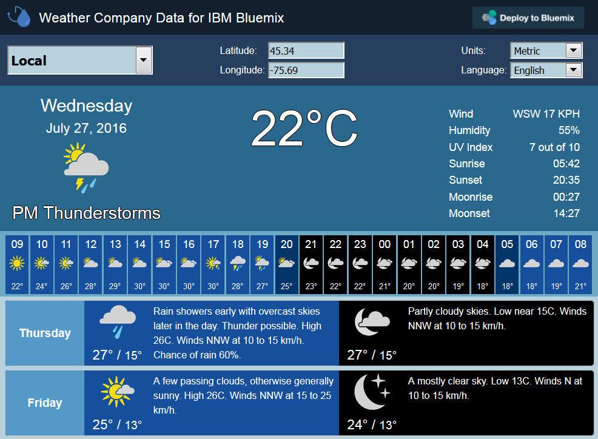

---

copyright:
  years: 2015, 2016
lastupdated: "2016-07-28"

---

{:new_window: target="_blank"}
{:shortdesc: .shortdesc}
{:screen:.screen}
{:codeblock:.codeblock}

# Esempi
{: #tutorials_samples}

Impara come utilizzare il servizio {{site.data.keyword.weather_short}} con i seguenti esempi.
{: shortdesc}

## Demo di
{{site.data.keyword.weather_short}}
{: #insights_weather_demo}

Puoi imparare a richiamare i dati meteo con il servizio {{site.data.keyword.weather_short}}
utilizzando l'applicazione demo [{{site.data.keyword.weather_short}}](http://weather-company-data-demo.{APPDomain}){: new_window}.
L'applicazione si apre nel tuo browser e ti chiede se desideri condividere la tua ubicazione corrente con essa. 

Dall'applicazione demo, puoi visualizzare le condizioni osservate correnti per il meteo nella tua ubicazione. 



È anche possibile vedere la previsione oraria per le successive 48 ore e la previsione giornaliera per i successivi 10 giorni.
La previsione giornaliera mostra la parte del giorno e la parte della notte.
Se fai clic su ognuna di queste aree nell'applicazione demo, puoi visualizzare i risultati della chiamata API nel formato JSON,
che include i metadati che sono stati utilizzati per richiamare i dati. 

Nell'applicazione demo, fai clic su **Distribuisci a Bluemix** per creare una versione clonata dell'applicazione o
[clona l'applicazione direttamente da GitHub](https://github.com/IBM-Bluemix/weather-company-data-demo). 

## Come ottenere una previsione oraria
{: #getting_twenty_four_hour_forecast}

Puoi immettere un'operazione `GET` nella tua applicazione per richiamare i dati della previsione di 48 ore.

Il `username` e la `password` sono univoci per la tua applicazione e l'istanza di servizio.
Puoi trovare queste informazioni nelle variabili di ambiente `VCAP_SERVICES`.

Il servizio restituisce le risposte nel formato JSON. Se la risposta ha esito positivo, viene restituito un codice di stato 200.
Se la risposta ha esito negativo, viene restituito un codice di errore.

Ad esempio, puoi utilizzare la seguente richiesta `GET` per richiamare la previsione di 48 ore
per le coordinate di latitudine e longitudine di Ottawa, ON, Canada:

```
GET https://<username>:<password>@twcservice.mybluemix.net:443/api/weather/v1/geocode/45.42/75.69/forecast/hourly/48hour.json?units=m&language=en-US
```
Puoi inoltre immettere un'operazione `GET` nella tua applicazione per richiamare i dati della previsione di 48 ore
per un codice postale.

**Nota**: puoi fornire un codice postale solo per i codici del paese supportati Stati Uniti (US),
Regno Unito (GB), Francia (FR), Germania (DE) o Italia (IT).

```
GET https://<username>:<password>@twcservice.mybluemix.net:443/api/weather/v1/location/97229%3A4%3AUS/forecast/hourly/48hour.json?units=m&language=en-US
```

Il corpo della risposta include i metadati e l'array delle previsioni orarie
per ognuna delle successive 48 ore. Ad esempio, i metadati possono contenere i seguenti dati:

```
{
  "metadata": {
    "language": "en-US",
    "transaction_id": "1467041322756:187065199",
    "version": "1",
    "latitude": 45.42,
    "longitude": 75.69,
    "units": "m",
    "expire_time_gmt": 1467041562,
    "status_code": 200
  },
  "forecasts": [
  ]
}
```

Ogni previsione oraria contiene le informazioni generali che applica
all'ora specificata da `num`. Ad esempio, la previsione oraria può contenere i seguenti dati:

```
   {
      "class": "fod_short_range_hourly",
      "expire_time_gmt": 1467041922,
      "fcst_valid": 1467043200,
      "fcst_valid_local": "2016-06-27T22:00:00+0600",
      "num": 1,
      "day_ind": "N",
      "temp": 21,
      "dewpt": 12,
      "hi": 21,
      "wc": 21,
      "feels_like": 21,
      "icon_extd": 2900,
      "wxman": "wx1600",
      "icon_code": 29,
      "dow": "Monday",
      "phrase_12char": "P Cloudy",
      "phrase_22char": "Partly Cloudy",
      "phrase_32char": "Partly Cloudy",
      "subphrase_pt1": "Partly",
      "subphrase_pt2": "Cloudy",
      "subphrase_pt3": "",
      "pop": 0,
      "precip_type": "rain",
      "qpf": 0,
      "snow_qpf": 0,
      "rh": 56,
      "wspd": 11,
      "wdir": 291,
      "wdir_cardinal": "WNW",
      "gust": null,
      "clds": 31,
      "vis": 16,
      "mslp": 1008.73,
      "uv_index_raw": 0,
      "uv_index": 0,
      "uv_warning": 0,
      "uv_desc": "Low",
      "golf_index": null,
      "golf_category": "",
      "severity": 1
    },
```

## Come ottenere una previsione giornaliera
{: #getting_ten_day_forecast}

Puoi immettere un'operazione `GET` nella tua applicazione per richiamare i dati della previsione di 10 giorni.
Ad esempio, puoi utilizzare la seguente richiesta `GET` per richiamare la previsione di 10 giorni per Ottawa, ON, Canada:

```
GET https://<username>:<password>@twcservice.mybluemix.net:443/api/weather/v1/geocode/45.42/75.69/forecast/daily/10day.json?units=m&language=en-US
```

Il corpo della risposta include i metadati e l'array delle previsioni giornaliere per ognuno dei successivi 10 giorni.
Ad esempio, i metadati possono contenere i seguenti dati:

```
{
  "metadata": {
    "language": "en-US",
    "transaction_id": "1467041740847:-1868497945",
    "version": "1",
    "latitude": 45.42,
    "longitude": 75.69,
    "units": "m",
    "expire_time_gmt": 1467043540,
    "status_code": 200
  },
  "forecasts": [
  ]
}
```

Ogni previsione giornaliera contiene le informazioni generali che applica al periodo di 24 ore per il giorno della settimana specificato (`dow`).
Ad esempio, la previsione giornaliera può contenere i seguenti dati:

```
      "class": "fod_long_range_daily",
      "expire_time_gmt": 1467043540,
      "fcst_valid": 1467075600,
      "fcst_valid_local": "2016-06-28T07:00:00+0600",
      "num": 2,
      "max_temp": 29,
      "min_temp": 18,
      "torcon": null,
      "stormcon": null,
      "blurb": null,
      "blurb_author": null,
      "lunar_phase_day": 22,
      "dow": "Tuesday",
      "lunar_phase": "Last Quarter",
      "lunar_phase_code": "LQ",
      "sunrise": "2016-06-28T05:11:23+0600",
      "sunset": "2016-06-28T20:49:39+0600",
      "moonrise": "2016-06-28T00:56:48+0600",
      "moonset": "2016-06-28T13:39:37+0600",
      "qualifier_code": null,
      "qualifier": null,
      "narrative": "Mainly sunny. Highs 28 to 30C and lows 17 to 19C.",
      "qpf": 0,
      "snow_qpf": 0,
      "snow_range": "",
      "snow_phrase": "",
      "snow_code": "",
      "night": {
      },
      "day": {
      }
    }
```

Ogni previsione giornaliera contiene una parte per la notte e una per il giorno per il giorno della settimana specificato.
Ad esempio, entrambe le parti possono contenere i seguenti dati di previsione:

```
      "night": {
        "fcst_valid": 1467118800,
        "fcst_valid_local": "2016-06-28T19:00:00+0600",
        "day_ind": "N",
        "thunder_enum": 0,
        "daypart_name": "Tomorrow night",
        "long_daypart_name": "Tuesday night",
        "alt_daypart_name": "Tuesday night",
        "thunder_enum_phrase": "No thunder",
        "num": 3,
        "temp": 18,
        "hi": 26,
        "wc": 18,
        "pop": 0,
        "icon_extd": 3100,
        "icon_code": 31,
        "wxman": "wx1500",
        "phrase_12char": "Clear",
        "phrase_22char": "Clear",
        "phrase_32char": "Clear",
        "subphrase_pt1": "Clear",
        "subphrase_pt2": "",
        "subphrase_pt3": "",
        "precip_type": "rain",
        "rh": 43,
        "wspd": 15,
        "wdir": 55,
        "wdir_cardinal": "NE",
        "clds": 2,
        "pop_phrase": "",
        "temp_phrase": "Low 18C.",
        "accumulation_phrase": "",
        "wind_phrase": "Winds NE at 10 to 15 km/h.",
        "shortcast": "Clear",
        "narrative": "A mostly clear sky. Low 18C. Winds NE at 10 to 15 km/h.",
        "qpf": 0,
        "snow_qpf": 0,
        "snow_range": "",
        "snow_phrase": "",
        "snow_code": "",
        "vocal_key": "D4:DA09:X3200320043:S320043:TL18:W02R02",
        "qualifier_code": null,
        "qualifier": null,
        "uv_index_raw": 0,
        "uv_index": 0,
        "uv_warning": 0,
        "uv_desc": "Low",
        "golf_index": null,
        "golf_category": ""
      },
```

## Come ottenere le condizioni correnti
{: #current_conditions}

Puoi immettere un'operazione `GET` nella tua applicazione per richiamare le condizioni meteo correnti.
Ad esempio, puoi utilizzare la seguente richiesta `GET` per richiamare le condizioni correnti per Ottawa, ON, Canada:

```
GET https://<username>:<password>@twcservice.mybluemix.net:443/api/weather/v1/geocode/45.42/75.69/observations.json?units=m&language=en-US
```

Il corpo della risposta include i metadati e i dati meteo osservati correntemente.
Ad esempio, i metadati possono contenere i seguenti dati:

```
{
  "metadata": {
    "language": "en-US",
    "transaction_id": "1467042290443:151881483",
    "version": "1",
    "latitude": 45.42,
    "longitude": 75.69,
    "units": "m",
    "expire_time_gmt": 1467051300,
    "status_code": 200
  },
  "observation": {
  }
}
```

I dati delle osservazioni contengono le informazioni generali e i valori specifici
delle unità di misura. Ad esempio, le condizioni correnti potrebbero contenere i seguenti dati
se le unità di misure specificate sono metriche:

```
  "observation": {
    "key": "36821",
    "class": "observation",
    "expire_time_gmt": 1467051300,
    "obs_id": "36821",
    "obs_name": "Bakanas",
    "valid_time_gmt": 1467039600,
    "day_ind": "N",
    "temp": 21,
    "wx_icon": 27,
    "icon_extd": 2700,
    "wx_phrase": "Mostly Cloudy",
    "pressure_tend": 1,
    "pressure_desc": "Rising",
    "dewPt": 17,
    "heat_index": 21,
    "rh": 74,
    "pressure": 965.2,
    "vis": 50,
    "wc": 21,
    "wdir": 270,
    "wdir_cardinal": "W",
    "gust": null,
    "wspd": 4,
    "max_temp": -4,
    "min_temp": null,
    "precip_total": null,
    "precip_hrly": null,
    "snow_hrly": null,
    "uv_desc": "Low",
    "feels_like": 21,
    "uv_index": 0,
    "qualifier": null,
    "qualifier_svrty": null,
    "blunt_phrase": null,
    "terse_phrase": null,
    "clds": 75
  }
```

## Come ottenere gli avvisi
{: #getting_alerts}

Puoi immettere un'operazione `GET` nella tua applicazione per richiamare le intestazioni dell'avviso meteo.
Ad esempio, puoi utilizzare la seguente richiesta `GET` per richiamare le intestazioni dell'avviso meteo per San Bernadino, CA, USA:

```
GET https://<username>:<password>@twcservice.mybluemix.net:443/api/weather/v1/geocode/34.12/-117.30/alerts.json?language=en-US
```

Il corpo della risposta include i metadati e le intestazioni degli avvisi meteo correnti.
Ad esempio, i metadati possono contenere i seguenti dati:

```
{
  "metadata": {
    "language": "en-US",
    "transaction_id": "1467042764309:-1516467294",
    "version": "1",
    "longitude": "-117.30",
    "latitude": "34.12",
    "expire_time_gmt": 1467042824,
    "status_code": 200
  },
}
```

I dati delle intestazioni degli avvisi contengono informazioni generali e una chiave per richiamare
i dettagli degli avvisi meteo. Ad esempio, le intestazioni degli avvisi possono contenere i seguenti dati:

```
  "alerts": [
    {
      "key": "cf63821f-9521-3f27-92ec-e1562ccd469b",
      "class": "bulletin",
      "msg_type_cd": 2,
      "msg_type": "Update",
      "pil": "NPW",
      "phenomena": "HT",
      "significance": "Y",
      "etn": "0003",
      "office_cd": "KSGX",
      "office_name": "San Diego",
      "office_st_cd": "CA",
      "office_cntry_cd": "US",
      "event_desc": "Heat Advisory",
      "severity_cd": 3,
      "severity": "Moderate",
      "categories": [
        {
          "category": "Met",
          "category_cd": 2
        }
      ],
      "response_types": [
        {
          "response_type": "Execute",
          "response_type_cd": 4
        }
      ],
      "urgency": "Expected",
      "urgency_cd": 2,
      "certainty": "Likely",
      "certainty_cd": 2,
      "effective_dt_tm_local": null,
      "effective_dt_tm_tz_abbrv": null,
      "expire_dt_tm_local": "2016-06-29T20:00:00-07:00",
      "expire_dt_tm_tz_abbrv": "PDT",
      "expire_time_gmt": 1467255600,
      "onset_dt_tm_local": null,
      "onset_dt_tm_tz_abbrv": null,
      "flood": null,
      "area_type": "Z",
      "lat": 33.48,
      "lon": -117.29,
      "area_id": "CAZ048",
      "area_name": "San Bernardino and Riverside County Valleys",
      "st_cd": "CA",
      "st_name": "California",
      "cntry_cd": "US",
      "cntry_name": "UNITED STATES OF AMERICA",
      "headline_text": "Heat Advisory until 8PM PDT WED",
      "detail_key": "cf63821f-9521-3f27-92ec-e1562ccd469b",
      "source": "National Weather Service",
      "disclaimer": null,
      "issue_dt_tm_local": "2016-06-27T04:38:50-07:00",
      "issue_dt_tm_tz_abbrv": "PDT",
      "identifier": "e234b6f889bf9a91c5d9f309db63eaa0",
      "proc_dt_tm_local": "2016-06-27T04:38:58-07:00",
      "proc_dt_tm_tz_abbrv": "PDT"
    }
  ]
```

La chiave del corpo della risposta delle intestazioni dell'avviso può essere utilizzata per trovare i dettagli degli avvisi meteo.
Ad esempio, puoi utilizzare la seguente richiesta `GET` per richiamare i dettagli dell'avviso meteo
che corrispondono alle intestazioni dell'avviso meteo per San Bernadino, CA, USA
nel seguente esempio:

```
https://twcservice.mybluemix.net:443/api/weather/v1/alert/cf63821f-9521-3f27-92ec-e1562ccd469b/details.json?language=en-US
```

Il corpo della risposta fornisce le seguenti informazioni e metadati:

```
{
  "metadata": {
    "language": "en-US",
    "transaction_id": "1467043225642:-1066997140",
    "version": "1",
    "alert_id": "cf63821f-9521-3f27-92ec-e1562ccd469b",
    "expire_time_gmt": 1467043285,
    "status_code": 200
  },
  "alertDetail": {
    "key": "cf63821f-9521-3f27-92ec-e1562ccd469b",
    "class": "bulletin",
    "msg_type_cd": 2,
    "msg_type": "Update",
    "pil": "NPW",
    "phenomena": "HT",
    "significance": "Y",
    "etn": "0003",
    "office_cd": "KSGX",
    "office_name": "San Diego",
    "office_st_cd": "CA",
    "office_cntry_cd": "US",
    "event_desc": "Heat Advisory",
    "severity_cd": 3,
    "severity": "Moderate",
    "categories": [
      {
        "category": "Met",
        "category_cd": 2
      }
    ],
    "response_types": [
      {
        "response_type": "Execute",
        "response_type_cd": 4
      }
    ],
    "urgency": "Expected",
    "urgency_cd": 2,
    "certainty": "Likely",
    "certainty_cd": 2,
    "effective_dt_tm_local": null,
    "effective_dt_tm_tz_abbrv": null,
    "expire_dt_tm_local": "2016-06-29T20:00:00-07:00",
    "expire_dt_tm_tz_abbrv": "PDT",
    "expire_time_gmt": 1467255600,
    "onset_dt_tm_local": null,
    "onset_dt_tm_tz_abbrv": null,
    "flood": null,
    "area_type": "Z",
    "lat": 33.48,
    "lon": -117.29,
    "area_id": "CAZ048",
    "area_name": "San Bernardino and Riverside County Valleys",
    "st_cd": "CA",
    "st_name": "California",
    "cntry_cd": "US",
    "cntry_name": "UNITED STATES OF AMERICA",
    "headline_text": "Heat Advisory until 8PM PDT WED",
    "source": "National Weather Service",
    "disclaimer": null,
    "issue_dt_tm_local": "2016-06-27T04:38:50-07:00",
    "issue_dt_tm_tz_abbrv": "PDT",
    "identifier": "e234b6f889bf9a91c5d9f309db63eaa0",
    "proc_dt_tm_local": "2016-06-27T04:38:58-07:00",
    "proc_dt_tm_tz_abbrv": "PDT",
    "texts": [
      {
        "language_cd": "en-US",
        "description": ".HIGH PRESSURE ALOFT WILL REMAIN IN PLACE THROUGH TUESDAY...THEN\nSLOWLY WEAKEN INTO NEXT WEEKEND. THIS WILL MAKE FOR VERY HOT\nAFTERNOONS IN THE MOUNTAINS...DESERTS...AND INLAND EMPIRE THROUGH\nWEDNESDAY. THE PEAK OF THE HEAT IS EXPECTED TUESDAY.* TEMPERATURE...MID AND HIGH CLOUDS WILL KEEP HIGH TEMPERATURES\n  TODAY SLIGHTLY LESS HOT THAN SUNDAY...THEN WARMING FOR TUESDAY\n  WITH HIGH TEMPERATURES 108 TO 114 IN THE LOWER DESERTS...100 TO\n  106 IN THE UPPER DESERTS...AND 98 TO 105 IN THE INLAND EMPIRE.\n\n* IMPACTS...HEAT ILLNESS POSSIBLE FOR THOSE PEOPLE MOST AT \n  RISK...INCLUDING CHILDREN...THE ELDERLY...AND THOSE WITH \n  CHRONIC ILLNESS. PETS ARE ALSO VULNERABLE TO HEAT ILLNESS.",
        "instruction": "TO REDUCE RISK DURING OUTDOOR WORK THE OCCUPATIONAL SAFETY AND\nHEALTH ADMINISTRATION RECOMMENDS SCHEDULING FREQUENT REST BREAKS\nIN SHADED OR AIR CONDITIONED ENVIRONMENTS. ANYONE OVERCOME BY\nHEAT SHOULD BE MOVED TO A COOL AND SHADED LOCATION.   HEAT STROKE\nIS AN EMERGENCY - CALL 9 1 1.\n\nTAKE EXTRA PRECAUTIONS IF YOU WORK OR SPEND TIME OUTSIDE. WHEN\nPOSSIBLE... RESCHEDULE STRENUOUS ACTIVITIES TO EARLY MORNING OR\nEVENING.  KNOW THE SIGNS AND SYMPTOMS OF HEAT EXHAUSTION AND HEAT\nSTROKE.  WEAR LIGHT WEIGHT AND LOOSE FITTING CLOTHING WHEN\nPOSSIBLE AND DRINK PLENTY OF WATER.\n\n",
        "overview": null
      }
    ],
    "polygon": null
  }
}
```

## Come ottenere i dati astronomici
{: #getting_almanac_data}

Puoi immettere un'operazione `GET` nella tua applicazione per richiamare i dati astronomici giornalieri o mensili.
Ad esempio, puoi utilizzare la seguente richiesta `GET` per richiamare le informazioni astronomiche per Atlanta, GA, USA:

```
https://twcservice.mybluemix.net:443/api/weather/v1/geocode/33.40/-83.42/almanac/daily.json?units=e&start=0112&end=0115
```

Il corpo della risposta fornisce le seguenti informazioni e metadati:

```
{
  "metadata": {
    "language": "en-US",
    "transaction_id": "1467044012413:-416805755",
    "version": "1",
    "latitude": 33.4,
    "longitude": -83.42,
    "units": "e",
    "expire_time_gmt": 1466157922,
    "status_code": 200
  },
  "almanac_summaries": [
    {
      "class": "almanac",
      "station_id": "095988",
      "station_name": "MONTICELLO",
      "almanac_dt": "0112",
      "interval": "D",
      "avg_hi": 56,
      "avg_lo": 28,
      "record_hi": 71,
      "record_hi_yr": 1974,
      "record_lo": 0,
      "record_lo_yr": 1982,
      "mean_temp": 42,
      "avg_precip": 0.13,
      "avg_snow": 0.1,
      "record_period": 30
    },
    {
      "class": "almanac",
      "station_id": "095988",
      "station_name": "MONTICELLO",
      "almanac_dt": "0113",
      "interval": "D",
      "avg_hi": 56,
      "avg_lo": 28,
      "record_hi": 72,
      "record_hi_yr": 1972,
      "record_lo": 13,
      "record_lo_yr": 1981,
      "mean_temp": 42,
      "avg_precip": 0.12,
      "avg_snow": 0,
      "record_period": 30
    },
    {
      "class": "almanac",
      "station_id": "095988",
      "station_name": "MONTICELLO",
      "almanac_dt": "0114",
      "interval": "D",
      "avg_hi": 56,
      "avg_lo": 28,
      "record_hi": 71,
      "record_hi_yr": 2000,
      "record_lo": 14,
      "record_lo_yr": 1956,
      "mean_temp": 42,
      "avg_precip": 0.13,
      "avg_snow": 0,
      "record_period": 30
    },
    {
      "class": "almanac",
      "station_id": "095988",
      "station_name": "MONTICELLO",
      "almanac_dt": "0115",
      "interval": "D",
      "avg_hi": 56,
      "avg_lo": 28,
      "record_hi": 75,
      "record_hi_yr": 1953,
      "record_lo": 11,
      "record_lo_yr": 1964,
      "mean_temp": 42,
      "avg_precip": 0.12,
      "avg_snow": 0,
      "record_period": 30
    }
  ]
}

```

## Utilizzo dei servizi di ubicazione
{: #using_location_services}

### Richiesta per nome città
Per richiedere le informazioni sull'ubicazione di una città, devi fornire almeno un parametro di query,
come ad esempio il nome di una città e un `locationType` della città. Puoi inoltre fornire
il `countryCode` e il `adminDistrictCode` per ridurre il numero di ubicazioni univoche
che possono essere richiamate.

Ad esempio, la seguente richiesta richiama le informazioni sull'ubicazione di Atlanta, Georgia, US.

```
GET https://<username>:<password>@twcservice.mybluemix.net:443/api/weather/v3/location/search?query=Atlanta&locationType=city&countryCode=US&adminDistrictCode=GA&language=en-US
```

Il corpo della richiesta contiene le informazioni e i metadati dell'ubicazione.
```
{
  "location": [
    {
      "address": "Atlanta, Georgia, United States",
      "adminDistrict": "Georgia",
      "adminDistrictCode": "GA",
      "city": "Atlanta",
      "longitude": -84.3902,
      "postalCode": "30303",
      "latitude": 33.7491,
      "country": "United States",
      "countryCode": "US"
    }
  ],
  "metadata": {
    "transaction_id": null,
    "format": "json",
    "adminDistrictCode": "GA",
    "total_cache_time_secs": 10800,
    "language": "en-US",
    "generated_time": 1467044888246,
    "locationType": "city",
    "status_code": 200,
    "version": "v3",
    "query": "Atlanta",
    "countryCode": "US"
  }
}
```

### Richiesta per codice geografico
Per richiedere una serie di ubicazioni per un codice geografico, devi fornire una coppia di latitudine e longitudine valida.

Ad esempio, la seguente richiesta richiama le informazioni sull'ubicazione per le coordinate geografiche di Atlanta, Georgia, US.

```
GET https://<username>:<password>@twcservice.mybluemix.net:443/api/weather/v3/location/point?geocode=34.53%2C-84.50&language=en-US
```

### Richiesta per codice postale
Per richiedere una serie di ubicazioni per un codice postale, devi fornire una chiave postale,
che è un composito di un &lt;postal code&gt;:&lt;country code&gt;.

Ad esempio, la seguente richiesta richiama le informazioni sull'ubicazione per un codice postale in Atlanta, Georgia, US.

```
GET https://<username>:<password>@twcservice.mybluemix.net:443/api/weather/v3/location/point?postalKey=30339%3AUS&language=en-US
```
