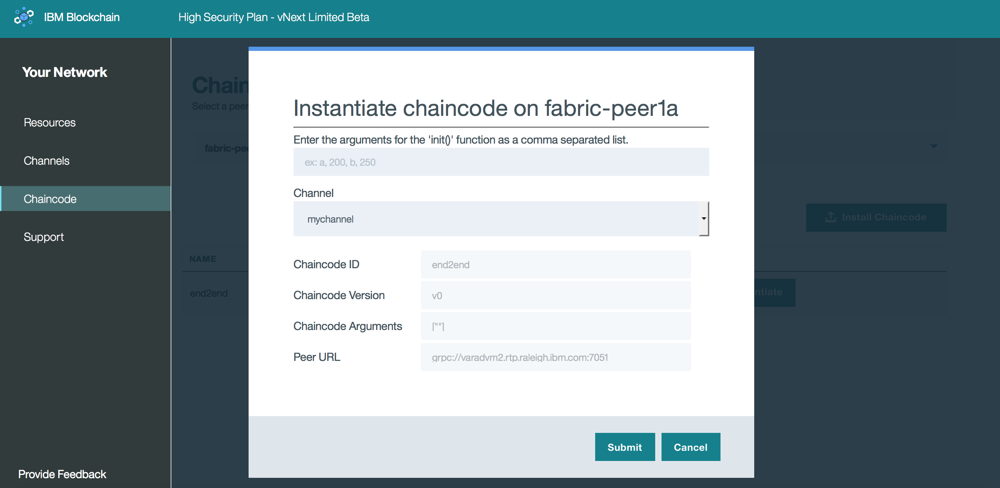

---

copyright:
  years: 2017

---

{:new_window: target="_blank"}
{:shortdesc: .shortdesc}
{:codeblock: .codeblock}
{:screen: .screen}
{:pre: .pre}

# Chaincode
{: #v10_dashboard}
Last updated: 16 March 2017
{: .last-updated}

Chaincode is software (currently written in Go or Java) that encapsulates the business logic and transactional instructions 
for creating and modifying assets.  It runs in a docker container associated with any peer that needs to interact with it.  
{:shortdesc}

Chaincode is first installed on a peer's filesystem and then instantiated on a channel.  The instantiation step involves 
the initialization of key value pairs and the deployment of the chaincode container.  Any peer wishing to interact with a 
chaincode must have the source code installed on its filesystem and a running chaincode container.  However, if a peer 
wishes to use the same chaincode application on multiple channels, it needs only a single instance of the container.  

**Figure 8** shows the chaincode installation overview:

*Figure 8. Chaincode Install Overview*

* Use the drop-down menu and select a peer to install chaincode onto.  
* Click the **Install Chaincode** button on the right side of your screen; this will open a new panel.

**Figure 9** shows the chaincode install window:

*Figure 9. Chaincode Install Window*

* Fill in the fields for ChaincodeID and Chaincode Version.  Be cognizant of naming schemes, as these strings will be used in client apps in order to interact with particular chaincodes.
* Click the browse button and navigate through your local filesystem to wherever your chaincode source is stored.  Select one or more files to install on your peer.  **Note**: It is recommended to only upload chaincode written in Go or Java.  

Once a chaincode has been installed on a peer's file system it must then be instantiated on a channel.  This instantiation step calls the `init` function to perform any necessary initialization of the chaincode.  Oftentimes this will involve setting the key value pairs that comprise a chaincode's initial world state.

**Figure 10** shows the chaincode instantiate window: 

*Figure 10. Chaincode Instantiate Window*

Note that the key value pairs are being set with the string - `["a","b","200","250"]` - and that there is a window to select the channel to instantiate on.  This example shows a chaincode named `end2end` installed on `fabric-peer1a` and instantiated on a channel named `mychannel`:

The install/instantiate combination is a powerful feature because it allows for a peer to interact with the same chaincode container across multiple channels.  The only prerequisite is for the actual chaincode source to be installed on the peer's file system.  As such, if a piece of common chaincode is being used across dozens of channels, a peer would need only a single chaincode container to perform read/writes on all the channel ledgers.  This lightweight approach proves beneficial to computational performance and throughput as networks scale and chaincode applications become more elaborate.    
