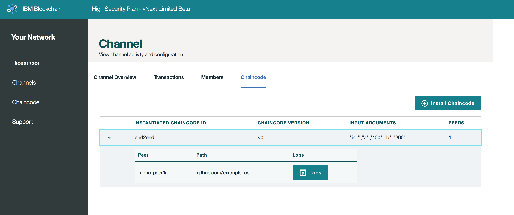

---

copyright:
  years: 2017

---

{:new_window: target="_blank"}
{:shortdesc: .shortdesc}
{:codeblock: .codeblock}
{:screen: .screen}
{:pre: .pre}

# Channels
{: #v10_dashboard}
Last updated: 16 March 2017
{: .last-updated}

Channels are an incredibly powerful mechanism for partitioning and isolating data, and they provide the primary foundation 
for data privacy.  Every network must have at least one channel in order for transactions to take place.  
{:shortdesc}

You segregate your network into channels, where each channel represents a subset of members that are 
authorized to see the data for the chaincodes instantiated on that channel; if you're not on a channel, you can't see 
the data.  Each channel has a unique ledger, and users must be properly authenticated in order to perform read/write operations against this data.  Additionally, access control lists can be implemented to restrict certain members and users (e.g. Member A restricted to read-only).

Imagine you are on a network with six members...  You might have a consortium-type channel where all six members transact 
and maintain a ledger for a common asset.  These transactions and the state of the involved assets would be available to 
all members.  However, for certain bilateral or multilateral transactions that require privacy from the network at large, 
you can create separate channels and thereby conceal this data.  

There are also methods for channel to channel interaction in the case of more complex business scenarios.  An application 
can be coded to query for the value(s) of a key or composite key on Channel A and then use the returned values to factor 
into a transaction on Channel B.  See the [Hyperledger Fabric documentation](http://hyperledger-fabric.readthedocs.io/en/latest/arch-deep-dive.html) for more information on channels, policies and cross-channel transactions.

**Figure 2** shows the initial dashboard screen displaying an overview of all channels for your Bluemix Org:

*Figure 2. Channels*

From this screen you can create a channel, or select a specific channel to view more precise details about ledger, 
chaincodes and membership.  

**Figure 3** shows the *Create a Channel* screen:

*Figure 3. Create Channel*

Choose a name reflective of the channel's business objective and invite any combination of your network members by selecting 
their **Company Name** and then clicking the **Add Member** button.  

**Figure 4** shows a specific channel's overview.  It displays ledger information such as block height 
and transaction history:

*Figure 4. Channel Overview*

**Figure 5** shows a specific channel's transaction history.  It displays timestamps for each transaction and the 
transaction's corresponding chaincode ID:

*Figure 5. Channel Transactions*

**Figure 6** shows a specific channel's membership registry.  It displays Company Names and the corresponding email for 
a system administrator:

*Figure 6. Channel Members*

**Figure 7** shows a specific channel's chaincode registry.  It displays unique information for each chaincode, such 
as chaincode ID, version, instantiation arguments and peers:  

*Figure 7. Channel Chaincode*

The **PEERS** value is simply the number of peers on the channel who have the chaincode container running.  See the 
**Chaincode** section below for more information on instantiation.  
