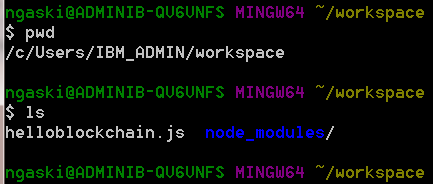
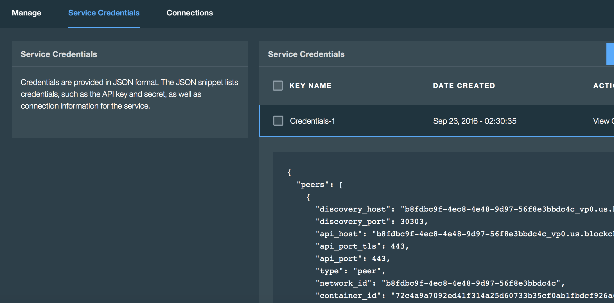
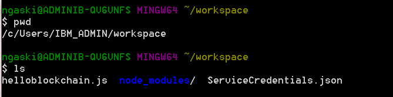
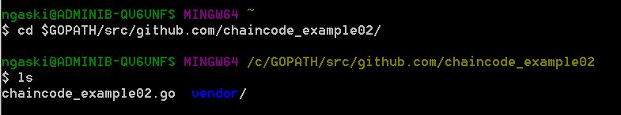

---

copyright:
years: 2016

---

{:new_window: target="_blank"}
{:shortdesc: .shortdesc}
{:codeblock: .codeblock}
{:screen: .screen}
{:pre: .pre}


# HFC SDK for Node.js
{: #etn_sdk}
Last updated: 07 October 2016
{: .last-updated}

The Hyperledger Fabric Client (HFC) SDK enables application developers to build Node.js applications that interact with a blockchain network. Node.js applications that leverage the HFC SDK can be used to perform the following network tasks:
{:shortdesc}

* Securely register and enroll users. A web application administrator with `registrar` authority can dynamically register and enroll users who have authenticated to the web application.
* Submit transactions to the blockchain network (deploy, invoke and query). All transactions are anonymous, confidential and unlinkable without 'auditor' authority.
* Store sensitive private keys and certificates in any location, such as an off-blockchain database. This requires implementing a simple key-value store interface.

The HFC SDK provides APIs, through which applications interact with a Hyperledger Fabric blockchain network. These APIs are designed to support two pluggable components:

1. Pluggable key value store, which is used to retrieve and store keys associated with a member. The  `chain.setKeyValStore()` method overrides the default file-based key value store implementation. The chain key value store is used to warehouse sensitive private keys, so access must be appropriately protected.
2. Pluggable member service, which is used to register and enroll members. The `chain.setMemberServices()` method  overrides the default implementation in `MemberServices`. Member services implements the Hyperledger fabric as a  permissioned blockchain network, which provides anonymity, unlinkability of transactions, and confidentiality.

The following link is no longer available on GitHub. Drilling down, it looks as though the SDK has been been migrated to gerrit, at the following link:  https://gerrit.hyperledger.org/r/#/admin/projects/fabric. I recommend you verify this with a Blockchain/Hyperledger developer before making the change. 

You can include the HFC SDK in your Node.js app by using the offline method or the npm method:
*  offline method: first copy the files from the Hyperledger Fabric source tree  (https://github.com/hyperledger/fabric/tree/master/sdk/node/lib) into your Node.js app `/lib` directory. Then include the HFC SDK in your application by adding the following code snippet:

```js
var hfc = require("./lib/hfc");
```

* npm method: from the command line, first install the HFC SDK from npm with the following snippet:

```
npm install hfc@0.5.3
```

Then include the HFC SDK in your application with the following code snippet:

```js
var hfc = require('hfc');
```  
<br>
## HFC Objects
{: #objects}

The following HFC objects (classes and interfaces) are described at a high level to help guide you through the object hierarchy:

* The top-level class is `Chain`, which is the client representation of a blockchain network. HFC allows you to interact with multiple networks, and to share a single `KeyValStore` and `MemberServices` object with multiple `Chain` objects, as needed. For each blockchain network, you will add one or more `Peer` objects, which represent the endpoints that HFC connects to in order to submit transactions.
* The `KeyValStore` interface is used by HFC to store and retrieve all persistent data. This data includes private keys, which must be kept secure. The default implementation is a file-based version located in the `FileKeyValStore` class.
* The `MemberServices` interface is implemented by the `MemberServicesImpl` class, and provides security and identity-related features such as privacy, unlinkability and confidentiality. This implementation issues *eCerts* (member enrollment certificates) and *tCerts* (transaction certificates for each member).
* The `Member` class represents end users who transact on the network, and other types of members such as peers (nodes). Use the `Member` class, which interacts with the `MemberServices` object, to *register* and *enroll* members and users. You can also deploy, query, and invoke chaincode directly from the 'Member' class by transacting with `Peer` objects; this implementation simply delegates the work to a temporary `TransactionContext` object.
* The `TransactionContext` class implements the bulk of the deploy, invoke and query logic. Each `TransactionContext` instance receives a unique tCert from `MemberServices`, which it always uses to submit transactions. To issue multiple transactions with the same tCert, retrieve a `TransactionContext` object directly from a Member object, and issue multiple deploy, invoke and query operations. However, using a single tCert for multiple transactions links the transactions such that they are identifiable as involving the same anonymous user. To avoid transaction linkage, call deploy, invoke, and query on the `User` or `Member` object.  

<br>
## Sample Node.js application
{: #nodesample}

The following sample Node.js application leverages the HFC SDK APIs in order to interact with a Bluemix blockchain network. The program functions with both blockchain network plans (starter and HSBN), and with any client-side operating system.

The objective is to use a JavaScript application--[helloblockchain.js](https://github.com/IBM-Blockchain/SDK-Demo/blob/master/helloblockchain.js)--to successfully deploy  chaincode--[chaincode_example02](https://github.com/IBM-Blockchain/SDK-Demo/blob/master/chaincode_example02.go)--to your Bluemix network, followed by an invocation and query.  

1. This program requires both Node.js and the npm JavaScript package manager.  Installing the latest version of [Node.js](https://nodejs.org/en/) will automatically include npm.  

1. Open a terminal and create a directory (workspace) where you will place the helloblockchain.js source code and node modules. For example:

    ```
    mkdir -p $HOME/workspace
    ```

1. Go to your newly created workspace folder and install HFC v0.5.3 with the following command:

     ```
     cd $HOME/workspace
     npm install hfc@0.5.3
     ```

1. Copy the [helloblockchain.js](https://github.com/IBM-Blockchain/SDK-Demo/blob/master/helloblockchain.js) program and save it to your workspace folder.  
   Your `/workspace` directory should look similar to the screenshot below:

   

1. If you have not yet done so, access the [Blockchain](https://console.ng.bluemix.net/catalog/services/blockchain/) tile in Bluemix and create an instance of the service. Select either the **Starter Developer** plan or the **High Security Business Network** plan ( if approved). Click the **CREATE** button and get the **Service Credentials** by copying and pasting the JSON file; save it as ServiceCredentials.json in your local '/workspace' directory. Please ensure that you copy the entire JSON payload; it should be 202 lines in a standard editor.  **Note**: When running a blockchain instance against the Bluemix [new console](https://new-console.ng.bluemix.net/#overview) format, you will notice a difference in the output of your **Service Credentials**.  Namely, the "credentials" line is removed from the object.  To fix this add the following snippet to line 2 of your ServiceCredentials.json file:

	```
	"credentials": {
	```

1. Then add a final closing `}` to line 202 to close the object.  The layout of your ServiceCredentials.json should mirror that of the example [ServiceCredentials.json](https://github.com/IBM-Blockchain/SDK-Demo/blob/master/ServiceCredentials.json), leaving you with a payload of 202 lines. If you obtain your credentials from a blockchain instance derived from the Bluemix [classic console](https://console.ng.bluemix.net/) format, then you needn't worry about this discrepancy.  The screenshots below depict the differences in the two layouts, with the initial showing *new console*, and the latter showing *classic*:

     

     

1. Upon adding ServiceCredentials.json, your `/workspace` directory should look similar to the following screenshot:

     

1. When the program is run, the HFC SDK creates the `keyValStore` directory within $HOME/workspace.  This `keyValStore` directory contains the cryptographic keys for each enrolled user.  You needn't delete the `keyValStore` directory when connecting to new Bluemix networks, rather, unique `keyValStore` directories will be created for each Bluemix instance.  

1. Create a chaincode directory under your $GOPATH, as shown below. If you have not yet set a $GOPATH on your machine, follow the instructions [here](https://github.com/golang/go/wiki/GOPGATH).

	```
	mkdir -p $GOPATH/src/chaincode_example02
	```

1. Copy [chaincode_example02.go](https://github.com/IBM-Blockchain/SDK-Demo/blob/master/chaincode_example02.go) to this new directory - `$GOPATH/src/chaincode_example02`.  This is the actual piece of chaincode that will be deployed to the Bluemix network once you run the program.  

1. Retrieve [vendor.zip](https://github.com/IBM-Blockchain/SDK-Demo/blob/master/vendor.zip) and save it to the same directory - `$GOPATH/src/chaincode_example02`. The vendor.zip package contains libraries and dependencies from the Hyperledger Fabric v0.5 codebase. The default Windows extraction creates a path similar to: **C:\GOPATH\src\chaincode_example02\vendor**. Before extracting, you must delete the `\vendor` directory from this path, or the chaincode deployment will fail. A correct path on Windows will look similar to:  **C:\GOPATH\src\chaincode_example02\vendor\github.com\hyperledger\fabric**. (Note: One `\vendor` directory is correct.)  The irregularity of a second `\vendor` directory does not occur on Linux or OS X.

1. You should now have a directory within your $GOPATH that looks similar to the following example:

    

1. From your local '/workspace' directory, run the node program:

	```
	node helloblockchain.js -c chaincode_example02
	```
	Enable debug logs:
	```
	DEBUG=hfc node helloblockchain.js -c chaincode_example02
	```

	Enable gRPC traces:
	```
	GRPC_TRACE=all DEBUG=hfc node helloblockchain.js -c chaincode_example02
	```

If `deploy`, `invoke` and `query` transactions are successful, you will see the following messages in your terminal:

```
Successfully deployed chaincode: request={"fcn":"init","args":["a","100","b","200"],"certificatePath":"/certs/blockchain-cert.pem","chaincodePath":"github.com/chaincode_example02/"}, response={"uuid":"2d6ad8d6-1390-4c60-a01b-f4c301175eb7","chaincodeID":"9be0a0ed3f1788e8728c8911c747d2f6d0e205fa63422dc598d498fe709b9b8d","result":"TODO: get actual results; waited 120 seconds and assumed deploy was successful"}

Successfully submitted chaincode invoke transaction: request={"chaincodeID":"9be0a0ed3f1788e8728c8911c747d2f6d0e205fa63422dc598d498fe709b9b8d","fcn":"invoke","args":["a","b","1"]}, response={"uuid":"f9a902d2-44d8-4b68-b43d-419470ba73ae"}

Successfully completed chaincode invoke transaction: request={"chaincodeID":"9be0a0ed3f1788e8728c8911c747d2f6d0e205fa63422dc598d498fe709b9b8d","fcn":"invoke","args":["a","b","1"]}, response={"result":"waited 20 seconds and assumed invoke was successful"}

Successfully queried  chaincode function: request={"chaincodeID":"9be0a0ed3f1788e8728c8911c747d2f6d0e205fa63422dc598d498fe709b9b8d","fcn":"query","args":["a"]}, value=99
```

Be aware that when running on a Starter Developer network it can sometimes take up to ten minutes for your chaincode container to start.  However, once started, subsequent deployments and invocations will execute immediately, because the prerequisite files have been stored on the host machine for your blockchain instance.  

Navigate to the **Blockchain** tab from your **Network Console**. This view shows blocks being appended to the blockchain ledger as the helloblockchain.js program issues deploy and invoke transactions. The following screenshot shows the results of running helloblockchain.js twice, with the default arguments for "a" and "b":

     

<br>
## Troubleshooting
Ensure that you are running **hfc@0.5.3** by issuing either of the following commands from your **/workspace** directory:
  * npm list | grep hfc
  * npm list -g | grep hfc  (If installed using the global `-g` flag)

Use the following procedure if you receive a query message:

  ```
Failed to query chaincode, function: request={"chaincodeID":"9be0a0ed3f1788e8728c8911c747d2f6d0e205fa63422dc598d498fe709b9b8d","fcn":"query","args":["a"]}, error={"error":{"status":"FAILURE","msg":{"type":"Buffer","data":[69,114,114,111,114,58,70,97,105,108,101,100,32,116,111,32,108,97,117,110,99,104,32,99,104,97,105,110,99,111,100,101,32,115,112,101,99,40,112,114,101,109,97,116,117,114,101,32,101,120,101,99,117,116,105,111,110,32,45,32,99,104,97,105,110,99,111,100,101,32,40,57,98,101,48,97,48,101,100,51,102,49,55,56,56,101,56,55,50,56,99,56,57,49,49,99,55,52,55,100,50,102,54,100,48,101,50,48,53,102,97,54,51,52,50,50,100,99,53,57,56,100,52,57,56,102,101,55,48,57,98,57,98,56,100,41,32,105,115,32,98,101,105,110,103,32,108,97,117,110,99,104,101,100,41]}},"msg":"Error:Failed to launch chaincode spec(premature execution - chaincode (9be0a0ed3f1788e8728c8911c747d2f6d0e205fa63422dc598d498fe709b9b8d) is being launched)"}
  ```

Increase the deploy wait time in the Node.js application. The default is set to 60 seconds, but it can take longer for the code to properly deploy, compile and start running in the Docker container. Try increasing the deploy wait time to 120 seconds. This idiosyncrasy is only observed on Starter Developer plans as the result of shared computational resources on the machine hosting your blockchain instance:

  ```js
chain.setDeployWaitTime(120);
  ```

Once your chaincode is successfully deployed on the network, you can reduce the deploy wait time to a nominal amount, such as a few seconds.

If you receive a handshake error, try a different `grpc` version. You can access your grpc version with either of the following commands:
    - `npm list | grep grpc`
    - `npm list -g | grep grpc`  

<br>
## Public and Private Keys
{: #keys}

Hyperledger Fabric uses certificate authorities, and their underlying public and private keys, to meet the security requirements of businesses operating on a shared blockchain. Member identity management, role management and transactional privacy can all be controlled through the HFC SDK.

User and transactional privacy on a shared blockchain are managed through the implementation of a PKI (Public Key Infrastructure) framework. The PKI, through certificate authorities, manages the generation, distribution and revocation of keys and digital certificates. The complete technical specifications for PKI and Membership Services are described in the security section of the Hyperledger Fabric v0.5 [protocol specification](https://github.com/hyperledger/fabric/blob/master/docs/protocol-spec.md). The basic tenets of the Hyperledger Fabric PKI are explained below:

1. The Registration Authority (RA) validates the identity of a user who is requesting access to the blockchain network.  This can be done dynamically by a user with `registrar` authority, or manually by editing the membersrvc.yaml file. The registration process occurs out-of-band and is executed through the `RegisterUser` function. The RA assigns enrollment credentials-`<enrollID>` and `<enrollPWD>`-to the user.

2. The user then sends an enrollment request to the Enrollment Certificate Authority (ECA), using the `CreateCertificatePair` function. This payload contains the user's one-time `<enrollPWD>`, Public Signature Verification Key and Public Encryption Key, and is signed with the user's Private Signature Verification Key. <br><br>Upon receipt of the enrollment request, the ECA issues an encrypted challenge to the user that can only be decrypted with the user's Private Encryption Key. After decrypting the challenge, the user resends the certificate request. The ECA, contingent upon an accurately decrypted response, returns an authenticated certificate pair signed with its digital signature. <br><br>The digital signature is produced by cryptographically hashing the certificate request (message) using the SHA-2 algorithm to produce a "digest." This "message digest" is then encrypted with the ECA's private signature key. Network members can then authenticate the digital signature by decrypting it with the ECA's public signature key. The returned enrollment certificate (eCert) pair contains one certificate for data signing (private) and one for data encryption (public). This eCert pair is static and long-term and can be either visible or invisible to transactions.

3. To transact on any blockchain network, each user must also have transaction certificates (tCerts). Upon successful enrollment, a user submits a request to the Transaction Certificate Authority (TCA) for a batch of tCerts. A tCert is short-term, specific to one transaction, and can be modified by the client using an API. After verifying the user's eCert, the TCA assigns a batch of tCerts and a KeyDF_Key (Key Derivation Function Key), which allows the user to decrypt their private keys. While the single KeyDF_Key is used for each tCert in the batch, the ensuing private key that is generated is unique to each tCert. To transact, a client must be able to sign the transaction payload with the decrypted private key. Only then is a transaction forwarded to network validating peers for consensus.
