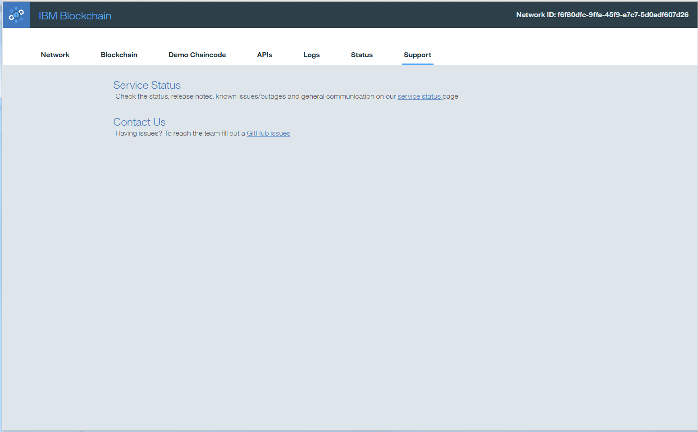

---

copyright:
  years: 2017
lastupdated: "2017-04-06"
---

{:new_window: target="_blank"}
{:shortdesc: .shortdesc}
{:codeblock: .codeblock}
{:screen: .screen}
{:pre: .pre}

# Getting support
{: #ibmblockchain_support}

There are several mechanisms available to obtain support and troubleshoot problems associated with your blockchain instance on Bluemix:
{:shortdesc}

## Non-defect issues

1. The most expedient method is to navigate to the **Support** tab  from your **Dashboard Monitor** as shown in the Figure 1 for version 0.6, or [the **Support** panel](dashboard_support.html) as in version 1.0.  

*Figure 1. Support tab*

* Use the [service status](https://bluemix-service-status.blockchain.ibm.com) page to investigate known issues with the networks and service.  The development and quality assurance teams actively update these pages to reflect any current abnormalities within the service.  This page also contains release notes for new commits of the Hyperledger Fabric code.
* Use [dW Answers](https://developer.ibm.com/answers/smartspace/blockchain/) to search responses from previously posed questions, or to submit a new inquiry.  Be sure to include the keyword **blockchain** in your question.
* Use [GitHub issues](https://github.com/IBM-Blockchain/ibm-blockchain-issues/issues) to reach the blockchain development team.  Share details and code snippets from your specific Bluemix instance.  
* Use the [Hyperledger Rocket.Chat](https://chat.hyperledger.org/channel/general) channel to raise questions concerning the Hyperledger Fabric code.  

## Software defect issues

For software defects or if your problem is unable to be solved by any of the above routes, then follow these steps to submit a help ticket:

* On the upper right corner of the **Menu Bar** (shown in Figure 1) click the **Account and Support** icon (shown in Figure 2).

*Figure 1. Menu Bar*

  
*Figure 2. Account and Support*

1. Click the **Get Help** button in the support section; a new panel will be presented.
1. Click the **Get In Touch** button.
1. On the next panel click the **A Service** button under the **I need technical support for** heading; another panel is presented.
1. Enter the details for your problem and select the **Next** button.  
1. On this panel choose the severity for the problem and click the **Submit** button.
1. You will receive an email notification in a few minutes for the Service Ticket opened for your request.  Follow the instructions in the email for additional communications on the problem.
