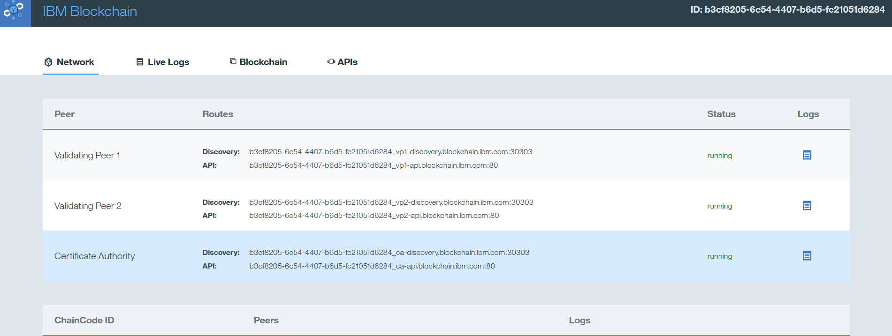
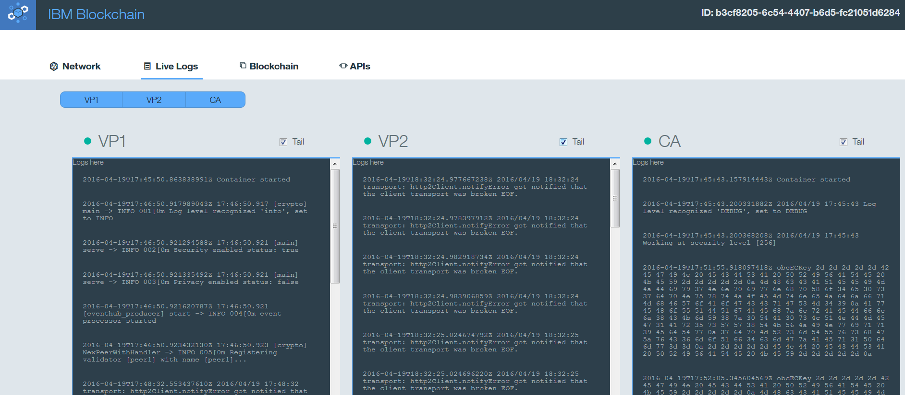
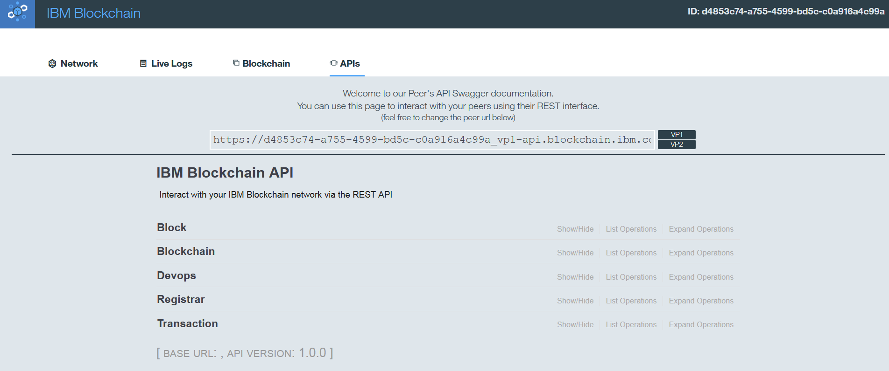
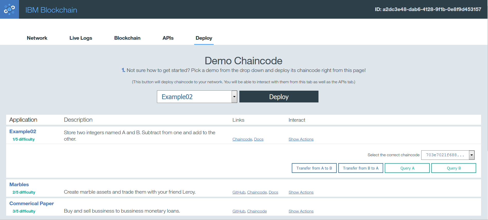

---

copyright:
  years: 2016

---

{:new_window: target="_blank"}
{:shortdesc: .shortdesc}
{:codeblock: .codeblock}
{:screen: .screen}
{:pre: .pre}

# Managing chain code with the {{site.data.keyword.blockchain}} monitor
{: #blockchain_dashboard_monitor}
*Last updated: 28 April 2016*

Use the blockchain monitor to retrieve details about your network, such as peer information, logs, ledger state, APIs, and chaincodes.  
The purpose of the monitor is to provide you with an overview of your blockchain environment, 
including performance data and currently deployed chaincodes.  
{:shortdesc}

## Monitor tabs
{: #blockchain_dashboard_monitor_tabs}

The following tabs are displayed within your dashboard:
  - Network
  - Live Logs
  - Blockchain
  - APIs
  - Deploy

**Network tab**: Displays data for your blockchain network.  Here you can find the Discovery and API routes for your two validating peers and for the Certificate Authority.   The routes are simply the combined values of your host and port for each node.  For example, if you were to look at JSON code snippet for your **Service Credentials** back on the **Service Dashboard**, you notice that `"discovery_host"` and `"discovery_port"` equate to the route displayed on the **Network** tab.  These values are useful if you want to manually connect to bluemix.  From this dashboard, you can monitor the status of your peers and any chaincode containers that are currently running.  You can also view logs.  

**Live Logs tab**:  Displays real-time data for your two validating peers and certificate authority.  The three windows will show you the results of all transactions made to the network.  Use this information to investigate and troubleshoot chaincode that fails to properly execute.

    
**Blockchain tab**: Displays the current state of your blockchain.  View all transactions, current ledger state, and performance data for your network.  

    
**APIs tab**:  Displays the Swagger UI.  Use this page to interact with your blockchain network by using the REST API.  

**Deploy tab**:  Contains three chaincode applications that you can deploy to your network.  You are able to interact with your chaincode from this tab OR the API tab.  

