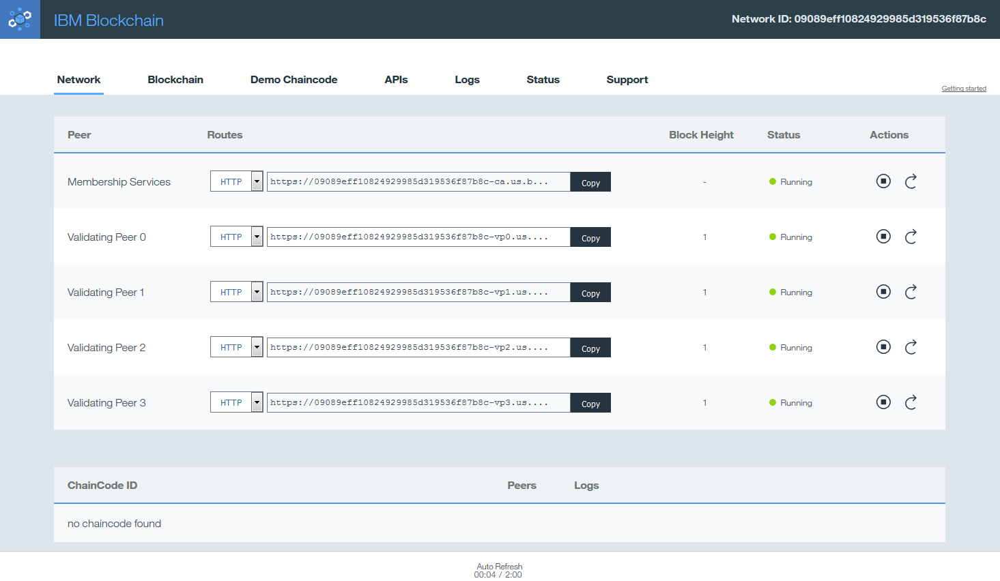
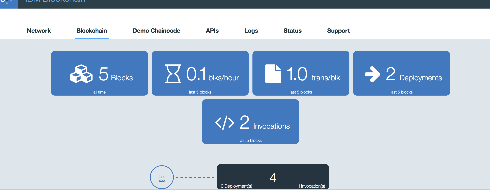
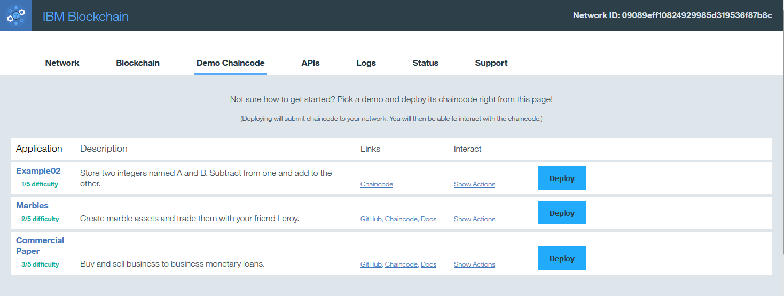
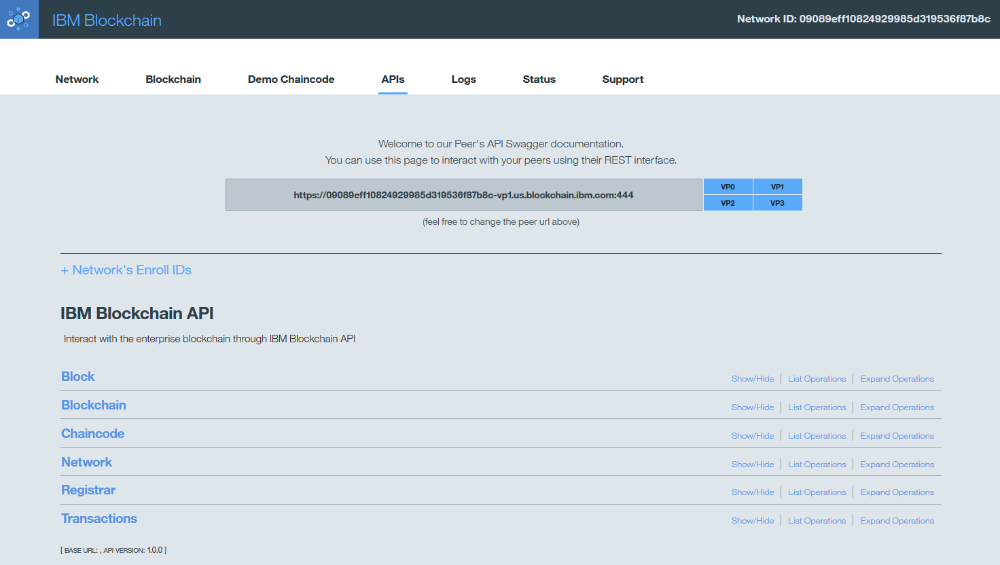
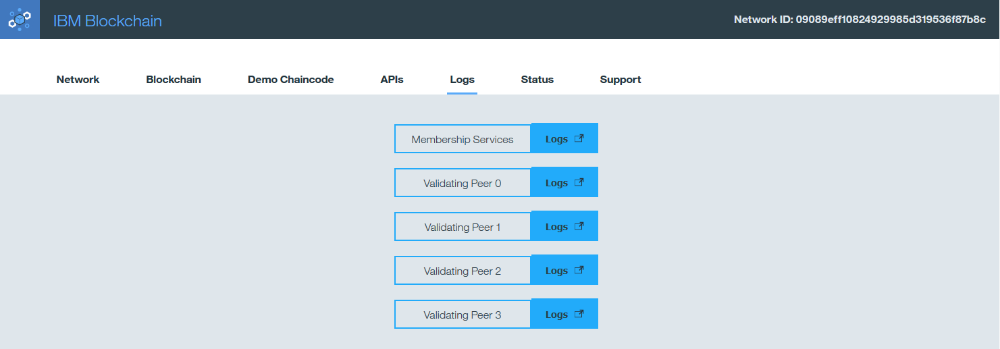
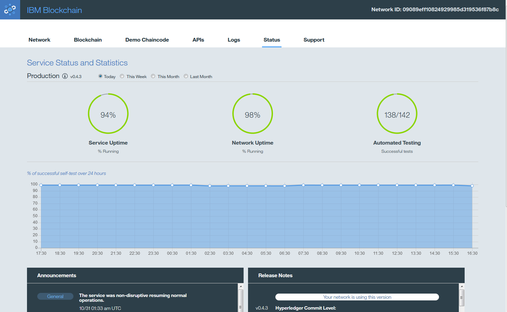
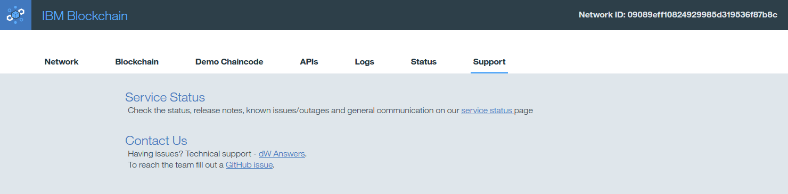

---

copyright:
  years: 2016
lastupdated: "2016-11-08"
---

{:new_window: target="_blank"}
{:shortdesc: .shortdesc}
{:codeblock: .codeblock}
{:screen: .screen}
{:pre: .pre}

# Dashboard monitor
{: #blockchain_dashboard_monitor}

The dashboard monitor provides an overview of your blockchain environment, including performance data and deployed chaincode. Use the monitor to view network information about peers, logs, ledger state, APIs and chaincode.  
{:shortdesc}

As shown in the following examples, the dashboard monitor tabs provide unique views into your blockchain network:
  - Network
  - Blockchain
  - Demo Chaincode
  - APIs
  - Logs
  - Status
  - Support

**Network tab**: Monitor the status of your peers and any chaincode containers that are running, as shown in Figure 1. View the Discovery and API routes for your validating peers and Certificate Authority, which are the combined node host and port values. For example, the JSON code snippet for your Bluemix **Service Credentials** on the **Service Dashboard** shows that `"discovery_host"` and `"discovery_port"` equate to the route displayed on the **Network** tab. These values are useful for manually connecting to Bluemix.

*Figure 1. Network tab*

**Blockchain tab**: View the current state of your blockchain. As shown in Figure 2, you can view all transactions, the current ledger state and performance data for the network:

*Figure 2. Blockchain tab*

**Demo Chaincode tab**: Learn and experiment with three sample chaincode templates, which you can deploy and invoke on your network. Instructions are provided to guide you through the process, as shown in Figure 3. All deployments and invocations of chaincode are written to the log, and can also be viewed on the Live Logs, Blockchain, and API tabs.  

*Figure 3. Demo Chaincode tab*

**APIs tab**: Use the Swagger UI to interact with your blockchain network through the REST API, as shown in Figure 4:  

*Figure 4. APIs tab*

**Logs tab**:  View logs for validating peers and Membership Services, which include the results of all transactions on the network. You can use log information to inspect transactions and troubleshoot chaincode.  

*Figure 5. Logs tab*

**Status tab**: View performance metrics for service, network and automated testing, as shown in Figure 6. Display data for the prior month. This tab also contains code announcements, general forums, known issues, and release notes for IBM Blockchain.  

*Figure 6. Status tab*

**Support tab**: Report an issue and view your Service status, as shown in Figure 7:

*Figure 7. Support tab*
