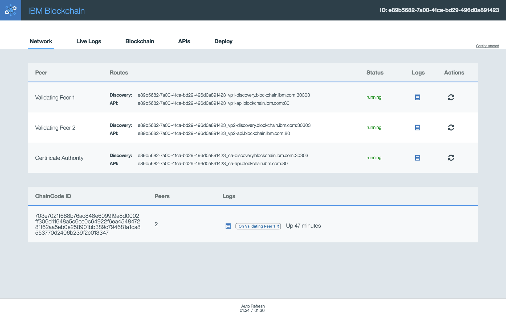

---

copyright:
  years: 2016

---

{:new_window: target="_blank"}
{:shortdesc: .shortdesc}
{:codeblock: .codeblock}
{:screen: .screen}
{:pre: .pre}

# Understanding your network through the blockchain monitor
{: #blockchain_dashboard_monitor}
*Last updated: 13 July 2016*
{: .last-updated}

Use the blockchain monitor to retrieve details about your network, such as peer information, logs, ledger state, APIs and chaincodes. The monitor provides you with an overview of your blockchain environment, including performance data and currently-deployed chaincodes.
{:shortdesc}

## Monitor tabs
{: #blockchain_dashboard_monitor_tabs}

The following tabs are displayed on your dashboard:
  - Network
  - Blockchain
  - Demo Chaincode
  - APIs
  - Logs
  - Status 
  - Support

**Network tab**: Monitor the status of your peers and any chaincode containers that are currently running, as shown in Figure 1. Additionally, you can find the Discovery and API routes for your validating peers and for the Certificate Authority. The routes are simply the combined values of your host and port for each node.  For example, the JSON code snippet for your **Service Credentials** on the **Service Dashboard** shows that `"discovery_host"` and `"discovery_port"` equate to the route displayed on the **Network** tab. These values are useful to manually connect to Bluemix.

*Figure 1. Network tab*

**Blockchain tab**: View the current state of your blockchain. As shown in Figure 2, you can view all transactions, the current ledger state and performance data for the network:

*Figure 2. Blockchain tab*

**Demo Chaincode tab**: Learn and experiment with three sample chaincode templates that you can deploy to and invoke on your network. Instructions are provided each step of the way to help guide you through the process, as shown in Figure 3. All deployments and invocations of chaincode will be written to the log, but can also be seen on other tabs, such as Live Logs, Blockchain, and API tabs.  

*Figure 3. Demo Chaincode tab*

**APIs tab**: Use the Swagger UI to interact with your blockchain network through the REST API, as shown in Figure 4:  

*Figure 4. APIs tab*

**Logs tab**:  View logging data form your validating peers and Membership Services. The logs will show you the results of all transactions on the network. Use this information to investigate and troubleshoot chaincode.  

*Figure 5. Logs tab*

**Status tab**: View performance metrics for service, network and automated testing, as shown in Figure 6.  Customize the time-period for the data display, going back as far as one month.  The tab also contains code announcements, general forums, known issues, and release notes regarding the current implementation of IBM Blockchain.  

*Figure 6. Status tab*

**Support tab**: Use the Support tab to raise a Github issue or to navigate to your Service status, as shown in Figure 7:

*Figure 7. Support tab*

