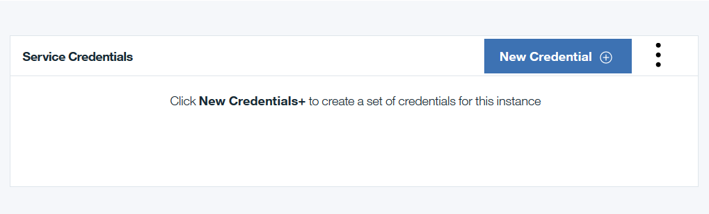

---

copyright:
  years: 2017
lastupdated: "2017-03-07"
---

{:new_window: target="_blank"}
{:shortdesc: .shortdesc}
{:codeblock: .codeblock}
{:screen: .screen}
{:pre: .pre}

# HSBN known issues
{: #etn_overview}

The following HSBN plan issues have been reported:

1. When using the High Security Business Network, which utilizes Hyperledger Fabric v0.6.1, resetting the network periodically during a development phase is suggested if there have been more than roughly fifty chaincode deployments.  Resetting the network removes deployed chaincode and the data that has been collected.  This provides a chance to remove older chaincode that has been superseded by improvements made during an iterative development phase.  If you are in a post-development phase, then the number of chaincode deployments should be monitored to leave capacity for the most important chaincode.
2. Sporadic "503 Service Unavailable" and "502 Bad Gateway" errors received when performing a status query of the network and the peers.
3. Potential for "Server.Serve failed to complete security handshake" messages in the logs for vp1. This is a non-fatal error and not related to network operation.
4. The **Service Credentials** might not self-populate; in this case, generate the credentials as follows:

 a) From your Service Dashboard, click the **Service Credentials** tab:

  

 b) From the **Service Credentials** tab, click the button for **New Credential**:

  

c) A new window titled **Add New Credential** is displayed; click the **Add** button at the bottom of this window:

  

 d) Now your screen should look similar to the following example. Clicking on **View Credentials** will reveal a JSON payload containing the Service Credentials for your HSBN instance.  

  

## Getting help

For support and help with your IBM Blockchain on Bluemix network, see [Getting support](ibmblockchain_support.html).
