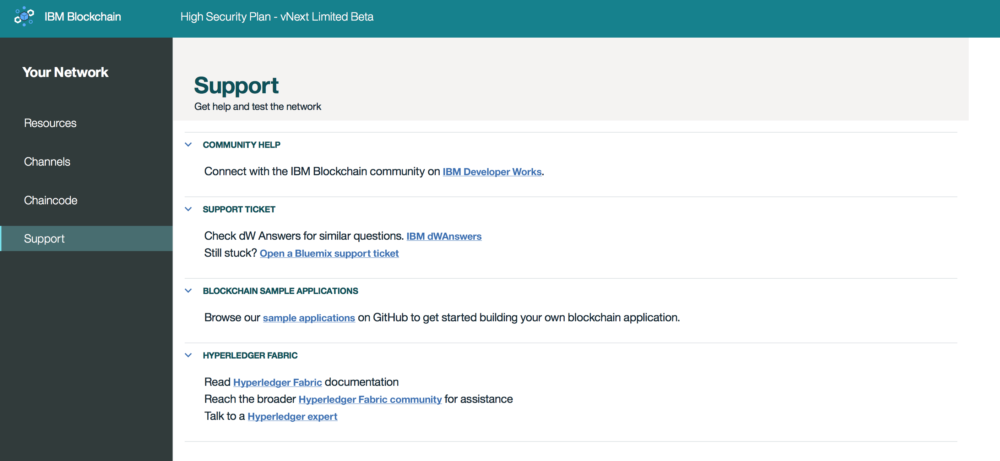

---

copyright:
  years: 2017

---

{:new_window: target="_blank"}
{:shortdesc: .shortdesc}
{:codeblock: .codeblock}
{:screen: .screen}
{:pre: .pre}

# Support
{: #v10_dashboard}
Letzte Aktualisierung: 16. März 2017
{: .last-updated}

Über die Links und Ressourcen auf dieser Seite können Sie auf Fehlerbehebungs- und Unterstützungsforen zugreifen. Wenn Sie Ihr Problem nicht beheben können oder keine Antwort auf Ihre Frage finden können, klicken Sie auf den Link **Bluemix-Support-Ticket**. Sie werden an einen Bildschirm weitergeleitet, der Sie durch den entsprechenden Prozess leitet.  
{:shortdesc}

**Abbildung 11** zeigt die Support-Anzeige:

*Abbildung 11. Blockchain-Support*
