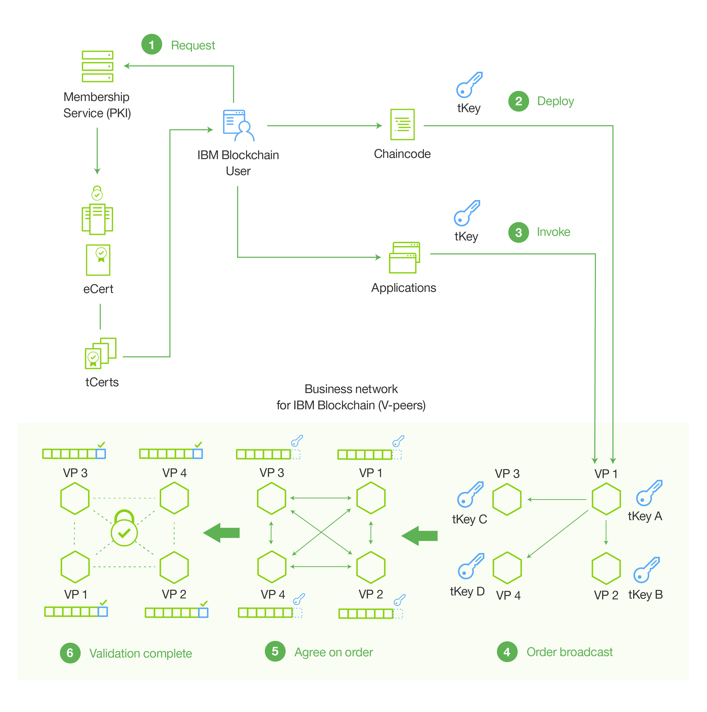

---

copyright:
years: 2016

---

{:new_window: target="_blank"}
{:shortdesc: .shortdesc}
{:codeblock: .codeblock}
{:screen: .screen}
{:pre: .pre}

# Netzumgebung
{: #etn_overview}
Letzte Aktualisierung: 03. November 2016
{: .last-updated}

Der Starter Developer-Plan und der High Security Business Network-Plan von IBM Blockchain on Bluemix nutzen die neuesten Iterationen von Hyperledger Fabric v0.6, das PBFT-Konsensprotokoll (PBFT - Practical Byzantine Fault Tolerance) und das SDK von Hyperledger Fabric Client (HFC) für Node.js. Beide Pläne bestehen aus vier Netzknoten und einer Zertifizierungsstelle. Von der Zertifizierungsstelle werden die 'Mitgliedschaftsservices' reguliert, von denen Identitäten, Netzberechtigungen und vertrauliche Transaktionen über das Ausgeben von digitalen Zertifikaten verwaltet werden.
{:shortdesc}

Folgende Blockchain-Funktionen stehen in beiden Plänen zur Verfügung:

* Vom PBFT-Konsensprotokoll wird die Reihenfolge aller Transaktionen verwaltet, die in das gemeinsam genutzte Hauptbuch geschrieben werden. Ein PBFT-Blockchain-Netz aus vier Knoten kann auch dann einen Konsens erreichen, wenn ein Byzantine-Knoten (fehlerhafter Knoten) vorhanden ist. Die Details der PBFT-Konsenstests finden Sie in [Konsens und Verfügbarkeit testen](etn_pbft.html).
* Vom HFC-SDK für Node.js wird die Interaktion zwischen den clientseitigen Node.js-Anwendungen und dem Blockchain-Netz ermöglicht. Die clientseitigen Apps können Benutzer sicher über die Mitgliedschaftsservices eintragen, Transaktionen absetzen und Assets mithilfe der tCerts verschlüsselt austauschen. Weitere Informationen zu den Mitgliedsservices und dem Datenschutz der Benutzer finden Sie im Abschnitt [HFC-SDK für Node.js](etn_sdk.html) und unter [Protocol Specification](https://github.com/hyperledger/fabric/blob/v0.6/docs/protocol-spec.md) von Hyperledger Fabric.
* Details zu Ihrer Blockchain-Netzumgebung finden Sie über die [Dashboard-Überwachung in Bluemix](ibmblockchainmonitor.html).  

 
## Terminologie

Die folgende Terminologie erläutert zusammen mit dem nachfolgenden Diagramm den Kontext der Komponenten eines IBM Blockchain-Netzes:

* Mitglied - Eine Identität für die Teilnahme in einem Blockchain-Netz. Es gibt unterschiedliche Klassen an Mitgliedern, unter anderem Benutzer, Peers, Validatoren und Auditoren.
* Mitgliedschaftsservices - Services zum Abrufen und Verwalten der Mitgliedschaftsidentitäten. Mitgliedschaftsservices werden von Zertifizierungsstellen reguliert.  
* Registrierung - Der Vorgang des Hinzufügens einer neuen Mitgliedsidentität zum Netz. Ein Mitglied kann von einem Benutzer mit der Berechtigung 'Registrator' dynamisch zum Netz hinzugefügt werden. Mitglieder werden auch Rollen und Attribute zugeordnet, von denen ihr Zugriff und ihre Berechtigung im Netz gesteuert wird. Weder Rollen noch Attribute können dynamisch zugeordnet werden; stattdessen müssen Sie die Datei 'membersrvc.yaml' bearbeiten.
* Eintragung - Schließt den Registrierungsprozess ab und ermöglicht dem neuen Mitglied den Zugriff auf das Blockchain-Netz. Die Eintragung kann vom Mitglied nach dem Abrufen eines geheimen Schlüssels vom Registrator (Out-of-band) oder über einen Mittelsmann mit delegierter Berechtigung durchgeführt werden, der im Auftrag des neuen Mitglieds handelt.  

 
## Netzarchitektur

In Abbildung 1 und der nachfolgenden Beschreibung werden die IBM Blockchain-Netzarchitektur und der Datenfluss für Mitgliedschaftsservices, Transaktionen, Konsens und das Anhängen ans Hauptbuch erläutert.

Abbildung 1.

In den folgenden Schritten wird der Netzfluss aus Abbildung 1 detailliert beschrieben:

1. Ein registrierter Benutzer trägt sich beim Netz über die PKI (Mitgliedschaftsservices) ein und erhält ein langfristiges Eintragungszertifikat (eCert - Enrollment Certificate) und einen Stapel Transaktionszertifikate (tCerts - Transaction Certificates).
2. Der Benutzer stellt den Chaincode im Netz bereit. Vom Chaincode (Smart Contract) werden die Geschäftslogik oder Regeln für die Regulierung eines bestimmten Transaktionstyps codiert. Für jede Transaktion (Bereitstellen, Aufrufen oder Abrufen) ist ein eindeutiges tCert erforderlich, das mit dem privaten Schlüssel des Benutzers signiert sein muss. Vom Benutzer wird der private Schlüssel von den zugewiesenen tCerts abgeleitet.
3. Der Benutzer ruft den Smart Contract auf, von dem der Vertrag zur Selbstausführung seiner codierten Logik ausgelöst wird.
4. Eine Transaktion wird an einen Netzpeer gesendet. Sobald der Peer die Transaktionsanforderung erhält, übergibt er die Anforderung an den primären Peer im Netz (VP1 in Abbildung 1). Der primäre Peer sortiert einen Block aus Transaktionen und sendet diese Reihenfolge an die anderen Peers.
5. Von den Peers wird das Netzkonsensprotokoll (PBFT) für die Zustimmung zur Reihenfolge der übergebenen Transaktionen verwendet. Dieser Prozess zum kollektiven Sortieren von Transaktionen wird als Konsens bezeichnet.  
6. Sobald die Peers einen Konsens erreicht haben, wird die Transaktionsanforderung ausgeführt und der Block wird an das gemeinsam genutzte Hauptbuch angehängt.  

<!---Both the developer and high-security networks unlock several features in the Hyperledger fabric which robustly enhance security, confidentiality and privacy.  The only fundamental difference between the two is their operating/hosting environment.  The developer network runs in a shared multi-tenant environment on Softlayer, whereas the high-security network exists as an isolated single-tenant running in a secure services container.  Each network leverages the same capabilities from the fabric, including a PBFT consensus protocol and the enhanced Node.js SDK.~~

~~The High-Security business network runs in an isolated and highly secured environment, distinguishing it from other cloud-hosted offerings. The operating system, fabric, and nodes all exist in a secure services container (SSC), providing your enterprise with the security and impregnability that customers have come to expect from system Z technology.  The SSC delivers performance optimization in - peer to peer communication, availability, scalability, hardware encryption, tamper-proof crypto keys, and securely encrypted VMs.  See the [Secure Services Container](etn_ssc.html) section for more details on the security features provided through the SSC.  Additionally, the high security network unlocks numerous features of the Hyperledger fabric (unavailable in the developer service), which robustly enhance security, confidentiality and privacy.  The configuration is such that you are able to test and affirm these features.~~  
{:shortdesc}

~~The high security plan augments the developer plan by delivering several enhancements that help meet the security requirements and concerns of an enterprise-level participant:~~--->

<!---The environment (LinuxONE on z) consists of a four-peer network implementing PBFT with Membership Services enabled, running in an application container.  The application container protects blockchain software, chaincode, and data running within the system. The blockchain software within the secure boot can be signed, attested, and encrypted; and once installed in the application container, is tamper-resistant.  Root users of the platform and system administrators cannot access or see z secure container contents.  In addition, the LinuxOne on z provides you with FIPS compliance, high Evaluation Assurance Level protection, a highly auditable operating environment, and crypto optimization--->
