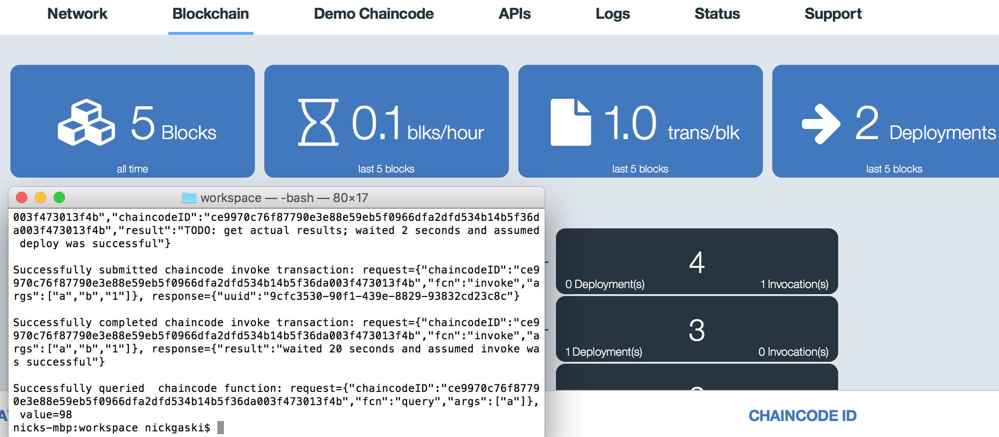

---

copyright:
  years: 2016, 2017
lastupdated: "2016-10-31"
---

{:new_window: target="_blank"}
{:shortdesc: .shortdesc}
{:codeblock: .codeblock}
{:screen: .screen}
{:pre: .pre}


# HFC-SDK für Node.js
{: #etn_sdk}


Mit dem SDK für Hyperledger Fabric Client (HFC) können Anwendungsentwickler Node.js-Anwendungen erstellen, die mit einem Blockchain-Netz interagieren. Node.js-Anwendungen, von denen das HFC-SDK genutzt wird, können zum Ausführen folgender Netztasks verwendet werden:
{:shortdesc}

* Sicheres Registrieren und Eintragen von Benutzern. Ein Webanwendungsadministrator mit der Berechtigung `registrar` kann Benutzer dynamisch registrieren und eintragen, die die sich an der Webanwendung authentifiziert haben.
* Transaktionen an das Blockchain-Netz übergeben (Bereitstellen, Aufrufen, Abfragen). Alle Transaktionen sind anonym, vertraulich und lassen sich ohne die Berechtigung 'auditor' nicht zuordnen.
* Speichern sensibler privater Schlüssel und Zertifikate an einer beliebigen Position, zum Beispiel in einer Datenbank außerhalb von Blockchain. Hierzu ist das Implementieren einer einfachen Schnittstelle für Schlüssel/Wert-Speicher erforderlich.

Vom HFC-SDK werden APIs bereitgestellt, über die Anwendungen mit einem Hyperledger Fabric-Blockchain-Netz interagieren können. Diese APIs müssen zwei modular aufgebaute Komponenten unterstützen:

1. Einen modular aufgebauten Schlüsselwertspeicher, der zum Abrufen und Speichern von Schlüsseln verwendet wird, die einem Mitglied zugeordnet sind. Von der Methode `chain.setKeyValStore()` wird die dateibasierte Standardimplementierung für den Schlüsselwertspeicher überschrieben. Da der Chain-Schlüsselwertspeicher zum Aufbewahren sensibler privater Schlüssel verwendet wird, muss der Zugriff entsprechend geschützt werden.
2. Einen modular aufgebauten Mitgliedschaftsservice, der zum Registrieren und Eintragen der Mitglieder verwendet wird. Von der Methode `chain.setMemberServices()` wird die Standardimplementierung in `MemberServices` überschrieben. Von den Mitgliedschaftsservices wird Hyperledger Fabric als genehmigtes Blockchain-Netz (mit Berechtigungen) implementiert, von dem Anonymität, Nichtverlinkbarkeit der Transaktionen und Vertraulichkeit bereitgestellt werden.

Sie können das HFC-SDK in die Node.js-App durch Verwendung der Offline-Methode oder der npm-Methode einschließen:
*  Offline-Methode: Kopieren Sie zuerst die Dateien aus der Hyperledger Fabric-Quellenbaumstruktur (https://github.com/hyperledger/fabric/tree/v0.6/sdk/node/lib) in das Verzeichnis `/lib` der Node.js-App. Schließen Sie anschließend durch Hinzufügen des folgenden Code-Snippets das HFC-SDK in die Anwendung ein:

```js
var hfc = require("./lib/hfc");
```

* npm-Methode: Installieren Sie zuerst in der Befehlszeile das HFC-SDK für npm mit dem folgenden Snippet:

```
npm install hfc@0.6.5
```

Schließen Sie anschließend mit dem folgenden Code-Snippet das HFC-SDK in die Anwendung ein:

```js
var hfc = require('hfc');
```  
<br>
## HFC-Objekte
{: #objects}

Die allgemeine Beschreibung der folgenden HFC-Objekte (Klassen und Schnittstellen) sollen die Objekthierarchie veranschaulichen:

* Die Klasse der Ausgangsebene ist `Chain`, die Clientdarstellung eines Blockchain-Netzes. Mit HFC können Sie mit vielen Netzen interagieren und ein einziges Objekt des Typs `KeyValStore` und `MemberServices` mit mehreren Objekten des Typs `Chain` bei Bedarf gemeinsam nutzen. Für jedes Blockchain-Netz fügen Sie mindestens ein Objekt des Typs `Peer` hinzu, das die Endpunkte darstellt, die HFC verbindet, um Transaktionen zu senden.
* Die Schnittstelle `KeyValStore` wird von HFC zum Speichern und Abrufen aller persistenten Daten verwendet. Diese Daten umfassen private Schlüssel, die sicher aufbewahrt werden müssen. Die Standardimplementierung ist eine dateibasierte Version, die sich in der Klasse `FileKeyValStore` befindet.
* Die Schnittstelle `MemberServices` wird von der Klasse `MemberServicesImpl` implementiert und stellt Sicherheitsfunktionen und identitätsbezogene Funktionen wie Datenschutz, Nichtverlinkbarkeit und Vertraulichkeit bereit. Von dieser Implementierung werden *eCerts* (Eintragungszertifikate für Mitglieder) und *tCerts* (Transaktionszertifikate für jedes Mitglied) ausgegeben.
* Die Klasse `Member` repräsentiert Endbenutzer, die im Netz Transaktionen ausführen, und weitere Mitgliedstypen, zum Beispiel Peers (Knoten). Verwenden Sie die Klasse `Member` zum Interagieren mit dem Objekt `MemberServices`, um Mitglieder und Benutzer *zu registrieren* und *einzutragen*. Sie können Chaincode durch das Ausführen von Transaktionen mit Objekten des Typs `Peer` auch direkt in der Klasse 'Member' bereitstellen, abfragen und aufrufen; von dieser Implementierung wird die Arbeit einfach an ein temporäres Objekt des Typs `TransactionContext` delegiert.
* Von der Klasse `TransactionContext` wird die Hauptarbeit der Bereitstellungs-, Aufruf- und Abfragelogik implementiert. Jede `TransactionContext`-Instanz empfängt ein eindeutiges tCert von `MemberServices`, das immer zum Senden von Transaktionen verwendet wird. Wenn mehrere Transaktionen mit demselben tCert gesendet werden sollen, rufen Sie ein Objekt des Typs `TransactionContext` direkt von einem Objekt des Typs 'Member' ab und senden mehrere Bereitstellungs-, Aufruf- und Abfrageoperationen. Wenn ein einzelnes tCert für mehrere Transaktionen verwendet wird, werden die Transaktionen miteinander verknüpft, sodass feststellbar wird, dass alle denselben anonymen Benutzer betreffen. Führen Sie Bereitstellungen, Aufrufe und Abfragen für das Objekt `User` oder `Member` aus, um eine Verknüpfung von Transaktionen zu vermeiden.  

<br>

## Beispiel für Node.js-Anwendung
{: #nodesample}

Im folgenden Beispiel für eine Node.js-Anwendung werden HFC-SDK-APIs zum Interagieren mit einem Bluemix Blockchain-Netz genutzt. Das Programm funktioniert mit beiden Blockchain-Netzplänen (Starter und HSBN) und mit jedem clientseitigen Betriebssystem.

Das Ziel ist die Verwendung der JavaScript-Anwendung [helloblockchain.js](https://github.com/IBM-Blockchain/SDK-Demo/blob/master/helloblockchain.js) zum erfolgreichen Bereitstellen eines Chaincode-Teils [chaincode_example02](https://github.com/IBM-Blockchain/SDK-Demo/blob/master/src/chaincode/chaincode_example02.go) für das Bluemix-Netz; danach sollen ein Aufruf und eine Abfrage ausgeführt werden.  

1. Für dieses Programm sind Node.js und der npm JavaScript-Paketmanager erforderlich.  Wenn die neueste Version von [Node.js](https://nodejs.org/en/) installiert wird, ist npm automatisch eingeschlossen.  

1. Öffnen Sie ein Terminal und erstellen Sie ein Verzeichnis (Arbeitsbereich), in das Sie den Quellcode für diese Demo platzieren können.  Beispiel:

    ```
    mkdir -p $HOME/workspace
    ```

1. Wechseln Sie in Ihr neu erstelltes Verzeichnis und klonen Sie das [SDK-Demo](https://github.com/IBM-Blockchain/SDK-Demo)-Repository.  Stellen Sie vor der Ausführung des Befehls `git clone` sicher, dass Sie die richtige Version von [Git](https://git-scm.com/downloads) für Ihr Betriebssystem installiert haben:

     ```
     cd $HOME/workspace
     git clone https://github.com/IBM-Blockchain/SDK-Demo.git
     ```
 Wenn in Ihrem Netz Hyperledger Fabric v0.5 ausgeführt wird, überprüfen Sie nach dem Klonen den v0.5-Zweig:

     ```
     cd $HOME/workspace/SDK-Demo
     git checkout v0.5
     ```

1. Jetzt müssen Sie die Serviceberechtigungsnachweise aus einer Blockchain-Instanz verwenden.

1. Klicken Sie auf die Kachel [Blockchain](https://console.ng.bluemix.net/catalog/services/blockchain/) in Bluemix (sofern Sie noch nicht darauf geklickt haben) und erstellen Sie eine Instanz des Service. Wählen Sie entweder den **Starter Developer**- oder den **High Security Business Network**-Plan aus. Klicken Sie auf die Schaltfläche **Erstellen**, sobald Sie Ihr Netz kuratiert haben.  Dadurch wird Ihr Service-Dashboard geöffnet.  Klicken Sie im oberen Teil der Seite auf die Registerkarte **Serviceberechtigungsnachweise**, um auf die Peer- und Benutzerregistrierungsdaten für Ihr Netz zuzugreifen.  **Anmerkung**: Bei HSBN-Netzen werden die Serviceberechtigungsnachweise möglicherweise nicht automatisch generiert.  Klicken Sie einfach auf die Schaltfläche **Neuer Berechtigungsnachweis**; dadurch wird ein neues Fenster geöffnet.  Klicken Sie anschließend im unteren Bereich des Fensters auf **Hinzufügen**.  Dadurch werden die JSON-Nutzungsdaten mit Ihren Serviceberechtigungsnachweisen gefüllt.

1. Aktualisieren Sie die Datei ServiceCredentials.json, die Sie beim Klonen des SDK-Demo-Repositorys erhalten haben, mit Ihren neuen Berechtigungsnachweisen.

1. Wenn das Programm ausgeführt wird, wird vom HFC-SDK das Verzeichnis `keyValStore-<Netu-ID>` in $HOME/workspace/SDK-Demo erstellt.  In diesem Verzeichnis `keyValStore-<Netz-ID>` sind die Verschlüsselungsschlüssel für jeden eingetragenen Benutzer enthalten.  Sie müssen das Verzeichnis `keyValStore` nicht löschen, wenn eine Verbindung zu neuen Bluemix-Netzen aufgebaut wird; stattdessen werden eindeutige `keyValStore-<Nett-ID>`-Verzeichnisse für jede Bluemix-Instanz erstellt.  Löschen Sie dieses Verschlüsselungsmaterial **ERST**, wenn Ihr Netz gelöscht oder zurückgesetzt wurde.  Ohne diese Daten kann Ihr Client nicht mit dem Bluemix CA-Server kommunizieren und die Anmeldung schlägt fehl.

1. Führen Sie in Ihrem SDK-Demo-Ordner das Knotenprogramm aus:

	```
	node helloblockchain.js
	```
	Aktivieren Sie die Debugprotokolle:
	```
	DEBUG=hfc node helloblockchain.js
	```

	Aktivieren Sie gRPC-Traces:
	```
	GRPC_TRACE=all DEBUG=hfc node helloblockchain.js
	```

Wenn die Transaktionen `deploy`, `invoke` und `query` erfolgreich sind, werden im Terminal die folgenden Nachrichten angezeigt:

```
Successfully deployed chaincode: request={"fcn":"init","args":["a","100","b","200"],"certificatePath":"/certs/blockchain-cert.pem","chaincodePath":"github.com/chaincode_example02/"}, response={"uuid":"2d6ad8d6-1390-4c60-a01b-f4c301175eb7","chaincodeID":"9be0a0ed3f1788e8728c8911c747d2f6d0e205fa63422dc598d498fe709b9b8d","result":"TODO: get actual results; waited 120 seconds and assumed deploy was successful"}

Successfully submitted chaincode invoke transaction: request={"chaincodeID":"9be0a0ed3f1788e8728c8911c747d2f6d0e205fa63422dc598d498fe709b9b8d","fcn":"invoke","args":["a","b","1"]}, response={"uuid":"f9a902d2-44d8-4b68-b43d-419470ba73ae"}

Successfully completed chaincode invoke transaction: request={"chaincodeID":"9be0a0ed3f1788e8728c8911c747d2f6d0e205fa63422dc598d498fe709b9b8d","fcn":"invoke","args":["a","b","1"]}, response={"result":"waited 20 seconds and assumed invoke was successful"}

Successfully queried  chaincode function: request={"chaincodeID":"9be0a0ed3f1788e8728c8911c747d2f6d0e205fa63422dc598d498fe709b9b8d","fcn":"query","args":["a"]}, value=99
```

**Anmerkung**: Der Chaincode-Quellcode wird im Ordner **src/chaincode** Ihres SDK-Demo-Repositorys aufbewahrt.  Dieser Ordner enthält **AUßERDEM** den Ordner **/vendor**, in dem sich Bibliotheken und Abhängigkeiten aus der Hyperledger Fabric-Codebasis befinden.  Wenn Sie die aktuelle Chaincode-Datei chaincode_example02.go durch Ihren eigenen Chaincode ersetzen, müssen Sie sicherstellen, dass Sie den Ordner **/vendor** beibehalten.  Diese Abhängigkeiten sind erforderlich, damit der Peer Ihren Chaincode erfolgreich kompilieren und den Container erstellen kann. Außerdem müssen Sie, wenn Sie über abhängige Bibliotheken verfügen, diese zum Ordner **/vendor** hinzufügen.

Beachten Sie hierbei, dass es bei einem Starter Developer-Netz manchmal längere Zeit dauern kann, bis die Bereitstellung erfolgreich ist und der Chaincode-Container gestartet wird.  Sobald er aber gestartet ist, werden nachfolgende Bereitstellungen und Aufrufe unverzüglich ausgeführt, weil die vorausgesetzten Daten für die Blockchain-Instanz auf der Hostmaschine gespeichert sind.  

Navigieren Sie von der **Netzkonsole** zur Registerkarte **Blockchain**. In dieser Ansicht wird angezeigt, dass Blöcke an das Blockchain-Hauptbuch angehängt werden, wenn vom Programm 'helloblockchain.js' Bereitstellungs- und Aufruftransaktionen gesendet werden. Im folgenden Screenshot werden die Ergebnisse einer zweimaligen Ausführung von 'helloblockchain.js' mit den Standardargumenten für "a" und "b" dargestellt:

     

<br>

## Fehlerbehebung
Stellen Sie sicher, dass **hfc@0.5.4** oder **hfc@0.6.5** ausgeführt wird; setzen Sie hierzu im Verzeichnis **/workspace** den folgenden Befehl ab:
  * npm list | grep hfc
  * npm list -g | grep hfc  (sofern mithilfe des globalen Flags `-g` installiert)

Netze, die mit dem v0.5-Zweig arbeiten, benötigen die frühere hfc-Version 0.5.4.

Verwenden Sie die folgende Prozedur, wenn Sie eine Abfragenachricht erhalten:

  ```
Failed to query chaincode, function: request={"chaincodeID":"9be0a0ed3f1788e8728c8911c747d2f6d0e205fa63422dc598d498fe709b9b8d","fcn":"query","args":["a"]}, error={"error":{"status":"FAILURE","msg":{"type":"Buffer","data":[69,114,114,111,114,58,70,97,105,108,101,100,32,116,111,32,108,97,117,110,99,104,32,99,104,97,105,110,99,111,100,101,32,115,112,101,99,40,112,114,101,109,97,116,117,114,101,32,101,120,101,99,117,116,105,111,110,32,45,32,99,104,97,105,110,99,111,100,101,32,40,57,98,101,48,97,48,101,100,51,102,49,55,56,56,101,56,55,50,56,99,56,57,49,49,99,55,52,55,100,50,102,54,100,48,101,50,48,53,102,97,54,51,52,50,50,100,99,53,57,56,100,52,57,56,102,101,55,48,57,98,57,98,56,100,41,32,105,115,32,98,101,105,110,103,32,108,97,117,110,99,104,101,100,41]}},"msg":"Error:Failed to launch chaincode spec(premature execution - chaincode (9be0a0ed3f1788e8728c8911c747d2f6d0e205fa63422dc598d498fe709b9b8d) is being launched)"}
  ```

Erhöhen Sie die Wartezeit für die Bereitstellung in der Anwendung 'Node.js'. Der Standardwert beträgt 60 Sekunden, das ordnungsgemäße Bereitstellen, Kompilieren und Starten der Ausführung des Codes im Docker-Containter kann jedoch länger dauern. Versuchen Sie, die Wartezeit für die Bereitstellung auf 120 Sekunden zu erhöhen. Diese Eigenart tritt nur in Starter-Entwicklerplänen auf, wenn Rechenressourcen auf der Maschine gemeinsam genutzt werden, auf der auch die Blockchain-Instanz gehostet wird:

  ```js
chain.setDeployWaitTime(120);
  ```

Sobald der Chaincode erfolgreich im Netz bereitgestellt wurde, können Sie die Wartezeit für die Bereitstellung auf einen normalen Wert herabsetzen, zum Beispiel auf einige Sekunden.

Wenn ein Handshake-Fehler auftritt, versuchen Sie eine andere `grpc`-Version. Sie können mit einem der folgenden Befehle auf die grpc-Version zugreifen:
    - `npm list | grep grpc`
    - `npm list -g | grep grpc`  


<br>
## Öffentliche und private Schlüssel
{: #keys}

Von Hyperledger Fabric werden Zertifizierungsstellen und die zugrunde liegenden öffentlichen und privaten Schlüssel verwendet, um die Sicherheitsanforderungen von Unternehmen zu erfüllen, die mit einer gemeinsam genutzten Blockchain-Instanz arbeiten. Das Identitätsmanagement für die Mitglieder, die Rollenverwaltung und der transaktionsorientierte Datenschutz können über das HFC-SDK kontrolliert werden.

Der Datenschutz für Benutzer und Transaktionen wird bei einer gemeinsam genutzten Blockchain-Instanz über die Implementierung eines PKI-Frameworks (PKI - Public Key Infrastructure) verwaltet. Unter Verwendung der PKI werden über die Zertifizierungsstellen Generierung, Verteilung und Widerruf der Schlüssel und digitalen Zertifikate verwaltet. Die vollständigen technischen Spezifikationen für die PKI und die Mitgliedschaftsservices werden im Sicherheitsabschnitt von Hyperledger Fabric v0.6 unter [Protocol Specification](http://hyperledger-fabric.readthedocs.io/en/v0.6/protocol-spec/) beschrieben. Die grundlegenden Prinzipien der Hyperledger Fabric-PKI werden nachfolgend erklärt:

1. Die Registrierungsstelle (Registration Authority, RA) überprüft die Identität eines Benutzers, der Zugriff auf das Blockchain-Netz anfordert.  Dies kann vom Benutzer mit der Berechtigung `registrar` dynamisch oder manuell durch Bearbeiten der Datei 'membersrvc.yaml' durchgeführt werden. Der Registrierungsprozess wird extern durchgeführt und wird über die Funktion `RegisterUser` ausgeführt. Von der RA werden dem Benutzer die Berechtigungsnachweise `<enrollID>` und `<enrollPWD>` zugewiesen.

2. Anschließend sendet der Benutzer mit der Funktion `CreateCertificatePair` eine Eintragungsanforderung an die Eintragungszertifizierungsstelle (Enrollment Certificate Authority, ECA). Diese Nutzdaten enthalten das einmalige Kennwort (`<enrollPWD>`), den öffentlichen Schlüssel für die Signaturprüfung (Public Signature Verification Key) und den öffentlichen Verschlüsselungsschlüssel (Public Encryption Key) des Benutzers; sie sind mit dem privaten Schlüssel für Signaturprüfung (Private Signature Verification Key) signiert. <br><br>Mit Erhalt der Eintragungsanforderung wird von der ECA eine verschlüsselte Abfrage an den Benutzer gesendet, die nur mit dem privaten Verschlüsselungsschlüssel des Benutzers entschlüsselt werden kann. Nach der Entschlüsselung der Abfrage sendet der Benutzer die Zertifikatsanforderung zurück. Von der ECA, die an eine korrekt entschlüsselte Antwort gebunden ist, wird ein authentifiziertes Zertifikatspaar zurückgegeben, das mit einer digitalen Signatur signiert ist. <br><br>Die digitale Signatur wird durch ein kryptografisches Hashverfahren der Zertifikatsanforderung (Nachricht) mithilfe des SHA-2-Algorithmus generiert, um einen "Digest" (Auszug) zu erstellen. Dieser "Message-Digest" wird anschließend mit dem privaten Signaturschlüssel der ECA verschlüsselt. Die Mitglieder des Netzes können danach die digitale Signatur durch Entschlüsseln dieser Signatur mit dem öffentlichen Signaturschlüssel der ECA authentifizieren. Das zurückgegebene Paar der Eintragungszertifikate (eCert) enthält ein Zertifikat zum Signieren der Daten (privat) und eines zum Verschlüsseln der Daten (öffentlich). Diese eCert-Paar ist statisch und für den langfristigen Gebrauch konzipiert; es kann für Transaktionen sichtbar oder nicht sichtbar sein.

3. Für Transaktionen in jedem Blockchain-Netz muss jeder Benutzer auch über Transaktionszertifikate (tCerts) verfügen. Nach einer erfolgreichen Registrierung sendet ein Benutzer eine Anforderung an die Transaktionszertifikatsstelle (Transaction Certificate Authority, TCA), um einen Stapel tCerts zu erhalten. Ein tCert ist für kurze Zeit konzipiert, nur für eine Transaktion bestimmt und kann vom Client mit einer API geändert werden. Nach dem Überprüfen des eCert vom Benutzer weist die TCA ihm einen Stapel tCerts und einen KeyDF_Key (Key Derivation Function Key) zu; dies ermöglicht dem Benutzer das Verschlüsseln seiner privaten Schlüssel. Während ein einzelner KeyDF_Key für jedes einzelne tCert in einem Stapel verwendet wird, ist der folgende private Schlüssel, der generiert wird, für jedes tCert eindeutig. Damit ein Client Transaktionen ausführen kann, muss er die Nutzdaten einer Transaktion mit einem entschlüsselten privaten Schlüssel signieren können. Nur in diesem Fall wird eine Transaktion an die validierenden Peers im Netz zum Konsensabgleich weitergeleitet.
