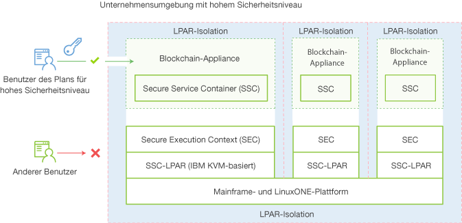

---

copyright:
  years: 2017
lastupdated: "2017-03-15"
---

{:new_window: target="_blank"}
{:shortdesc: .shortdesc}
{:codeblock: .codeblock}
{:screen: .screen}
{:pre: .pre}

# IBM Secure Service Container
{: #etn_ssc}

Der **HSBN vNext Beta**- und der HSBN-Plan werden als eine Appliance in IBM Secure Service Container bereitgestellt, von dem die Basisinfrastruktur für das Hosting der Blockchain-Services bereitgestellt wird. Von der Appliance werden Betriebssysteme, Docker-Container, Middleware und Softwarekomponenten, die autonom arbeiten, miteinander kombiniert; außerdem werden Basisservices und eine Infrastruktur mit optimierter Sicherheit bereitgestellt.
{:shortdesc}

Im folgenden Architekturdiagramm wird veranschaulicht, wie IBM Secure Service Container und die Blockchain-Appliances organisiert sind:

*Abbildung 1. Übersicht über IBM Secure Service Container und Blockchain-Appliances*

IBM Secure Service Container bietet eine innovative Verschlüsselung, Sicherheit und die Zuverlässigkeit einer LinuxONE on z Systems-Plattform für Blockchain-Services zum Verarbeiten vertraulicher Daten und von Daten mit gesetzlicher Aufbewahrungsfrist. Blockchain wird durch eine Reihe von Funktionen von IBM Secure Service Container geschützt: ein gekapseltes Betriebssystem, verschlüsselte Applianceplatten, Manipulationsschutz, geschützter Hauptspeicher und eine starke LPAR-Isolation, die so konfiguriert werden kann, dass sie der Zertifizierung EAL5+ entspricht.

## Wichtigste Sicherheitsfunktionen
Von IBM Secure Service Container werden die folgenden optimierten Sicherheitsfunktionen für Blockchain-Services bereitgestellt:  

### Schutz vor Systemadministratoren
>Auf den Appliance-Code können nicht einmal Plattform- oder Systemadministratoren zugreifen.  Der Datenzugriff wird von der Appliance kontrolliert, unbefugter Zugriff ist somit nicht möglich.  Dies wird auch durch eine Kombination aus Signierungen und Verschlüsselungen aller momentan aktiven bzw. übertragenen Daten und ruhenden Daten unterstützt. Auch der Zugriff auf den Hauptspeicher ist nicht möglich. Von der Firmware wird dies durch eine Architektur zum sicheren Booten (Secure Boot Architecture) unterstützt.

>Systemadministratoren unterliegen den folgenden Beschränkungen, wenn Blockchain durch IBM Secure Service Container gesichert ist:
>* Kein Zugriff auf Knoten
>* Kein Anzeigen des Blockchain-Netzes

### Schutz vor Manipulation  
>Von IBM Secure Service Container werden alle externen Schnittstellen inaktiviert, von denen Zugriff auf den LPAR-Hauptspeicher bereitgestellt wird. Ein Bootladeprogramm für Images ist signiert, um sicherzustellen, dass es nicht manipuliert oder gegen ein anderes ausgetauscht werden kann.

### Verschlüsselte Applianceplatten
>Der gesamte Code und alle Daten auf den Platten werden fortlaufend unter Verwendung der Linux-Verschlüsselungsebene verschlüsselt:  
- Gekapseltes Betriebssystem
- Geschützte IP
- Integrierte Überwachung und automatische Fehlerbehebung  
