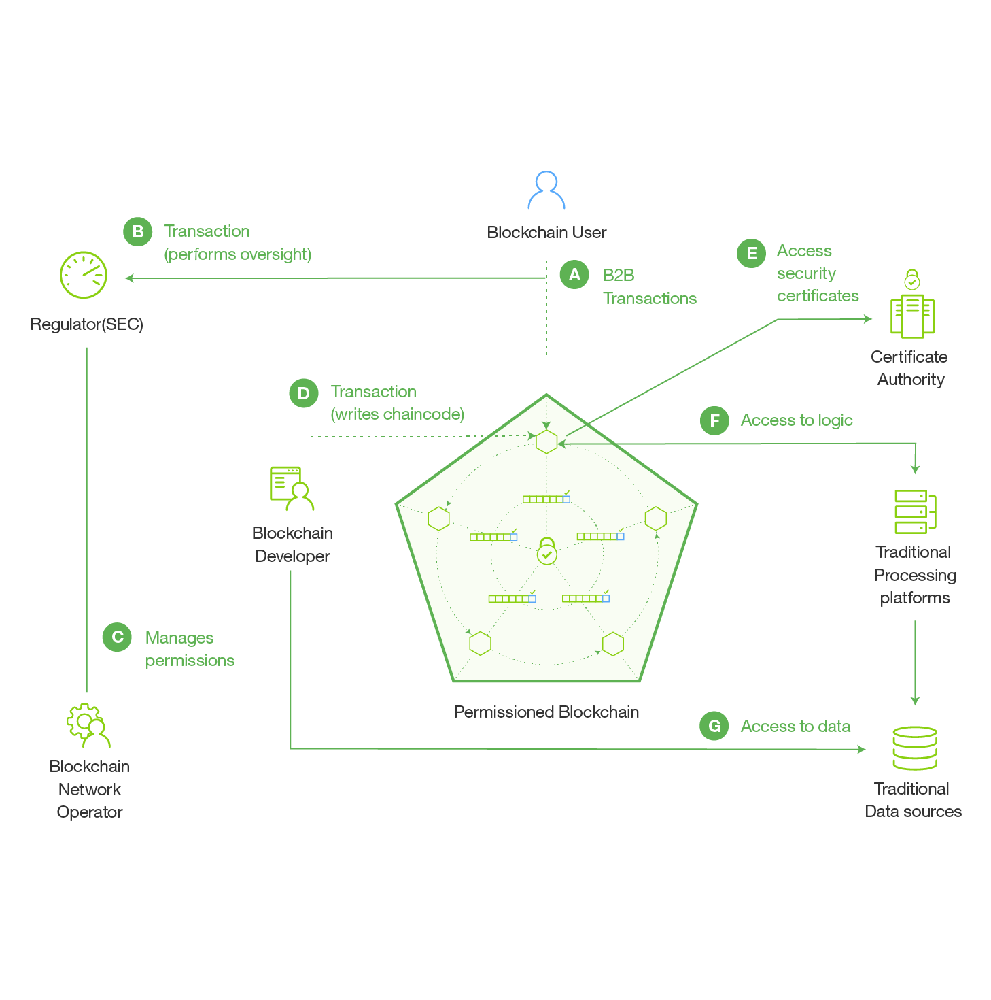

---

copyright:
  years: 2016

---

{:new_window: target="_blank"}
{:shortdesc: .shortdesc}
{:codeblock: .codeblock}
{:screen: .screen}
{:pre: .pre}

# Informationen zu Blockchain
{: #ibmblockchain_overview}
Letzte Aktualisierung: 03. November 2016
{: .last-updated}

## Was ist Blockchain?
{: #what}

Blockchain ist eine Technologie für eine neue Generation von Transaktionsanwendungen, mit der Vertrauen, Verantwortlichkeit und Transparenz hergestellt wird, während gleichzeitig die Geschäftsprozesse optimiert werden. Das Blockchain-Netz wurde zunächst von Bitcoin eingeführt, seine praktische Verwendung geht jedoch weit über das Umtauschen von Kryptowährungen hinaus. Mit Blockchain bildet IBM den grundlegenden Geschäftsverkehr neu ab und öffnet damit die Tür zu einer neuen Welt digitaler Interaktionen.

Mit Blockchain können die Kosten und die Komplexität unternehmensweiter Geschäftsprozesse erheblich reduziert werden. Das verteilte Hauptbuch erleichtert die Erstellung kosteneffizienter Unternehmensnetze, in denen so gut wie alles, was einen Wert besitzt, ohne zentralen Steuerungspunkt verfolgt und gehandelt werden kann. Blockchain ist für eine große Vielzahl an Geschäftsanwendungen eine vielversprechende Lösung. In Blockchain-Netzen kann der Wertpapierhandel zum Beispiel in Minuten anstatt in Tagen abgewickelt werden. Außerdem erleichtert Blockchain Unternehmen die Optimierung der Waren- und Zahlungsströme und ermöglicht den Herstellern die Reduzierung der Produktrückrufe durch eine offene gemeinsame Nutzung der Produktionsprotokolle mit OEMs und Regulierungsbehörden.  
 

## Schlüsselbegriffe
{: #keyterms}
Für ein umfassendes Verständnis der Blockchain-Konzepte sind die folgenden Begriffe von grundlegender Bedeutung:

**Transakteur**: Ein Netzteilnehmer, der über einen Knoten mit dem Blockchain-Netz verbunden ist, der mit einem SDK oder einer API Transaktionen von einem Client sendet.

**Transaktion**: Eine Anforderung von einem Transakteur zum Ausführen einer Funktion für das Blockchain-Netz. Zur Verfügung stehen Transaktionstypen zum Bereitstellen, Aufrufen und Abfragen, die über die Chaincode-Funktionen implementiert werden, die im API-Vertrag der Struktur festgelegt sind.

**Hauptbuch**: Eine Abfolge von in Bezug auf die Verschlüsselung verlinkten Blöcken, in denen Transaktionen und der aktuelle globale Status enthalten sind. Zusätzlich zu den Daten aus früheren Transaktionen enthält das Hauptbuch auch Daten zu aktuell aktiven Chaincode-Anwendungen.

**Globaler Status**: Datenbank mit Schlüsselwerten, die von Chaincodes bei der Ausführung durch eine Transaktion zum Speichern ihres Status verwendet wird.

**Chaincode**: Eingebettete Logik, von der die Regeln für bestimmte Typen von Netztransaktionen codiert wird. Entwickler schreiben Chaincode-Anwendungen und stellen Sie im Netz bereit. Endbenutzer rufen den Chaincode anschließend über eine clientseitige Anwendung auf, die die Schnittstelle für einen Peer oder Knoten ist. Netztransaktionen werden von Chaincode ausgeführt, die bei ihrer Validierung an das gemeinsam genutzte Hauptbuch angehängt werden und den globalen Status ändern.

**Validierender Peer**: Ein Netzknoten, von dem das Konsensprotokoll für das Netz zum Überprüfen der Transaktionen und Verwalten des Hauptbuchs ausgeführt wird. Überprüfte Transaktionen werden an das Hauptbuch in Blöcken angehängt. Wenn der Konsens für eine Transaktion fehlschlägt, wird sie aus dem Block gelöscht und somit nicht in das Hauptbuch geschrieben. Ein validierender Peer (VP) verfügt über die Berechtigung zum Bereitstellen, Aufrufen und Abfragen eines Chaincodes.

**Nicht validierender Peer**: Ein Netzknoten, der als Proxy fungiert und Transakteure mit validierenden Peers verbindet. Ein nicht validierender Peer (NVP) leitet Aufrufanforderungen an seinen verbundenen validierenden Peer (VP) weiter. Außerdem hostet er den Ereignisstromserver und den REST-Service.

**Konsens**: Ein Protokoll, von dem die Reihenfolge der Transaktionen im Blockchain-Netz (Bereitstellen und Aufrufen) verwaltet wird. Validierende Knoten werden durch Implementieren des Konsensprotokolls gemeinsam zum Genehmigen von Transaktionen verwendet. Durch den Konsensabgleich wird sichergestellt, dass der Transaktionsreihenfolge für das gemeinsame Hauptkonto von einem Quorum an Knoten zugestimmt wird. Da alle Abweichungen in Bezug auf diese Reihenfolge beseitigt werden, wird durch den Konsensabgleich sichergestellt, dass alle Knoten für ein identisches Blockchain-Hauptbuch verwendet werden. Weitere Informationen und Testfälle finden Sie im Abschnitt [Konsens](etn_pbft.html).  

**Genehmigtes Netz**: Ein Blockchain-Netz, in dem für jeden Knoten eine Mitgliedsidentität im Netz definiert sein muss und in dem von jedem Knoten nur auf Transaktionen zugegriffen werden kann, für die er berechtigt ist.  

## Schlüsselkonzepte
{: #keyconcepts}

**Übersicht**: Blockchain ist ein spezielles Netz, in dem Mitglieder digitalisierte Assets verfolgen und austauschen. Ein gemeinsam genutztes Hauptbuch enthält den einzelnen Datensatz für alle Transaktionen im Netz und wird auf allen Mitgliedern im Netz repliziert. Chaincode-Anwendungen enthalten unmittelbar anwendbare Verträge und clientseitige Anwendungen, die als Schnittstelle mit dem Netz über ein SDK oder eine API dienen.

Zwei oder mehr Transaktionspartner, die Mitglieder im Blockchain-Netz sind, stimmen implizit den Bedingungen des Smart Contract zu, durch den die Transaktion geregelt wird (zum Beispiel dass bei Erhalt von Asset "a" das Asset "b" fällig ist). Sobald Funktionen in Blockchain bereitgestellt werden, können Sie in einem Vertrag aufgerufen werden (zum Beispiel kann eine Transaktion ausgelöst werden). Anschließend werden Aufrufe von einem führenden Knoten sortiert und an validierende Peers rundgesendet, um den Konsens zu überprüfen. Nach der Validierung werden die Transaktionen ausgeführt und in Blöcken im Hauptbuch aufgezeichnet. Danach wird das Hauptbuch an alle Netzknoten über eine Replikation verteilt. Sobald die Transaktionen an das Hauptbuch angehängt sind, können Sie nicht mehr geändert oder gelöscht werden; die einzige Möglichkeit, die Auswirkungen einer genehmigten Transaktion rückgängig zu machen oder zu ändern, ist das Abschicken einer nachfolgenden Transaktion.

**Netz**: Ein Blockchain-Netz weist folgende Merkmale auf:

- Ein verteiltes, dezentrales Peer-to-Peer-Netz mit Knoten, die Netzteilnehmer wie Banken, Regierungsbehörden, Hersteller und Wertpapierhändler darstellen.
- Eine Gruppe aus Peers, von denen Transaktionen über ein Konsensprotokoll validiert werden, bevor sie in einem gemeinsam genutzten Hauptbuch festgeschrieben werden.

**Gemeinsam genutztes Hauptbuch**: Das gemeinsam genutzte Hauptbuch sorgt als "Single Source of Truth" für Datengleichheit und dient als komplettes Verlaufsprotokoll der validierten Transaktionen in einem Blockchain-Netz. Eventuelle Abweichungen im gemeinsam genutzten Hauptbuch werden auf den Knoten durch den Konsensabgleich aufgelöst. Das Hauptbuch weist folgende Attribute auf:
- Es zeichnet alle validierten Transaktionen im Netz auf.
- Es wird von allen Teilnehmern im Netz gemeinsam genutzt.
- Es wird repliziert, sodass jeder Teilnehmer über eine eigene Kopie verfügt.
- Es wird genehmigt, sodass die Teilnehmer nur ihre eigenen Transaktionen anzeigen können.

**Beispiel**: In Abbildung 1 wird ein Beispiel für ein Blockchain-Netz mit Aktien und das gemeinsam genutzte Hauptbuch erläutert:

*Abbildung 1. Beispiel eines gemeinsam genutzten Hauptbuchs*

In Abbildung 1 werden typische Netzteilnehmer im Aktienmarkt dargestellt: Ein Anlagenverwalter (eine Bank), das Front Office, die Unternehmensaktivitäten, eine zentrale Wertpapierverwahrstelle (CSD) und ein Clearing-Partner (Clearing/CCP):
1. Mithilfe einer Clientanwendung ruft der Verwalter Chaincode auf, um Wertpapierblöcke zu kaufen und zu verkaufen.  
2. Transaktionen können von jedem beliebigen Netzknoten ausgelöst werden, werden aber immer an den primären (führenden) validierenden Knoten weitergeleitet, von dem die Transaktionen sortiert werden. Vom primären Knoten werden die sortierten Transaktionen an alle validierenden Peers gesendet, um zur vorgeschlagenen Reihenfolge einen Konsens zu erreichen bzw. die Zustimmung zu erhalten.
3. Wenn alle der Reihenfolge der Transaktionen zugestimmt haben, werden die Transaktionen ausgeführt und für jeden validierenden Knoten an das Hauptbuch angehängt. Danach wird das Hauptbuch auf allen Netzknoten repliziert.  

 
## Netz- und Anwendungsarchitektur
{: #architecture}

In Abbildung 2 wird ein Beispiel für ein genehmigtes Blockchain-Netz, mit verteilter, dezentraler Peer-to-Peer-Architektur und einer Zertifizierungsstelle dargestellt, von der Benutzerrollen und Berechtigungen verwaltet werden:

*Abbildung 2. Ein genehmigtes Blockchain-Netz: Datenfluss und Netzzugriff werden über Mitgliedsrollen geregelt*

Die folgenden Beschreibungen betreffen die Architektur und den Ablauf in Abbildung 2 und stellen keine sequenzielle Verarbeitung dar:

**A:** Ein Blockchain-Benutzer sendet eine Transaktion an das genehmigte Blockchain-Netz (mit Berechtigungen). Die Transaktion kann eine Bereitstellung, ein Aufruf oder eine Abfrage sein; sie wird von einer clientseitigen Anwendung unter Nutzung eines SDKs oder direkt über eine REST-API abgesetzt.  

**B:** Von vertrauenswürdigen Unternehmensnetzen wird der Zugriff auf Regulierungsbehörden und Prüfinstanzen, wie der SEC im amerikanischen Aktienmarkt, bereitgestellt.  

**C:** Ein Blockchain-Netzbetreiber verwaltet die Mitgliedsberechtigungen, zum Beispiel das Registrieren der Regulierungsbehörde (B) als "Prüfinstanz" und des Blockchain-Benutzers (A) als "Kunde". Die Transaktionen einer Prüfinstanz können auf das Abfragen beschränkt werden, ein Kunde kann dagegen zum Bereitstellen, Aufrufen und Abfragen bestimmter Chaincode-Typen berechtigt werden.

**D:** Ein Blockchain-Entwickler schreibt Chaincode (Smart Contracts) und clientseitige Anwendungen zum Aufrufen der Smart Contracts. Der Blockchain-Entwickler kann den Chaincode über die REST-Schnittstelle direkt im Netz bereitstellen. Wenn er Berechtigungsnachweise von einer herkömmlichen Datenquelle in den Chaincode einschließen möchte, kann der Entwickler eine Out-of-band-Verbindung für den Zugriff auf die Daten verwenden (G).

**E:** Ein Blockchain-Benutzer stellt über einen Peerknoten (A) eine Verbindung zum Netz her. Bevor er mit Transaktionen fortfahren kann, werden vom Knoten die Registrierung- und Transaktionszertifikate des Benutzers aus der Zertifizierungsstelle abgerufen. Benutzer müssen über diese digitalen Zertifikate verfügen, damit sie in einem genehmigten Netz Transaktionen ausführen können.

**F:** Ein Benutzer, der versucht, Chaincode auszuführen, kann aufgefordert werden, seine Berechtigungsnachweise für eine konventionelle Datenquelle (G) anzugeben. Zum Bestätigen der Benutzerberechtigung kann vom Chaincode über eine herkömmliche Verarbeitungsplattform eine Out-of-band-Verbindung zu diesen Daten verwendet werden.

In Abbildung 3 werden die IBM Blockchain-Kernkomponenten dargestellt. Mitgliedsservices, Blockchain-Services und Chaincode-Services sind logische Strukturen, keine physischen Partitionierungen von Komponenten in getrennte Prozesse, Adressräume oder virtuelle Maschinen:  *Abbildung 3. Hyperledger Fabric-Referenzarchitektur*

**Mitgliedschaftsservices**: Von Mitgliedschaftsservices werden die Benutzeridentitäten über eine Zertifizierungsstelle für Peers in einem genehmigten Blockchain-Netz verwaltet. Von Mitgliedschaftsservices wird eine Unterscheidung der Rollen durch Kombinieren von PKI-Elementen (PKI - Public Key Infrastructure) und der Dezentralisierung (Konsens) bereitgestellt. Im Gegensatz dazu werden in Netzen ohne Berechtigungen keine mitgliedssepzifischen Berechtigungen bzw. keine Unterscheidung der Rollen bereitgestellt.

In einem genehmigten Blockchain-Netz (mit Berechtigungen) sind Entitäten zum Registrieren der Berechtigungsnachweise für langfristige Identitäten (Eintragungszertifikate) erforderlich, die nach Entitätstyp unterschieden werden können. Ein Eintragungszertifikat berechtigt den Aussteller von Transaktionszertifikaten (Transaction Certificate Authority, TCA) zum Ausgeben von Pseudonymberechtigungsnachweisen für Benutzer; anhand dieser Zertifikate werden Transaktionen autorisiert, die vom Benutzer gesendet werden. Transaktionszertifikate verbleiben in Blockchain und ermöglichen den berechtigten Benutzern das Zuordnen von Transaktionen, die sich sonst nicht zuordnen lassen würden.

**Blockchain-Services**: Von Blockchain-Services wird das gemeinsam genutzte Hauptbuch über ein Peer-to-Peer-Protokoll verwaltet, das auf HTTP/2 basiert. Die Datenstrukturen sind hoch optimiert und stellen den effizientesten Hashalgorithmus zur Verwaltung der Replikation für das gemeinsam genutzte Hauptbuch bereit. PBFT wird als Konsensprotokoll implementiert.    

**Chaincode-Services**: Von den Chaincode-Services wird eine sichere und schlanke Methode für die Sandbox-Chaincode-Ausführung auf den validierenden Knoten bereitgestellt. Die Umgebung ist ein "gesperrter" und sicherer Container und verfügt über eine Reihe signierter Basisimages, in denen ein sicheres Betriebssystem und die Chaincode-Sprache sowie Laufzeit- und SDL-Ebenen für Go, Java und Node.js enthalten sind. Weitere Sprachen können bei Bedarf aktiviert werden.

Weitere Informationen zur Implementierung von IBM Blockchain finden Sie unter [Protocol Specification](https://github.com/hyperledger/fabric/blob/v0.6/docs/protocol-spec.md#fabric) für Hyperledger Fabric 0.5.
