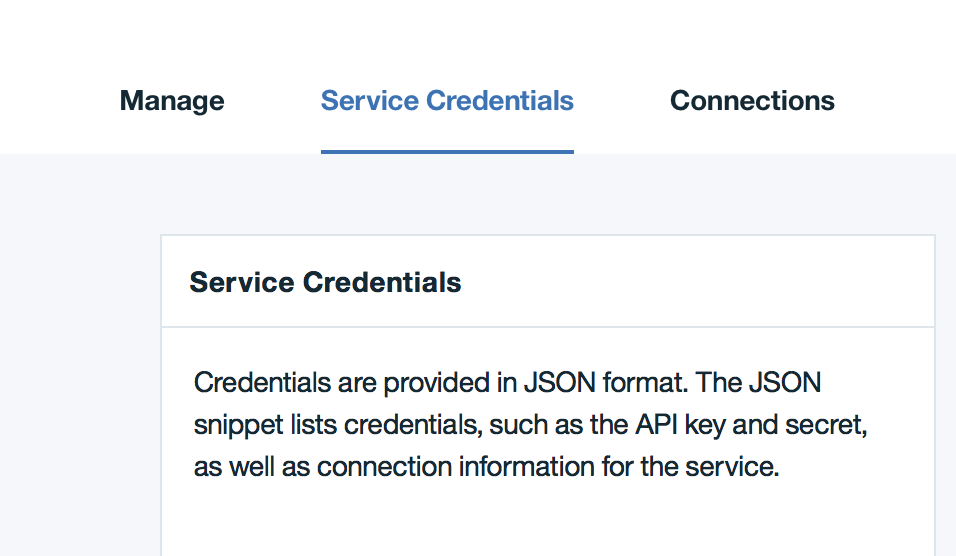

---

copyright:
  years: 2017
lastupdated: "2017-03-07"
---

{:new_window: target="_blank"}
{:shortdesc: .shortdesc}
{:codeblock: .codeblock}
{:screen: .screen}
{:pre: .pre}

# HSBN - Bekannte Probleme
{: #etn_overview}

Die folgenden Probleme mit HSBN-Plänen sind dokumentiert:

1. Bei Verwendung von High Security Business Network, das mit Hyperledger Fabric v0.6.1 arbeitet, ist es empfehlenswert, das Netz während einer Entwicklungsphase regelmäßig zurückzusetzen, wenn es zu mehr als schätzungsweise fünfzig Chaincode-Bereitstellungen kam.  Durch das Zurücksetzen des Netzes werden bereitgestellter Chaincode sowie die erfassten Daten entfernt.  Das ist eine Gelegenheit, um älteren Chaincode zu entfernen, der durch Verbesserungen während einer iterativen Entwicklungsphase abgelöst wurde.  Während einer Entwicklungsnachphase muss die Anzahl der Chaincode-Bereitstellungen dann überwacht werden, damit Kapazität für den wichtigsten Chaincode übrig bleibt.
2. Vereinzelte Fehler des Typs "503 Service Unavailable" und "502 Bad Gateway" beim Durchführen einer Statusabfrage des Netzes und der Peers empfangen.
3. Mögliche Fehler des Typs "Server.Serve failed to complete security handshake" in den vp1-Protokollen. Dies ist kein schwerwiegender Fehler; er bezieht sich nicht auf die Netzoperation.
4. Die **Serviceberechtigungsnachweise** werden möglicherweise nicht von selbst ausgefüllt; generieren Sie die Berechtigungsnachweise in diesem Fall wie folgt:

 a) Klicken Sie im Service-Dashboard auf die Registerkarte **Serviceberechtigungsnachweise**:

  

 b) Klicken Sie auf der Registerkarte **Serviceberechtigungsnachweise** auf die Schaltfläche **Neuer Berechtigungsnachweis**:

  

c) Es wird ein neues Fenster mit dem Titel **Neuen Berechtigungsnachweis hinzufügen** angezeigt; klicken Sie im unteren Bereich dieses Fensters auf die Schaltfläche **Hinzufügen**:

  

 d) Nun sollte Ihre Anzeige dem folgenden Beispiel ähneln. Wenn Sie auf **Berechtigungsnachweise anzeigen** klicken, werden JSON-Nutzdaten mit den Serviceberechtigungsnachweisen für Ihre HSBN-Instanz sichtbar.  

  

## Hilfe anfordern

Wenn Sie Unterstützung und Hilfe für Ihr IBM Blockchain on Bluemix-Netz benötigen, lesen Sie die Informationen im Abschnitt [Support und bekannte Probleme](ibmblockchain_support.html).
