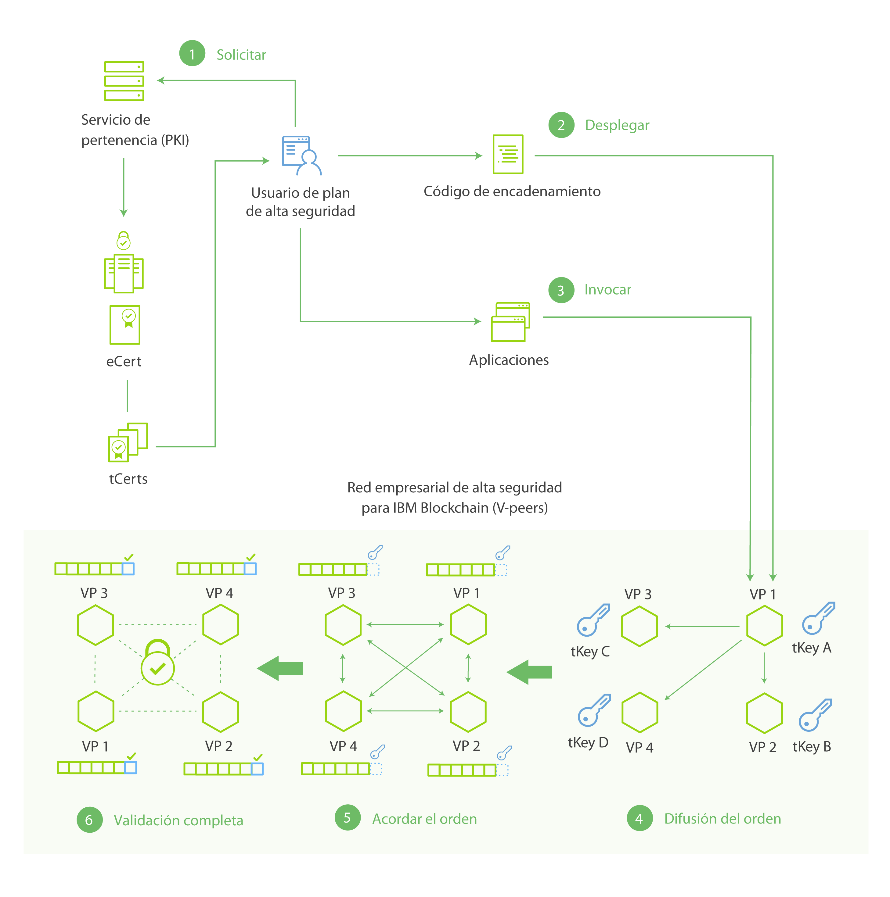

---

copyright:
years: 2016

---

{:new_window: target="_blank"}
{:shortdesc: .shortdesc}
{:codeblock: .codeblock}
{:screen: .screen}
{:pre: .pre}

# Entorno de red
{: #etn_overview}
Última actualización: 03 de noviembre de 2016
{: .last-updated}

El plan de IBM Blockchain en el Desarrollador inicial de Bluemix y el plan de Red empresarial de alta seguridad aprovechan las últimas iteraciones de Hyperledger Fabric v0.6, el protocolo de consenso PBFT (Practical Byzantine Fault Tolerance) y el SDK for Node.js de Hyperledger Fabric Client (HFC). Los dos planes constan de cuatro nodos de red y de una entidad emisora de certificados. La entidad emisora de certificados controla los "Servicios de pertenencia", que gestiona identidades, permisos de red y transacciones confidenciales mediante la emisión de certificados digitales.
{:shortdesc}

Las siguientes prestaciones de blockchain están disponibles en los dos planes:

* El protocolo de consenso PBFT gestiona la solicitud de todas las transacciones escritas al libro mayor compartido. Una red de blockchain de PBFT de cuatro nodos puede alcanzar un consenso a pesar de un nodo bizantino (defectuoso). Para obtener detalles sobre las pruebas de consenso PBFT, consulte [Realización de pruebas de consenso y disponibilidad](etn_pbft.html).
* El SDK de HFC para Node.js permite que las aplicaciones Node.js de lado de cliente interactúen con la red de blockchain. Las apps del lado del cliente pueden inscribir de forma segura usuarios a través de Servicios de pertenencia, emitir transacciones e intercambiar criptográficamente activos mediante el uso de tCerts. Para más información sobre Servicios de pertenencia y la privacidad de usuario, consulte la sección [SDK para Node.js de HFC](etn_sdk.html) y la [Especificación de protocolo](https://github.com/hyperledger/fabric/blob/v0.6/docs/protocol-spec.md) de Hyperledger Fabric.
* Puede acceder a detalles sobre el entorno de red de blockchain a través del [Panel de control del supervisor de Bluemix](ibmblockchainmonitor.html).  

 
## Terminología

La siguiente terminología, junto con el subsiguiente diagrama, contextualiza los componentes de una red de IBM Blockchain:

* Miembro: una identidad para participar en la red de blockchain. Hay distintas clases de miembros, incluidos usuarios, iguales, validadores y auditores.
* Servicios de pertenencia: servicios relacionados con la obtención y gestión de identidades de miembros. Los servicios de pertenencia están controlados por entidades emisoras de certificados.  
* Registro: el acto de añadir una nueva identidad de miembro a la red. Un miembro puede añadirlo dinámicamente a la red un usuario con privilegio 'registrar'. A los miembros también se les asignan roles y atributos, que controlan su acceso y autoridad en la red. Ni roles ni atributos se pueden asignan dinámicamente; en su lugar se debe editar el archivo membersrvc.yaml.
* Inscripción: completa el proceso de registro permitiendo al nuevo miembro acceder a la red de blockchain. La inscripción puede realizarla el nuevo miembro después de obtener un secreto de un registrador (fuera de banda) o mediante un intermediario con autoridad delegada para actuar en nombre del nuevo miembro.  

 
## Arquitectura de red

En la figura 1, y en su descripción subsiguiente, se ilustra la arquitectura de red de IBM Blockchain y los flujos de datos para servicios de miembros, transacciones, consenso y adición al libro mayor:

Figura 1.

Los siguientes pasos describen el flujo de red a partir de la Figura 1 en detalle:

1. Un usuario registrado se inscribe en la red a través de PKI (Servicios de pertenencia) y recibe un certificado de inscripción a largo plazo (eCert) y un lote de certificados de transacción (tCerts).
2. El usuario despliega encadenamiento de código en la red. El código de encadenamiento (contrato digital) codifica la lógica empresarial, o reglas, que controlan un tipo específico de transacción. Cada transacción (desplegar, invocar o consultar) requiere un tCert exclusivo y debe estar firmado con la clave privada del usuario. El usuario obtiene su clave privada de los tCerts asignados.
3. El usuario invoca el contrato digital, que desencadena el contrato para que autoejecute su lógica codificada.
4. Se somete una transacción a un igual de red. Una vez que el igual recibe la solicitud de transacción, somete la solicitud al igual primario de la red (VP1 en la Figura 1). El igual primario ordenará un bloque de transacciones y difundirá este orden a sus iguales asociados.
5. Los iguales utilizan el protocolo de consenso de red (PBFT) para acordar el orden de las transacciones sometidas. Este proceso de ordenar de forma colectiva transacciones se denomina consenso.  
6. Una vez que los iguales han alcanzado el consenso, las solicitudes de transacciones se ejecutan y el bloque se añade al libro mayor compartido.  

<!---Both the developer and high-security networks unlock several features in the Hyperledger fabric which robustly enhance security, confidentiality and privacy.  The only fundamental difference between the two is their operating/hosting environment.  The developer network runs in a shared multi-tenant environment on Softlayer, whereas the high-security network exists as an isolated single-tenant running in a secure services container.  Each network leverages the same capabilities from the fabric, including a PBFT consensus protocol and the enhanced Node.js SDK.~~

~~The High-Security business network runs in an isolated and highly secured environment, distinguishing it from other cloud-hosted offerings. The operating system, fabric, and nodes all exist in a secure services container (SSC), providing your enterprise with the security and impregnability that customers have come to expect from system Z technology.  The SSC delivers performance optimization in - peer to peer communication, availability, scalability, hardware encryption, tamper-proof crypto keys, and securely encrypted VMs.  See the [Secure Services Container](etn_ssc.html) section for more details on the security features provided through the SSC.  Additionally, the high security network unlocks numerous features of the Hyperledger fabric (unavailable in the developer service), which robustly enhance security, confidentiality and privacy.  The configuration is such that you are able to test and affirm these features.~~  
{:shortdesc}

~~The high security plan augments the developer plan by delivering several enhancements that help meet the security requirements and concerns of an enterprise-level participant:~~--->

<!---The environment (LinuxONE on z) consists of a four-peer network implementing PBFT with Membership Services enabled, running in an application container.  The application container protects blockchain software, chaincode, and data running within the system. The blockchain software within the secure boot can be signed, attested, and encrypted; and once installed in the application container, is tamper-resistant.  Root users of the platform and system administrators cannot access or see z secure container contents.  In addition, the LinuxOne on z provides you with FIPS compliance, high Evaluation Assurance Level protection, a highly auditable operating environment, and crypto optimization--->
