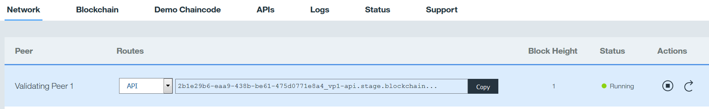

---

copyright:
years: 2016

---

{:new_window: target="_blank"}
{:shortdesc: .shortdesc}
{:codeblock: .codeblock}
{:screen: .screen}
{:pre: .pre}

# Realización de pruebas de consenso y disponibilidad
{: #etn_pbft}

Última actualización: 13 de octubre de 2016
{: .last-updated}

El plan de desarrollador inicial y el plan Red empresarial de alta seguridad le permiten probar el protocolo de consenso PBFT (Practical Byzantine Fault Tolerance) en una red de blockchain de cuatro nodos. Los siguientes temas proporcionan detalles sobre el consenso en general, y PBFT en particular. Una vez esté preparado para iniciar la prueba, se proporcionan casos de prueba de PBFT.  
{:shortdesc}  

## ¿Qué es consenso?

Consenso es un método para validar el orden de solicitudes, o transacciones, (desplegar e invocar), en una red de blockchain. El orden de transacciones correcto es muy importante, porque muchas transacciones tienen una dependencia de una o más transacciones anteriores (por ejemplo, los cargos en cuenta a menudo tienen una dependencia de créditos anteriores).

En una red de blockchain, no hay ninguna autoridad centralizada que determine el orden de transacciones; en su lugar, muchos nodos (o iguales) de validación implementan el protocolo de consenso de red. El consenso garantiza que un quórum de nodos acuerden el orden en el que las transacciones se añaden al libro mayor compartido. Al resolver las discrepancias en el orden de transacciones propuesto, el consenso garantiza que todos los nodos de red de blockchain estén operando en un libro mayor idéntico. En otras palabras, el consenso garantiza* la integridad y la coherencia de todas las transacciones de red de blockchain.

* Esta garantía depende de variables como el protocolo de consenso concreto implementado y el número de nodos en la red de blockchain. Los dos planes de Blockchain en Bluemix implementan el protocolo de consenso PBFT.  

 
## ¿Qué es PBFT?

Practical Byzantine Fault Tolerance (PBFT) es un tipo de protocolo de consenso. La función de un protocolo de consenso es mantener el orden de transacciones en una red de blockchain, a pesar de las amenazas a este orden. Una de esas amenazas es la anomalía simultánea arbitraria (un tipo de error bizantino) de varios nodos de red. Si se utiliza PBFT, una red de blockchain de (N) nodos puede soportar (f) número de nodos bizantinos, donde f = (N-1)/3. En otras palabras, PBFT garantiza que un mínimo de 2\*f + 1 nodos alcancen el consenso en el orden de transacciones antes de añadirlos a un libro mayor compartido. Al derivar alguna fórmula revela la regla que una red PBFT garantiza la consistencia de datos y la integridad a pesar de errores bizantinos en menos de un tercio de todos los nodos de red.  

 
## PBFT y la red de blockchain

La regla PBFT 2\*f + 1 tiene las siguientes implicaciones para el plan de Desarrollador inicial y el plan de Red empresarial de alta seguridad:

1. La red no puede más de un nodo bizantino. Cada red contiene N=4 nodos, de modo que al aplicar la fórmula del número máximo de nodos bizantinos tolerados da como resultado: f=(4-1)/3=1. Si existen dos o más nodos bizantinos (f>1), una red PBFT de 4 nodos no puede garantizar la coherencia o la integridad del libro mayor en todos los nodos. (En comparación, la tolerancia de dos nodos bizantinos necesitaría f=(7-1)/3=2, o una red de blockchain de PBFT con un mínimo de 7 nodos.)
2. Si hay menos de 2\*f + 1 nodos en línea, la red deja de añadir al libro mayor, porque PBFT no puede garantizar la coherencia o la integridad de los datos en todos los nodos. La red reanudará la adición al libro mayor cuando como mínimo haya 2\*f + 1 nodos en línea (en este caso, tres o cuatro nodos).
3. Como sólo un mínimo de 2\*f + 1 nodos deben alcanzar el consenso antes de continuar con el siguiente bloque de transacciones, el libro mayor de todos los nodos adicionales (más allá de 2\*f + 1) se quedará atrás temporalmente. Este retardo en sincronizar el libro mayor compartido en todos los nodos es una limitación inevitable en cualquier red PFBT.
 

## Casos de prueba de consenso
Los siguientes casos de prueba de consenso han sido evaluados por IBM como que satisfacen los estándares de disponibilidad de red para PBFT:

1. [Realizar pruebas en PBFT sin nodos bizantinos](pbft_test1.html). El proceso de consenso ejecuta transacciones y las añade al libro mayor.
2. [Simular un nodo bizantino](pbft_test2.html) deteniendo un nodo y seguir enviando transacciones de despliegue, invocación y consulta. El proceso de consenso PBFT ejecuta transacciones y las añade al libro mayor. Esta prueba se ha repetido para cada nodo en un entorno de cuatro nodos.
3. [Simular dos nodos bizantinos](pbft_test3.html) deteniendo dos nodos y seguir enviando transacciones de despliegue, invocación y consulta. Debido a que no se ha podido alcanzar el consenso PBFT, las transacciones no se ejecutan ni añaden al libro mayor.
4. [El reinicio de un nodo que se ha detenido](pbft_test4.html) en el caso de prueba anterior (Prueba 3). El proceso de consenso PBFT reanuda la ejecución de transacciones y la adición al libro mayor. El nodo que se ha reiniciado sincroniza su libro mayor con el libro mayor compartido.  

Atención: Revise las siguientes notas antes de iniciar la prueba de consenso:

- Todas las pruebas de consenso utilizan la API REST para interactuar con los iguales de red.
- HTTP/2 es el protocolo de comunicaciones; los casos de prueba utilizan los URL de iguales. Por ejemplo: 'VP0–api.dev.blockchain.ibm.com:80'. Los valores simbólicos ***VP0, VP1, VP2 y VP3*** se utilizan como marcadores para los URL de iguales literales.
-  Para iniciar la sesión en un igual, utilice las credenciales que se proporcionan al desplegar el servicio de Bluemix. Para los casos de prueba, **test\_user1** y **test\_user1\_enrollSecret** se utilizan como valores para *enrollID* y *enrollSecret*, respectivamente.
-  Simular bloqueos de nodos deteniendo y reiniciando manualmente iguales con los botones **Acciones** en la consola de red. La Figura 1 a continuación muestra las **Acciones** en el separador **Red**:

*Figura 1. Detener e iniciar iguales*

- Los casos de prueba utilizan **chaincode_example02**, de forma predeterminada, desde: https://github.com/hyperledger/fabric/tree/v0.6/examples/chaincode/go/chaincode_example02. No obstante, puede utilizar su propio código de encadenamiento, o cualquiera de los ejemplos de código de encadenamiento en: https://github.com/hyperledger/fabric/tree/v0.6/examples/chaincode/go.
- Las solicitudes se procesan por lotes en una transacción para su proceso. Sin embargo, puede asegurar un proceso inmediato confiando en el valor de tiempo de espera de lotes; si espera como mínimo dos segundos antes de someter la siguiente solicitud se procesará la transacción inmediatamente.
