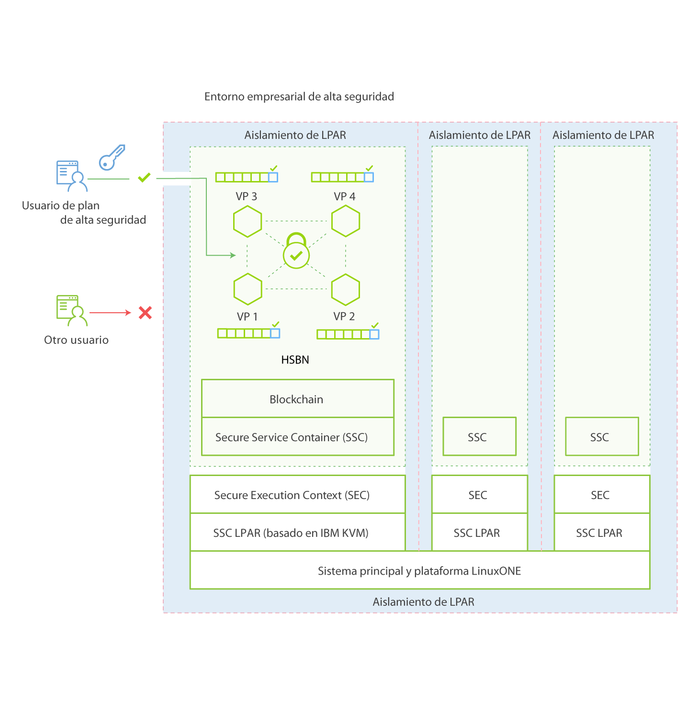

---

copyright:
years: 2016

---

{:new_window: target="_blank"}
{:shortdesc: .shortdesc}
{:codeblock: .codeblock}
{:screen: .screen}
{:pre: .pre}


# IBM Secure Service Container
{: #etn_ssc}

Última actualización: 13 de octubre de 2016
{: .last-updated}

La Red empresarial de alta seguridad de IBM Blockchain se despliega como un dispositivo en IBM Secure Service Container, lo que proporciona la infraestructura base para alojar servicios de blockchain. El dispositivo combina sistemas operativos, contenedores Docker, middleware y componentes de software que funcionan de forma autónoma y proporciona servicios principales e infraestructura con seguridad optimizada.
{:shortdesc}

IBM Secure Service Container incluye la criptografía, seguridad y fiabilidad avanzada de la plataforma z Systems LinuxONE para los servicios de blockchain para manejar datos confidenciales y regulados. Blockchain está protegido a través de una serie de características desde IBM Secure Service Container: sistema operativo encapsulado, discos de dispositivos cifrados, protección contra manipulación, memoria protegida y un aislamiento de LPAR sólido que puede configurarse para coincidir con la certificación EAL5+.

El siguiente diagrama de arquitectura muestra cómo se organizan IBM Secure Service Container y los dispositivos de blockchain:


*Figura 1. Visión general de IBM Secure Service Container y dispositivos de blockchain*
<br><br>
## Características de seguridad clave
IBM Secure Service Container proporciona las siguientes funciones de seguridad optimizadas para servicios de blockchain:  

### Protección de administradores del sistema
>No se puede acceder al código de dispositivo incluso por los administradores de plataforma o sistemas.  El acceso a datos está controlado por el dispositivo, por lo que el acceso no autorizado está inhabilitado.  Esto se soporta a través de una combinación de firma y cifrado de todos los datos en curso y en reposo. También se eliminará todo el acceso a la memoria. El firmware le da soporte con una arquitectura de arranque seguro.

>Los administradores del sistema tienen las siguientes limitaciones cuando blockchain está protegido por IBM Secure Service Container:
>* No puede acceder a los nodos
>* No puede ver la red de blockchain

### Protección contra manipulación  
>IBM Secure Service Container inhabilita todas las interfaces externas que proporcionan acceso a la memoria LPAR. Se registra un cargador de arranque de imagen para asegurarse de que no pueda manipularse ni cambiarse por uno distinto.

### Discos de dispositivo cifrados
>Todo el código y los datos almacenados en el disco se cifran en todo momento utilizando la capa de cifrado de Linux:  
- Sistema operativo encapsulado
- IP protegida
- Supervisión y autorreparación incluidas  
<br>

## Gestión de dispositivos mediante las API REST
Los dispositivos de software están preconfigurados para que el usuario los utilice en la plataforma fiable, segura y escalable z Systems. Puede gestionar estos dispositivos a través de las API REST sin realizar ninguna configuración.

Para gestionar activos de blockchain mediante las API REST, puede utilizar la interfaz de usuario de Swagger en el panel de control de Blockchain en las herramientas de mandatos REST o Bluemix, tales como `curl` o `Postman`.

Por ejemplo, para obtener información sobre los iguales de la red, emita el siguiente mandato utilizando `curl`:
```
curl -u <nombreusuario>:<contraseña> https://<ip_igual>:<puerto>/network/peers
```
Vea el siguiente mandato curl de ejemplo y los resultados devueltos:
* Mandato:
```
curl -u dashboarduser_type0_2ef27***:89317***https://ad3130e8-4a1a-4ce6-a084-689a345a3308_vp1-api.blockchain.ibm.com:443/network/peers
```
* Información devuelta de todos los iguales de la red:
```
{
	"peers": [{
		"ID": {
			"name": "ad3130e8-4a1a-4ce6-a084-689a345a3308_vp2"
		},
		"address": "ad3130e8-4a1a-4ce6-a084-689a345a3308_vp2-discovery.blockchain.ibm.com:30303",
		"type": 1,
		"pkiID": "rC0uvv0cbSbiT8RUGKPQM3q/o09oyWlcBmRxogi2Cls="
	},
	{
		"ID": {
			"name": "ad3130e8-4a1a-4ce6-a084-689a345a3308_vp1"
		},
		"address": "ad3130e8-4a1a-4ce6-a084-689a345a3308_vp1-discovery.blockchain.ibm.com:30303",
		"type": 1,
		"pkiID": "oeoI+Xa/lW8Xvrvv71A+Nvzit+JDa+oIkthpZHwfaTE="
	}]
}
```
Para obtener más información sobre cómo interactuar con blockchain mediante las API REST, consulte [Supervisor del panel de control](https://new-console.ng.bluemix.net/docs/services/blockchain/ibmblockchainmonitor.html) y [Ejemplos y guías de aprendizaje](https://new-console.ng.bluemix.net/docs/services/blockchain/ibmblockchain_tutorials.html).
