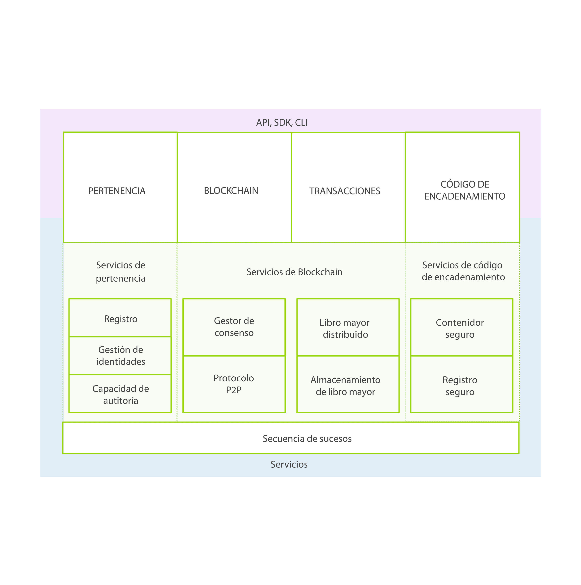

---

copyright:
  years: 2016

---

{:new_window: target="_blank"}
{:shortdesc: .shortdesc}
{:codeblock: .codeblock}
{:screen: .screen}
{:pre: .pre}

# Acerca de blockchain
{: #ibmblockchain_overview}
Última actualización: 23 de septiembre de 2016
{: .last-updated}

## ¿Qués es blockchain?
{: #what}

Blockchain es una tecnología para aplicaciones transaccionales de última generación que establece una relación de confianza, responsabilidad y transparencia a la vez que simplifica los procesos empresariales. La red de blockchain fue introducida por primera vez por bitcoin, pero sus usos prácticos van más allá de los intercambios de criptomonedas. Con blockchain, IBM está reinventando los intercambios empresariales más fundamentales y abre la puerta a un nuevo mundo de interacciones digitales.

Está proyectado que Blockchain reduzca considerablemente el coste y la complejidad de los procesos de negocio entre empresas. Su libro mayor distribuido hace más fácil la creación de redes empresariales rentables, donde virtualmente se puede realizar el seguimiento y comerciar con todo los que tenga valor, sin un punto de control centralizado. Blockchain ya muestra ser una gran promesa en una amplia gama de aplicaciones empresariales. Como un ejemplo, las redes de blockchain permiten establecer operaciones con valores en minutos en lugar de días. Blockchain también ayuda a las empresas a optimizar el flujo de bienes y pagos, y permitir que los fabricantes reduzcan las retiradas de productos compartiendo abiertamente registros de producción con los OEM y reguladores.  
 

## Términos clave
{: #keyterms}
Los siguientes términos son instrumentales para conseguir una descripción holística de conceptos de blockchain:

**Negociador**: Un participante de red conectada a la red de blockchain a través de un nodo que somete transacciones desde un cliente utilizando un kit de desarrollo de software (SDK) o una interfaz de programación de aplicaciones (API).

**Transacción**: Una solicitud realizada por el negociador para ejecutar una función en la red de blockchain. Los tipos de transacción son desplegar, invocar y consultar, que se implementan a través de las funciones de código de encadenamiento descritas en el contrato de la API de la estructura.

**Libro mayor**: Una secuencia de bloques enlazados criptográficamente que contienen transacciones y el escenario mundial actual. Además de los datos de transacciones anteriores, el libro mayor también contiene los datos de aplicaciones de código de encadenamiento que se ejecutan actualmente.

**Escenario mundial**: Base de datos basada en clave-valor que utilizan los códigos de encadenamiento para almacenar su estado cuando se ejecuta una transacción.

**Código de encadenamiento**: Lógica incluida que codifica las reglas para tipos específicos de transacciones de red. Los desarrolladores escriben aplicaciones de código de encadenamiento y las despliegan en la red. A continuación, los usuarios finales invocarán el código de encadenamiento a través de una aplicación del lado de cliente que intercambia información con un igual, o nodo, de la red. El código de encadenamiento ejecuta transacciones de red, que si se validan, se añaden al libro mayor compartido y modifican el escenario mundial.

**Igual de validación**: Un nodo de red que ejecuta el protocolo de consenso para que la red valide transacciones y mantenga el libro mayor. Las transacciones validadas se añaden al libro mayor en bloques. Si una transacción falla el consenso, se depura del bloque y, por lo tanto, no se graba en el libro mayor. Un igual de validación (VP) tiene la autoridad de desplegar, invocar y consultar código de encadenamiento.

**Igual de no validación**: Un nodo de red que funciona como proxy, conectando negociadores con iguales de validación. Un igual de no validación (NVP) reenvía solicitudes de invocación a su igual de validación conectado (VP). También aloja el servidor de secuencia de sucesos y el servicio REST.

**Consenso**: Un protocolo que mantiene el orden de transacciones de red de blockchain (desplegar e invocar). Los nodos de validación funcionan de forma colectiva para aprobar transacciones implementando el protocolo de consenso. El consenso garantiza que un quórum de nodos acuerden el orden de transacciones en un libro mayor compartido. Al resolver todas las discrepancias en este orden, el consenso garantiza que todos los nodos operen sobre un libro mayor de blockchain idéntico. Consulte el tema [consenso](etn_pbft.html) para obtener más información y casos de prueba.  

**Red autorizada**: Una red de blockchain donde es necesario que cada nodo mantenga una identidad de miembro en la red, y cada nodo tiene acceso a únicamente las transacciones que admiten los permisos.  

 
## Conceptos clave
{: #keyconcepts}

**Visión general**: Blockchain es un tipo específico de red, por la que los miembros realizan un seguimiento e intercambian activos digitalizados. Un libro mayor compartido contiene el único registro de todas las transacciones de red, y se duplica en todos los miembros de la red. Las aplicaciones de código de encadenamiento contienen contratos de autoejecución y aplicaciones del lado de cliente que intercambian información con la red a través de un kit de desarrollo de software (SDK) o una interfaz de programación de aplicaciones (API).

Dos o más partes negociadoras, como miembros de una red de blockchain, acuerdan de forma implícita sobre los términos del contrato digital que controla la transacción (por ejemplo, tras la recepción de un activo "a", el activo "b" ha caducado). Una vez que se ha desplegado en blockchain, se pueden invocar las funciones en el contrato (es decir, se puede desencadenar una transacción). Las invocaciones subsiguientes se ordenan según un nodo inicial y se difunden a iguales de validación para el consenso. Después de la validación, las transacciones se ejecutan y registran en el libro mayor en bloques. Luego el libro mayor se distribuirá a todos los nodos de red a través de la réplica. Una vez añadidas al libro mayor, las transacciones nunca pueden modificarse ni suprimirse; la única forma de deshacer o cambiar los efectos de una transacción aprobada es someter una transacción subsiguiente.

**Red**: Una red de blockchain se caracteriza como se indica a continuación:

- Una red distribuida de igual a igual y descentralizada, con nodos que representan participantes de la red, como bancos, agencias de gobierno, fabricantes y compañías de inversiones.
- Un grupo de iguales que validan transacciones a través de un protocolo de consenso antes de confirmarlas en un libro mayor compartido.

**Libro mayor compartido**: El libro mayor compartido es la única fuente fiable, o todo el historial de transacciones validadas, en una red de blockchain. Cualquier discrepancia en el libro mayor compartido en todos los nodos se resuelve a través del consenso. El libro mayor tiene los siguientes atributos:
- Registra todas las transacciones validadas en la red.
- Se comparte entre todos los participantes de red.
- Se duplica, de modo que cada participante tiene su propia copia.
- Debe tener autorización, de modo que los participantes solamente pueden ver sus propias transacciones.

**Ejemplo**: La Figura 1 muestra un ejemplo de red de blockchain de valores y el libro mayor:

*Figura 1. Un ejemplo de libro mayor compartido*

La Figura 1 muestra participantes de red típicos en un mercado de valores: guardián de activos (banco), recepción, operaciones, depósito de valores (CSD) y un grupo de liquidación (Liquidación/CCP):
1. Utilizando una aplicación cliente, el guardián invoca el código de encadenamiento para comprar y vender bloques de valores.  
2. Las transacciones pueden desencadenarse desde cualquier nodo de red, pero siempre se reenvían al nodo de validación primario (principal), que ordena las transacciones. El nodo primario difunde las transacciones ordenadas a todos los iguales de validación para el consenso, o acuerdo, en el orden propuesto.
3. Si se está de acuerdo en el orden de transacciones, las transacciones se ejecutan y se añaden al libro mayor en cada nodo de validación. A continuación, el libro mayor se duplicará en todos los nodos de red.  

## Arquitectura de red y aplicación
{: #architecture}

La Figura 2 muestra un ejemplo de red de blockchain autorizada, que presenta una arquitectura distribuida de igual a igual y descentralizada y una entidad emisora de certificados que gestiona los permisos y roles de usuario:

*Figura 2. Una red de blockchain autorizada: el flujo de datos y el acceso a red los controlan roles de miembros*

Las siguientes descripciones corresponden a la arquitectura y al flujo que se muestra en la Figura 2, que no representa un proceso secuencial:

**A:** Un usuario de Blockchain somete una transacción a la red de Blockchain autorizada. La transacción puede ser un despliegue, una invocación o una consulta, y se emite a través de una aplicación del lado del cliente haciendo uso de un SDK, o directamente a través de una API REST.  

**B:** Las redes empresariales fiables proporcionan acceso a reguladores y auditores, como por ejemplo el organismo SEC en el mercado de valores de Estados Unidos.  

**C:** Un operador de red de Blockchain gestiona permisos de miembros como inscribir el regulador (B) como "auditor" y el usuario de Blockchain (A) como "cliente". Un auditor podría estar restringido a las transacciones de consulta, mientras que un cliente puede tener autorización para desplegar, invocar y consultar determinados tipos de código de encadenamiento.

**D:** Un desarrollador de Blockchain escribe código de encadenamiento (contratos digitales) y aplicaciones del lado del cliente para invocar contratos digitales. El desarrollador de Blockchain ha podido desplegar código de encadenamiento directamente en la red, a través de una interfaz REST. Para incluir credenciales desde un origen de datos tradicional en el código de encadenamiento, el desarrollador podría utilizar una conexión fuera de banda para acceder a los datos (G).

**E:** Un usuario de Blockchain se conecta a la red a través de un nodo de igual (A). Antes de continuar con las transacciones, el nodo recupera la inscripción del usuario y los certificados de transacción de la entidad emisora de certificados. Los usuarios deben poseer estos certificados digitales para poder negociar en una red autorizada.

**F:** Un usuario que intenta controlar el código de encadenamiento puede ser requerido a que verifique sus credenciales en un origen de datos tradicional (G). Para confirmar la autorización del usuario, el código de encadenamiento puede utilizar una conexión fuera de banda para estos datos, a través de una plataforma de proceso tradicional.

La Figura 3 muestra los componentes principales de IBM Blockchain. Servicios de pertenencia, Servicios de Blockchain y Servicios de código de encadenamiento son estructuras lógicas, no una partición física de componentes en procesos, espacios de direcciones o máquinas virtuales independientes:

*Figura 3. Arquitectura de referencia de Hyperledger Fabric*

**Servicios de pertenencia**: Servicios de pertenencia gestiona identidades de usuario en una red de blockchain autorizada a través del igual de la entidad emisora de certificados. Servicios de pertenencia proporciona una distinción de roles combinando elementos de infraestructura de claves públicas (PKI) y descentralización (consenso). En cambio, las redes no autorizadas no proporcionan autorización específica de miembro o una distinción de roles.

Un blockchain autorizado requiere que las entidades se registren para obtener credenciales de identidad a largo plazo (certificados de inscripción) que puede distinguirse de acuerdo con el tipo de entidad. Para los usuarios, un certificado de inscripción autoriza a la entidad emisora de certificados de transacciones (TCA) a emitir credenciales seudónimas; estos certificados autorizan las transacciones sometidas por el usuario. Los certificados de transacción persisten en el blockchain, y permiten a los auditores autorizados asociar transacciones que de lo contrario no podrían enlazarse.

**Servicios de Blockchain**: Servicios de Blockchain gestiona el libro mayor compartido utilizando un protocolo de igual a igual, que se basa en HTTP/2. Las estructuras de datos están altamente optimizadas para proporcionar el algoritmo hash más eficiente para mantener la réplica del libro mayor compartido. PBFT se implementa como protocolo de consenso.    

**Servicios de Chaincode**: Servicios de Chaincode proporciona un método seguro y ligero para probar la ejecución de código de encadenamiento en los nodos de validación. El entorno es un contenedor “bloqueado” y protegido, junto con un conjunto de imágenes base firmadas que contienen lenguaje de código de encadenamiento y sistema operativo seguro, tiempo de ejecución y capas de SDK para Go, Java y Node.js. Si es necesario se pueden habilitar lenguajes adicionales.

Consulte la  [especificación de protocolo](https://github.com/hyperledger/fabric/blob/master/docs/protocol-spec.md#fabric) para Hyperledger Fabric 0.5 para aprender más sobre la implementación de blockchain de IBM.
