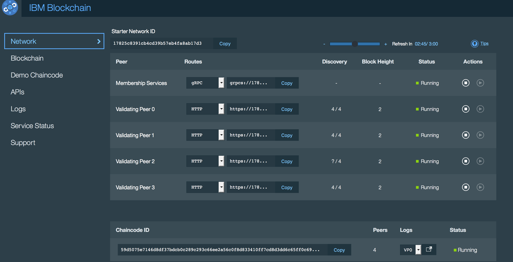

---

copyright:
  years: 2016

---

{:new_window: target="_blank"}
{:shortdesc: .shortdesc}
{:codeblock: .codeblock}
{:screen: .screen}
{:pre: .pre}

# Supervisor del panel de control
{: #blockchain_dashboard_monitor}
Última actualización: 08 de noviembre de 2016
{: .last-updated}

El supervisor del panel de control proporciona una visión general del entorno de blockchain, incluidos los datos de rendimiento y el código de encadenamiento desplegado. Utilice el supervisor para ver información de red sobre iguales, registros, estado del libro mayor, API y código de encadenamiento.  
{:shortdesc}

Tal como se muestra en los siguientes ejemplos, los separadores del monitor del panel de control ofrecen vistas exclusivas de su red blockchain:
  - Red
  - Blockchain
  - Demo de código de encadenamiento
  - API
  - Registros
  - Estado
  - Soporte

**Separador Red**: Supervisar el estado de los iguales y todos los contenedores de código de encadenamiento que están en ejecución, como se muestra en la Figura 1. Ver las rutas de descubrimiento y API para los iguales de validación y la entidad emisora de certificados, que son los valores combinados de puerto y host de nodo. Por ejemplo, el fragmento de código JSON para **Credenciales de servicio** en **Panel de control de servicio** de Bluemix muestra que `"discovery_host"` y `"discovery_port"` equivalen a la ruta visualizada en el separador **Red**. Estos valores son útiles para conectarse manualmente a Bluemix.

*Figura 1. Separador Red*

**Separador Blockchain**: Ver el estado actual de blockchain. Tal como se muestra en la Figura 2, puede ver todas las transacciones, el estado de libro mayor actual y los datos del rendimiento para la red:

*Figura 2. Separador Blockchain*

**Separador Demo de código de encadenamiento**: Aprenda y experimente con tres plantillas de código de encadenamiento de ejemplo, que puede desplegar e invocar en la red. Se proporcionan instrucciones para guiarle a través del proceso, tal como se muestra en la Figura 3. Todos los despliegues y las invocaciones del código de encadenamiento se graban en el registro y también pueden verse en los separadores Registros en tiempo real, Blockchain y API.  

*Figura 3. Separador Demo de código de encadenamiento*

**Separador API**: Utilice la interfaz de usuario de Swagger para interactuar con la red de blockchain a través de la API REST, como se muestra en la Figura 4:  

*Figura 4. Separador API*

**Separador Registros**:  Ver los registros de los iguales de validación y Servicios de pertenencia, que incluyen los resultados de todas las transacciones en la red. Puede utilizar información de registro para inspeccionar transacciones y resolver problemas del código de encadenamiento.  

*Figura 5. Separador Registros*

**Separador Estado**: Ver medidas de rendimiento para el servicio, red y pruebas automatizadas, como se muestra en la Figura 6. Visualizar datos para el mes anterior. Este separador también contiene anuncios de códigos, foros generales, problemas conocidos y notas del release para IBM Blockchain.  

*Figura 6. Separador Estado*

**Separador Soporte**: Notificar un problema y ver el estado del servicio, como se muestra en la Figura 7:

*Figura 7. Separador Soporte*
