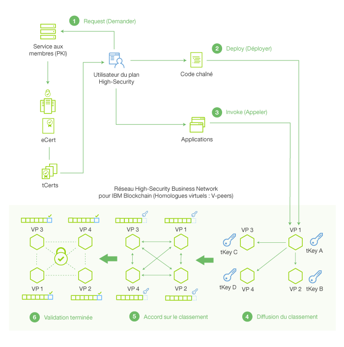

---

copyright:
years: 2016

---

{:new_window: target="_blank"}
{:shortdesc: .shortdesc}
{:codeblock: .codeblock}
{:screen: .screen}
{:pre: .pre}

# Environnement réseau
{: #etn_overview}
Dernière mise à jour : 13 octobre 2016
{: .last-updated}

Le plan IBM Blockchain on Bluemix Starter Developer et le plan High Security Business Network exploitent les dernières itérations d'Hyperledger Fabric v0.5, le protocole de consensus Practical Byzantine Fault Tolerance (PBFT) et le SDK Hyperledger Fabric Client (HFC) pour Node.js. Tous deux se composent de quatre noeuds réseau et d'une autorité de certification. L'autorité de certification régit les "Services aux membres", lesquels gèrent les identités, les autorisations réseau et les transactions confidentielles via l'émission de certificats numériques.
{:shortdesc}

Les fonctionnalités de chaîne de blocs suivantes sont disponibles dans les deux plans :

* Le protocole de consensus PBFT gère le classement de toutes les transactions écrites dans le registre partagé. Un
réseau de blockchain PBFT de quatre noeuds
peut atteindre un
consensus malgré la présence d'un noeud Byzantine (défectueux). Pour plus de détails sur les tests de consensus PBFT, voir [Tests du consensus et de la disponibilité](etn_pbft.html).
* Le logiciel SDK HFC pour Node.js permet aux applications
Node.js côté client d'interagir avec le réseau de blockchain. Les applications côté client peuvent inscrire de manière sécurisée des utilisateurs via les Services aux membres, émettre des transactions et échanger sous forme cryptographique des actifs via l'utilisation de certificats de transactions (tCerts). Pour plus d'informations sur les Services aux membres et la confidentialité utilisateur, voir la section [Logiciel SDK HFC pour Node.js](etn_sdk.html) et la [Spécification de protocole](https://github.com/hyperledger/fabric/blob/master/docs/protocol-spec.md) Hyperledger Fabric.
* Vous pouvez accéder aux détails de votre environnement réseau de blockchain via le [Tableau de bord du moniteur Bluemix](ibmblockchainmonitor.html).  

 
## Terminologie

La terminologie ci-après, ainsi que le diagramme associé, permet de situer en contexte les composants du réseau IBM Blockchain :

* Membre - Identité permettant de participer à un réseau de blockchain. Il existe différentes classes de membres : utilisateurs, homologues, valideurs, auditeurs, etc.
* Services aux membres - Services liés à l'obtention et à la gestion des identités de membre. Les Services aux membres sont régis par les autorités de certification.  
* Enregistrement - Opération consistant à ajouter une nouvelle identité de membre au réseau. Un membre peut être ajouté de manière dynamique au réseau par un utilisateur disposant du privilège 'registraire'. Les membres se voient également affecter des rôles et des attributs, qui contrôlent leur accès et leurs droits sur le réseau. Les rôles et les attributs ne peuvent pas être affectés de manière dynamique ; vous devez pour cela éditer le fichier membersrvc.yaml.
* Inscription - Opération qui permet de terminer le processus d'enregistrement en autorisant le nouveau membre à accéder au réseau de blockchain. L'inscription peut être effectuée par le nouveau membre après obtention d'un code secret auprès d'un registraire (externe), ou par un intermédiaire disposant de droits délégués lui permettant d'agir pour le compte du nouveau membre.  

 
## Architecture réseau

La Figure 1, et la description qui suit, dépeignent l'architecture de réseau IBM Blockchain, ainsi que le flot de données des services aux membres, les transactions, le consensus et les ajouts dans le registre :

Figure 1.

Les étapes suivantes décrivent le flot réseau de la Figure 1 en détail :

1. Un utilisateur s'inscrit auprès du réseau via PKI (Services aux membres) et reçoit un certificat d'enregistrement à long terme (eCert) ainsi qu'un lot de certificats de transaction (tCerts).
2. L'utilisateur déploie le code blockchain sur le réseau. Le code blockchain (contrat intelligent) code une logique applicative, ou des règles, qui régissent un type spécifique de transaction. Chaque transaction (deploy, invoke ou query) exige un certificat tCert unique, et doit être signé à l'aide de la clé privée de l'utilisateur. L'utilisateur dérive sa clé privée des certificats tCerts affectés.
3. L'utilisateur appelle le contrat intelligent, lequel déclenche l'exécution automatique par le contrat de sa logique codée.
4. Une transaction est soumise à un réseau homologue. Lorsque ce dernier reçoit la demande de transaction, il la soumet à l'homologue principal du réseau (VP1 dans la Figure 1). L'homologue principal va ensuite classer un bloc de transactions et diffuser ce classement à ses homologues compagnons.
5. Les homologues utilisent le protocole de consensus réseau (PBFT) pour convenir du classement des transactions soumises. Ce processus de classement collectif des transactions est appelé consensus.  
6. Une fois que les homologues sont parvenus à un consensus, les demandes de transaction sont exécutées et le bloc est ajouté dans le registre partagé.  

<!---Both the developer and high-security networks unlock several features in the Hyperledger fabric which robustly enhance security, confidentiality and privacy.  The only fundamental difference between the two is their operating/hosting environment.  The developer network runs in a shared multi-tenant environment on Softlayer, whereas the high-security network exists as an isolated single-tenant running in a secure services container.  Each network leverages the same capabilities from the fabric, including a PBFT consensus protocol and the enhanced Node.js SDK.~~

~~The High-Security business network runs in an isolated and highly secured environment, distinguishing it from other cloud-hosted offerings. The operating system, fabric, and nodes all exist in a secure services container (SSC), providing your enterprise with the security and impregnability that customers have come to expect from system Z technology.  The SSC delivers performance optimization in - peer to peer communication, availability, scalability, hardware encryption, tamper-proof crypto keys, and securely encrypted VMs.  See the [Secure Services Container](etn_ssc.html) section for more details on the security features provided through the SSC.  Additionally, the high security network unlocks numerous features of the Hyperledger fabric (unavailable in the developer service), which robustly enhance security, confidentiality and privacy.  The configuration is such that you are able to test and affirm these features.~~  
{:shortdesc}

~~The high security plan augments the developer plan by delivering several enhancements that help meet the security requirements and concerns of an enterprise-level participant:~~--->

<!---The environment (LinuxONE on z) consists of a four-peer network implementing PBFT with Membership Services enabled, running in an application container.  The application container protects blockchain software, chaincode, and data running within the system. The blockchain software within the secure boot can be signed, attested, and encrypted; and once installed in the application container, is tamper-resistant.  Root users of the platform and system administrators cannot access or see z secure container contents.  In addition, the LinuxOne on z provides you with FIPS compliance, high Evaluation Assurance Level protection, a highly auditable operating environment, and crypto optimization--->
