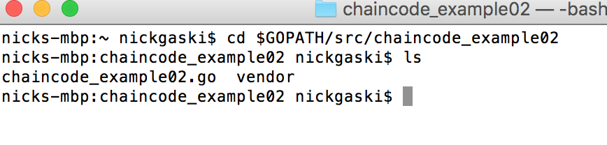

---

copyright:
years: 2016

---

{:new_window: target="_blank"}
{:shortdesc: .shortdesc}
{:codeblock: .codeblock}
{:screen: .screen}
{:pre: .pre}


# Logiciel SDK HFC pour Node.js
{: #etn_sdk}
Dernière mise à jour : 7 octobre 2016
{: .last-updated}

Le logiciel SDK Hyperledger Fabric Client (HFC) permet aux développeurs d'applications de créer des applications Node.js qui interagissent avec un réseau de blockchain. Les applications Node.js qui optimisent le logiciel SDK HFC peuvent être utilisées pour l'exécution des tâches réseau suivantes :
{:shortdesc}

* Enregistrer et inscrire des utilisateurs de manière sécurisée. Un administrateur d'applications Web disposant des droits de `registraire` peut enregistrer et inscrire de manière dynamique des utilisateurs qui se sont authentifiés auprès de l'application Web.
* Soumettre des transactions au réseau de blockchain (deploy, invoke et query). Toutes les transactions sont anonymes, confidentielles et elles ne peuvent pas être reliées sans le
droit 'auditeur'.
* Stocker des clés privées et des certificats sensibles dans un emplacement, par exemple une base de données à l'extérieur de la chaîne de blocs. Cela implique la mise en oeuvre d'une interface de stockage clé-valeur simple.

Le logiciel SDK HFC fournit des API, grâce auxquelles les applications interagissent avec un réseau de blockchain Hyperledger Fabric. Ces API sont conçues pour accepter deux composants enfichables :

1. Magasin de valeur de clé enfichable, utilisé pour extraire et stocker les clés associées à un membre. La méthode `chain.setKeyValStore()` remplace la mise en oeuvre d'un magasin de valeur de clé basé sur un fichier par défaut. Le magasin de valeur de clé de chaîne est utilisé pour les clés privés sensibles d'entrepôt de données, de sorte que l'accès soit correctement protégé.
2. Service aux membres enfichable, utilisé pour l'enregistrement et l'inscription de membres. La méthode `chain.setMemberServices()` remplace l'implémentation par défaut dans `MemberServices`. Les services aux membres implémentent la matrice Hyperledger en tant que réseau de blockchain privé, qui garantit l'anonymat, l'impossibilité de relier des transactions et la confidentialité.

Vous pouvez inclure le logiciel SDK HFC dans votre application Node.js à l'aide de la méthode offline ou de la méthode npm :
*  méthode off line : copiez d'abord les fichiers depuis l'arborescence source de Hyperledger Fabric (https://github.com/hyperledger/fabric/tree/master/sdk/node/lib) dans le répertoire `/lib` de votre application Node.js. Ensuite, incluez le logiciel SDK HFC dans votre application en ajoutant le fragment de code suivant :

```js
var hfc = require("./lib/hfc");
```

* méthode npm : depuis la ligne de commande, installez d'abord le logiciel SDK HFC depuis npm à l'aide du fragment de code suivant :

```
npm install hfc@0.5.3
```

Ensuite, incluez le logiciel SDK HFC dans votre application avec le fragment de code suivant :

```js
var hfc = require('hfc');
```  
<br>
## Objets HFC
{: #objects}

Les objets HFC (classes et interfaces) suivants sont décrits à un niveau supérieur pour vous guider dans la hiérarchie d'objets :

* La classe de niveau supérieur est `Chain`, ce qui est la représentation client d'un réseau de blockchain. HFC vous permet d'interagir avec plusieurs réseaux et de partager un objet `KeyValStore` et `MemberServices` unique avec plusieurs objets `Chain` si nécessaire. Pour chaque réseau de blockchain, vous devez ajouter un ou plusieurs objets `Peer`, lesquels représentent les noeuds finaux auxquels se connecte HFC pour soumettre des transactions.
* L'interface `KeyValStore` est utilisée par HFC pour stocker et extraire toutes les données persistantes. Ces données incluent des clés privées, qui doivent être conservées en lieu sûr. L'implémentation par défaut est une version basée sur des fichiers située dans la classe `FileKeyValStore`.
* L'interface `MemberServices` est implémentée par la classe `MemberServicesImpl`, elle assure la sécurité et fournit des fonctions liées aux identités, comme le caractère privé des données, l'impossibilité de relier des transactions et la confidentialité. Cette implémentation émet des *certificats d'enregistrement (eCerts)* (certificats d'enregistrement de membre) et des *certificats de transaction (tCerts)* (certificats de transaction pour chaque membre).
* La classe `Member` représente les utilisateurs finaux qui effectuent des transactions sur le réseau, et d'autres types de membres, comme les homologues (noeuds). Utilisez la classe `Member`, qui interagit avec l'objet `MemberServices`, pour *enregistrer* et *inscrire* les membres et les utilisateurs. Vous pouvez aussi déployer, interroger et appeler un code blockchain directement depuis la classe 'Member' en effectuant une transaction avec les objets `Peer` ; cette implémentation délègue simplement le travail à un objet `TransactionContext` temporaire.
* La classe `TransactionContext` implémente la logique de déploiement, d'appel et d'interrogation en vrac. Chaque instance `TransactionContext` reçoit un certificat de transaction (tCert) de `MemberServices`, qu'il utilise toujours pour soumettre des transactions. Pour émettre plusieurs transactions avec le même certificat tCert, extrayez directement un objet `TransactionContext` d'un objet Member, puis émettez plusieurs opérations de déploiement (deploy), d'appel (invoke) et de requête (query). Toutefois, l'utilisation d'un seul certificat tCert pour plusieurs transactions relie les transactions de sorte qu'elles soient identifiables dès lors qu'elles impliquent le même utilisateur anonyme. Pour éviter la liaison de transaction, appelez deploy, invoke et query sur l'objet `User` ou `Member`.  

<br>
## Exemple d'application Node.js
{: #nodesample}

L'exemple d'application Node.js ci-après optimise les API du logiciel SDK HFC pour interagir avec un réseau de blockchain Bluemix. La programme fonctionne avec des plans de réseau de blockchain (starter et HSBN), ainsi qu'avec un système d'exploitation côté client.

L'objectif est d'utiliser une application JavaScript--[helloblockchain.js](https://github.com/IBM-Blockchain/SDK-Demo/blob/master/helloblockchain.js)--pour déployer un code blockchain--[chaincode_example02](https://github.com/IBM-Blockchain/SDK-Demo/blob/master/chaincode_example02.go)--sur votre réseau Bluemix, suivi d'un appel (invoke) et d'une requête (query).  

1. Ce programme requiert à la fois Node.js et le gestionnaire de package JavaScript npm.  L'installation de la dernière version de [Node.js](https://nodejs.org/en/) inclut automatiquement npm.  

1. Ouvrez un terminal et créez un répertoire (workspace) dans lequel vous allez placer le code source helloblockchain.js et les modules de noeud. Par exemple :

    ```
    mkdir -p $HOME/workspace
    ```

1. Accédez au dossier workspace que vous venez de créer et
installez HFC v0.5.3 à l'aide de la commande suivante :

     ```
     cd $HOME/workspace
     npm install hfc@0.5.3
     ```

1. Copiez le programme [helloblockchain.js](https://github.com/IBM-Blockchain/SDK-Demo/blob/master/helloblockchain.js) et sauvegardez-le dans votre dossier workspace.  
   Votre répertoire `/workspace` doit ressembler à la capture d'écran ci-dessous :

   

1. Si ce n'est déjà fait, accédez à la vignette [Blockchain](https://console.ng.bluemix.net/catalog/services/blockchain/) dans Bluemix et créez une instance du service. Sélectionnez le plan **Starter Developer** ou le plan **High Security Business Network** (si approuvé). Cliquez sur le bouton **CREATE** et obtenez les **données d'identification de service** en copiant et en collant le fichier JSON ; sauvegardez-le en tant que ServiceCredentials.json dans votre répertoire '/workspace' local. Assurez-vous de copier l'intégralité du contenu JSON ; il doit s'agir de 202 lignes dans un éditeur standard.  **Remarque **: Lors de l'exécution d'une instance de chaîne de blocs au format de la [nouvelle console](https://new-console.ng.bluemix.net/#overview) Bluemix, vous noterez une différence dans la sortie de vos **données d'identification de service**.  A savoir, la ligne "credentials" est retirée de l'objet.  Pour corriger cela, ajoutez le fragment de code suivant sur la ligne 2 de votre fichier ServiceCredentials.json :

	```
	"credentials": {
	```

1. Ajoutez ensuite une parenthèse de fin `}`
à la ligne 202 pour fermer l'objet. L'agencement de votre fichier ServiceCredentials.json doit être le miroir du fichier de l'exemple [ServiceCredentials.json](https://github.com/IBM-Blockchain/SDK-Demo/blob/master/ServiceCredentials.json), ce qui vous laisse avec un contenu de 202 lignes. Si vous obtenez vos données d'identification d'une instance de chaîne de blocs dérivée du format de [console classique](https://console.ng.bluemix.net/) Bluemix, vous ne devez pas vous soucier de cette différence.  
Les captures d'écran ci-dessous illustrent les différences entre les
deux agencements, avec l'agencement initial indiquant *nouvelle
console*, et la dernier affichant *classique*:

     

     

1. Après l'ajout de ServiceCredentials.json, votre répertoire `/workspace` doit ressembler à la capture d'écran suivante :

     

1. Lors de l'exécution du programme, le logiciel SDK HFC crée le répertoire `keyValStore` dans $HOME/workspace.  Ce répertoire `keyValStore` contient les clés cryptographiques pour chaque utilisateur inscrit.  Il n'est pas nécessaire de supprimer le répertoire `keyValStore` lors de la connexion aux nouveaux réseaux Bluemix ; des répertoires `keyValStore` uniques seront créés pour chaque instance Bluemix.  

1. Créez un répertoire chaincode sous $GOPATH, comme illustré ci-après. Si vous n'avez pas défini de chemin $GOPATH sur votre machine, suivez les instructions [ici](https://github.com/golang/go/wiki/GOPGATH).

	```
	mkdir -p $GOPATH/src/chaincode_example02
	```

1. Copiez [chaincode_example02.go](https://github.com/IBM-Blockchain/SDK-Demo/blob/master/chaincode_example02.go) dans ce nouveau répertoire - `$GOPATH/src/chaincode_example02`.  Il s'agit de l'élément de code blockchain réel qui sera déployé sur le réseau Bluemix une fois le programme lancé.  

1. Procédez à l'extraction du package [vendor.zip](https://github.com/IBM-Blockchain/SDK-Demo/blob/master/vendor.zip) et sauvegardez son contenu dans le même répertoire - `$GOPATH/src/chaincode_example02`. Le package vendor.zip contient les bibliothèques et les dépendances du codebase Hyperledger Fabric v0.5. L'extraction Windows par défaut crée un chemin similaire à : **C:\GOPATH\src\chaincode_example02\vendor**. Avant de procéder à l'extraction, vous devez supprimer le répertoire `\vendor` de ce chemin, ou bien le déploiement de code blockchain va échouer. Un chemin correct sur Windows ressemble à ce qui suit : **C:\GOPATH\src\chaincode_example02\vendor\github.com\hyperledger\fabric**. (Remarque : Un répertoire `\vendor` est correct.)  L'irrégularité d'un second répertoire `\vendor` n'a pas lieu sur Linux ou OS X.

1. Vous devez maintenant avoir un répertoire similaire à l'exemple suivant dans votre chemin $GOPATH :

    

1. Depuis votre répertoire '/workspace' local, exécutez le programme de noeud  :

	```
	node helloblockchain.js -c chaincode_example02
	```
	Activez les journaux de débogage :
	```
	DEBUG=hfc node helloblockchain.js -c chaincode_example02
	```

	Activez les traces gRPC :
	```
	GRPC_TRACE=all DEBUG=hfc node helloblockchain.js -c chaincode_example02
	```

Si les transactions `deploy`, `invoke` et `query` aboutissent, vous verrez les messages suivants sur votre terminal :

```
Successfully deployed chaincode: request={"fcn":"init","args":["a","100","b","200"],"certificatePath":"/certs/blockchain-cert.pem","chaincodePath":"github.com/chaincode_example02/"}, response={"uuid":"2d6ad8d6-1390-4c60-a01b-f4c301175eb7","chaincodeID":"9be0a0ed3f1788e8728c8911c747d2f6d0e205fa63422dc598d498fe709b9b8d","result":"TODO: get actual results; waited 120 seconds and assumed deploy was successful"}

Successfully submitted chaincode invoke transaction: request={"chaincodeID":"9be0a0ed3f1788e8728c8911c747d2f6d0e205fa63422dc598d498fe709b9b8d","fcn":"invoke","args":["a","b","1"]}, response={"uuid":"f9a902d2-44d8-4b68-b43d-419470ba73ae"}

Successfully completed chaincode invoke transaction: request={"chaincodeID":"9be0a0ed3f1788e8728c8911c747d2f6d0e205fa63422dc598d498fe709b9b8d","fcn":"invoke","args":["a","b","1"]}, response={"result":"waited 20 seconds and assumed invoke was successful"}

Successfully queried  chaincode function: request={"chaincodeID":"9be0a0ed3f1788e8728c8911c747d2f6d0e205fa63422dc598d498fe709b9b8d","fcn":"query","args":["a"]}, value=99
```

Gardez à l'esprit que lors de l'exécution sur un réseau Starter Developer, le démarrage du conteneur de votre code blockchain peut prendre jusqu'à dix minutes.  
Toutefois, une fois le démarrage effectué, les déploiements et les
appels suivants seront immédiats, car les fichiers prérequis sont
stockés sur la machine hôte de votre instance de chaîne de blocs.  

Accédez à l'onglet **Blockchain** depuis votre **console réseau (Network Console)**. Cette vue illustre l'ajout de blocs dans le registre de chaîne de blocs lorsque le programme helloblockchain.js émet des transactions deploy et invoke. La capture d'écran suivante comporte les résultats de l'exécution de helloblockchain.js deux fois, avec les arguments par défaut pour "a" et "b" :

     

<br>
## Traitement des incidents
Vérifiez que vous exécutez **hfc@0.5.3** à l'aide de l'une des commandes suivantes depuis votre répertoire **/workspace** :
  * npm list | grep hfc
  * npm list -g | grep hfc  (si installé avec l'indicateur
global `-g`)

Procédez comme suit si vous recevez un message de requête :

  ```
Failed to query chaincode, function: request={"chaincodeID":"9be0a0ed3f1788e8728c8911c747d2f6d0e205fa63422dc598d498fe709b9b8d","fcn":"query","args":["a"]}, error={"error":{"status":"FAILURE","msg":{"type":"Buffer","data":[69,114,114,111,114,58,70,97,105,108,101,100,32,116,111,32,108,97,117,110,99,104,32,99,104,97,105,110,99,111,100,101,32,115,112,101,99,40,112,114,101,109,97,116,117,114,101,32,101,120,101,99,117,116,105,111,110,32,45,32,99,104,97,105,110,99,111,100,101,32,40,57,98,101,48,97,48,101,100,51,102,49,55,56,56,101,56,55,50,56,99,56,57,49,49,99,55,52,55,100,50,102,54,100,48,101,50,48,53,102,97,54,51,52,50,50,100,99,53,57,56,100,52,57,56,102,101,55,48,57,98,57,98,56,100,41,32,105,115,32,98,101,105,110,103,32,108,97,117,110,99,104,101,100,41]}},"msg":"Error:Failed to launch chaincode spec(premature execution - chaincode (9be0a0ed3f1788e8728c8911c747d2f6d0e205fa63422dc598d498fe709b9b8d) is being launched)"}
  ```

Augmentez le temps de déploiement dans l'application Node.js. La valeur par défaut est de 60 secondes, mais plus de temps peut être nécessaire pour que le code puisse se déployer, se compiler et commencer à s'exécuter correctement dans le conteneur Docker. Essayez d'augmenter le délai de déploiement à 120 secondes. Cette particularité ne s'observe que dans les plans Starter Developer comme le résultat de ressources de calcul partagées sur la machine qui héberge votre instance de chaîne de blocs :

  ```js
chain.setDeployWaitTime(120);
  ```

Une fois votre chaîne de blocs déployée sur le réseau, vous pouvez réduire le délai de déploiement à une quantité nominale, par exemple quelques secondes.

Si vous recevez une erreur d'établissement de liaison, essayez d'utiliser une autre version de `grpc`. Pour accédez à votre version de grpc, utilisez l'une des commandes suivantes :
    - `npm list | grep grpc`
    - `npm list -g | grep grpc`  

<br>
## Clés publiques et clés privées
{: #keys}

Hyperledger Fabric utilise des autorités de certification, ainsi que leurs clés publiques et privées sous-jacentes, pour répondre aux exigences de sécurité des entreprises exploitant une chaîne de blocs partagée. Il est possible de contrôler la gestion des identités de membre, la gestion des rôles et la confidentialité transactionnelle, depuis le logiciel SDK HFC.

La confidentialité utilisateur et transactionnelle sur une chaîne de blocs partagée est gérée via l'implémentation d'une infrastructure à clés publiques (PKI). L'infrastructure PKI, via des autorités de certification, gère la génération, la distribution et la révocation des clés et des certificats numériques. 
Les spécifications techniques complètes pour l'infrastructure PKI et
les Services aux membres sont décrites dans la section relative à la
sécurité de la
[spécification
de protocole](https://github.com/hyperledger/fabric/blob/master/docs/protocol-spec.md) Hyperledger Fabric v0.5. Les principes de base de l'infrastructure PKI Hyperledger Fabric sont décrits ci-dessous :

1. L'organisme d'enregistrement valide l'identité d'un utilisateur qui demande l'accès au réseau de blockchain.  Cette opération peut être effectuée de manière dynamique par un utilisateur doté des droits de `registraire`, ou de façon manuelle par l'édition du fichier membersrvc.yaml. Le processus d'enregistrement s'effectue en externe et via la fonction `RegisterUser`. 
L'organisme d'enregistrement affecte les données d'identification
d'inscription--`<enrollID>` et
`<enrollPWD>`-à l'utilisateur.

2. L'utilisateur envoie ensuite une demande d'inscription à l'autorité de certificat d'enregistrement, en utilisant la fonction `CreateCertificatePair`. Ce contenu comporte le mot de passe unique de l'utilisateur `<enrollPWD>`, la clé de vérification de signature publique et la clé de chiffrement publique, et il est signé avec la clé de vérification de signature privée de l'utilisateur. <br><br>A réception de la demande d'inscription, l'autorité de certificat d'enregistrement émet une demande d'authentification chiffrée pour l'utilisateur qui peut uniquement être déchiffrée par la clé de chiffrement privée de l'utilisateur. Une fois la demande d'authentification déchiffrée, l'utilisateur renvoie la demande de certificat. L'autorité de certificat d'enregistrement, dépendant d'une réponse déchiffrée exacte, renvoie une paire de certificats authentifiée et signée avec sa signature numérique. <br><br>La signature numérique est produite par un hachage cryptographique de la demande de certificat (message) à l'aide de l'algorithme SHA-2 pour la production d'un "résumé (digest)". Ce "résumé du message" est ensuite chiffré avec la clé de signature privée de l'autorité de certificat d'enregistrement. Les membres du réseau peuvent ensuite authentifier la signature numérique en la déchiffrant à l'aide de la clé de signature publique de l'autorité de certificat d'enregistrement. La paire de certificat d'enregistrement (eCert) retournée contient un certificat pour la signature de données (privée) et un certificat pour le chiffrement de données (public). Cette paire eCert est statique et à long terme, et elle peut être visible ou invisible pour les transactions.

3. Pour effectuer des transactions sur un réseau de
blockchain, chaque utilisateur doit également disposer de certificats de transaction (tCerts). Une
fois inscrit, un utilisateur soumet une demande à l'agent de
communication autorisé (TCA) pour un lot de certificats tCerts. Un certificat tCert est un certificat à court terme, spécifique à une transaction, et il peut être modifié par un client à l'aide d'une API. Après vérification du certificat eCert de l'utilisateur, l'autorité de certification de transaction affecte un lot de certificats tCerts et une clé KeyDF_Key (clé de fonction de dérivation de clé), ce qui permet à l'utilisateur de déchiffrer ses clés privées. Alors que la clé KeyDF_Key unique est utilisée pour chaque certificat tCert du lot, la clé suivante qui est générée est unique pour chaque certificat tCert. Pour effectuer une transaction, un client doit pouvoir signer le contenu de transaction à l'aide de la clé privée déchiffrée. Ce n'est qu'à ce moment qu'une transaction est transférée vers le réseau qui valide les homologues pour un consensus.
