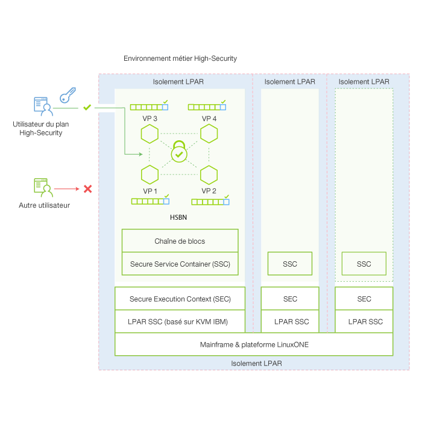

---

copyright:
years: 2016

---

{:new_window: target="_blank"}
{:shortdesc: .shortdesc}
{:codeblock: .codeblock}
{:screen: .screen}
{:pre: .pre}


# IBM Secure Service Container
{: #etn_ssc}

Dernière mise à jour : 13 octobre 2016
{: .last-updated}

Le plan IBM Blockchain Security Business Network est déployé en tant que dispositif dans un conteneur IBM Secure Service Container, lequel fournit l'infrastructure de base pour l'hébergement des services de chaîne de blocs. Le dispositif associe des systèmes d'exploitation, des conteneurs Docker, des middleware et des composants logiciels qui fonctionnent de manière autonome et fournissent des services et une infrastructure de base ainsi qu'une sécurité optimisée.
{:shortdesc}

IBM Secure Service Container met à disposition des services de chaîne de blocs des fonctions de cryptographie avancée, de sécurité et de fiabilité de la plateforme z Systems LinuxONE pour le traitement de données sensibles et régulées. La chaîne de blocs est protégée grâce à une série de fonctions d'IBM Secure Service Container (système d'exploitation encapsulé, disques de dispositif chiffrés, protection inviolable, mémoire protégée et puissant isolement LPAR) qui peuvent être configurées pour respecter la certification EAL5+.

Le schéma d'architecture suivant illustre l'organisation du conteneur IBM Secure Service Container et de dispositifs de chaîne de blocs :


*Figure 1. Présentation d'IBM Secure Service Container et des dispositifs de chaîne de blocs*
<br><br>
## Principales fonctions de sécurité
IBM Secure Service Container fournit les fonctions de sécurité optimisée suivantes pour les services de chaîne de blocs :  

### Protection des administrateurs système
>Le code du dispositif n'est accessible ni à la plateforme ni aux administrateur système.  L'accès aux données est contrôlé par le dispositif, de sorte que tout accès non autorisé est désactivé.  Ceci est possible grâce à une combinaison d'opérations de signature et de chiffrement de toutes les données utilisées ou au repos. Tous les accès à la mémoire sont également retirés. Le microprogramme prend tout cela en charge grâce à une architecture d'amorçage sécurisée.

>Les limitations suivantes s'appliquent aux administrateurs système lorsque la chaîne de blocs est sécurisée par IBM Secure Service Container :
>* Ils ne peuvent pas accéder aux noeuds.
>* Ils ne peuvent pas afficher le réseau de blockchain.

### Protection contre les falsifications  
>IBM Secure Service Container désactive toutes les interfaces externes qui permettent un accès à la mémoire LPAR. Un chargeur d'amorçage d'image est signé, ce qui garantit qu'il est impossible de le falsifier ou de le remplacer par un autre.

### Disques de dispositif chiffrés
>Tout le code et toutes les données stockés sur le disque sont chiffrés à tout moment à l'aide de la couche de chiffrement Linux :  
- Système d'exploitation encapsulé
- IP protégée
- Surveillance intégrée et réparation spontanée  
<br>

## Gestion des dispositifs via des API REST
Les dispositifs logiciels sont préconfigurés pour que vous puissiez les utiliser sur la plateforme z Systems fiable, sécurisée et évolutive. Vous pouvez gérer ces dispositifs via des API REST sans aucune configuration.

Pour gérer les actifs de chaîne de blocs via des API REST, vous pouvez utiliser l'interface utilisateur swagger sur le tableau de bord Blockchain sur Bluemix ou des outils de commande REST, comme `curl` ou `Postman`.

Par exemple, pour obtenir des informations sur tous les homologues du réseau, exécutez la commande suivante avec `curl` :
```
curl -u <username>:<password> https://<peer_ip>:<port>/network/peers
```
Voici un exemple de commande curl et les résultats retournés :
* Commande :
```
curl -u dashboarduser_type0_2ef27***:89317***https://ad3130e8-4a1a-4ce6-a084-689a345a3308_vp1-api.blockchain.ibm.com:443/network/peers
```
* Informations retournées sur tous les homologues du réseau :
```
{
	"peers": [
      {
		"ID": {
			"name": "ad3130e8-4a1a-4ce6-a084-689a345a3308_vp2"
		},
		"address": "ad3130e8-4a1a-4ce6-a084-689a345a3308_vp2-discovery.blockchain.ibm.com:30303",
		"type": 1,
		"pkiID": "rC0uvv0cbSbiT8RUGKPQM3q/o09oyWlcBmRxogi2Cls="
	},
	{
		"ID": {
			"name": "ad3130e8-4a1a-4ce6-a084-689a345a3308_vp1"
		},
		"address": "ad3130e8-4a1a-4ce6-a084-689a345a3308_vp1-discovery.blockchain.ibm.com:30303",
		"type": 1,
		"pkiID": "oeoI+Xa/lW8Xvrvv71A+Nvzit+JDa+oIkthpZHwfaTE="
	}]
}
```
Pour en savoir plus sur la façon d'interagir avec la chaîne de blocs via des API REST, voir la section [Moniteur de tableau de bord](https://new-console.ng.bluemix.net/docs/services/blockchain/ibmblockchainmonitor.html) and [Samples and tutorials](https://new-console.ng.bluemix.net/docs/services/blockchain/ibmblockchain_tutorials.html).
