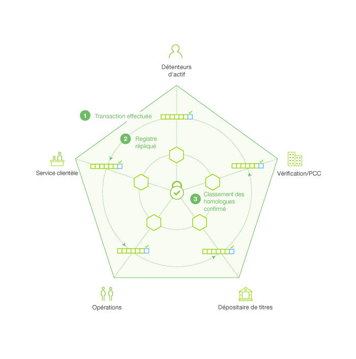
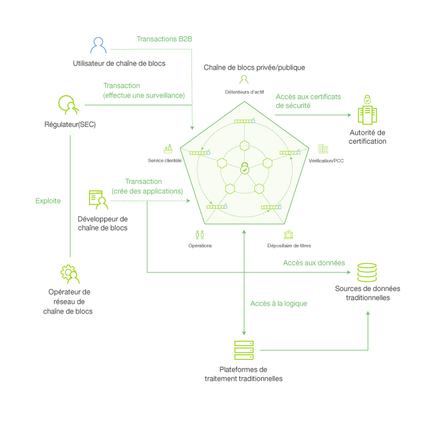
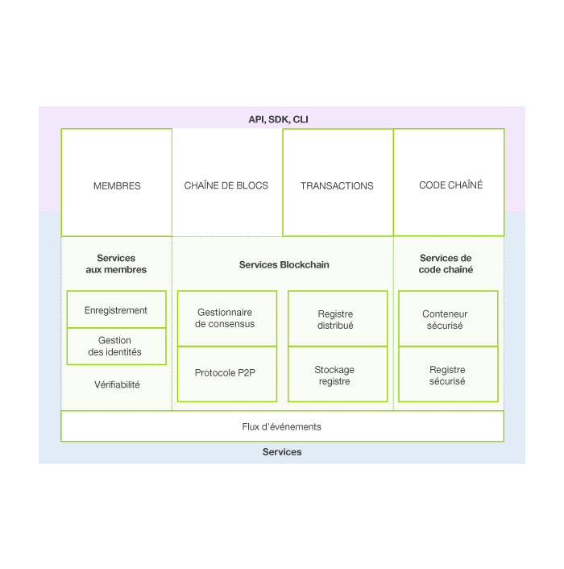

---

copyright:
  years: 2016

---

{:new_window: target="_blank"}
{:shortdesc: .shortdesc}
{:codeblock: .codeblock}
{:screen: .screen}
{:pre: .pre}

# A propos de la chaîne de blocs
{: #ibmblockchain_overview}
Dernière mise à jour : 03 novembre 2016
{: .last-updated}

## Qu'est-ce qu'une chaîne de blocs ?
{: #what}

La chaîne de blocs (ou blockchain) est une technologie destinée à une nouvelle génération d'applications transactionnelles. Elle garantit la fiabilité, la responsabilité et la transparence des informations tout en rationalisant les processus métier. Le réseau de blockchain a initialement été introduit par le bitcoin, mais dans la pratique ses usages vont bien au-delà des échanges de crypto-monnaie. Avec la chaîne de blocs, IBM redonne un nouveau visage aux échanges commerciaux les plus fondamentaux, et il ouvre la voie à un nouveau monde d'interactions numériques.

Le concept de chaîne de blocs devrait permettre de réduire considérablement les coûts et la complexité des processus métier interentreprises. Son registre distribué simplifie la création de réseaux d'entreprise rentables où tout ce qui a virtuellement de la valeur peut être suivi et échangé, sans la nécessité d'un organe centralisé de contrôle. La chaîne de blocs s'annonce déjà très prometteuse dans une large gamme d'application métier. Pour ne prendre qu'un exemple, les réseaux de blockchain permettent de régler des opérations sur titres en seulement quelques minutes, alors que plusieurs jours étaient auparavant nécessaires. La chaîne de blocs permet également aux entreprises de rationaliser la circulation des marchandises et des paiements. Les fabricants peuvent aussi diminuer les rappels de produits grâce au partage ouvert des journaux de production avec les constructeurs et les régulateurs.  
 

## Termes clés
{: #keyterms}
Les termes suivants sont essentiels à la compréhension complète des concepts de chaîne de blocs :

**Réseau de transactions** : Réseau participant connecté au réseau de blockchain via un noeud, qui soumet les transactions d'un client à l'aide d'un logiciel SDK ou d'une API.

**Transaction** : Demande effectuée par un réseau de transactions pour l'exécution d'une fonction sur le réseau de blockchain. Les types de transaction (deploy, invoke et query) sont implémentés via des fonctions de code blockchain énoncées dans le contrat d'API de la matrice.

**Registre** : Séquence de blocs reliés cryptographiquement, contenant des transactions et l'état global actuel. Outre les données des précédentes transactions, le registre contient également les données des applications de code blockchain en cours d'exécution.

**Etat global** : Base de données clé-valeur utilisée par les codes blockchain pour le stockage de leur état lors de l'exécution par une transaction.

**Code blockchain** : Logique intégrée qui code les règles pour des types spécifiques de transactions réseau. Les développeurs écrivent des applications de code blockchain et les déploient sur le réseau. Les utilisateurs finaux appellent ensuite le code blockchain via une application côté client qui sert d'interface avec l'homologue réseau, ou un noeud. Le code blockchain exécute des transactions réseau, lesquelles, si elles sont validées, sont ajoutées dans le registre partagé et modifient l'état global.

**Homologue de validation** : Noeud réseau qui exécute le protocole de consensus pour que le réseau valide les transactions et maintienne à jour le registre. Les transactions validées sont ajoutées dans le registre, par blocs. Si une transaction échoue au consensus, elle est purgée dans le bloc et, par conséquent, non écrite dans le registre. Un homologue de validation a le droit de déployer (deploy), d'appeler (invoke) et d'interroger (query) le code blockchain.

**Homologue sans validation** : Noeud réseau qui fait office de proxy, en connectant les réseaux de transaction aux homologues de validation. Un homologue sans validation (NVP) transmet les demandes d'appel à son homologue de validation (VP) connecté. Il héberge également le serveur de flux d'événements et le service REST.

**Consensus** : Protocole qui gère le classement des transactions (deploy et invoke) du réseau de blockchain. Les noeuds de validation collaborent pour approuver les transactions par l'implémentation du protocole de consensus. Le consensus garantit qu'un quorum de noeuds convient du classement des transactions dans le registre partagé. En résolvant toutes les différences dans ce classement, le consensus garantit que tous les noeuds opèrent dans un registre de chaîne de blocs identique. Pour afficher plus d'informations et des scénarios de test, consultez la rubrique relative au [consensus](etn_pbft.html).  

**Réseau privé** : Réseau de blockchain dans lequel chaque noeud est requis pour gérer l'identité des membres sur le réseau, et chaque noeud n'a accès qu'aux seules transactions autorisées par ses droits.  

## Concepts clés
{: #keyconcepts}

**Vue d'ensemble** : La chaîne de blocs est un type de réseau spécifique, sur lequel des membres suivent et échangent des actifs digitalisés. Un registre partagé contient l'enregistrement unique de toutes les transactions réseau, et est répliqué entre tous les membres du réseau. Les applications de code blockchain contiennent des contrats à exécution automatique et des applications côté client qui servent d'interface avec le réseau via un logiciel SDK ou une API.

Au moins deux parties engagées dans des transactions, en tant que membres d'un réseau de blockchain, conviennent de manière implicite des conditions du contrat intelligent qui régit la transaction (par exemple, à réception de l'actif "a", l'actif "b" est dû). Une fois déployées dans la chaîne de blocs, les fonctions du contrat peuvent être appelées (en d'autres termes, une transaction peut être déclenchée). Le ou les appels qui s'ensuivent sont classés par un noeud principal et diffusés vers les homologues de validation à des fins de consensus. Après validation, les transactions sont exécutées et enregistrées dans le registre, par blocs. Le registre est ensuite distribué sur tous les noeuds réseau via la réplication. Une fois ajoutées dans le registre, les transactions ne peuvent jamais être modifiées ou supprimées ; le seul moyen d'annuler ou de modifier les effets d'une transaction approuvée est de soumettre une transaction suivante.

**Réseau** : Un réseau de blockchain se caractérise comme suit :

- Réseau distribué, d'égal à égal décentralisé, avec des noeuds représentant les participants au réseau (banques, agences gouvernementale, fabricants et entreprises d'investissement, par exemple).
- Groupes d'homologues qui valident les transactions via un protocole de consensus avant de les valider dans un registre partagé.

**Registre partagé** : Le registre partagé est l'unique source fidèle, ou l'historique intégral des transactions validées, sur un réseau de blockchain. Toutes les différences dans le registre partagé entre les noeuds sont résolues grâce à un consensus. Le registre présente les attributs suivants :
- Il enregistre toutes les transactions validées sur le réseau.
- Il est partagé entre tous les participants du réseau.
- Il est répliqué, de sorte que chaque participant dispose de sa propre copie.
- Il est privé, de sorte que les participants ne peuvent voir que leurs propres transactions.

**Example**: La figure 1 illustre un
exemple de réseau de blockchain d'actions et
le registre partagé :

*Figure 1.
Exemple de registre partagé*

La figure 1 illustre les participants d'un réseau typique sur un marché d'actions : Détenteur d'actif (banque), Service clientèle, Opérations, Dépositaire de titres et Partie compensatrice (Vérification/PCC) :
1. Par le biais d'une application client, le dépositaire appelle un code blockchain pour la vente et l'achat de blocs de titres.  
2. Les transactions peuvent être déclenchées depuis n'importe quel noeud réseau, mais elles sont toujours transférées vers le noeud de validation principal, lequel classe les transactions. Le noeud principal diffuse les transactions classées vers tous les homologues de validation à fins de consensus, ou d'accord, sur le classement proposé.
3. Si le classement des transactions est approuvé, les transactions sont exécutées et ajoutées dans le registre sur chaque noeud de validation. Le registre est ensuite répliqué sur tous les noeuds réseau.  

 
## Architecture du réseau et des applications
{: #architecture}

La Figure 2 illustre un exemple de réseau de blockchain
privé, qui bénéficie d'une architecture distribuée, d'égal à égal
décentralisée et d'une autorité de certification qui gère les rôles
utilisateur et les droits :

*Figure 2. Réseau de blockchain privé : le flux de données
et l'accès réseau sont régis par des rôles de membre*

Les descriptions suivantes correspondent à l'architecture et au flux illustrés dans la Figure 2, qui ne représentent pas un traitement séquentiel :

**A :** Un utilisateur de chaîne de blocs
soumet une transaction au réseau de blockchain privé. La transaction peut être un déploiement (deploy), un appel (invoke) ou une requête (query) et elle est émise via une application côté client qui optimise un logiciel, ou directement à partir d'une API REST.  

**B :** Les réseaux d'entreprise de confiance accordent l'accès à des régulateurs et des auditeurs (par exemple, la SEC, sur le marché d'actions américain).  

**C :** Un opérateur de réseau de blockchain gère les droits des membres, comme l'inscription du Régulateur (B) en tant que "auditeur" et l'utilisateur de chaîne de blocs (A) en tant que "client". Un auditeur peut être limité à l'interrogation de transactions, alors qu'un client peut être autorisé à déployer, appeler et interroger certains types de code blockchain.

**D :** Un développeur de chaîne de blocs écrit du code blockchain (contrats intelligents), ainsi que des applications côté client pour l'appel de ces contrats intelligents. Le développeur de chaîne de blocs peut aussi déployer du code blockchain directement sur le réseau, via une interface REST. Pour inclure les données d'identification d'une source de données traditionnelle dans le code blockchain, le développeur peut utiliser une connexion externe pour accéder aux données (G).

**E :** Un utilisateur de chaîne de blocs se connecte au réseau via un noeud homologue (A). Avant de poursuivre des transactions, le noeud extrait les certificats d'inscription et de transaction de l'utilisateur de l'autorité de certification. Les utilisateurs doivent être en possession de ces certificats numériques pour effectuer des transactions sur un réseau privé.

**F :** Un utilisateur qui essaie d'activer du code blockchain peut être invité à vérifier ses données d'identification sur une source de données traditionnelle (G). Pour confirmer l'autorisation d'un utilisateur, le code blockchain peut utiliser une connexion externe à ces données, via une plateforme de traitement traditionnelle.

La Figure 3 présente les composants de base d'IBM Blockchain. Les Services aux membres, les Services Blockchain et les Services de code blockchain sont des structures logiques, et non un partitionnement physique de composants dans des processus distincts, des espaces adresse ou des machines virtuelles :

*Figure 3. Architecture de référence de matrice Hyperledger*

**Services aux membres** : Ces services gèrent les identités utilisateur sur un réseau de blockchain privé via l'homologue de l'autorité de certification. Ils permettent de distinguer les rôles en associant des éléments de l'infrastructure à clés publiques (PKI) et la décentralisation (consensus). En revanche, les réseaux non privés ne fournissent pas d'autorité spécifique aux membres ou une distinction des rôles.

Une chaîne de blocs privée nécessite des entités pour l'enregistrement des données d'identification d'identité à long terme (certificats d'enregistrement), lesquels peuvent être distingués en fonction du type d'entité. Pour les utilisateurs, un certificat d'enregistrement autorise l'agent de communication autorisé (TCA) à émettre des données d'identification sous forme de pseudonyme ; ces certificats autorisent les transactions soumises par l'utilisateur. Les certificats de transaction persistent sur la chaîne de blocs et permettent aux auditeurs autorisés d'associer sinon les transactions qui ne peuvent pas être reliées.

**Services Blockchains** : Ces services gèrent le registre partagé à l'aide d'un protocole d'égal à égal, qui repose sur HTTP/2. Les structures de données sont hautement optimisées pour fournit l'algorithme de hachage le plus efficace pour la gestion de la réplication du registre partagé. PBFT est implémenté en tant que protocole de consensus.    

**Services de code blockchain** : Ces services constituent une méthode simple et sécurisée pour l'exécution de code blockchain bac à sable sur les noeuds de validation. L'environnement est un conteneur “verrouillé” et sécurisé, associé à un ensemble d'images de base signées contenant le système d'exploitation sécurisé et le langage de code blockchain, les couches d'exécution et SDK pour Go, Java et Node.js. D'autres langages peuvent être activés, si nécessaire.

Pour en savoir plus sur l'implémentation de la chaîne de blocs par IBM, consultez la [spécification de protocole](https://github.com/hyperledger/fabric/blob/v0.6/docs/protocol-spec.md#fabric) relative à Hyperledger Fabric 0.5.
