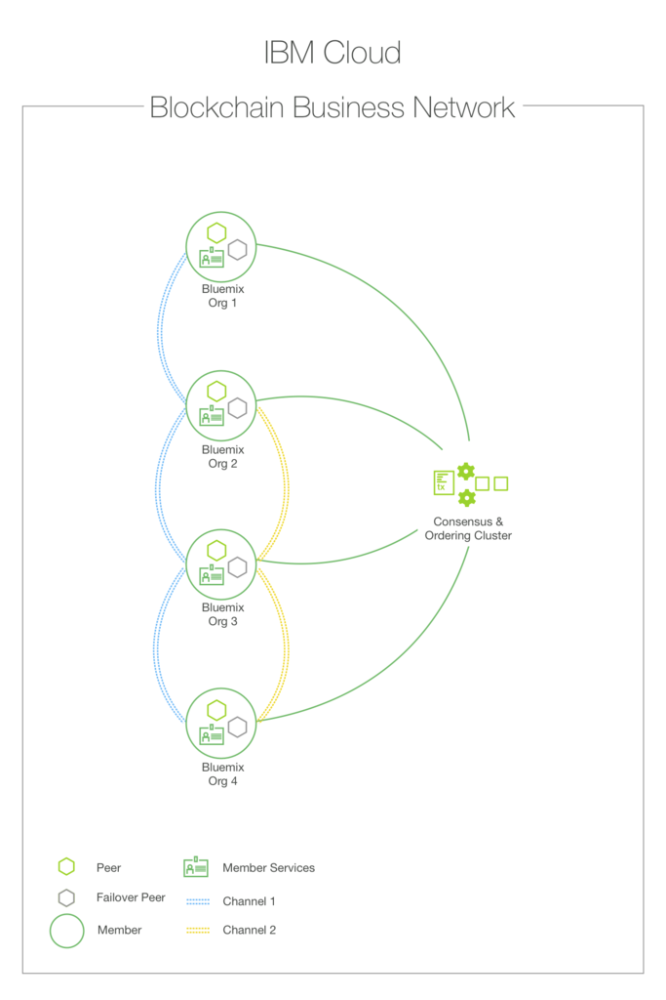

---

copyright:
  years: 2017
lastupdated: "2017-03-16"
---

{:new_window: target="_blank"}
{:shortdesc: .shortdesc}
{:codeblock: .codeblock}
{:screen: .screen}
{:pre: .pre}

# Présentation du réseau HSBN vNext bêta
{: #v10_netoverview}

Le service HSBN vNext Beta optimise Hyperledger Fabric v1.0 pour offrir un réseau de blockchain sécurisé et privé sur lequel des membres authentifiés peuvent aisément définir des actifs et créer les solutions métier permettant de les modifier et de les échanger.
{:shortdesc}

Ce service **simplifie énormément** le processus autrement mystérieux et fastidieux d'amorçage d'un réseau de blockchain de niveau entreprise. Nous fournissons l'infrastructure et les outils permettant d'inviter des membres, d'agréger différents matériels cryptographiques de vérification d'identité, d'établir des règles de gouvernance, et ainsi de suite... Ces processus compliqués deviennent intuitifs et naturels. En quelques minutes, vous pouvez générer un réseau de haute sécurité entièrement opérationnel, doté de canaux, de stratégies et de différents types de logique métier.  

La **haute disponibilité** pour les composants intégraux du réseau (homologue, service de commande, autorité de certification, code blockchain) élimine les effets désastreux qui pourraient naître de points de défaillance uniques. Un moniteur de tableau de bord intégré permet de gérer facilement ces composants et constitue un puissant mécanisme pour la visualisation des actifs et des contrats intelligents. 

La **modularité** de l'architecture Hyperledger Fabric v1.0 et la nette séparation des rôles réseau fournit une infrastructure qui permet l'évolutivité et des calculs hautement performants.   

Les freins et contrepoids qui opèrent tout au long du cycle de vie d'une transaction garantissent des résultats homogènes et approfondis ; les registres demeurent constamment synchronisés grâce à la mise en oeuvre du protocole gossip bien connu. Le contrôle d'identité et d'accès sont aisément appliqués via les opérations de **signature/vérification** qui se produisent perpétuellement via le réseau.  

Des **outils de gouvernance** sont fournis pour permettre aux membres d'administrer et de gérer les règles métier essentielles au réseau. Vous pouvez, par exemple, implémenter des règles qui définissent le nombre de membres d'un réseau qui doivent accepter l'adhésion d'un nouveau membre. Ou peut-être un actif nécessite-t-il l'adhésion de chaque participant pour qu'une modification puisse être effectuée. Les règles de gouvernance sont une absolue nécessité pour tous les types de réseau métier et elles peuvent souvent être extrêmement élaborées. Les outils de gouvernance (éditeurs de règle, par exemple) simplifient énormément ce processus.

Le service s'exécute dans un environnement **hautement sécurisé et isolé** sans accès externe (y compris un accès utilisateur root) aux composants réseau. Les données sont chiffrées durant leur transfert et leur stockage, et le support disponible pour les modules de sécurité matériels permet de protéger les clés numériques conformément à la réglementation du secteur. Un **ordinateur dédié** permet des interactions réseau, garantissant ainsi des performances élevées et la protection des données. Les opérations de hachage, signature/vérification et les communications de composant à composant sont accélérées grâce à des implémentations de cryptographie évoluée.

La **Figure 1** illustre un exemple de réseau de blockchain déployé composé de quatre membres (chacun propriétaire de deux homologues), une autorité de certification responsable de la distribution du matériel cryptographique de vérification d'identité et d'un service de commande définissant les règles et les participants du réseau.  Le canal contient l'ensemble des quatre membres du réseau, alors que le canal jaune est limité aux membres 2, 3 et 4 :

*Figure 2. Exemple de réseau de blockchain composé de quatre membres utilisant des canaux pour isoler des données*

Pour plus de détails sur l'ensemble des fonctions et fonctionnalités Hyperledger Fabric v1.0,
consultez la documentation complète à l'adresse : http://hyperledger-fabric.readthedocs.io/en/latest/
