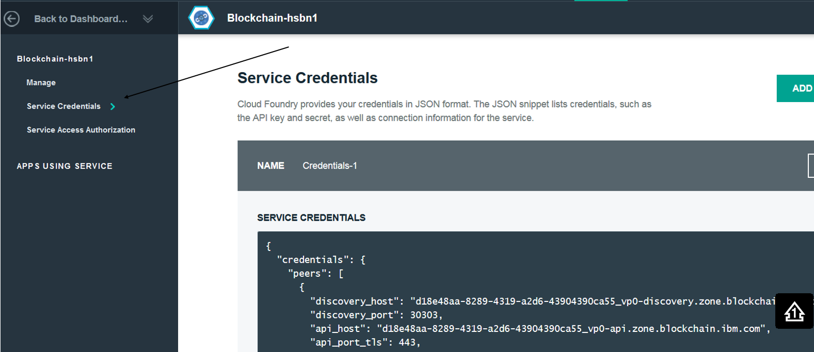

---

copyright:
years: 2016

---

{:new_window: target="_blank"}
{:shortdesc: .shortdesc}
{:codeblock: .codeblock}
{:screen: .screen}
{:pre: .pre}


# HFC SDK per Node.js
{: #etn_sdk}
Ultimo aggiornamento: 07 ottobre 2016
{: .last-updated}

L'HFC (Hyperledger Fabric Client) SDK consente agli sviluppatori di applicazioni di mettere a punto delle applicazioni Node.js che interagiscono con
una rete blockchain. Le applicazioni Node.js che si avvalgono dell'HFC SDK possono essere utilizzate per eseguire le seguenti attività di rete:
{:shortdesc}

* Eseguire la registrazione e il completamento della registrazione degli utenti in modo protetto. Un amministratore di applicazione web con l'autorizzazione `registrar` può eseguire dinamicamente la registrazione e il completamento della registrazione degli utenti che hanno eseguito l'autenticazione presso l'applicazione web.
* Inoltra le transazioni alla rete blockchain (distribuzione, richiamo e query). Tutte le transazioni sono anonime, confidenziali e non collegabili senza l'autorizzazione 'auditor'.
* Memorizzare certificati e chiavi private sensibili in qualsiasi ubicazione, come ad esempio un database esterno al blockchain. Ciò richiede l'implementazione di una semplice interfaccia di memorizzazione di valori chiave.

L'HFC SDK fornisce delle API tramite le quali le applicazioni interagiscono con una rete blockchain Hyperledger Fabric. Queste API sono progettate per supportare due componenti collegabili:

1. Un archivio di valori chiave collegabile, che viene utilizzato per richiamare e memorizzare le chiavi associate a un membro. Il metodo `chain.setKeyValStore()` sovrascrive l'implementazione di archivio di valori chiave basato su file predefinita. L'archivio di valori chiave della catena viene utilizzato per immagazzinare chiavi private sensibili e, pertanto, l'accesso deve essere protetto in modo appropriato.
2. Un servizio membri collegabile, che viene utilizzato per registrare e completare la registrazione di membri. Il metodo `chain.setMemberServices()` sovrascrive l'implementazione predefinita in `MemberServices`. Member Services implementa Hyperledger Fabric come una rete blockchain con autorizzazioni, che fornisce anonimato, non collegabilità delle transazioni e confidenzialità.

Puoi includere l'HFC SDK nella tua applicazione Node.js utilizzando il metodo offline oppure il metodo npm:
*  Metodo offline: copia prima i file dalla struttura ad albero di origine Hyperledger Fabric (https://github.com/hyperledger/fabric/tree/master/sdk/node/lib) nella tua applicazione Node.js `/lib` directory. Includi quindi l'HFC SDK nella tua applicazione aggiungendo il seguente frammento di codice:

```js
var hfc = require("./lib/hfc");
```

* Metodo npm: dalla riga comandi, installa prima l'HFC SDK da npm con il seguente frammento:

```
npm install hfc@0.5.3
```

Includi quindi l'HFC SDK nella tua applicazione con il seguente frammento di codice:

```js
var hfc = require('hfc');
```  
<br>
## Oggetti HFC
{: #objects}

I seguenti oggetti HFC (classi e interface) sono descritti a un alto livello per guidarti meglio nella gerarchia degli oggetti:

* La classe di livello superiore è `Chain`, che è la rappresentazione client di una rete blockchain. HFC ti consente di interagire con più reti e di condividere un singolo oggetto `KeyValStore` e `MemberServices` con più oggetti `Chain`, come necessario. Per ciascuna rete blockchain,
aggiungerai uno o più oggetti `Peer`, che rappresentano gli endpoint a cui si connette l'HFC per inoltrare le transazioni.
* L'interfaccia `KeyValStore` viene utilizzata dall'HFC per memorizzare e richiamare tutti i dati persistenti. Questi dati includono le chiavi private, che devono essere tenute al sicuro. L'implementazione predefinita è una versione basata su file che si trova nella classe `FileKeyValStore`.
* L'interfaccia `MemberServices` è implementata dalla classe `MemberServicesImpl` e fornisce funzioni di sicurezza e correlate all'identità quali la privacy, la non collegabilità e la confidenzialità. Questa implementazione emette *eCert* (certificati di registrazione completata dei membri) e *tCert* (certificati di transazione per ciascun membro).
* La classe `Member` rappresenta gli utenti finali che eseguono transazioni sulla rete e altri tipi di membri quali i peer (nodi). Utilizza la classe `Member`, che interagisce con l'oggetto `MemberServices`, per registrare (*register*) e completare la registrazione (*enroll*) di membri e utenti. Puoi anche eseguire operazioni di distribuzione, query e richiamo del chaincode direttamente dalla classe 'Member' mediante transazioni con gli oggetti`Peer`; questa implementazione delega semplicemente il lavoro a un oggetto `TransactionContext` temporaneo.
* La classe `TransactionContext` implementa il grosso della logica di distribuzione, richiamo e query. Ogni istanza `TransactionContext` riceve un tCert univoco da `MemberServices`, che utilizza sempre per inoltrare le transazioni. Per emettere più transazioni con lo stesso tCert, richiama un
oggetto `TransactionContext` direttamente da un oggetto Member ed emetti più operazioni di distribuzione, richiamo e query. Tuttavia, l'utilizzo di un singolo tCert per più transazioni collega le transazioni in modo che siano identificabili come implicanti lo stesso utente anonimo. Per evitare il collegamento delle transazioni, richiama distribuzione, richiamo e query sull'oggetto `User` o `Member`.  

<br>
## Applicazione Node.js di esempio
{: #nodesample}

La seguente applicazione Node.js di esempio si avvale delle API dell'HFC SDK per interagire con una rete blockchain Bluemix. Il programma funziona con entrambi i piani di rete blockchain (starter e HSBN), e con qualsiasi sistema operativo lato client.

L'obiettivo è quello di utilizzare un'applicazione JavaScript--[helloblockchain.js](https://github.com/IBM-Blockchain/SDK-Demo/blob/master/helloblockchain.js)--per eseguire con esito positivo la distribuzione del chaincode--[chaincode_example02](https://github.com/IBM-Blockchain/SDK-Demo/blob/master/chaincode_example02.go)--alla tua rete Bluemix, seguita da un richiamo e una query.  

1. Questo programma richiede sia Node.js che il gestore pacchetto JavaScript npm.  L'installazione della versione più recente di [Node.js](https://nodejs.org/en/) includerà automaticamente npm.  

1. Apri un terminale e crea una directory (spazio di lavoro) dove metterai i moduli di nodo e il codice sorgente helloblockchain.js. Ad esempio:

    ```
    mkdir -p $HOME/workspace
    ```

1. Vai alla cartella dello spazio di lavoro appena creata e installa HFC v0.5.3 con il seguente comando:

     ```
     cd $HOME/workspace
     npm install hfc@0.5.3
     ```

1. Copia il programma [helloblockchain.js](https://github.com/IBM-Blockchain/SDK-Demo/blob/master/helloblockchain.js) e salvalo nella tua cartella dello spazio di lavoro.  
   La tua directory dello spazio di lavoro (`/workspace`) dovrebbe essere simile al seguente screenshot:

   

1. Se non lo hai ancora fatto, accedi al tile [Blockchain](https://console.ng.bluemix.net/catalog/services/blockchain/) in Bluemix e crea un'istanza del servizio. Seleziona il piano **Starter Developer** oppure il piano **High Security Business Network** ( se approvato). Fai clic sul pulsante **CREA** e ottieni le **Credenziali di servizio** copiando e incollando il file JSON; salvalo come ServiceCredentials.json nella tua directory '/workspace' locale. Assicurati di copiare l'intero payload JSON; dovrebbe essere 202 righe in un editor standard.  **Nota**: quando esegui un'istanza blockchain sul formato della [nuova console](https://new-console.ng.bluemix.net/#overview) Bluemix, noterai una differenza nell'output delle
tue **Credenziali di servizio**.  Specificamente, la riga "credentials" viene rimossa dall'oggetto.  Per correggere ciò, aggiungi il seguente frammento di codice alla riga 2 del tuo file ServiceCredentials.json:

	```
	"credentials": {
	```

1. Aggiungi quindi una `}` di chiusura alla riga 202 per chiudere l'oggetto.  Il layout del tuo ServiceCredentials.json dovrebbe riflettere quello del [ServiceCredentials.json](https://github.com/IBM-Blockchain/SDK-Demo/blob/master/ServiceCredentials.json) di esempio, lasciandoti con un payload di 202 righe. Se ottieni le tue credenziali da un'istanza blockchain derivata dal formato della [console classica](https://console.ng.bluemix.net/) Bluemix, non dovrai preoccuparti di questa discrepanza.  Gli screenshot di seguito illustrano le differenze nei due layout, con quello iniziale che mostra la *nuova console* e quello successivo che mostra quella *classica*:

     

     

1. Dopo l'aggiunta di ServiceCredentials.json, la tua directory `/workspace` dovrebbe essere simile al seguente screenshot:

     

1. Quando il programma viene eseguito, l'HFC SDK crea la directory `keyValStore` in $HOME/workspace.  Questa directory `keyValStore`
contiene le chiavi crittografiche per ciascun utente con la registrazione completa.  Non devi eliminare la directory `keyValStore` quando ti connetti alle
nuove reti Bluemix; verranno piuttosto create delle directory `keyValStore` univoche per ciascuna istanza Bluemix.  

1. Crea una directory chaincode nel tuo $GOPATH, come mostrato di seguito. Se non hai ancora impostato un $GOPATH sulla tua macchina, attieniti alle istruzioni [qui](https://github.com/golang/go/wiki/GOPGATH).

	```
	mkdir -p $GOPATH/src/chaincode_example02
	```

1. Copia [chaincode_example02.go](https://github.com/IBM-Blockchain/SDK-Demo/blob/master/chaincode_example02.go) in questa nuova directory - `$GOPATH/src/chaincode_example02`.  Questa è la parte effettiva del chaincode che verrà distribuita alla rete Bluemix dopo che esegui il programma.  

1. Richiama [vendor.zip](https://github.com/IBM-Blockchain/SDK-Demo/blob/master/vendor.zip) e salvalo nella stessa directory - `$GOPATH/src/chaincode_example02`. Il pacchetto vendor.zip contiene le librerie e le dipendenze dalla base di codice Hyperledger Fabric v0.5. L'estrazione di Windows predefinita crea un percorso simile a: **C:\GOPATH\src\chaincode_example02\vendor**. Prima dell'estrazione, devi eliminare la directory `\vendor` da questo percorso altrimenti la distribuzione del chaincode non riuscirà. Un percorso corretto su Windows sarà simile al seguente:  **C:\GOPATH\src\chaincode_example02\vendor\github.com\hyperledger\fabric**. (Nota: una directory `\vendor` è corretta).  L'irregolarità di una seconda directory `\vendor` non si verifica su Linux o OS X.

1. Dovresti avere ora una directory nel tuo $GOPATH che è simile al seguente esempio:

    

1. Dalla tua directory '/workspace' locale, esegui il programma di nodo:

	```
	node helloblockchain.js -c chaincode_example02
	```
	Abilita i log di debug:
	```
	DEBUG=hfc node helloblockchain.js -c chaincode_example02
	```

	Abilita le tracce gRPC:
	```
	GRPC_TRACE=all DEBUG=hfc node helloblockchain.js -c chaincode_example02
	```

Se le transazioni di distribuzione (`deploy`), richiamo (`invoke`) e `query` vengono eseguite correttamente, vederai i seguenti messaggi nel tuo terminale:

```
Successfully deployed chaincode: request={"fcn":"init","args":["a","100","b","200"],"certificatePath":"/certs/blockchain-cert.pem","chaincodePath":"github.com/chaincode_example02/"}, response={"uuid":"2d6ad8d6-1390-4c60-a01b-f4c301175eb7","chaincodeID":"9be0a0ed3f1788e8728c8911c747d2f6d0e205fa63422dc598d498fe709b9b8d","result":"TODO: get actual results; waited 120 seconds and assumed deploy was successful"}

Successfully submitted chaincode invoke transaction: request={"chaincodeID":"9be0a0ed3f1788e8728c8911c747d2f6d0e205fa63422dc598d498fe709b9b8d","fcn":"invoke","args":["a","b","1"]}, response={"uuid":"f9a902d2-44d8-4b68-b43d-419470ba73ae"}

Successfully completed chaincode invoke transaction: request={"chaincodeID":"9be0a0ed3f1788e8728c8911c747d2f6d0e205fa63422dc598d498fe709b9b8d","fcn":"invoke","args":["a","b","1"]}, response={"result":"waited 20 seconds and assumed invoke was successful"}

Successfully queried  chaincode function: request={"chaincodeID":"9be0a0ed3f1788e8728c8911c747d2f6d0e205fa63422dc598d498fe709b9b8d","fcn":"query","args":["a"]}, value=99
```

Tieni presente che, in caso di esecuzione su una rete Starter Developer, possono a volte volerci fino a 10 minuti perché il tuo contenitore chaincode venga avviato.  Tuttavia, una volta avviato, le distribuzioni e le chiamate successive verranno eseguite immediatamente, perché i file prerequisiti sono stati memorizzati sulla macchina host per l'istanza blockchain.  

Passa alla scheda **Blockchain** dalla tua **Console di rete**. Questa vista mostra i blocchi che vengono accodati al registro blockchain man mano che il programma helloblockchain.js emette transazioni di distribuzione e richiamo. Il seguente screenshot mostra i risultati dell'esecuzione di helloblockchain.js di due volte, con gli argomenti predefiniti per "a" e "b":

     

<br>
## Risoluzione dei problemi
Accertati che stai eseguendo **hfc@0.5.3** emettendo o l'uno o l'altro dei seguenti comandi dalla tua directory **/workspace**:
  * npm list | grep hfc
  * npm list -g | grep hfc  (se installato utilizzando l'indicatore `-g` globale)

Utilizza la seguente procedura se ricevi un messaggio di query:

  ```
Failed to query chaincode, function: request={"chaincodeID":"9be0a0ed3f1788e8728c8911c747d2f6d0e205fa63422dc598d498fe709b9b8d","fcn":"query","args":["a"]}, error={"error":{"status":"FAILURE","msg":{"type":"Buffer","data":[69,114,114,111,114,58,70,97,105,108,101,100,32,116,111,32,108,97,117,110,99,104,32,99,104,97,105,110,99,111,100,101,32,115,112,101,99,40,112,114,101,109,97,116,117,114,101,32,101,120,101,99,117,116,105,111,110,32,45,32,99,104,97,105,110,99,111,100,101,32,40,57,98,101,48,97,48,101,100,51,102,49,55,56,56,101,56,55,50,56,99,56,57,49,49,99,55,52,55,100,50,102,54,100,48,101,50,48,53,102,97,54,51,52,50,50,100,99,53,57,56,100,52,57,56,102,101,55,48,57,98,57,98,56,100,41,32,105,115,32,98,101,105,110,103,32,108,97,117,110,99,104,101,100,41]}},"msg":"Error:Failed to launch chaincode spec(premature execution - chaincode (9be0a0ed3f1788e8728c8911c747d2f6d0e205fa63422dc598d498fe709b9b8d) is being launched)"}
  ```

Aumenta il tempo di attesa della distribuzione nell'applicazione Node.js. Il valore predefinito è impostato su 60 secondi ma la distribuzione, la compilazione e l'avvio dell'esecuzione nel contenitore Dock corretti del codice può richiedere più tempo. Prova ad aumentare il tempo di attesa della distribuzione a 120 secondi. Questa idiosincrasia è stata osservata solo nei piani Starter Developer a causa delle risorse di calcolo condivise sulla macchina che ospita la tua istanza blockchain:

  ```js
chain.setDeployWaitTime(120);
  ```

Dopo che il tuo chaincode è stato distribuito correttamente sulla rete, puoi ridurre il tempo di attesa della distribuzione a una quantità nominale, come ad esempio pochi secondi.

Se ricevi un errore di handshake, prova una versione di `grpc` differente. Puoi accedere alla tua versione di grpc con l'uno o l'altro dei seguenti comandi:
    - `npm list | grep grpc`
    - `npm list -g | grep grpc`  

<br>
## Chiavi pubbliche e private
{: #keys}

Hyperledger Fabric utilizza le autorità di certificazione, e le loro chiavi pubbliche e private sottostanti, per soddisfare i requisiti di sicurezza delle attività di business che operano su un blockchain condiviso. La gestione dell'identità dei membri, la gestione dei ruoli e la privacy transazionale possono essere tutte controllate tramite l'HFC SDK.

La privacy degli utenti e quella transazionale su un blockchain condiviso sono gestite tramite l'implementazione di un framework PKI (Public Key Infrastructure). La PKI, tramite le autorità di certificazione, gestisce la generazione, la distribuzione e la revoca di chiavi e certificati digitali. Le specifiche tecniche complete per PKI e Membership Services sono descritte nella sezione relativa alla sicurezza di Hyperledger Fabric v0.5 [protocol specification](https://github.com/hyperledger/fabric/blob/master/docs/protocol-spec.md). I principi di base della PKI di Hyperledger Fabric sono spiegati qui di seguito:

1. L'Autorità di registrazione (o RA, Registration Authority) convalida l'identità di un utente che sta richiedendo l'accesso alla rete blockchain.  Tale operazione può essere eseguita dinamicamente da un utente con l'autorizzazione `registrar` oppure manualmente modificando il file membersrvc.yaml. Il processo di registrazione si verifica fuori banda e viene eseguito tramite la funzione `RegisterUser`. RA assegna le credenziali di registrazione `<enrollID>` e `<enrollPWD>` all'utentethe user.

2. L'utente invia quindi una richiesta di registrazione completa all'Autorità di certificazione di registrazione completa (o ECA, Enrollment Certificate Authority) utilizzando la funzione `CreateCertificatePair`. Questo payload contiene la `<enrollPWD>` a singolo utilizzo dell'utente, la chiave di verifica della firma pubblica e la chiave di crittografia pubblica, ed è firmato con la chiave di verifica della firma privata dell'utente. <br><br>Quando riceve la richiesta di registrazione completa, l'ECA emette una richiesta di verifica crittografata all'utente che può essere decrittografata solo con la chiave di crittografia privata dell'utente. Dopo la decrittografia della richiesta di verifica, l'utente invia nuovamente la richiesta di certificato. L'ECA, subordinatamente a una risposta decrittografata accuratamente, restituisce una coppia di certificati autenticati firmata con la sua firma digitale. <br><br>La firma digitale viene prodotta eseguendo crittograficamente l'hashing della richiesta di certificato (messaggio) utilizzando l'algoritmo SHA-2 per produrre un "digest". Questo "digest del messaggio" viene quindi crittografato con la chiave di firma privata dell'ECA. I membri della rete possono quindi autenticare la firma digitale decrittografandola con la chiave di firma pubblica dell'ECA. La coppia di certificati di registrazione completa restituita contiene un certificato per la firma dei dati (privato) e uno per la decrittografia dei dati (pubblico). Questa coppia di eCert è statica e a lungo termine e può essere visibile o invisibile alle transazioni.

3. Per eseguire transazioni su qualsiasi rete blockchain, ciascun utente deve disporre anche di certificati di transazione (tCert). Dopo la corretta esecuzione della registrazione completa, un utente inoltra una richiesta all'Autorità di certificazione delle transazioni (o TCA, Transaction Certificate Authority) per un batch di tCert. Un tCert è a breve termine, specifico per una singola transazione, e può essere modificato dal client utilizzando una API. Dopo aver verificato l'eCert dell'utente, la TCA assegna un batch di tCert e una KeyDF_Key (Key Derivation Function Key), che consente all'utente di decrittografare le relative chiavi private. Mentre la KeyDF_Key singola viene utilizzata per ciascun tCert nel batch, la conseguente chiave privata generata è univoca per ciascun tCert. Per eseguire transazioni, un client deve poter firmare il payload della transazione con la chiave privata decrittografata. Solo allora una transazione viene inoltrata ai peer di convalida della rete per il consenso.
