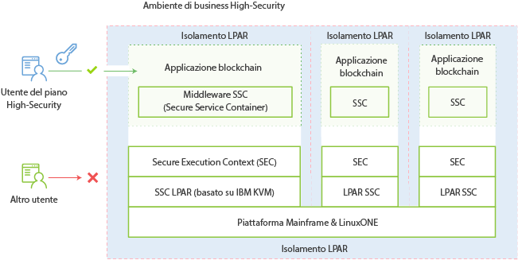

---

copyright:
  years: 2017
lastupdated: "2017-03-15"
---

{:new_window: target="_blank"}
{:shortdesc: .shortdesc}
{:codeblock: .codeblock}
{:screen: .screen}
{:pre: .pre}

# IBM Secure Service Container
{: #etn_ssc}

Il piano **HSBN vNext Beta** e il piano HSBN vengono distribuiti in forma di applicazione in IBM Secure Service Container, che fornisce l'infrastruttura di base per ospitare i servizi blockchain. L'applicazione combina sistemi operativi, contenitori Docker e componenti middleware e software che operano autonomamente e fornisce i servizi di base e l'infrastruttura con una sicurezza ottimizzata.
{:shortdesc}

Il seguente diagramma dell'architettura illustra in che modo sono organizzati IBM Secure Service Container e le applicazioni blockchain:

*Figura 1. Panoramica di IBM Secure Service Container e applicazioni blockchain*

IBM Secure Service Container porta la crittografia, la sicurezza e l'affidabilità avanzate della piattaforma z Systems LinuxONE ai servizi blockchain per gestire dati sensibili e regolamentati. Blockchain è protetto tramite una serie di funzioni da IBM Secure Service Container: sistema operativo incapsulato, dischi di applicazioni crittografati, protezione da manomissioni, memoria protetta e forte isolamento LPAR che possono essere configurati in modo da soddisfare i requisiti della certificazione EAL5+.

## Funzioni di sicurezza chiave
IBM Secure Service Container fornisce le seguenti funzioni di sicurezza ottimizzate per i servizi blockchain:  

### Protezione dagli amministratori di sistema
>Al codice dell'applicazione non possono accedere neanche gli amministratori di piattaforma o sistema.  L'accesso ai dati è controllato dall'applicazione e, pertanto, l'accesso non autorizzato è disabilitato.  Ciò è supportato tramite una combinazione di firma e crittografia di tutti i dati in transito e statici. Viene rimosso anche tutto l'accesso alla memoria. Il firmware supporta ciò con una architettura di avvio protetto.

>Gli amministratori di sistema hanno le seguenti limitazioni quando il blockchain è protetto da IBM Secure Service Container:
>* Non possono accedere ai nodi
>* Non possono visualizzare la rete blockchain

### Protezione da manomissioni  
>IBM Secure Service Container disabilita tutte le interfacce esterne che forniscono accesso alla memoria LPAR. Un caricatore di avvio dell'immagine è firmato per garantire che non possa essere manomesso o scambiato con uno diverso.

### Dischi applicazione crittografati
>Tutto il codice e tutti i dati memorizzati su disco sono sempre crittografati utilizzando il livello di crittografia Linux:  
- Sistema operativo incapsulato
- IP protetto
- Monitoraggio e autocorrezione incorporati  
