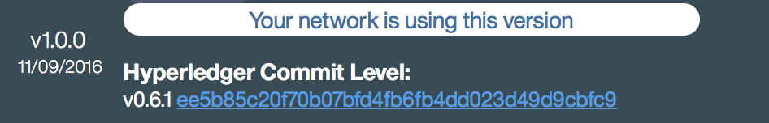

---

copyright:
  years: 2016
lastupdated: "2016-11-08"
---

{:new_window: target="_blank"}
{:shortdesc: .shortdesc}
{:screen: .screen}
{:codeblock: .codeblock}
{:pre: .pre}

# Applicazioni di esempio ed esercitazioni
{: #1stanchor}


seguenti esempi illustrano la modalità di funzionamento di applicazioni e chaincode in una rete IBM Blockchain di test. Per ulteriori informazioni sul codice Hyperledger Fabric v0.6, che è alla base delle reti IBM Blockchain, visita la [Fabric Docs](https://github.com/hyperledger/fabric/tree/v0.6/docs) per il progetto Hyperledger della Linux Foundation.  
{:shortdesc}

Per provare le applicazioni chaincode in azione, puoi distribuire immediatamente le demo Marbles, Commercial Paper o Car Lease qui di seguito (fai clic su un pulsante Distribuisci a Bluemix). Altrimenti, continua a leggere per esplorare l'esercitazione Hello Chaincode.

- [](https://bluemix.net/deploy?repository=https://github.com/ibm-blockchain/marbles.git)  **Marbles**
- [](https://bluemix.net/deploy?repository=https://github.com/IBM-Blockchain/cp-web.git)  **Commercial Paper**
- [](https://bluemix.net/deploy?repository=https://github.com/IBM-Blockchain/car-lease-demo.git)  **Car Lease**  

<br>
## Ulteriori informazioni sull'esercitazione del chaincode
{: #hellocc}
Questa esercitazione ti guida nell'utilizzo degli elementi di base per codificare una semplice applicazione chaincode. Svilupperai in modo incrementale un chaincode funzionante che crea le risorse generiche per lo scambio su una rete. Interagirai quindi con il chaincode tramite la API di rete. Dopo aver completato questa esercitazione, sarai in grado di rispondere alle seguenti domande:
- Cos'è chaincode?
- Come implemento il chaincode?
- Quali dipendenze esistono?
- Quali sono le funzioni principali?
- Come passo diversi valori ai miei argomenti?
- Come completo la registrazione in modo protetto di un utente sulla mia rete?
- Come compilo il mio chaincode?
- Come interagisco con il chaincode tramite la API REST?

### Cos'è chaincode?
Chaincode è codice Go (Golang) o Java che consente agli utenti di interagire con una rete blockchain. Quando 'richiami' una transazione sulla rete, richiami una funzione in chaincode che legge e scrive valori nel registro.  

<br>
## Impostazione dell'ambiente di sviluppo
Per avviare lo sviluppo del chaincode, installa prima i seguenti strumenti e dipendenze raccomandati:

### Git

- [Git download page](https://git-scm.com/downloads)
- [Pro Git book](https://git-scm.com/book/en/v2)
- [Git Desktop (an alternative to the Git CLI)](https://desktop.github.com/)

Git è un potente strumento di controllo della versione per lo sviluppo del chaincode e per lo sviluppo del software in generale. Git Bash, che viene installato con Git per Windows, è il terminale della riga di comando raccomandato.

Dopo aver completato le installazioni di Git, verifica che Git sia installato:

```
$ git version
git version 2.9.0.windows.1
```

Dopo aver installato Git, crea un account per te stesso su [GitHub](https://github.com/). Il servizio IBM Blockchain su Bluemix richiede che il chaincode sia in un repository GitHub per la distribuzione tramite l'API REST.  

## Go

Go è al momento l'unico linguaggio supportato per la scrittura del chaincode in Bluemix. L'installazione di Go include una serie di strumenti della CLI utili per la scrittura del chaincode. Ad esempio, il comando `go build` ti permette di compilare il tuo chaincode prima di tentare di distribuirlo in una rete. Installa Go v1.6, che è la versione utilizzata per lo sviluppo di Hyperledger Fabric v0.6:  

- [Go 1.6 install](https://golang.org/dl/#go1.6.3)
- [Go installation instructions](https://golang.org/doc/install)
- [Go documentation and tutorials](https://golang.org/doc/)

Verifica che Go sia stato correttamente installato eseguendo i seguenti comandi. L'output del comando `go version` può variare, a seconda del tuo sistema operativo:

```
$ go version
go version go1.6.3 windows/amd64

$ echo $GOPATH
C:\gopath
```

La tua variabile di ambiente `GOPATH` non deve corrispondere all'esempio precedente, ma devi utilizzare una directory valida nel tuo file system. Quando esegui `go build` per verificare che il tuo chaincode sia in compilazione, Go ricerca nella directory `$GOPATH/src` tutte le dipendenze non standard che elenchi nel blocco `import` nel tuo chaincode. [Go installation instructions](https://golang.org/doc/install) ti guidano nella configurazione della variabile di ambiente GOPATH.  

<br>
## Hyperledger Fabric

Sono supportate due versioni di Hyperledger Fabric per Blockchain in Bluemix: v0.5 e v0.6.  Come descritto qui di seguito, la tua versione del chaincode deve essere allineata alla versione di Hyperledger nella tua rete Bluemix.

Attenzione:
1. Per abilitare le funzioni di lettura e scrittura sul registro, il tuo chaincode deve importare lo shim da Hyperledger Fabric.
2. Per compilare il tuo chaincode localmente, devi aver specificato l'ubicazione del codice Hyperledger Fabric nella tua variabile di ambiente `GOPATH`.

Per determinare quale versione di Hyperledger Fabric la tua istanza Bluemix sta eseguendo, fai clic sulla scheda **Stato servizio** nel tuo monitoraggio del dashboard.  Scorri fino alla sezione **Note sulla release**; il pannello `La tua rete sta utilizzando questa versione` visualizzerà il **Livello di commit di Hyperledger** che stai eseguendo:


Figura 1. Versione Hyperledger Fabric

La tua versione del chaincode deve essere allineata alla versione di Hyperledger Fabric a cui distribuirai il tuo chaincode. Ad esempio, la rete rappresentata nella Figura 1 richiede la clonazione della base di codice Hyperledger Fabric v0.6-preview. La base di codice fabric, per entrambe le versioni, deve essere archiviato nel tuo percorso `$GOPATH/hyperledger/fabric`:

- [v0.5 Hyperledger Fabric](https://github.com/hyperledger-archives/fabric/tree/v0.5-developer-preview)
- [v0.6 HHyperledger Fabric](https://gerrit.hyperledger.org/r/gitweb?p=fabric.git;a=shortlog;h=refs/heads/v0.6)

Per installare la base di codice Hyperledger Fabric v0.5, utilizza il seguente comando git clone:

```
# Crea le directory principali nel tuo GOPATH
mkdir -p $GOPATH/src/github.com/hyperledger
cd $GOAPTH/src/github.com/hyperledger

# Clona la base di codice della release appropriata in $GOPATH/src/github.com/hyperledger/fabric
# Tieni presente che la release v0.5 è un ramo del repository.  Definita dopo l'argomento -b
git clone -b v0.5-developer-preview https://github.com/hyperledger-archives/fabric.git
```

Per installare la base di codice Hyperledger Fabric v0.6, utilizza il seguente comando git clone:

```
# La release v0.6 esiste come un ramo nel repository fabric Gerrit
git clone -b v0.6 http://gerrit.hyperledger.org/r/fabric
```

Se il fabric non è stato correttamente installato nel tuo `GOPATH`, il tuo chaincode restituirà un errore simile al seguente esempio:
```
$ go build .
chaincode_example02.go:27:2: cannot find package "github.com/hyperledger/fabric/core/chaincode/shim" in any of:
        C:\Go\src\github.com\hyperledger\fabric\core\chaincode\shim (from $GOROOT)
        C:\gopath\src\github.com\hyperledger\fabric\core\chaincode\shim (from $GOPATH)
```

### Configura la tua pipeline di sviluppo

Utilizza le seguenti istruzioni per configurare una pipeline per la scrittura, la creazione e la verifica del tuo chaincode. Scriverai il chaincode nella tua macchina locale, verificherai che è stato compilato e lo caricherai su GitHub. Quindi lo distribuirai e verificherai sulla rete Bluemix utilizzando l'API REST fabric.

1. Dividi la versione corretta del repository [learn chaincode](https://github.com/IBM-Blockchain/learn-chaincode) per la tua versione di rete al tuo account GitHub. Dividi v1.0 in una rete fabric v0.5 o dividi v2.0 in una rete fabric v0.6. Un'opzione è di utilizzare il pulsante **Fork**, posizionato nell'angolo in alto a destra nella pagina del repository. Dividere le copie del repository completo nella tua macchina locale, inclusi tutti i rami che vengono mostrati facendo clic sul pulsante **Branch:** nell'angolo in alto a sinistra nella pagina. Per eseguire la divisione utilizzando la CLI, immetti i seguenti comandi nella shell Git Bash:

2. Clona la tua divisione nel tuo $GOPATH:

  ```bash
  cd $GOPATH
  mkdir -p src/github.com/<YOUR_GITHUB_ID_HERE>/
  cd src/github.com/<YOUR_GITHUB_ID_HERE>/
  git clone -b v1.0 https://github.com/<YOUR_GITHUB_ID_HERE>/learn-chaincode.git
  OR
  git clone -b v2.0 https://github.com/<YOUR_GITHUB_ID_HERE>/learn-chaincode.git
  ```

  Ora hai una copia della tua divisione nella tua macchina locale. Scriverai il chaincode modificando o aggiungendo i file locali, eseguendo il loro push alla tua divisione GitHub e quindi distribuirai il tuo chaincode alla tua rete blockchain utilizzando l'API REST in un peer di rete.

3. Vengono fornite due versioni del chaincode utilizzato in questa esercitazione: **start** è il chaincode di base da cui patirai e **finished* è il tuo chaincode completato pronto per la build. Per prima cosa, assicurati che **start** sia stato creato nel tuo ambiente locale:

  ```bash
  cd $GOPATH/src/github.com/<YOUR_GITHUB_ID_HERE>/learn-chaincode/start
  go build ./
  ```

La versione **start** del learn-chaincode deve essere compilata senza errori o messaggi. Se questo non si verifica, rivedi le precedenti istruzioni per la corretta installazione di Go.

5. Scrivi le modifiche nei tuoi file chaincode locali ed esegui il push dei file aggiornati alla tua divisione GitHub:

  ```bash
  cd $GOPATH/src/github.com/<YOUR_GITHUB_ID_HERE>/learn-chaincode/
  # Consulta quali file sono stati modificati localmente.  Dovresti visualizzare chaincode_start.go
  git status
  # Prepara tutte le modifiche nel repository locale per il commit
  git add --all
  # Esegui il commit di tutte le modifiche preparate.  Inserisci una breve descrizione dopo l'argomento -m
  git commit -m "Compiled my code"
  # Riesegui il push dei commit locali a https://github.com/<YOUR_GITHUB_ID_HERE>/learn-chaincode/
  git push
  ```

#### Implementa l'interfaccia chaincode
Il tuo prossimo passo è di implementare l'interfaccia shim chaincode nel tuo codice Go. Le tre funzioni principali sono **Init**, **Invoke** e **Query**. Tutte e tre le funzioni prendono un nome funzione e un array di stringhe come input ma sono richiamate in punti differenti. Il tuo percorso di sviluppo termina con n chaincode funzionante che crea risorse generiche per lo scambio si una rete blockchain.

### Dipendenze
L'istruzione `import` elenca le dipendenze per la creazione del tuo chaincode:
1. `fmt` - contiene `Println` per attività di debug/registrazione.
2. `errors` - formato di errore Go standard.
3. `github.com/hyperledger/fabric/core/chaincode/shim` - codice che interfaccia il tuo codice Golang con un peer di rete.

#### Init()
La funzione `Init` viene richiamata quando distribuisci per la prima volta il tuo chaincode. Come è implicito nel nome, utilizza questa funzione per inizializzare il tuo chaincode. In questo esempio, utilizziamo `Init` per configurare lo stato iniziale di una sola coppia chiave/valore nel registro.

Nel tuo file `chaincode_start.go`, modifica la funzione `Init` in modo che memorizzi il primo elemento `args` nella chiave "hello_world":

```go
func (t *SimpleChaincode) Init(stub shim.ChaincodeStubInterface, function string, args []string) ([]byte, error) {
	if len(args) != 1 {
		return nil, errors.New("Incorrect number of arguments. Expecting 1")
	}

	err := stub.PutState("hello_world", []byte(args[0]))
	if err != nil {
		return nil, err
	}

	return nil, nil
}
```

Questa operazione viene eseguita utilizzando la funzione stub `stub.PutState`. Questa funzione interpreta il primo argomento inviato nella richiesta di distribuzione come il valore da archiviare nella chiave 'hello_world'. Se si verifica un errore perché è stato trasmesso un numero sbagliato di argomenti o perché qualcosa non ha funzionato durante la scrittura nel registro, questa funzione restituisce un errore. Altrimenti, termina senza errori e senza restituire alcun messaggio.  

#### Invoke()
Utilizza la funzione `Invoke` per richiamare le funzioni chaincode per eseguire del "lavoro reale" nella rete blockchain. Le funzioni Invoke sono acquisite come transazioni, che vengono raggruppate in blocchi per la scrittura nel registro. L'aggiornamento del registro viene archiviato richiamando il tuo chaincode. La struttura di `Invoke` è semplice; riceve una funzione o un array di argomenti. In base alla funzione trasmessa dal parametro della funzione nella richiesta di richiamo, `Invoke` richiamerà una funzione di supporto o restituirà un errore.

Nel tuo file `chaincode_start.go`, modifica la funzione `Invoke` per richiamare una funzione di scrittura generica:

```go
func (t *SimpleChaincode) Invoke(stub shim.ChaincodeStubInterface, function string, args []string) ([]byte, error) {
	fmt.Println("invoke is running " + function)

	// Handle different functions
	if function == "init" {
		return t.Init(stub, "init", args)
	} else if function == "write" {
		return t.write(stub, args)
	}
	fmt.Println("invoke did not find func: " + function)

	return nil, errors.New("Received unknown function invocation")
}
```

Il codice sta ora cercando `write`; aggiungi quindi la funzione di scrittura al tuo file `chaincode_start.go`:

```go
func (t *SimpleChaincode) write(stub shim.ChaincodeStubInterface, args []string) ([]byte, error) {
	var name, value string
	var err error
	fmt.Println("running write()")

	if len(args) != 2 {
		return nil, errors.New("Incorrect number of arguments. Expecting 2. name of the variable and value to set")
	}

	name = args[0]                            //rename for fun
	value = args[1]
	err = stub.PutState(name, []byte(value))  //write the variable into the chaincode state
	if err != nil {
		return nil, err
	}
	return nil, nil
}
```

Questa funzione `write` dovrebbe presentarsi in modo simile alla precedente modifica `Init`. Puoi ora impostare la chiave e il valore per`PutState`, che ti consente di memorizzare qualsiasi coppia chiave/valore nel registro del blockchain.

#### Query()
La funzione `Query` viene richiamata per eseguire una query dello stato del tuo chaincode e non aggiunge blocchi alla catena (ledger). Solo le funzioni di distribuzione e richiamano aggiungono dei nuovi blocchi. Utilizza `Query` per leggere il valore delle coppie chiave/valore dello stato del tuo chaincode.

Nel tuo file `chaincode_start.go`, modifica la funzione `Query` in modo che richiami una funzione di lettura (read) generica:

```go
func (t *SimpleChaincode) Query(stub shim.ChaincodeStubInterface, function string, args []string) ([]byte, error) {
	fmt.Println("query is running " + function)

	// Handle different functions
	if function == "read" {                            //read a variable
		return t.read(stub, args)
	}
	fmt.Println("query did not find func: " + function)

	return nil, errors.New("Received unknown function query")
}
```

Il codice sta ora cercando `read`; aggiungi quindi la funzione di 'lettura' al tuo file `chaincode_start.go`:

```go
func (t *SimpleChaincode) read(stub shim.ChaincodeStubInterface, args []string) ([]byte, error) {
	var name, jsonResp string
	var err error

	if len(args) != 1 {
		return nil, errors.New("Incorrect number of arguments. Expecting name of the var to query")
	}

	name = args[0]
	valAsbytes, err := stub.GetState(name)
	if err != nil {
		jsonResp = "{\"Error\":\"Failed to get state for " + name + "\"}"
		return nil, errors.New(jsonResp)
	}

	return valAsbytes, nil
}
```

Questa funzione `read` utilizza `GetState`, che è il complemento di `PutState`. Questa funzione shim prende solo un singolo argomento stringa: il nome della chiave da richiamare. Questa funzione restituisce quindi il valore, come un array di byte, a `Query`, che a sua volta lo invia al gestore REST.

#### Main()
La funzione `main` viene eseguita quando ciascun peer distribuisce la sua istanza del chaincode. Avvia il chaincode e lo registra presso il peer. Non è richiesto alcun aggiornamento del codice per 'main'; sia chaincode_start.go che chaincode_finished.go includono una funzione `main` all'inizio di ciascun file:

```go
func main() {
	err := shim.Start(new(SimpleChaincode))
	if err != nil {
		fmt.Printf("Error starting Simple chaincode: %s", err)
	}
}
```

### Interazione con il tuo chaincode
Il modo più rapido per testare il tuo chaincode consiste nell'utilizzare l'interfaccia REST sui tuoi peer.
L'IU Swagger sul tuo monitor dashboard Bluemix ti consente di provare la distribuzione di chaincode senza scrivere del codice aggiuntivo.  

#### API Swagger
Per utilizzare la API Swagger, completa la seguente procedura:

1. Accedi a [Bluemix](https://console.ng.bluemix.net/login) e accertati di essere nella scheda **Dashboard**.
1. Controlla di trovarti nello stesso "spazio" Bluemix che contiene il tuo servizio IBM Blockchain. Lo spostamento nello spazio si trova sulla sinistra.
1. Vicino alla parte inferiore si trova un pannello **Servizi**; fai clic sul tuo servizio IBM Blockchain.
1. Dovresti vedere un messaggio di benvenuto in IBM Blockchain; fai clic sul pulsante **AVVIA** sulla destra.
1. Nella pagina del monitor, dovresti vedere due tabelle; la tabella inferiore potrebbe essere vuota.
	- **Scheda Rete:**
		- I **log dei peer** si trovano nella tabella superiore. Nella riga per **peer 1**, fai clic sull'icona di file per visualizzare il log. Oltre a questa vista statica, ci sono dei **log dei peer in streaming** dal vivo nella scheda **Visualizza i log** vicino alla parte superiore della pagina.
		- I **log dei chaincode** si trovano nella tabella inferiore. Ogni chaincode è etichettato con l'hash di chaincode restituito quando è stato distribuito. Seleziona il peer in qualsiasi riga di chaincode e fai quindi clic sull'icona di file per visualizzare il log.
	- **Scheda API**: visualizza la pagina di documentazione della API Swagger.
1. Continua con la seguente procedura per implementare il completamento della registrazione protetto. Le chiamate all'endpoint `/chaincode` nell'interfaccia REST richiedono un ID di contesto protetto. Perché la maggior parte delle chiamate REST venga accettata, devi passare un *enrollID* registrato dall'elenco di credenziali di servizio:
  - Fai clic su **+ ID registrazione di rete** per espandere l'elenco di valori *enrollID* e i loro segreti.
  - Copia la serie di credenziali in un file di testo per un uso successivo.
  - Espandi la sezione API **Registrar**.
  - Espandi la sezione `POST /registrar`.
  - Compila il campo `Valore` con il JSON che specifica un `enrollID` e `enrollSecret' dalle tue credenziali:

  

  Il *Corpo della risposta* dovrebbe essere simile al seguente esempio:

  

Ora che hai impostato un `enrollID`, puoi utilizzare questo ID quando distribuisci, richiami ed esegui query del chaincode nei passi successivi.
### Distribuzione del tuo chaincode
Per distribuire il tuo chaincode tramite l'interfaccia REST; il tuo chaincode deve essere memorizzato in un repository GitHub pubblico. Quando invii una richiesta di distribuzione a un peer, specifichi l'URL per il repository di chaincode e i parametri per inizializzare il chaincode.

**Prima di distribuire** il tuo chaincode, verifica che esegua l'attività di sviluppo in locale:
1. Apri un prompt dei comandi e vai alla directory che contiene `chaincode_start.go`. Immetti il seguente comando:
	```
	go build ./
	```
1. Espandi la sezione API **Chaincode**.
1. Espandi la sezione `POST /chaincode`.
1. Imposta il campo di testo `DeploySpec` (svuota gli altri campi) con il codice di esempio qui di seguito, specificando il tuo percorso al repository di chaincode e l'`enrollID` dal passo `/registrar` precedente. Il `"path":` dovrebbe presentarsi simile a: `"https://github.com/johndoe/learn-chaincode/finished"`. Questo è il percorso alla tua biforcazione del repository più il percorso al tuo file chaincode_finished.go:

	```
	{
		"jsonrpc": "2.0",
		"method": "deploy",
		"params": {
			"type": 1,
			"chaincodeID": {
				"path": "https://github.com/ibm-blockchain/learn-chaincode/finished"
			},
			"ctorMsg": {
				"function": "init",
				"args": [
					"hi there"
				]
			},
			"secureContext": "user_type1_xxxxxxxxx"
		},
		"id": 1
	}
	```

  Il *Corpo della risposta* dovrebbe essere simile al seguente esempio:

  

  La risposta per la distribuzione conterrà l'ID per questo chaincode. L'ID è un hash alfanumerico di 128 caratteri, che puoi utilizzare per delle future richieste di richiamo o di query. Copia questo ID nel tuo editor di testo.

#### Query
Esegui una query del tuo chaincode per il valore della chiave `hello_world`, che hai impostato con la funzione `Init`:
1. Espandi la sezione API **Chaincode**.
1. Espandi la sezione `POST /chaincode`.
1. Compila il campo di testo `QuerySpec` (svuota gli altri campi) con il seguente esempio, specificando l'ID chaincode dal passo di distribuzione precedente e l'`enrollID` dal passo `/registrar` precedente:

	```
	{
		"jsonrpc": "2.0",
		"method": "query",
		"params": {
			"type": 1,
			"chaincodeID": {
				"name": "CHAINCODE_HASH_HERE"
			},
			"ctorMsg": {
				"function": "read",
				"args": [
					"hello_world"
				]
			},
			"secureContext": "user_type1_xxxxxxxxx"
		},
		"id": 2
	}
	```
  Il *Corpo della risposta" dovrebbe essere simile al seguente esempio:

  

  Il valore di `hello_world` è "hi there", che è stato impostato dal corpo della chiamata di distribuzione precedente.

#### Richiamo
Richiama la funzione di scrittura (write) generica con `invoke`. Modifica il valore di `hello_world` in "go away":
1. Espandi la sezione API **Chaincode**.
1. Espandi la sezione `POST /chaincode`.
1. Compila il campo di testo `InvokeSpec` (svuota gli altri campi) con il seguente esempio, specificando l'ID chaincode dal passo di distribuzione precedente e l'`enrollID` dal passo `/registrar` precedente:

	```
	{
		"jsonrpc": "2.0",
		"method": "invoke",
		"params": {
			"type": 1,
			"chaincodeID": {
				"name": "CHAINCODE_HASH_HERE"
			},
			"ctorMsg": {
				"function": "write",
				"args": [
					"hello_world",
					"go away"
				]
			},
			"secureContext": "user_type1_xxxxxxxxx"
		},
		"id": 3
	}
	```
  Il *Corpo della risposta" dovrebbe essere simile al seguente esempio:

  

  Esegui nuovamente la query sopra indicata; dovresti ottenere la seguente risposta:

  

Hai appena completato la scrittura di un po' di chaincode di base.  

<br>
## Requisiti per la demo
{: #requirements}

I seguenti prerequisiti, inclusi con il tuo servizio Bluemix, sono obbligatori per eseguire le applicazioni demo Marbles, Commercial Paper e Car Lease. Il tuo ambiente Bluemix clona l'Hyperledger Fabric per fornire queste dipendenze:

- ID Bluemix https://console.ng.bluemix.net/ (richiesto per creare la tua rete IBM Blockchain e fornire le credenziali di servizio per i peer e per l'autorità di certificazione)
- Node.js 0.12.0+ e npm v2+
- Ambiente Golang (richiesto solo per sviluppare un tuo chaincode)

Le demo richiedono inoltre dimestichezza con Node.js e il modulo express. Devi anche avere una comprensione concettuale di 'chaincode', 'registro' (in inglese 'ledger') e 'peer' in un contesto di blockchain; consulta il [glossario di Hyperledger Fabric](https://github.com/hyperledger/fabric/blob/v0.6/docs/glossary.md).  

<br>
## Demo Marbles
{: #marbles}

L'applicazione Marbles illustra un semplice trasferimento di risorsa tra due parti. L'applicazione è progettata per testare l'SDK JavaScript, guidarne lo sviluppo e aiutare gli sviluppatori ad acquisire dimestichezza con l'SDK e il chaincode.

Esplora le [esercitazioni Marbles](https://github.com/IBM-Blockchain/marbles/blob/master/tutorial_part1.md) per capire in che modo applicazione web, SDK e chaincode operano insieme. Se già hai dimestichezza con chaincode e IBM Blockchain, puoi [distribuire manualmente](https://github.com/IBM-Blockchain/marbles/blob/master/tutorial_part1.md#) la demo a Bluemix oppure fare clic sul pulsante Distribuisci a Bluemix per utilizzare l'applicazione web:
  
[](https://bluemix.net/deploy?repository=https://github.com/ibm-blockchain/marbles.git)  

<br>
## Demo Commercial Paper
{: #commercialpaper}

L'applicazione Commercial Paper illustra il modo in cui è possibile implementare una rete di scambi commerciali di commercial paper utilizzando IBM Blockchain. La demo Commercial Paper esplora una rete blockchain con autorizzazioni, su cui ai partecipanti vengono assegnati dei ruoli e i corrispondenti livelli di accesso. Consulta il [README di Commercial Paper](https://github.com/IBM-Blockchain/cp-web#readme) per saperne di più sui componenti di questa demo oppure distribuiscila a Bluemix immediatamente per vedere la rete di scambi commerciali in azione:
  
[](https://bluemix.net/deploy?repository=https://github.com/IBM-Blockchain/cp-web.git)  

<br>
## Demo Car Lease
{: #carlease}

L'applicazione Car Lease illustra il ciclo di vita di un veicolo, andando dalla produzione, passando per diversi proprietari e finendo con la rottamazione del veicolo. La demo utilizza Node.js per la programmazione lato server e Golang per il chaincode in esecuzione sulla rete IBM Blockchain. La demo include anche due istanze di chaincode: una definisce le regole per le transazioni del veicolo e l'altra registra tutte le transazioni del veicolo durante il suo ciclo di vita. Entrambi i programmi chaincode utilizzano gli oggetti JSON per memorizzare i dati. Consulta il [README di Car Lease](https://github.com/IBM-Blockchain/car-lease-demo/blob/master/README.md) per saperne di più sull'architettura dell'applicazione e gli attributi di veicolo associati a questa demo oppure distribuisci la demo immediatamente a Bluemix:
  
[](https://bluemix.net/deploy?repository=https://github.com/IBM-Blockchain/car-lease-demo.git)  

<br>

<!-- comment out - moving to separate file for now jh
## Non-deterministic chaincode
{: #ndcc}

IBM Blockchain networks support deterministic chaincode only. Using non-deterministic chaincode is not supported, and will cause severe errors, on any blockchain network.

**Non-deterministic chaincode** is any chaincode that does **not** result in the same appended value, over time and across nodes, on the blockchain ledger. By contrast, **deterministic chaincode** always produces the same appended value, over time and across nodes, on the blockchain ledger.

### Deterministic chaincode example
An **invoke** transaction that always increments the value of a variable by one is deterministic, because the result is always the same, on every node, without variance. Whenever this transaction is run against a fixed value of five, for example, the appended value is always six, on every node, every time. The network outcome for deterministic chaincode is no divergence in the blockchain; the copy of the ledger on each node always indicates (after syncing) that the value is one greater than the previous invocation.

### Non-deterministic chaincode example
An **invoke** transaction that increments the value of a blockchain variable with the number of elapsed seconds since the start of the day (00:00) is non-deterministic, because over time the value will vary across nodes. Each time this transaction is run against a fixed value of five, for example, the appended value diverges across nodes (with rare exceptions), because the number of elapsed seconds since 00:00 will inevitably vary. The network outcome for this non-deterministic chaincode is divergent blockchains; all nodes will not agree on the value of five + the number of elapsed seconds since 00:00.

### Randomness
Chaincode must exhibit no randomness in the appended values, over time and across nodes. Any randomness produces divergent blockchains across nodes, which must then be resolved by the network. To avoid randomness, you must ensure that no parallel chaincode can affect the input value from invocation chaincode. For example, do not run any **query** transactions in parallel with **invoke** transactions, because parallel queries could produce variance in the invocation values across nodes.

### Using a global variable
Using a global or instance variable to store a value that was retrieved from the ledger, or to set a value on the ledger, can lead to non-determinism. Chaincode should not rely on global or instance variables that will not retain their state across restarts of a chaincode container. The following is an example that uses a global variable; the value of `key`, which is written to the ledger via the `stub.PutState` function, is derived from a global variable:

```go
//declare global variable
var INVOICE_COUNTER int64

//increment the counter and save the state
		INVOICE_COUNTER =INVOICE_COUNTER+1
		key := INVOICE+strconv.FormatInt(INVOICE_COUNTER, 10)
		ccLogger.Infof("The key formed for saving the state: %s", key)
		stub.PutState(key,[]byte(invoiceID))
```

### Iterating over a map type
Iteration over a map type can lead to non-determinism, because order is not deterministic in the Go programming language. The following is an example of iteration over the map named `columnTypes`:

```go
 func generateColumns(colTypes map[string]string, colKeys []bool) ([]*shim.ColumnDefinition, error) {
	var tableColumns []*shim.ColumnDefinition
	keyIndex := 0
	for k, _ := range colTypes {
		tableColumns = append(tableColumns, &shim.ColumnDefinition{k, shim.ColumnDefinition_STRING, colKeys[keyIndex]})

		keyIndex++
	}
	return tableColumns, nil
}
```

-->


<!-- ## Using the Node.js SDK
{: #nodesdk}

Use the [Hyperledger fabric client SDK ](https://github.com/IBM-Blockchain/ibm-blockchain-js/blob/master/README.md) library for easier interaction with an IBM Blockchain network.  The SDK, through importing packages and libraries, allows for an application developer to build Node.js applications that can invoke functionality on the blockchain network from the client side.  Member services and asset management are now pluggable components on client side applications.  See the [Enhanced Node.js SDK](etn_sdk.html) section for full documentation and application examples. -->
