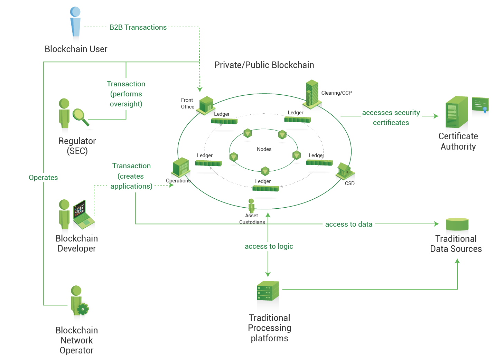

---

copyright:
  years: 2017
lastupdated: "2017-03-16"
---

{:new_window: target="_blank"}
{:shortdesc: .shortdesc}
{:codeblock: .codeblock}
{:screen: .screen}
{:pre: .pre}

# Panoramica della rete HSBN vNext Beta
{: #v10_netoverview}

Il servizio HSBN vNext Beta utilizza Hyperledger Fabric v1.0 per fornire una rete blockchain sicura e con autorizzazioni su cui i membri autenticati possono facilmente definire le risorse e creare soluzioni di business per la modifica e lo scambio di tali risorse.
{:shortdesc}

Questo servizio **semplifica notevolmente** l'arcano e noioso processo di avvio di una rete blockchain a livello aziendale.  Ti vengono forniti il framework e gli strumenti per invitare membri, aggregare vari materiali di identità crittografici, stabilire regole di governance e così via.  Questi processi complicati diventano semplici e intuitivi.  In pochi minuti puoi generare una rete altamente sicura e pienamente funzionale con canali, politiche e diversi stili di logica di business.  

L'**Elevata disponibilità** per i componenti integrali della rete (peer, servizio di ordinamento, Autorità di certificazione, chaincode) elimina gli effetti paralizzanti che possono derivare dai singoli punti di errore.  Un monitor dashboard integrato consente una facile gestione di questi componenti e fornisce un potente meccanismo per visualizzare risorse e contratti smart.

La **modularità** dell'architettura Hyperledger Fabric v1.0 e la netta separazione dei ruoli di rete forniscono un'infrastruttura che consente scalabilità e calcolo ad elevate prestazioni.  

I controlli e bilanciamenti che si verificano durante tutto il ciclo di vita di una transazione garantiscono risultati uniformi e totalmente controllati; inoltre i registri vengono mantenuti costantemente sincronizzati attraverso un'implementazione del noto protocollo gossip.  L'identità e il controllo degli accessi vengono applicati facilmente attraverso le operazioni di **firma/verifica** che avvengono continuamente in tutta la rete.  

Vengono forniti degli **strumenti di governance** per consentire ai membri di amministrare e gestire le regole di business fondamentali per la propria rete.  Ad esempio, potresti voler implementare una politica che definisca quanti membri di una rete debbano accordarsi per far aderire un nuovo membro. Oppure, è richiesta l'approvazione di ogni partecipante affinché una risorsa possa essere modificata.  Le regole di governance sono una necessità fondamentale per qualsiasi tipo di rete di business e spesso possono essere estremamente elaborate.  Gli strumenti di governance (ad esempio, gli editor delle politiche) semplificano notevolmente questo processo.

Il servizio viene eseguito in un ambiente **altamente sicuro e isolato** senza accesso esterno (incluso l'accesso root) ai componenti di rete.  Vengono crittografati i dati elaborati e inattivi e il supporto disponibile per i moduli di sicurezza hardware consente di proteggere le chiavi digitali in conformità alle normative di settore.  Il **Calcolo dedicato** viene fornito per le interazioni di rete, il che garantisce elevate prestazioni e la protezione dei dati.  L'esecuzione dell'hash, le operazioni di firma/verifica e la comunicazione tra i componenti vengono accelerate grazie alle implementazioni di crittografia avanzate.

La **Figura 1** mostra un esempio di rete blockchain distribuita composta da quattro membri (ognuno proprietario di due peer), un'Autorità di certificazione responsabile della distribuzione del materiale di identità crittografico e un servizio di ordinamento che definisce le politiche e i partecipanti della rete.  Il canale blu contiene tutti e quattro i membri della rete, mentre il canale giallo è limitato ai membri 2, 3 e 4:

*Figura 2. Una rete blockchain di esempio composta da quattro membri che utilizzano i canali per isolare i dati*

Per maggiori informazioni su tutte le funzioni e caratteristiche di Hyperledger Fabric v1.0,
vedi la documentazione della release completa all'indirizzo: http://hyperledger-fabric.readthedocs.io/en/latest/
