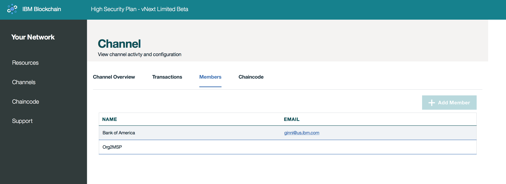

---

copyright:
  years: 2017

---

{:new_window: target="_blank"}
{:shortdesc: .shortdesc}
{:codeblock: .codeblock}
{:screen: .screen}
{:pre: .pre}

# チャネル
{: #v10_dashboard}
最終更新日: 2017 年 3 月 16 日
{: .last-updated}

チャネルは、データのパーティショニングおよび分離のための非常に強力なメカニズムであり、データのプライバシーのための主要な基盤を提供します。トランザクションが実行されるためには、すべてのネットワークにそれぞれ少なくとも 1 つのチャネルが必要です。  
{:shortdesc}

ネットワークをチャネルに分割します。各チャネルは、そのチャネルでインスタンス化されたチェーンコードのデータを表示することを許可されたメンバーのサブセットを表します。そのチャネル上に存在しないユーザーは、データを見ることができません。各チャネルには固有の台帳があり、ユーザーは、そのデータに対して読み取り/書き込み操作を実行するためには正しく認証されていなければなりません。さらに、特定のメンバーおよびユーザーを制限するためにアクセス制御リストを実装することもできます (例えば、メンバー A を読み取り専用に制限する)。

6 人のメンバーがいるネットワークに自分がいるものと想定します。6 人のメンバー全員が共通の資産の台帳についてトランザクションおよび保守を行うコンソーシアム・タイプのチャネルが考えられます。 そのようなトランザクションと、関わる資産の状態を、すべてのメンバーが利用できます。ただし、ネットワーク全体からのプライバシーを必要とする二者間または多者間のトランザクションについて、個別のチャネルを作成することで、そのデータを隠すことができます。  

また、さらに複雑なビジネス・シナリオの場合におけるチャネル間の対話向けの方式もあります。チャネル A 上のキーまたは複合キーの値を照会し、返された値を使用してチャネル B 上のトランザクションの要素とするように、アプリケーションをコーディングすることができます。チャネル、ポリシー、およびチャネル間トランザクションについて詳しくは、[Hyperledger Fabric の資料](http://hyperledger-fabric.readthedocs.io/en/latest/arch-deep-dive.html)を参照してください。

**図 2** に、自分の Bluemix 組織のすべてのチャネルの概要を表示する初期ダッシュボード画面を示します。

*図 2. チャネル*

この画面から、チャネルを作成するか、または特定のチャネルを選択して、台帳、チェーンコード、およびメンバーシップに関するさらに正確な詳細情報を表示できます。  

**図 3** に、*「チャネルの作成 (Create a Channel)」*画面を示します。

*図 3. チャネルの作成*

チャネルのビジネス目標を反映する名前を選択し、ネットワーク・メンバーの**「会社名 (Company Name)」**を選択してから**「メンバーの追加 (Add Member)」**ボタンをクリックすることによって任意の組み合わせのネットワーク・メンバーを招待します。  

**図 4** に、特定のチャネルの概要を示します。ブロックの高さや、トランザクション履歴などの台帳情報を表示しています。

*図 4. チャネルの概要*

**図 5** に、特定のチャネルのトランザクション履歴を示します。トランザクションごとのタイム・スタンプと、トランザクションの対応するチェーンコード ID が表示されています。

*図 5. チャネルのトランザクション*

**図 6** に、特定のチャネルのメンバーシップ・レジストリーを示します。会社名と、システム管理者の対応する E メールが表示されています。

*図 6. チャネル・メンバー*

**図 7** に、特定のチャネルのチェーンコード・レジストリーを示します。チェーンコード ID、バージョン、インスタンス化引数、およびピアなどの、チェーンコードごとの固有の情報が表示されています。  

*図 7. チャネルのチェーンコード*

**「ピア数 (PEERS)」** の値は、単に、チェーンコード・コンテナーが稼働しているチャネル上のピアの数です。インスタンス化について詳しくは、下記の
『**チェーンコード**』のセクションを参照してください。  
