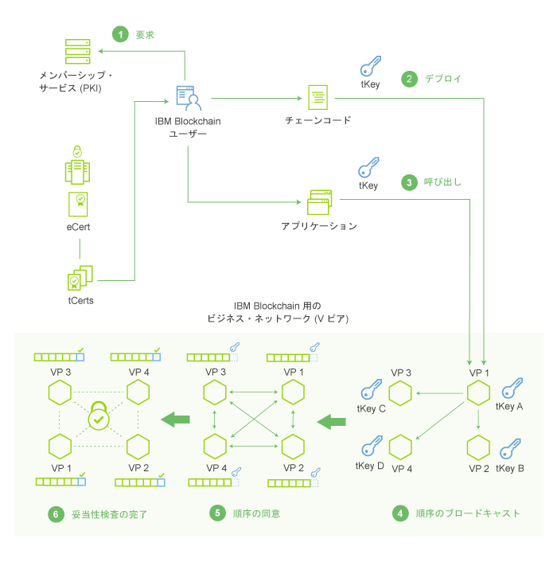

---

copyright:
  years: 2016, 2017
lastupdated: "2017-03-09"
---

{:new_window: target="_blank"}
{:shortdesc: .shortdesc}
{:codeblock: .codeblock}
{:screen: .screen}
{:pre: .pre}

# ネットワーク・ランドスケープ
{: #etn_overview}

IBM Blockchain on Bluemix の Starter Developer プランと High Security Business Network プランでは、Hyperledger Fabric v0.6、Practical Byzantine Fault Tolerance (PBFT) コンセンサス・プロトコル、Hyperledger Fabric Client (HFC) SDK for Node.js が提供する機能を利用します。どちらのプランも、4 つのネットワーク・ノードと認証局によって構成されます。認証局は「メンバーシップ・サービス」を統括します。これは、ID、ネットワーク・アクセス権、機密トランザクションをデジタル証明書の発行によって管理します。
{:shortdesc}

どちらのプランでも、以下のブロックチェーン機能を使用できます。

* PBFT コンセンサス・プロトコルは、共有台帳に書き込まれるすべてのトランザクションの順序付けを管理します。4 つのノードの PBFT ブロックチェーン・ネットワークは、1 つのビザンチン (欠陥のある) ノードにかかわりなく、コンセンサスに到達できます。PBFT コンセンサス・テストの詳細については、[コンセンサスと可用性のテスト](etn_pbft.html)を参照してください。
* HFC SDK for Node.js により、クライアント・サイドの Node.js アプリケーションは、ブロックチェーン・ネットワークと対話できるようになります。クライアント・サイドのアプリは、メンバーシップ・サービスによってユーザーを安全に登録し、トランザクションを発行し、tCerts の使用によって資産を暗号化して交換することができます。メンバーシップ・サービスとユーザー・プライバシーについて詳しくは、[HFC SDK for Node.js](etn_sdk.html) セクションと Hyperledger Fabric [プロトコル仕様](https://github.com/hyperledger/fabric/blob/v0.6/docs/protocol-spec.md)を参照してください。
* [Bluemix モニター・ダッシュボード](ibmblockchainmonitor.html)から、ブロックチェーン・ネットワーク環境に関する詳細にアクセスすることができます。  

 
## 用語

以下の用語と後続の図は、Hyperledger Fabric v0.6 に基づいて IBM Blockchain ネットワークのコンポーネントの文脈を説明しています。

**メンバー**: ブロックチェーン・ネットワークに参加するための ID。メンバーには、さまざまなクラスがあります (ユーザー、ピア、バリデーター、監査員など)。

**メンバーシップ・サービス**: メンバー ID の取得と管理に関連したサービス。メンバーシップ・サービスは、認証局によって統括されます。  

**登録 (Registration)**: 新規メンバー ID をネットワークに追加する操作。「登録」特権を持つユーザーは、メンバーを動的にネットワークに追加することができます。また、メンバーには役割や属性も割り当てられます。これは、ネットワークでのアクセスと権限を制御します。役割も属性も動的に割り当てることはできません。代わりに、membersrvc.yaml ファイルを編集する必要があります。

**エンロール (Enrollment)****: 新規メンバーがブロックチェーン・ネットワークにアクセスできるようにすることにより、登録プロセスを完了します。新規メンバーが登録者から秘密を入手した後に (アウト・オブ・バンド)、または代行者の権限を持つ仲介者が新規メンバーに代わってエンロールを行うことができます。  

**取引者**: ノードを介してブロックチェーン・ネットワークに接続し、SDK または API を使用してクライアントからトランザクションを実行依頼するネットワーク参加者。

**トランザクション**: 取引者がブロックチェーン・ネットワークで特定の機能を実行するために行う要求。トランザクション・タイプは、デプロイ、呼び出し、照会であり、ファブリックの API 契約で規定されたチェーンコード機能によって実装されます。

**台帳**: トランザクションや最新のワールド・ステートを含む、暗号によってリンクされたブロックのシーケンス。台帳には、以前のトランザクションのデータだけでなく、現在実行中のチェーンコード・アプリケーションのデータも含まれます。

**ワールド・ステート**: トランザクションによって実行されたときにチェーンコードが自身の状態を保管するのに使用するキー値データベース。

**チェーンコード**: 特定のネットワーク・トランザクションのタイプのルールをエンコードする埋め込みロジック。開発者は、チェーンコード・アプリケーションを作成し、それをネットワークにデプロイします。次いで、エンド・ユーザーは、ネットワーク・ピアつまりノードとインターフェースをとるクライアント・サイド・アプリケーションを使用してチェーンコードを呼び出します。チェーンコードは、ネットワーク・トランザクションを実行します。これは、検証されると共有台帳に追加され、ワールド・ステートを変更します。

**検証ピア**: ネットワークのコンセンサス・プロトコルを実行し、トランザクションを検証して台帳を保守するネットワーク・ノード。検証されたトランザクションは、台帳にブロック単位で付加されます。コンセンサスに失敗した場合、トランザクションはブロックから消去され、台帳には書き込まれません。検証ピア (VP) には、チェーンコードをデプロイし、呼び出し、照会する権限が備わっています。

**非検証ピア**: プロキシーとして機能するネットワーク・ノード。取引者を検証ピアに接続します。非検証ピア (NVP) は、接続されている検証ピア (VP) に呼び出し要求を転送します。また、イベント・ストリーム・サーバーと REST サービスをホストします。

**コンセンサス**: ブロックチェーン・ネットワーク・トランザクション (デプロイと呼び出し) の順序を維持するプロトコル。ノードの検証は、コンセンサス・プロトコルを実装することによって、トランザクションを承認するために集合的に機能します。コンセンサスにより、ノードのクォーラムは共有台帳のトランザクションの順序に同意します。発生する矛盾をこの順序で解決することによって、コンセンサスは同一のブロックチェーン台帳ですべてのノードが機能するようにします。詳細情報やテスト・ケースについては、『[コンセンサス](etn_pbft.html)』のトピックを参照してください。  

**許可されたネットワーク**: 各ノードにネットワークでのメンバー ID の保守が要求されるブロックチェーン・ネットワーク。各ノードには、そのアクセス権によって許可されるトランザクションのみへのアクセス権があります。  

 
## ネットワーク・アーキテクチャー

図 1 とその後の説明は、IBM Blockchain のネットワーク・アーキテクチャーと、メンバー・サービス、トランザクション、コンセンサス、台帳への付加についてのデータ・フローを描写しています。

図 1。

以下のステップは、図 1 からのネットワーク・フローを詳しく説明しています。

1. 登録ユーザーは、PKI (メンバーシップ・サービス) を使用してネットワークにエンロールし、長期間登録証明書 (eCert) と一連のトランザクション証明書 (tCerts) を受け取ります。
2. ユーザーはチェーンコードをネットワークにデプロイします。チェーンコード (スマート契約) は、ビジネス・ロジック、つまりルールをエンコードして、特定タイプのトランザクションを統括します。各トランザクション (デプロイ、呼び出し、または照会) は固有の tCert を必要とし、ユーザーの秘密鍵を使用して署名する必要があります。ユーザーは、割り当てられた tCerts からプライベート・キーを導出します。
3. ユーザーはスマート契約を呼び出します。これは、契約をトリガーし、エンコードされたロジックを自己実行します。
4. トランザクションがネットワーク・ピアにサブミットされます。ピアは、トランザクション要求を受け取ったら、要求をネットワークの 1 次ピアにサブミットします (図 1 の VP1)。1 次ピアは、トランザクションのブロックを配列し、この配列をそのフェロー・ピアにブロードキャストします。
5. ピアは、ネットワーク・コンセンサス・プロトコル (PBFT) を使用して、サブミットされたトランザクションの配列に同意します。トランザクションを集合的に配列するこのプロセスは、コンセンサスと呼ばれています。  
6. ピアがコンセンサスに達したら、トランザクション要求が実行され、ブロックが共有台帳に付加されます。  

<!---Both the developer and high-security networks unlock several features in the Hyperledger fabric which robustly enhance security, confidentiality and privacy.  The only fundamental difference between the two is their operating/hosting environment.  The developer network runs in a shared multi-tenant environment on Softlayer, whereas the high-security network exists as an isolated single-tenant running in a secure services container.  Each network leverages the same capabilities from the fabric, including a PBFT consensus protocol and the enhanced Node.js SDK.~~

~~The High-Security business network runs in an isolated and highly secured environment, distinguishing it from other cloud-hosted offerings. The operating system, fabric, and nodes all exist in a secure services container (SSC), providing your enterprise with the security and impregnability that customers have come to expect from system Z technology.  The SSC delivers performance optimization in - peer to peer communication, availability, scalability, hardware encryption, tamper-proof crypto keys, and securely encrypted VMs.  See the [Secure Services Container](etn_ssc.html) section for more details on the security features provided through the SSC.  Additionally, the high security network unlocks numerous features of the Hyperledger fabric (unavailable in the developer service), which robustly enhance security, confidentiality and privacy.  The configuration is such that you are able to test and affirm these features.~~  
{:shortdesc}

~~The high security plan augments the developer plan by delivering several enhancements that help meet the security requirements and concerns of an enterprise-level participant:~~--->

<!---The environment (LinuxONE on z) consists of a four-peer network implementing PBFT with Membership Services enabled, running in an application container.  The application container protects blockchain software, chaincode, and data running within the system. The blockchain software within the secure boot can be signed, attested, and encrypted; and once installed in the application container, is tamper-resistant.  Root users of the platform and system administrators cannot access or see z secure container contents.  In addition, the LinuxOne on z provides you with FIPS compliance, high Evaluation Assurance Level protection, a highly auditable operating environment, and crypto optimization--->
