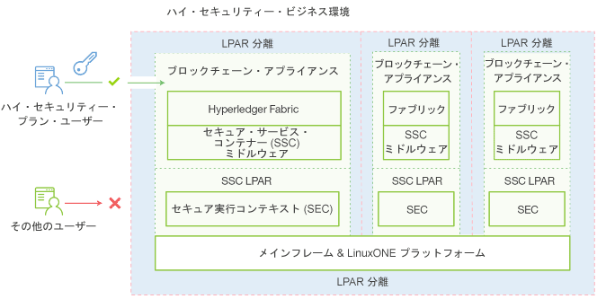

---

copyright:
  years: 2017
lastupdated: "2017-03-15"
---

{:new_window: target="_blank"}
{:shortdesc: .shortdesc}
{:codeblock: .codeblock}
{:screen: .screen}
{:pre: .pre}

# IBM Secure Service Container
{: #etn_ssc}

**HSBN vNext Beta** プランおよび HSBN プランは、ブロックチェーン・サービスをホストするための基本インフラストラクチャーを提供する IBM Secure Service Container へのアプライアンスとしてデプロイされます。このアプライアンスは、自律的に機能するオペレーティング・システム、Docker コンテナー、ミドルウェア、ソフトウェアの各コンポーネントを結合し、最適化されたセキュリティーが実装されたコア・サービスとインフラストラクチャーを提供します。
{:shortdesc}

以下のアーキテクチャーの図は、IBM Secure Service Container とブロックチェーン・アプライアンスの編成を示しています。

*図 1. IBM Secure Service Container とブロックチェーン・アプライアンスの概要*

IBM Secure Service Container は、機密性の高い規制対象のデータを扱うための Systems LinuxONE プラットフォームの高度な暗号化、セキュリティー、信頼性をブロックチェーン・サービスにもたらします。ブロックチェーンは、IBM Secure Service Container からの一連の機能によって保護されます。その機能として、カプセル化されたオペレーティング・システム、暗号化されたアプライアンス・ディスク、改ざん保護、保護されたメモリー、および強力な LPAR の隔離などがあり、EAL5+ の証明と一致するよう構成することができます。

## 主なセキュリティー機能
IBM Secure Service Container は、ブロックチェーン・サービスに、以下の最適化されたセキュリティー機能を提供します。  

### システム管理者からの保護
>プラットフォーム管理者やシステム管理者であっても、アプライアンス・コードにアクセスすることはできません。データ・アクセスはアプライアンスによって制御されるため、無許可アクセスは不可能です。これは、処理中/保留中のすべてのデータの署名と暗号化の組み合わせによってサポートされます。メモリーへのアクセスもすべて除外されます。ファームウェアは、セキュア・ブート・アーキテクチャーによってこれをサポートします。

>ブロックチェーンが IBM Secure Service Container によって保護されている場合、システム管理者には、以下の制限があります。
>* ノードにアクセスできない
>* ブロックチェーン・ネットワークを表示できない

### 改ざんからの保護  
>IBM Secure Service Container は、LPAR メモリー・アクセスを提供するすべての外部インターフェースを無効にします。改ざんから保護したり別のものと交換したりできないようにするために、イメージ・ブート・ローダーは署名されています。

### 暗号化されたアプライアンス・ディスク
>ディスク上に保管されるコードとデータはすべて、Linux 暗号化レイヤーを使用して毎回暗号化されます。  
- カプセル化されたオペレーティング・システム
- 保護された IP
- 組み込みモニターと自己修復  
