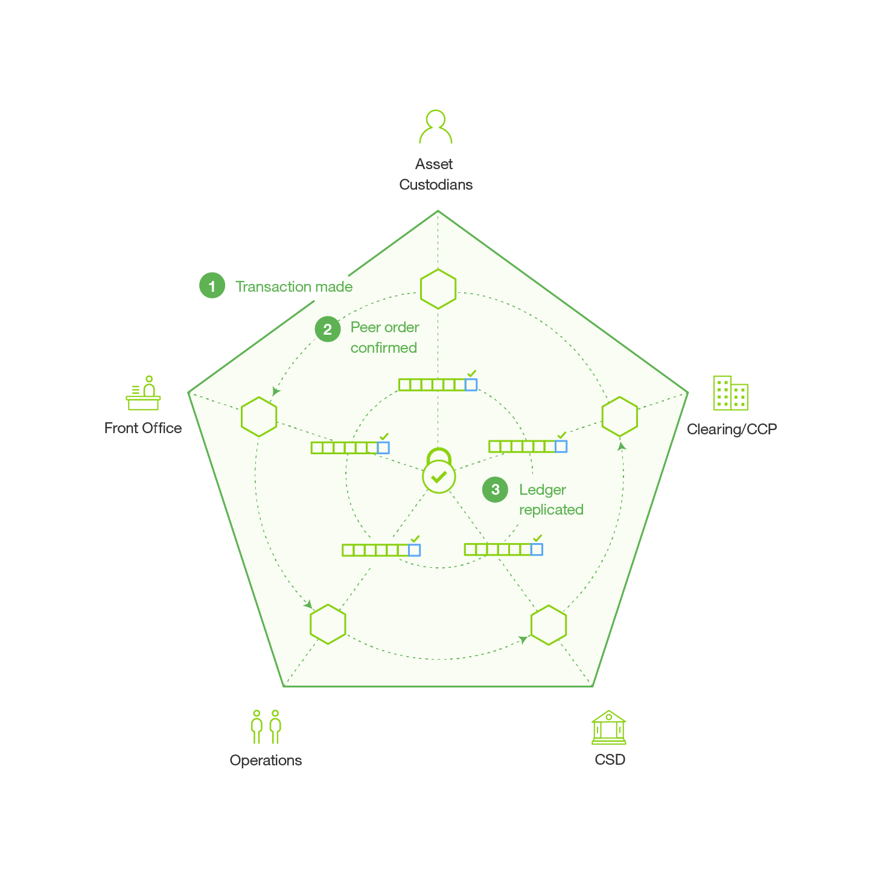

---

copyright:
  years: 2016

---

{:new_window: target="_blank"}
{:shortdesc: .shortdesc}
{:codeblock: .codeblock}
{:screen: .screen}
{:pre: .pre}

# ブロックチェーンについて
{: #ibmblockchain_overview}
最終更新日: 2016 年 9 月 23 日
{: .last-updated}

## ブロックチェーンとは
{: #what}

ブロックチェーンとは、信頼性、説明責任、透明性を確立しながらビジネス・プロセスを効率化する、次世代のトランザクション・アプリケーションのための技術です。ブロックチェーン・ネットワークは最初にビットコインで導入されましたが、その実用は仮想通貨の交換にとどまりません。IBM はブロックチェーンを使用して、最も基本的なビジネス上のやりとりを刷新し、デジタル式対話の新しい世界を開きます。

ブロックチェーンには、企業間ビジネス・プロセスのコストと複雑さを大幅に削減する可能性があります。その分散台帳により、コスト効率の高いビジネス・ネットワークの構築がより簡単になります。このネットワークでは、集中管理拠点を設けずに、価値を持つほぼすべてのものを、追跡および取引の対象にすることができます。早くもブロックチェーンは、幅広いビジネス・アプリケーションにわたり大いに期待されています。一例として、ブロックチェーン・ネットワークを活用すれば、証券取引の決済にかかる期間を数日から数分へと短縮することができます。また、ブロックチェーンは、企業による商品と支払いのフローの合理化に役立ちます。また、OEM および規制当局との間で製造ログをオープンに共有することによる、製造メーカーの製品リコール件数の削減を可能にしています。  
 

## 重要用語
{: #keyterms}
以下の用語は、ブロックチェーンの概念の全体を理解するうえで役立ちます。

**取引者**: ノードを介してブロックチェーン・ネットワークに接続し、SDK または API を使用してクライアントからトランザクションを実行依頼するネットワーク参加者。

**トランザクション**: 取引者がブロックチェーン・ネットワークで特定の機能を実行するために行う要求。トランザクション・タイプは、デプロイ、呼び出し、照会であり、ファブリックの API 契約で規定されたチェーンコード機能によって実装されます。

**台帳**: トランザクションや最新のワールド・ステートを含む、暗号によってリンクされたブロックのシーケンス。台帳には、以前のトランザクションのデータだけでなく、現在実行中のチェーンコード・アプリケーションのデータも含まれます。

**ワールド・ステート**: トランザクションによって実行されたときにチェーンコードが自身の状態を保管するのに使用するキー値データベース。

**チェーンコード**: 特定のネットワーク・トランザクションのタイプのルールをエンコードする埋め込みロジック。開発者は、チェーンコード・アプリケーションを作成し、それをネットワークにデプロイします。次いで、エンド・ユーザーは、ネットワーク・ピアつまりノードとインターフェースをとるクライアント・サイド・アプリケーションを使用してチェーンコードを呼び出します。チェーンコードは、ネットワーク・トランザクションを実行します。これは、検証されると共有台帳に追加され、ワールド・ステートを変更します。

**検証ピア**: ネットワークのコンセンサス・プロトコルを実行し、トランザクションを検証して台帳を保守するネットワーク・ノード。検証されたトランザクションは、台帳にブロック単位で付加されます。コンセンサスに失敗した場合、トランザクションはブロックから消去され、台帳には書き込まれません。検証ピア (VP) には、チェーンコードをデプロイし、呼び出し、照会する権限が備わっています。

**非検証ピア**: プロキシーとして機能するネットワーク・ノード。取引者を検証ピアに接続します。非検証ピア (NVP) は、接続されている検証ピア (VP) に呼び出し要求を転送します。また、イベント・ストリーム・サーバーと REST サービスをホストします。

**コンセンサス**: ブロックチェーン・ネットワーク・トランザクション (デプロイと呼び出し) の順序を維持するプロトコル。ノードの検証は、コンセンサス・プロトコルを実装することによって、トランザクションを承認するために集合的に機能します。コンセンサスにより、ノードのクォーラムは共有台帳のトランザクションの順序に同意します。発生する矛盾をこの順序で解決することによって、コンセンサスは同一のブロックチェーン台帳ですべてのノードが機能するようにします。詳細情報やテスト・ケースについては、『[コンセンサス](etn_pbft.html)』のトピックを参照してください。  

**許可されたネットワーク**: 各ノードにネットワークでのメンバー ID の保守が要求されるブロックチェーン・ネットワーク。各ノードには、そのアクセス権によって許可されるトランザクションのみへのアクセス権があります。  

 
## 重要概念
{: #keyconcepts}

**概要**: ブロックチェーンは、メンバーがデジタル化された資産を追跡して交換する特殊なタイプのネットワークです。共有台帳は、すべてのネットワーク・トランザクションの単一レコードを含んでおり、すべてのネットワーク・メンバー間で複製されます。チェーンコード・アプリケーションには、SDK または API を介してネットワークとインターフェースをとる自己実行型の契約とクライアント・サイド・アプリケーションが含まれます。

ブロックチェーン・ネットワークのメンバーである 2 つ以上のトランザクション・パーティーが、トランザクションに適用されるスマート・コントラクトの条項に暗黙的に同意します (例えば、アセット "a" を受け取ったらすぐに、アセット "b" を準備する)。ブロックチェーンにデプロイされると、契約の機能を呼び出すことができます (すなわち、トランザクションをトリガーできる)。先頭ノードと、コンセンサスのための検証ピアに対するブロードキャストによって、次の呼び出しが順序付けされます。検証に続いて、トランザクションが実行され、台帳にブロック単位で記録されます。次いで、台帳はレプリケーションによってすべてのネットワーク・ノードに配布されます。台帳に追加された後に、トランザクションを変更したり、削除したりすることはできません。承認されたトランザクションの効果を取り消したり、変更したりする唯一の方法は、後続のトランザクションを実行依頼することです。

**ネットワーク**: ブロックチェーン・ネットワークには次のような特性があります。

- 銀行、行政機関、製造メーカー、証券会社などのネットワーク参加者を表すノードのある、分散型かつ非集中型のピアツーピア・ネットワーク。
- トランザクションを共有台帳にコミットする前に、コンセンサス・プロトコルを介してトランザクションを検証するピアのグループ。

**共有台帳**: 共有台帳は、ブロックチェーン・ネットワークにおける唯一の真実のソースであり、検証されたトランザクションのすべての履歴でもあります。ノード間で共有台帳に矛盾が発生した場合、それらはコンセンサスによって解決されます。台帳には以下の属性があります。
- ネットワーク上の検証されたすべてのトランザクションを記録します。
- すべてのネットワーク参加者間で共有されます。
- 各参加者が自分のコピーを持てるように複製されます。
- 参加者が自分のトランザクションのみを表示できるように許可が付与されます。

**例**: 図 1 は、証券のブロックチェーン・ネットワークと共有台帳のサンプルを示しています。

*図 1. 共有台帳のサンプル*

図 1 は、証券市場における通常のネットワーク参加者、つまり、資産管理者 (銀行)、フロント・オフィス、オペレーション、証券預託 (CSD)、清算機関 (クリアリング/CCP) を示しています。
1. 管理者はクライアント・アプリケーションを使用して、チェーンコードを呼び出し、証券を売買します。  
2. トランザクションは任意のネットワーク・ノードからトリガーできますが、常に 1 次 (先頭) 検証ノードに転送され、トランザクションが順序付けされます。1 次ノードは、提案された順序に関するコンセンサス、つまり合意のために、順序付けされたトランザクションをすべての検証ピアにブロードキャストします。
3. トランザクションの順序が合意に達したら、トランザクションは実行され、各検証ノードで台帳に付加されます。次いで、台帳はすべてのネットワーク・ノードに複製されます。  

## ネットワークとアプリケーションのアーキテクチャー
{: #architecture}

図 2 は、許可されたブロックチェーン・ネットワークのサンプルを示しています。これは、分散型かつ非集中型のピアツーピア・アーキテクチャーと、ユーザー権限と役割を管理する認証局を特徴としています。
*図 2. 許可されたブロックチェーン・ネットワーク: データ・フローおよびネットワーク・アクセスはメンバー役割によって管理される*

以下の説明は、図 2 に示されているアーキテクチャーとフローに対応しており、順次処理を表しているわけではありません。

**A:** ブロックチェーン・ユーザーは、許可されたブロックチェーン・ネットワークにトランザクションを実行依頼します。トランザクションにはデプロイ、呼び出し、または照会を指定でき、SDK を活用するクライアント・サイド・アプリケーションを介して、または REST API を介して直接発行されます。  

**B:** 信頼できるビジネス・ネットワークは、米国証券市場の SEC などの、監査役や取締役にアクセスを提供します。  

**C:** ブロックチェーン・ネットワーク・オペレーターは、取締役 (B) を「監査役」に、ブロックチェーン・ユーザー (A) を「クライアント」に登録するなどして、メンバーのアクセス権を管理します。監査役の役割は、トランザクションの照会に制限されます。一方、クライアントは特定のタイプのチェーンコードをデプロイ、呼び出し、照会する権限が与えられています。

**D:** ブロックチェーン開発者はチェーンコード (スマート・コントラクト) を作成し、クライアント・サイド・アプリケーションはスマート・コントラクトを呼び出します。ブロックチェーン開発者は、REST インターフェースを介してチェーンコードを直接ネットワークにデプロイできます。従来のデータ・ソースの資格情報をチェーンコードに含める場合、開発者はアウト・オブ・バンド接続を使用してデータ (G) にアクセスできます。

**E:** ブロックチェーン・ユーザーはピア・ノード (A) を介してネットワークに接続します。トランザクションを続行する前に、ノードはユーザーの登録とトランザクション証明書を認証局から取得します。許可されたネットワークでトランザクションを実行するために、ユーザーはこれらのデジタル証明書を所有する必要があります。

**F:** チェーンコードを駆動しようとするユーザーは、従来のデータ・ソース (G) にある自分の資格情報を検証する必要があります。ユーザーの権限を確認するために、チェーンコードは従来の処理プラットフォームを介して、このデータに対してアウト・オブ・バンド接続を使用できます。

図 3 は IBM Blockchain のコア・コンポーネントを示しています。メンバーシップ・サービス、ブロックチェーン・サービス、チェーンコード・サービスは論理構造であり、コンポーネントを個別のプロセス、アドレス・スペース、または仮想マシンに分割する物理分割ではありません。

*図 3. Hyperledger ファブリック参照アーキテクチャー*

**メンバーシップ・サービス**: メンバーシップ・サービスは認証局ピアを介して、許可されたブロックチェーン・ネットワーク上のユーザー ID を管理します。メンバーシップ・サービスは、公開鍵インフラストラクチャー (PKI) と非集中 (コンセンサス) の要素を組み合わせることによって、役割の区別を提供しています。これとは対照的に、許可されていないネットワークはメンバー固有の権限または役割の区別に対応していません。

許可されたブロックチェーンでは、エンティティーが長期 ID 資格情報 (登録証明書) に登録することを必要とします。このエンティティーは、エンティティー・タイプに従って区別できます。ユーザーにとって、登録証明書はトランザクション認証局 (TCA) に仮名の資格情報を発行する権限を与えます。これらの証明書はユーザーによって実行依頼されたトランザクションを許可します。トランザクション証明書は、ブロックチェーン上に存続し、本来はリンクできないトランザクションを、権限を持つ監査役が関連付けられるようにします。

**ブロックチェーン・サービス**: ブロックチェーン・サービスは、HTTP/2 上に構築されたピアツーピア・プロトコルを使用して共有台帳を管理します。データ構造は、共有台帳のレプリケーションを維持する最も効率的なハッシュ・アルゴリズムを提供するよう、高度に最適化されています。PBFT はコンセンサス・プロトコルとして実装されます。    

**チェーンコード・サービス**: チェーンコード・サービスは、検証ノードでチェーンコード実行をサンドボックス化するためのセキュアで軽量な方法を提供します。この環境は「ロック・ダウン」されたセキュアなコンテナーであり、セキュアな OS とチェーンコード言語、ランタイム、Go、Java、Node.js 用の SDK レイヤーを含む署名付きの基本イメージのセットを備えています。必要に応じて、追加の言語を有効にすることもできます。

IBM のブロックチェーンの実装について詳しくは、Hyperledger Fabric 0.5 の「[プロトコル規格](https://github.com/hyperledger/fabric/blob/master/docs/protocol-spec.md#fabric)」を参照してください。
